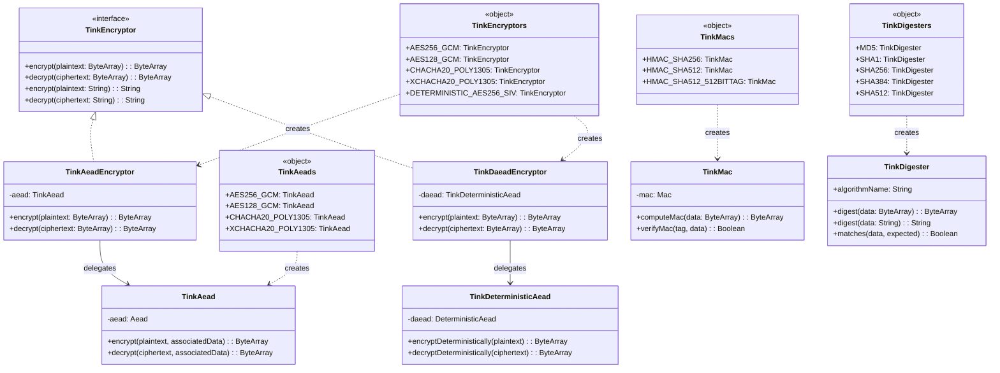
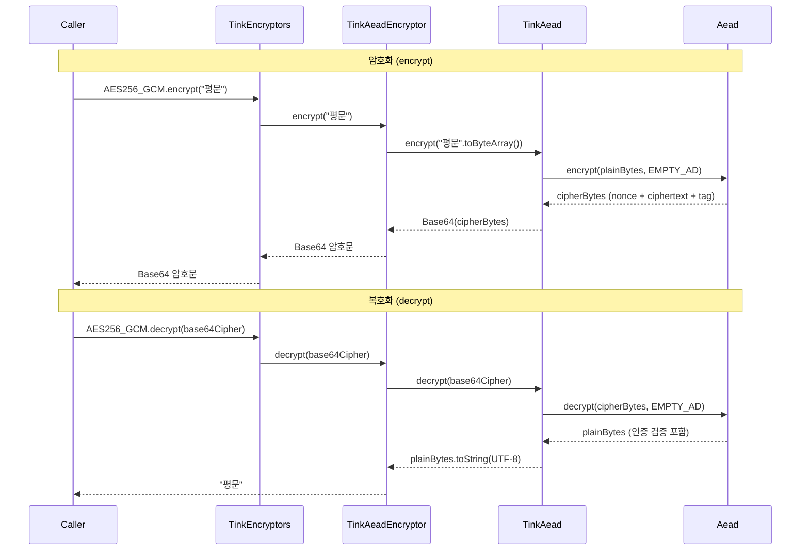

# bluetape4k-tink

[English](./README.md) | 한국어

Google [Tink](https://github.com/google/tink) 암호화 라이브러리를 Kotlin 관용적으로 래핑한 모듈입니다.

기존 `bluetape4k-crypto`(Jasypt 기반 PBE)와 독립적으로 동작하며, 현대적 인증 암호화(AEAD) 알고리즘을 안전한 API로 제공합니다.

## 특징

- **AEAD (인증 암호화)** — AES-256-GCM, AES-128-GCM, ChaCha20-Poly1305, XChaCha20-Poly1305
- **Deterministic AEAD** — AES-256-SIV (검색 가능한 암호화, DB 인덱스 필드 등)
- **MAC (메시지 인증 코드)** — HMAC-SHA256, HMAC-SHA512
- **Digest (해시)** — MD5, SHA-1, SHA-256, SHA-384, SHA-512 (JDK `MessageDigest` 기반, BouncyCastle 불필요)
- **Encrypt (통합 암호화 인터페이스)** — `TinkEncryptor`로 AEAD/DAEAD를 통합 사용
- Kotlin Extension 함수로 간결한 사용
- Thread-safe 1회 초기화 (`registerTink()`)
- `ByteArray` / `String` 입출력 모두 지원 (String 암호문은 Base64 인코딩)

## 의존성

```kotlin
// build.gradle.kts
dependencies {
    implementation("io.github.bluetape4k:bluetape4k-tink:$bluetape4kVersion")
}
```

## 빠른 시작

### AEAD — 인증 암호화 (AES-256-GCM)

```kotlin
import io.bluetape4k.tink.aead.TinkAeads

// 싱글턴 인스턴스 사용
val encrypted: String = TinkAeads.AES256_GCM.encrypt("안녕하세요, Tink!")
val decrypted: String = TinkAeads.AES256_GCM.decrypt(encrypted)
// decrypted == "안녕하세요, Tink!"

// 연관 데이터(Associated Data)로 컨텍스트 바인딩
val ad = "user-id=42".toByteArray()
val encryptedWithAd = TinkAeads.AES256_GCM.encrypt("비밀 데이터", ad)
val decryptedWithAd = TinkAeads.AES256_GCM.decrypt(encryptedWithAd, ad)

// 잘못된 AD로 복호화 시 GeneralSecurityException 발생
```

### AEAD — 확장 함수

```kotlin
import io.bluetape4k.tink.aead.TinkAeads
import io.bluetape4k.tink.aead.tinkEncrypt
import io.bluetape4k.tink.aead.tinkDecrypt

val aead = TinkAeads.AES256_GCM

// String 확장 함수
val encrypted = "민감한 정보".tinkEncrypt(aead)
val original = encrypted.tinkDecrypt(aead)

// ByteArray 확장 함수
val data = "Hello".toByteArray()
val cipherBytes = data.tinkEncrypt(aead)
val plainBytes = cipherBytes.tinkDecrypt(aead)
```

### AEAD — 커스텀 키 생성

```kotlin
import io.bluetape4k.tink.aeadKeysetHandle
import io.bluetape4k.tink.aead.TinkAead
import com.google.crypto.tink.aead.AesGcmKeyManager

// 새 키를 생성하여 인스턴스 생성
val myAead = TinkAead(aeadKeysetHandle(AesGcmKeyManager.aes256GcmTemplate()))

// ChaCha20-Poly1305 사용 (하드웨어 AES 가속 없는 환경에 유리)
val chacha = TinkAeads.CHACHA20_POLY1305
val xchacha = TinkAeads.XCHACHA20_POLY1305
```

### Deterministic AEAD — 결정적 암호화 (AES-256-SIV)

동일한 평문 + 동일한 키 → 항상 동일한 암호문. DB 컬럼 암호화 + 인덱스 검색에 활용.

```kotlin
import io.bluetape4k.tink.daead.TinkDaeads

val daead = TinkDaeads.AES256_SIV

// 암호화
val ct1 = daead.encryptDeterministically("hong@example.com")
val ct2 = daead.encryptDeterministically("hong@example.com")
// ct1 == ct2 (결정적 특성)

// 복호화
val email = daead.decryptDeterministically(ct1)
// email == "hong@example.com"

// DB WHERE 절 조건 비교 예시
val searchCt = daead.encryptDeterministically(inputEmail)
// SELECT * FROM users WHERE encrypted_email = :searchCt
```

### MAC — 메시지 인증 코드

```kotlin
import io.bluetape4k.tink.mac.TinkMacs
import io.bluetape4k.tink.mac.computeTinkMac
import io.bluetape4k.tink.mac.verifyTinkMac

val mac = TinkMacs.HMAC_SHA256

// 태그 계산
val tag: ByteArray = mac.computeMac("중요한 데이터")

// 검증
val isValid: Boolean = mac.verifyMac(tag, "중요한 데이터")  // true
val isTampered: Boolean = mac.verifyMac(tag, "변조된 데이터") // false

// 확장 함수
val tag2 = "중요한 데이터".computeTinkMac(mac)
val ok = "중요한 데이터".verifyTinkMac(tag2, mac)  // true
```

### Digest — 해시 다이제스트

BouncyCastle 없이 JDK `MessageDigest`만으로 해시 알고리즘을 사용합니다.
`bluetape4k-crypto`의 `Digesters`를 대체합니다.

```kotlin
import io.bluetape4k.tink.digest.TinkDigesters
import io.bluetape4k.tink.digest.tinkDigest
import io.bluetape4k.tink.digest.matchesTinkDigest

// 싱글턴 인스턴스 사용
val hash = TinkDigesters.SHA256.digest("Hello, World!")
val matches = TinkDigesters.SHA256.matches("Hello, World!", hash) // true

// 확장 함수
val hash2 = "Hello, World!".tinkDigest(TinkDigesters.SHA256)
"Hello, World!".matchesTinkDigest(hash2, TinkDigesters.SHA256) // true

// 사용 가능 알고리즘: MD5, SHA1, SHA256, SHA384, SHA512
```

### Encrypt — 통합 암호화 인터페이스

`TinkEncryptor` 인터페이스로 AEAD(비결정적)와 DAEAD(결정적) 암호화를 통합합니다.
`bluetape4k-crypto`의 `Encryptors`를 대체합니다.

```kotlin
import io.bluetape4k.tink.encrypt.TinkEncryptors
import io.bluetape4k.tink.encrypt.tinkEncrypt
import io.bluetape4k.tink.encrypt.tinkDecrypt

// 비결정적 암호화 (범용)
val encrypted = TinkEncryptors.AES256_GCM.encrypt("비밀 메시지")
val decrypted = TinkEncryptors.AES256_GCM.decrypt(encrypted)

// 결정적 암호화 (DB 검색용)
val ct = TinkEncryptors.DETERMINISTIC_AES256_SIV.encrypt("검색 가능한 필드")
val ct2 = TinkEncryptors.DETERMINISTIC_AES256_SIV.encrypt("검색 가능한 필드")
// ct == ct2 (결정적)

// 확장 함수
val enc = "Hello".tinkEncrypt(TinkEncryptors.CHACHA20_POLY1305)
val dec = enc.tinkDecrypt(TinkEncryptors.CHACHA20_POLY1305)
```

## 알고리즘 선택 가이드

| 사용 목적           | 권장 알고리즘                | 클래스                                         |
|-----------------|------------------------|--------------------------------------------|
| 범용 암호화          | AES-256-GCM            | `TinkAeads.AES256_GCM` / `TinkEncryptors.AES256_GCM` |
| 하드웨어 AES 없는 환경  | XChaCha20-Poly1305     | `TinkAeads.XCHACHA20_POLY1305` / `TinkEncryptors.XCHACHA20_POLY1305` |
| DB 컬럼 검색 가능 암호화 | AES-256-SIV            | `TinkDaeads.AES256_SIV` / `TinkEncryptors.DETERMINISTIC_AES256_SIV` |
| 데이터 무결성 검증      | HMAC-SHA256            | `TinkMacs.HMAC_SHA256`                      |
| 고보안 무결성 검증      | HMAC-SHA512 (512비트 태그) | `TinkMacs.HMAC_SHA512_512BITTAG`            |
| 범용 해시          | SHA-256                | `TinkDigesters.SHA256`                      |
| 최고 수준 해시        | SHA-512                | `TinkDigesters.SHA512`                      |

## 주의 사항

### AEAD vs Deterministic AEAD

- **AEAD** (`TinkAeads`): 매 암호화마다 랜덤 nonce 사용 → 동일 평문도 매번 다른 암호문 생성. **일반 데이터 보호에 권장.**
- **Deterministic AEAD** (`TinkDaeads`): 동일 평문 → 동일 암호문. 패턴 유출 가능성이 있으므로 **검색이 필요한 DB 필드에만 사용.**

### 키 관리

`TinkAeads`, `TinkDaeads`, `TinkMacs`의 싱글턴 인스턴스는 **애플리케이션 수명 동안 메모리에 보관되는 임시 키
**를 사용합니다. 재시작 후에도 복호화가 필요한 경우 키를 안전하게 직렬화하여 보관해야 합니다.

```kotlin
import com.google.crypto.tink.CleartextKeysetHandle
import com.google.crypto.tink.JsonKeysetWriter
import io.bluetape4k.tink.aeadKeysetHandle
import java.io.ByteArrayOutputStream

// 키 직렬화 (실제 운영에서는 KMS로 암호화하여 보관)
val keysetHandle = aeadKeysetHandle()
val outputStream = ByteArrayOutputStream()
CleartextKeysetHandle.write(keysetHandle, JsonKeysetWriter.withOutputStream(outputStream))
val keysetJson = outputStream.toString()
```

### String 암호문 형식

`encrypt(String)` 반환값은 **Base64(표준)** 인코딩된 암호문입니다.
`decrypt(String)` 입력도 동일한 Base64 형식이어야 합니다.

### Redis 기반 키 로테이션

`bluetape4k-tink`는 versioned keyset 추상화와 envelope 암호화 래퍼를 제공합니다.
실제 Redis 저장은 `bluetape4k-lettuce`의 `LettuceVersionedKeysetStore`를 사용합니다.

```kotlin
import io.bluetape4k.redis.lettuce.tink.LettuceVersionedKeysetStore
val store = LettuceVersionedKeysetStore(connection, "user-email", AesGcmKeyManager.aes256GcmTemplate())
val aead = TinkAeads.versioned(store)

val encrypted = aead.encrypt("hello")
store.rotate()

// rotation 이전 암호문도 version prefix를 이용해 계속 복호화 가능
val decrypted = aead.decrypt(encrypted)
```

## 모듈 구조

```
io.bluetape4k.tink
├── TinkSupport.kt                          # 초기화, 헬퍼 함수, 상수
├── keyset/                                 # 버전 관리 keyset/rotation 지원
│   ├── VersionedKeysetHandle.kt            # version + createdAt + KeysetHandle
│   ├── VersionedKeysetStore.kt             # 저장소 추상화
│   ├── TinkKeysetJsonSupport.kt            # KeysetHandle JSON 직렬화/복원
│   ├── VersionedTinkAead.kt                # version prefix 기반 AEAD 래퍼
│   └── VersionedTinkDaead.kt               # version prefix 기반 DAEAD 래퍼
├── aead/                                   # AEAD (인증 암호화)
│   ├── TinkAead.kt                         # AEAD 래퍼 클래스
│   ├── TinkAeads.kt                        # 팩토리 싱글턴
│   └── TinkAeadExtensions.kt              # 확장 함수
├── daead/                                  # Deterministic AEAD (결정적 암호화)
│   ├── TinkDeterministicAead.kt            # DAEAD 래퍼 클래스
│   └── TinkDaeads.kt                       # 팩토리 싱글턴
├── mac/                                    # MAC (메시지 인증 코드)
│   ├── TinkMac.kt                          # MAC 래퍼 클래스
│   ├── TinkMacs.kt                         # 팩토리 싱글턴
│   └── TinkMacExtensions.kt               # 확장 함수
├── digest/                                 # Digest (해시) — NEW
│   ├── TinkDigester.kt                     # JDK MessageDigest 래퍼 클래스
│   ├── TinkDigesters.kt                    # 팩토리 싱글턴 (MD5, SHA1, SHA256, SHA384, SHA512)
│   └── TinkDigesterExtensions.kt           # 확장 함수
└── encrypt/                                # Encrypt (통합 인터페이스) — NEW
    ├── TinkEncryptor.kt                    # 통합 암복호화 인터페이스
    ├── TinkAeadEncryptor.kt                # AEAD 기반 비결정적 구현체
    ├── TinkDaeadEncryptor.kt               # DAEAD 기반 결정적 구현체
    ├── TinkEncryptors.kt                   # 팩토리 싱글턴
    └── TinkEncryptorExtensions.kt          # 확장 함수
```

## 다이어그램

### TinkEncryptor 클래스 계층



### AEAD encrypt/decrypt 흐름



## bluetape4k-crypto 와의 차이

> **`bluetape4k-crypto`는 @Deprecated 되었습니다.** 신규 개발에서는 `bluetape4k-tink`를 사용하세요.

| 항목       | `bluetape4k-crypto` (Deprecated) | `bluetape4k-tink`              |
|----------|----------------------------------|--------------------------------|
| 기반 라이브러리 | Jasypt + BouncyCastle            | Google Tink + JDK              |
| 암호화 방식   | PBE (Password-Based)             | AEAD (인증 암호화)                  |
| 인증       | 없음 (AES-CBC)                     | 내장 (GCM/Poly1305/SIV)          |
| 결정적 암호화  | 불가                               | AES-SIV로 지원                    |
| MAC      | 별도                               | HMAC-SHA256/512 내장              |
| 해시       | BouncyCastle 필요                  | JDK MessageDigest (추가 의존성 없음)  |
| 통합 인터페이스 | 없음                               | `TinkEncryptor` (AEAD/DAEAD 통합) |
| 의존성      | Jasypt + BouncyCastle            | Google Tink만                   |

### 마이그레이션 가이드

| `bluetape4k-crypto` | `bluetape4k-tink` |
|-----|------|
| `Digesters.SHA256.digest(data)` | `TinkDigesters.SHA256.digest(data)` |
| `Digesters.SHA256.matches(data, hash)` | `TinkDigesters.SHA256.matches(data, hash)` |
| `"hello".digest(Digesters.SHA256)` | `"hello".tinkDigest(TinkDigesters.SHA256)` |
| `Encryptors.AES.encrypt(data)` | `TinkEncryptors.AES256_GCM.encrypt(data)` |
| `Encryptors.AES.decrypt(data)` | `TinkEncryptors.AES256_GCM.decrypt(data)` |
| `"hello".encrypt(Encryptors.AES)` | `"hello".tinkEncrypt(TinkEncryptors.AES256_GCM)` |
| `Encryptors.DeterministicAES` | `TinkEncryptors.DETERMINISTIC_AES256_SIV` |
