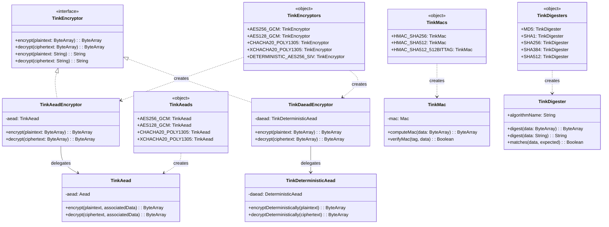
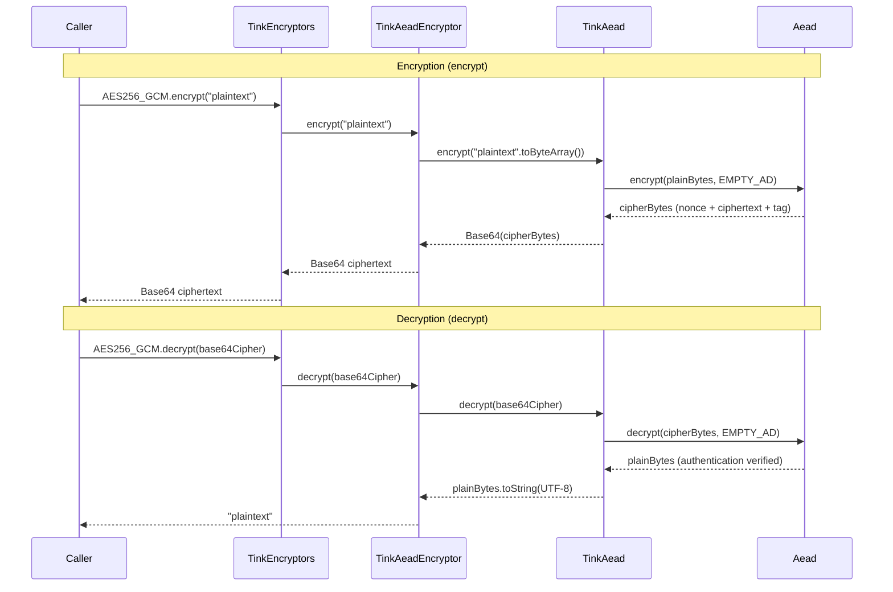

# bluetape4k-tink

English | [한국어](./README.ko.md)

An idiomatic Kotlin wrapper around Google [Tink](https://github.com/google/tink) cryptography library.

It operates independently of the legacy
`bluetape4k-crypto` (Jasypt-based PBE) and exposes modern authenticated encryption (AEAD) algorithms through a safe, Kotlin-friendly API.

## Features

- **AEAD (Authenticated Encryption)** — AES-256-GCM, AES-128-GCM, ChaCha20-Poly1305, XChaCha20-Poly1305
- **Deterministic AEAD** — AES-256-SIV (searchable encryption for DB index fields, etc.)
- **MAC (Message Authentication Code)** — HMAC-SHA256, HMAC-SHA512
- **Digest (Hash)** — MD5, SHA-1, SHA-256, SHA-384, SHA-512 (JDK `MessageDigest`-based, no BouncyCastle needed)
- **Encrypt (Unified encryption interface)** — `TinkEncryptor` unifies AEAD and DAEAD usage
- Concise usage via Kotlin extension functions
- Thread-safe one-time initialization (`registerTink()`)
- Both `ByteArray` and `String` I/O supported (String ciphertexts are Base64-encoded)

## Dependencies

```kotlin
// build.gradle.kts
dependencies {
    implementation("io.github.bluetape4k:bluetape4k-tink:$bluetape4kVersion")
}
```

## Quick Start

### AEAD — Authenticated Encryption (AES-256-GCM)

```kotlin
import io.bluetape4k.tink.aead.TinkAeads

// Using the singleton instance
val encrypted: String = TinkAeads.AES256_GCM.encrypt("Hello, Tink!")
val decrypted: String = TinkAeads.AES256_GCM.decrypt(encrypted)
// decrypted == "Hello, Tink!"

// Bind context with Associated Data
val ad = "user-id=42".toByteArray()
val encryptedWithAd = TinkAeads.AES256_GCM.encrypt("secret data", ad)
val decryptedWithAd = TinkAeads.AES256_GCM.decrypt(encryptedWithAd, ad)

// Decrypting with wrong AD throws GeneralSecurityException
```

### AEAD — Extension Functions

```kotlin
import io.bluetape4k.tink.aead.TinkAeads
import io.bluetape4k.tink.aead.tinkEncrypt
import io.bluetape4k.tink.aead.tinkDecrypt

val aead = TinkAeads.AES256_GCM

// String extension functions
val encrypted = "sensitive data".tinkEncrypt(aead)
val original = encrypted.tinkDecrypt(aead)

// ByteArray extension functions
val data = "Hello".toByteArray()
val cipherBytes = data.tinkEncrypt(aead)
val plainBytes = cipherBytes.tinkDecrypt(aead)
```

### AEAD — Custom Key Generation

```kotlin
import io.bluetape4k.tink.aeadKeysetHandle
import io.bluetape4k.tink.aead.TinkAead
import com.google.crypto.tink.aead.AesGcmKeyManager

// Generate a new key and create an instance
val myAead = TinkAead(aeadKeysetHandle(AesGcmKeyManager.aes256GcmTemplate()))

// ChaCha20-Poly1305 (preferred when hardware AES acceleration is unavailable)
val chacha = TinkAeads.CHACHA20_POLY1305
val xchacha = TinkAeads.XCHACHA20_POLY1305
```

### Deterministic AEAD — Deterministic Encryption (AES-256-SIV)

Same plaintext + same key always produces the same ciphertext. Ideal for encrypting DB columns while retaining index searchability.

```kotlin
import io.bluetape4k.tink.daead.TinkDaeads

val daead = TinkDaeads.AES256_SIV

// Encryption
val ct1 = daead.encryptDeterministically("hong@example.com")
val ct2 = daead.encryptDeterministically("hong@example.com")
// ct1 == ct2 (deterministic property)

// Decryption
val email = daead.decryptDeterministically(ct1)
// email == "hong@example.com"

// DB WHERE clause lookup example
val searchCt = daead.encryptDeterministically(inputEmail)
// SELECT * FROM users WHERE encrypted_email = :searchCt
```

### MAC — Message Authentication Code

```kotlin
import io.bluetape4k.tink.mac.TinkMacs
import io.bluetape4k.tink.mac.computeTinkMac
import io.bluetape4k.tink.mac.verifyTinkMac

val mac = TinkMacs.HMAC_SHA256

// Compute tag
val tag: ByteArray = mac.computeMac("important data")

// Verify
val isValid: Boolean = mac.verifyMac(tag, "important data")  // true
val isTampered: Boolean = mac.verifyMac(tag, "tampered data") // false

// Extension functions
val tag2 = "important data".computeTinkMac(mac)
val ok = "important data".verifyTinkMac(tag2, mac)  // true
```

### Digest — Hash Digest

Uses only the JDK `MessageDigest` — no BouncyCastle required. Replaces `Digesters` from `bluetape4k-crypto`.

```kotlin
import io.bluetape4k.tink.digest.TinkDigesters
import io.bluetape4k.tink.digest.tinkDigest
import io.bluetape4k.tink.digest.matchesTinkDigest

// Using the singleton instance
val hash = TinkDigesters.SHA256.digest("Hello, World!")
val matches = TinkDigesters.SHA256.matches("Hello, World!", hash) // true

// Extension functions
val hash2 = "Hello, World!".tinkDigest(TinkDigesters.SHA256)
"Hello, World!".matchesTinkDigest(hash2, TinkDigesters.SHA256) // true

// Available algorithms: MD5, SHA1, SHA256, SHA384, SHA512
```

### Encrypt — Unified Encryption Interface

The `TinkEncryptor` interface unifies non-deterministic AEAD and deterministic DAEAD encryption. Replaces
`Encryptors` from `bluetape4k-crypto`.

```kotlin
import io.bluetape4k.tink.encrypt.TinkEncryptors
import io.bluetape4k.tink.encrypt.tinkEncrypt
import io.bluetape4k.tink.encrypt.tinkDecrypt

// Non-deterministic encryption (general purpose)
val encrypted = TinkEncryptors.AES256_GCM.encrypt("secret message")
val decrypted = TinkEncryptors.AES256_GCM.decrypt(encrypted)

// Deterministic encryption (for DB search)
val ct = TinkEncryptors.DETERMINISTIC_AES256_SIV.encrypt("searchable field")
val ct2 = TinkEncryptors.DETERMINISTIC_AES256_SIV.encrypt("searchable field")
// ct == ct2 (deterministic)

// Extension functions
val enc = "Hello".tinkEncrypt(TinkEncryptors.CHACHA20_POLY1305)
val dec = enc.tinkDecrypt(TinkEncryptors.CHACHA20_POLY1305)
```

## Algorithm Selection Guide

| Use Case                             | Recommended Algorithm     | Class                                                                |
|--------------------------------------|---------------------------|----------------------------------------------------------------------|
| General encryption                   | AES-256-GCM               | `TinkAeads.AES256_GCM` / `TinkEncryptors.AES256_GCM`                 |
| No hardware AES acceleration         | XChaCha20-Poly1305        | `TinkAeads.XCHACHA20_POLY1305` / `TinkEncryptors.XCHACHA20_POLY1305` |
| Searchable DB column encryption      | AES-256-SIV               | `TinkDaeads.AES256_SIV` / `TinkEncryptors.DETERMINISTIC_AES256_SIV`  |
| Data integrity verification          | HMAC-SHA256               | `TinkMacs.HMAC_SHA256`                                               |
| High-security integrity verification | HMAC-SHA512 (512-bit tag) | `TinkMacs.HMAC_SHA512_512BITTAG`                                     |
| General-purpose hash                 | SHA-256                   | `TinkDigesters.SHA256`                                               |
| Highest-strength hash                | SHA-512                   | `TinkDigesters.SHA512`                                               |

## Important Notes

### AEAD vs Deterministic AEAD

- **AEAD** (
  `TinkAeads`): Uses a random nonce on every encryption — even identical plaintexts produce different ciphertexts. *
  *Recommended for general data protection.**
- **Deterministic AEAD** (
  `TinkDaeads`): Same plaintext always produces the same ciphertext. Pattern leakage is possible, so **use only for DB
  fields that require searching.**

### Key Management

The singleton instances of `TinkAeads`, `TinkDaeads`, and `TinkMacs` use **ephemeral keys that reside in memory for the
lifetime of the application**. If decryption must survive a restart, serialize and persist the keys securely.

```kotlin
import com.google.crypto.tink.CleartextKeysetHandle
import com.google.crypto.tink.JsonKeysetWriter
import io.bluetape4k.tink.aeadKeysetHandle
import java.io.ByteArrayOutputStream

// Key serialization (in production, encrypt with KMS before storing)
val keysetHandle = aeadKeysetHandle()
val outputStream = ByteArrayOutputStream()
CleartextKeysetHandle.write(keysetHandle, JsonKeysetWriter.withOutputStream(outputStream))
val keysetJson = outputStream.toString()
```

### String Ciphertext Format

The return value of `encrypt(String)` is a **standard Base64**-encoded ciphertext. The input to
`decrypt(String)` must be in the same Base64 format.

### Redis-Based Key Rotation

`bluetape4k-tink` provides a versioned keyset abstraction and envelope encryption wrapper. Actual Redis storage uses
`LettuceVersionedKeysetStore` from `bluetape4k-lettuce`.

```kotlin
import io.bluetape4k.redis.lettuce.tink.LettuceVersionedKeysetStore
val store = LettuceVersionedKeysetStore(connection, "user-email", AesGcmKeyManager.aes256GcmTemplate())
val aead = TinkAeads.versioned(store)

val encrypted = aead.encrypt("hello")
store.rotate()

// Ciphertexts encrypted before rotation can still be decrypted using the version prefix
val decrypted = aead.decrypt(encrypted)
```

## Module Structure

```
io.bluetape4k.tink
├── TinkSupport.kt                          # Initialization, helper functions, constants
├── keyset/                                 # Versioned keyset / rotation support
│   ├── VersionedKeysetHandle.kt            # version + createdAt + KeysetHandle
│   ├── VersionedKeysetStore.kt             # Store abstraction
│   ├── TinkKeysetJsonSupport.kt            # KeysetHandle JSON serialization/restoration
│   ├── VersionedTinkAead.kt                # AEAD wrapper with version prefix
│   └── VersionedTinkDaead.kt               # DAEAD wrapper with version prefix
├── aead/                                   # AEAD (Authenticated Encryption)
│   ├── TinkAead.kt                         # AEAD wrapper class
│   ├── TinkAeads.kt                        # Factory singleton
│   └── TinkAeadExtensions.kt              # Extension functions
├── daead/                                  # Deterministic AEAD
│   ├── TinkDeterministicAead.kt            # DAEAD wrapper class
│   └── TinkDaeads.kt                       # Factory singleton
├── mac/                                    # MAC (Message Authentication Code)
│   ├── TinkMac.kt                          # MAC wrapper class
│   ├── TinkMacs.kt                         # Factory singleton
│   └── TinkMacExtensions.kt               # Extension functions
├── digest/                                 # Digest (Hash) — NEW
│   ├── TinkDigester.kt                     # JDK MessageDigest wrapper class
│   ├── TinkDigesters.kt                    # Factory singleton (MD5, SHA1, SHA256, SHA384, SHA512)
│   └── TinkDigesterExtensions.kt           # Extension functions
└── encrypt/                                # Encrypt (Unified interface) — NEW
    ├── TinkEncryptor.kt                    # Unified encrypt/decrypt interface
    ├── TinkAeadEncryptor.kt                # Non-deterministic AEAD implementation
    ├── TinkDaeadEncryptor.kt               # Deterministic DAEAD implementation
    ├── TinkEncryptors.kt                   # Factory singleton
    └── TinkEncryptorExtensions.kt          # Extension functions
```

## Diagrams

### TinkEncryptor Class Hierarchy



### AEAD encrypt/decrypt Flow



## Comparison with bluetape4k-crypto

> **`bluetape4k-crypto` is `@Deprecated`.** Use `bluetape4k-tink` for all new development.

| Item                     | `bluetape4k-crypto` (Deprecated) | `bluetape4k-tink`                       |
|--------------------------|----------------------------------|-----------------------------------------|
| Underlying library       | Jasypt + BouncyCastle            | Google Tink + JDK                       |
| Encryption scheme        | PBE (Password-Based)             | AEAD (Authenticated Encryption)         |
| Authentication           | None (AES-CBC)                   | Built-in (GCM/Poly1305/SIV)             |
| Deterministic encryption | Not supported                    | Supported via AES-SIV                   |
| MAC                      | Separate                         | HMAC-SHA256/512 built-in                |
| Hash                     | Requires BouncyCastle            | JDK MessageDigest (no extra dependency) |
| Unified interface        | None                             | `TinkEncryptor` (AEAD/DAEAD unified)    |
| Dependencies             | Jasypt + BouncyCastle            | Google Tink only                        |

### Migration Guide

| `bluetape4k-crypto`                    | `bluetape4k-tink`                                |
|----------------------------------------|--------------------------------------------------|
| `Digesters.SHA256.digest(data)`        | `TinkDigesters.SHA256.digest(data)`              |
| `Digesters.SHA256.matches(data, hash)` | `TinkDigesters.SHA256.matches(data, hash)`       |
| `"hello".digest(Digesters.SHA256)`     | `"hello".tinkDigest(TinkDigesters.SHA256)`       |
| `Encryptors.AES.encrypt(data)`         | `TinkEncryptors.AES256_GCM.encrypt(data)`        |
| `Encryptors.AES.decrypt(data)`         | `TinkEncryptors.AES256_GCM.decrypt(data)`        |
| `"hello".encrypt(Encryptors.AES)`      | `"hello".tinkEncrypt(TinkEncryptors.AES256_GCM)` |
| `Encryptors.DeterministicAES`          | `TinkEncryptors.DETERMINISTIC_AES256_SIV`        |
