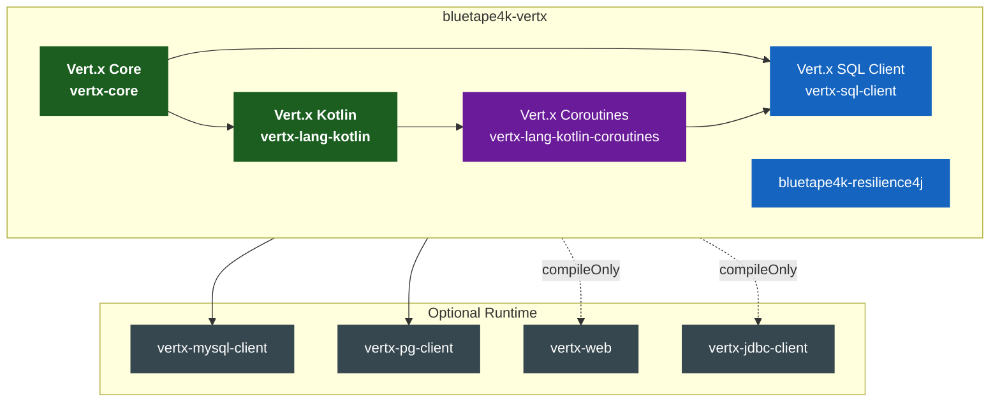
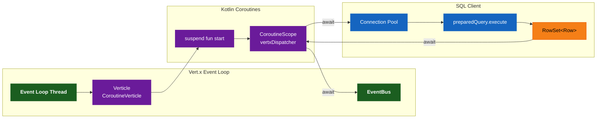
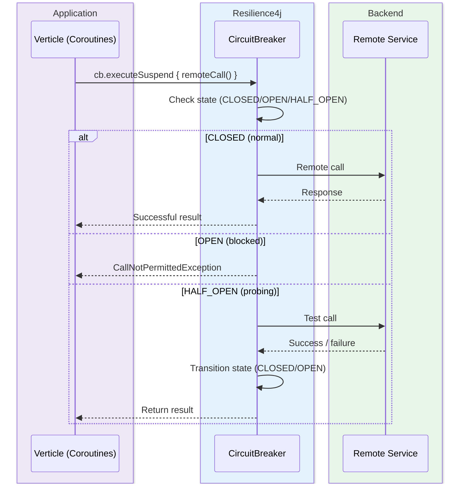
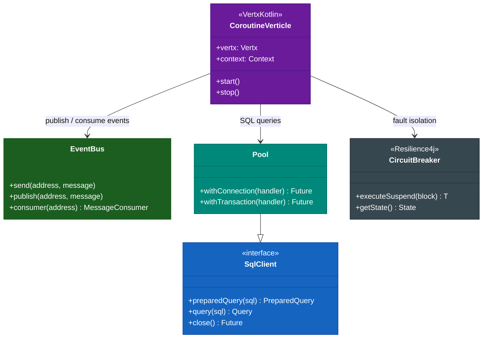

# Module bluetape4k-vertx

English | [한국어](./README.ko.md)

A unified module for async and Coroutines-based development with Vert.x.

> The former `vertx/core`, `vertx/sqlclient`, and `vertx/resilience4j` modules have been merged into this single module.

## What's Included

### Vert.x Core (formerly `vertx/core`)

- Vert.x Kotlin Coroutines extensions
- Verticle deployment and management utilities
- EventBus coroutine adapters
- Suspend support based on `vertx_lang_kotlin_coroutines`

### Vert.x SQL Client (formerly `vertx/sqlclient`)

- `vertx-sql-client` + `vertx-sql-client-templates` integration
- MySQL / PostgreSQL drivers included
- MyBatis Dynamic SQL integration
- JDBC client support (optional)
- Coroutines-based query execution

### Resilience4j Integration (formerly `vertx/resilience4j`)

- Vert.x + Resilience4j Circuit Breaker integration
- Resilience4j Micrometer metrics integration (optional)

## Installation

```kotlin
dependencies {
    implementation("io.github.bluetape4k:bluetape4k-vertx:${bluetape4kVersion}")
}
```

Optional runtime dependencies per service:

```kotlin
dependencies {
    implementation("io.github.bluetape4k:bluetape4k-vertx:${bluetape4kVersion}")

    // For MySQL
    runtimeOnly(Libs.vertx_mysql_client)

    // For PostgreSQL
    runtimeOnly(Libs.vertx_pg_client)
}
```

## Dependency Structure

| Category                       | Scope            | Description              |
|--------------------------------|------------------|--------------------------|
| `vertx-core`                   | `api`            | Vert.x core              |
| `vertx-lang-kotlin`            | `api`            | Kotlin language support  |
| `vertx-lang-kotlin-coroutines` | `api`            | Coroutines support       |
| `vertx-sql-client`             | `api`            | SQL client abstraction   |
| `bluetape4k-resilience4j`      | `api`            | Resilience4j integration |
| `vertx-mysql-client`           | `implementation` | MySQL driver             |
| `vertx-pg-client`              | `implementation` | PostgreSQL driver        |
| `vertx-web`                    | `compileOnly`    | Optional web support     |
| `vertx-jdbc-client`            | `compileOnly`    | Optional JDBC            |

## Architecture Diagrams

### Module Dependency Structure



### Vert.x Event Loop + Coroutines Processing Flow



### Circuit Breaker + Resilience4j Integration Flow



### Vert.x Core Component Class Structure



## Usage Examples

### Verticle (Coroutines)

```kotlin
import io.vertx.kotlin.coroutines.CoroutineVerticle
import io.vertx.kotlin.coroutines.await

class MainVerticle : CoroutineVerticle() {

    override suspend fun start() {
        val server = vertx.createHttpServer()
        server.requestHandler { req ->
            req.response().end("Hello Vert.x!")
        }
        server.listen(8080).await()
    }
}
```

### SQL Client (Coroutines)

```kotlin
import io.vertx.sqlclient.Pool
import io.vertx.kotlin.coroutines.await

suspend fun findUser(pool: Pool, id: Long): RowSet<Row> {
    return pool.preparedQuery("SELECT * FROM users WHERE id = $1")
        .execute(Tuple.of(id))
        .await()
}
```

### Circuit Breaker + Resilience4j

```kotlin
import io.github.resilience4j.circuitbreaker.CircuitBreaker
import io.bluetape4k.resilience4j.circuitbreaker.executeSuspend

val cb = CircuitBreaker.ofDefaults("vertx-service")

suspend fun callRemoteService(): String =
    cb.executeSuspend { remoteCall() }
```
