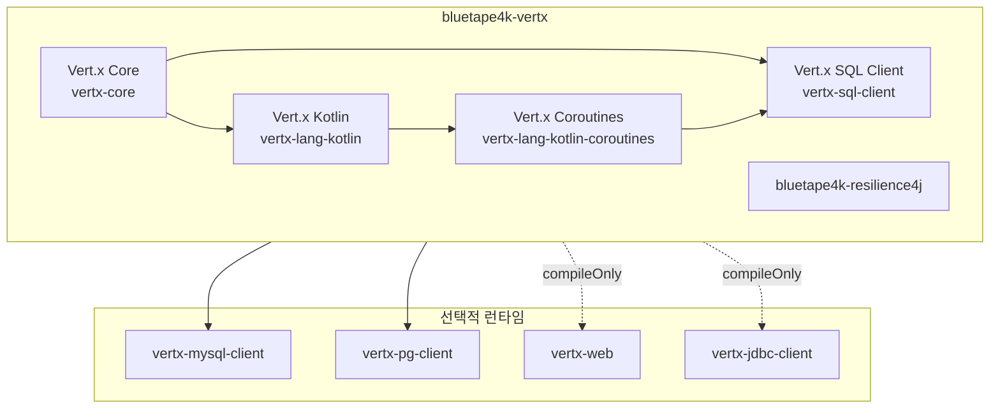
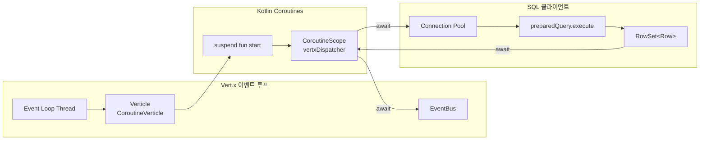
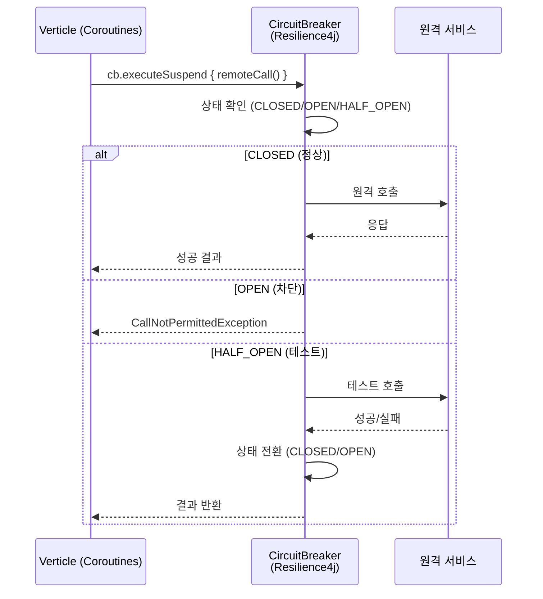
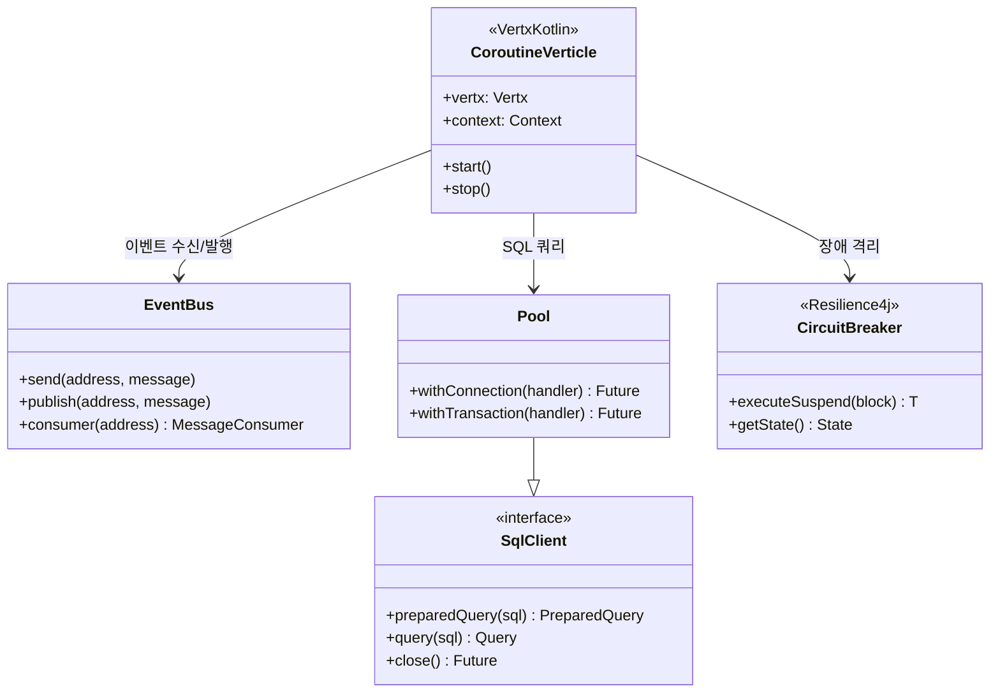

# Module bluetape4k-vertx

Vert.x 기반 비동기/Coroutines 개발을 위한 단일 통합 모듈입니다.

> 구 `vertx/core`, `vertx/sqlclient`, `vertx/resilience4j` 모듈이 이 모듈로 통합되었습니다.

## 제공 기능

### Vert.x Core (구 `vertx/core`)
- Vert.x Kotlin Coroutines 확장
- Verticle 배포/관리 유틸리티
- EventBus 코루틴 어댑터
- `vertx_lang_kotlin_coroutines` 기반 suspend 지원

### Vert.x SQL Client (구 `vertx/sqlclient`)
- `vertx-sql-client` + `vertx-sql-client-templates` 통합
- MySQL / PostgreSQL 드라이버 내장
- MyBatis Dynamic SQL 통합
- JDBC 클라이언트 지원 (선택적)
- Coroutines 기반 쿼리 실행

### Resilience4j 통합 (구 `vertx/resilience4j`)
- Vert.x + Resilience4j Circuit Breaker 통합
- Resilience4j Micrometer 메트릭 연동 (선택적)

## 설치

```kotlin
dependencies {
    implementation("io.github.bluetape4k:bluetape4k-vertx:${bluetape4kVersion}")
}
```

서비스별 선택적 런타임 의존성:

```kotlin
dependencies {
    implementation("io.github.bluetape4k:bluetape4k-vertx:${bluetape4kVersion}")

    // MySQL 사용 시
    runtimeOnly(Libs.vertx_mysql_client)

    // PostgreSQL 사용 시
    runtimeOnly(Libs.vertx_pg_client)
}
```

## 주요 의존성 구조

| 범주 | 의존 방식 | 설명 |
|------|-----------|------|
| `vertx-core` | `api` | Vert.x 핵심 |
| `vertx-lang-kotlin` | `api` | Kotlin 언어 지원 |
| `vertx-lang-kotlin-coroutines` | `api` | Coroutines 지원 |
| `vertx-sql-client` | `api` | SQL 클라이언트 추상화 |
| `bluetape4k-resilience4j` | `api` | Resilience4j 통합 |
| `vertx-mysql-client` | `implementation` | MySQL 드라이버 |
| `vertx-pg-client` | `implementation` | PostgreSQL 드라이버 |
| `vertx-web` | `compileOnly` | 선택적 Web 지원 |
| `vertx-jdbc-client` | `compileOnly` | 선택적 JDBC |

## 아키텍처 다이어그램

### 모듈 의존성 구조



### Vert.x 이벤트 루프 + Coroutines 처리 흐름



### Circuit Breaker + Resilience4j 통합 흐름



### Vert.x 핵심 컴포넌트 클래스 구조



## 사용 예시

### Verticle (Coroutines)

```kotlin
import io.vertx.kotlin.coroutines.CoroutineVerticle
import io.vertx.kotlin.coroutines.await

class MainVerticle : CoroutineVerticle() {

    override suspend fun start() {
        val server = vertx.createHttpServer()
        server.requestHandler { req ->
            req.response().end("Hello Vert.x!")
        }
        server.listen(8080).await()
    }
}
```

### SQL Client (Coroutines)

```kotlin
import io.vertx.sqlclient.Pool
import io.vertx.kotlin.coroutines.await

suspend fun findUser(pool: Pool, id: Long): RowSet<Row> {
    return pool.preparedQuery("SELECT * FROM users WHERE id = $1")
        .execute(Tuple.of(id))
        .await()
}
```

### Circuit Breaker + Resilience4j

```kotlin
import io.github.resilience4j.circuitbreaker.CircuitBreaker
import io.bluetape4k.resilience4j.circuitbreaker.executeSuspend

val cb = CircuitBreaker.ofDefaults("vertx-service")

suspend fun callRemoteService(): String =
    cb.executeSuspend { remoteCall() }
```
