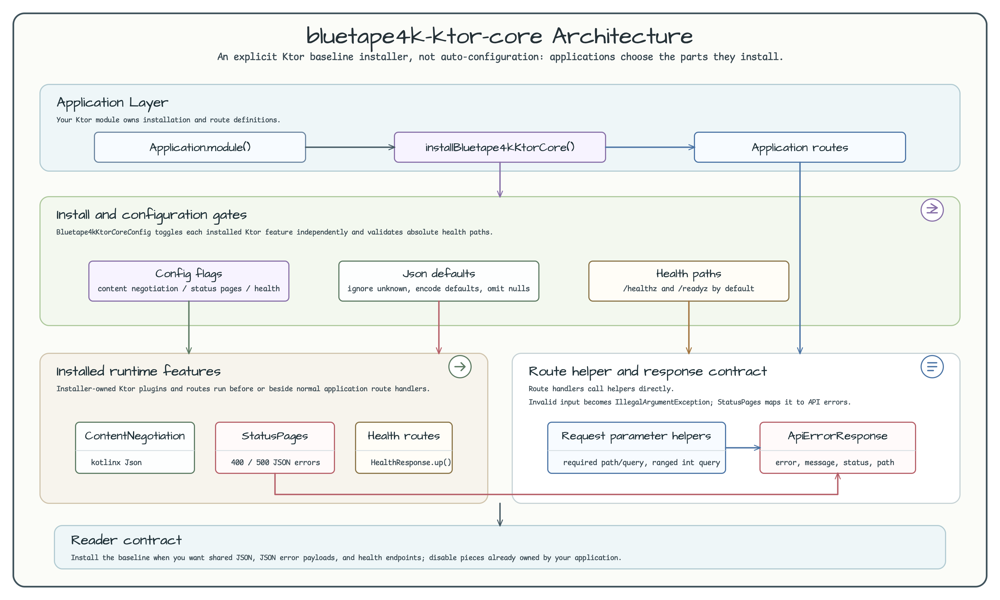

# bluetape4k-ktor-core

[English](./README.md) | [한국어](./README.ko.md)

Small Ktor server defaults for bluetape4k applications.

## Architecture Diagram



## Features

- `Bluetape4kKtorJson.defaultJson()` provides shared kotlinx serialization defaults.
- `installBluetape4kKtorCore()` installs the baseline Ktor plugins explicitly.
- `ApiErrorResponse` and `StatusPagesConfig.bluetape4kErrorResponses()` produce consistent JSON error payloads.
- `/healthz` and `/readyz` routes return `HealthResponse.up()` by default.
- Query and path parameter helpers keep repeated Ktor route validation compact.

## Dependency

```kotlin
dependencies {
    implementation("io.bluetape4k:bluetape4k-ktor-core")
}
```

## Usage

```kotlin
import io.bluetape4k.ktor.core.installBluetape4kKtorCore
import io.bluetape4k.ktor.core.intQueryParameter
import io.bluetape4k.ktor.core.requiredPathParameter
import io.ktor.server.application.Application
import io.ktor.server.application.call
import io.ktor.server.response.respond
import io.ktor.server.routing.get
import io.ktor.server.routing.routing

fun Application.module() {
    installBluetape4kKtorCore()

    routing {
        get("/items/{type}") {
            val type = call.requiredPathParameter("type")
            val size = call.intQueryParameter("size", defaultValue = 10, range = 1..100)

            call.respond(mapOf("type" to type, "size" to size))
        }
    }
}
```

The default installer adds content negotiation, JSON error handling, and
health/readiness routes. When an application already owns one of those Ktor
plugins, disable that part with `Bluetape4kKtorCoreConfig`.
