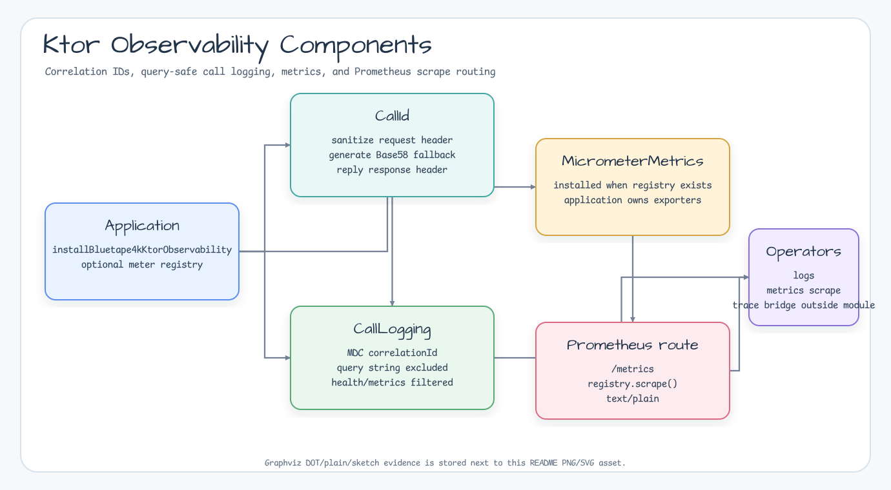

# bluetape4k-ktor-observability

[English](./README.md) | [한국어](./README.ko.md)

bluetape4k 애플리케이션에서 관측성 기본값을 명시적으로 설치하는 Ktor 모듈입니다.

## 컴포넌트 다이어그램



## 기능

- `installBluetape4kKtorObservability()`는 선택한 Ktor 관측성 플러그인을 명시적으로 설치합니다.
- Ktor `CallId`는 정제된 correlation ID만 전파합니다.
- `CallLogging`은 query string을 제외한 기본 로그 메시지와 MDC를 함께 사용합니다.
- 애플리케이션이 `MeterRegistry`를 제공할 때만 Micrometer `MicrometerMetrics`를 설치합니다.
- `prometheusScrapeRoute()`는 애플리케이션이 소유한 `PrometheusMeterRegistry`로 scrape route를 엽니다.
- 선택적 OpenTelemetry 서버 tracing은 애플리케이션이 소유한 `OpenTelemetry` 인스턴스를 사용합니다.
- 통합 installer는 기본적으로 `Bluetape4kKtorObservabilityConfig.correlationId`를 CallId,
  CallLogging, tracing이 함께 사용합니다.
- tracing에 별도 header 또는 length 정책이 필요할 때만
  `KtorOpenTelemetryTracingConfig.correlationId`를 명시적인 override로 지정합니다.

## 의존성

```kotlin
dependencies {
    implementation("io.bluetape4k:bluetape4k-ktor-observability")

    // Prometheus scrape route를 사용할 때만 필요합니다.
    implementation("io.micrometer:micrometer-registry-prometheus")

    // OpenTelemetry Ktor tracing helper를 사용할 때만 필요합니다.
    implementation("io.opentelemetry.instrumentation:opentelemetry-ktor-3.0")
}
```

## Micrometer와 Prometheus 사용 예

```kotlin
import io.bluetape4k.ktor.observability.Bluetape4kKtorObservabilityConfig
import io.bluetape4k.ktor.observability.installBluetape4kKtorObservability
import io.bluetape4k.ktor.observability.prometheusScrapeRoute
import io.ktor.server.application.Application
import io.ktor.server.routing.routing
import io.micrometer.prometheusmetrics.PrometheusMeterRegistry

fun Application.module(registry: PrometheusMeterRegistry) {
    installBluetape4kKtorObservability(
        Bluetape4kKtorObservabilityConfig(meterRegistry = registry)
    )

    routing {
        prometheusScrapeRoute(registry)
    }
}
```

## OpenTelemetry Tracing 사용 예

Tracing은 명시적으로 켜야 합니다. OpenTelemetry SDK, exporter, propagator는
애플리케이션에서 만들고, helper에는 완성된 `OpenTelemetry` 인스턴스만 전달합니다.

```kotlin
import io.bluetape4k.ktor.observability.Bluetape4kKtorObservabilityConfig
import io.bluetape4k.ktor.observability.KtorOpenTelemetryTracingConfig
import io.bluetape4k.ktor.observability.installBluetape4kKtorObservability
import io.ktor.server.application.Application
import io.opentelemetry.api.OpenTelemetry

fun Application.module(openTelemetry: OpenTelemetry) {
    installBluetape4kKtorObservability(
        Bluetape4kKtorObservabilityConfig(
            tracing = KtorOpenTelemetryTracingConfig(
                openTelemetry = openTelemetry,
                captureSanitizedCorrelationId = true
            )
        )
    )
}
```

`captureSanitizedCorrelationId`는 정제된 `correlation.id` trace attribute만
기록합니다. raw request header는 기록하지 않습니다. traced request에는 bounded
`correlation.present` attribute가 항상 기록됩니다.

통합 installer는 CallId, CallLogging, 응답 전파, tracing에 하나의 correlation
정책을 적용합니다. `correlationId`를 지정하지 않은 tracing 설정은 top-level 정책의
request header와 `maxLength`를 상속합니다. 애플리케이션 correlation ID와 분리된 trace
전용 정책이 필요하면 `KtorOpenTelemetryTracingConfig.correlationId`를 지정합니다.

## 의존성 정책

이 모듈은 Ktor `CallId`, `CallLogging`, `MicrometerMetrics`를 명시적으로
설치합니다. 실제 `MeterRegistry`, exporter, tracing backend는 애플리케이션이
소유합니다. OpenTelemetry tracing은 기본으로 설치하지 않습니다.
`opentelemetry-ktor-3.0` instrumentation dependency는 tracing helper를 사용할 때만
추가하세요. 이 instrumentation의 version은 OpenTelemetry alpha BOM에서 정해지므로,
애플리케이션이 소유한 telemetry 설정을 쉽게 교체할 수 있게 유지하는 편이 좋습니다.

수신 correlation ID는 그대로 되돌려 보내지 않습니다. trim, safe character filtering,
length cap을 거친 값만 MDC와 응답 헤더에 사용합니다.
