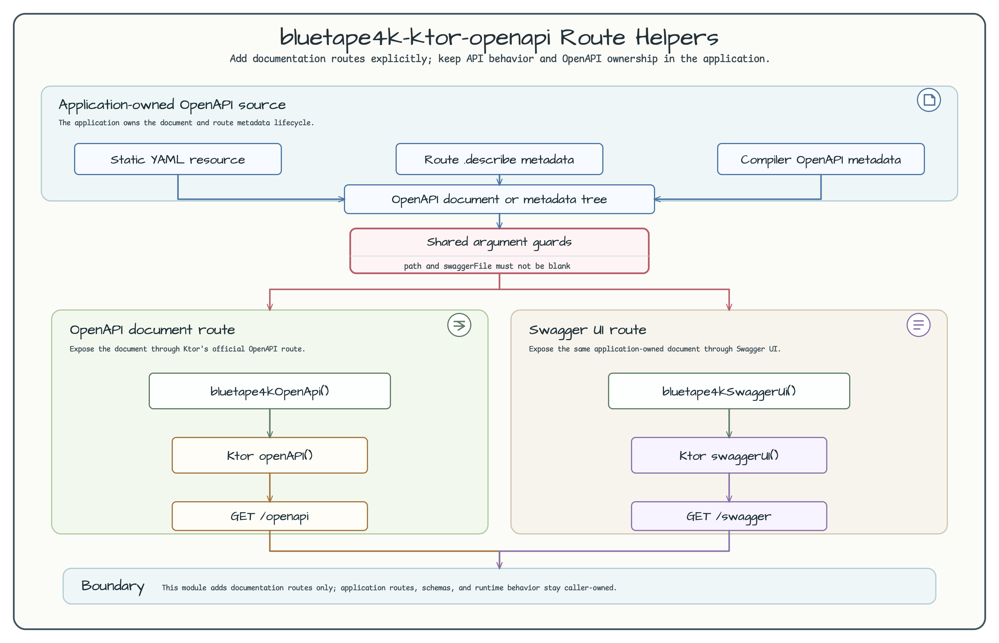

# bluetape4k-ktor-openapi

[English](README.md) | [한국어](README.ko.md)

Optional Ktor OpenAPI helpers for applications that want explicit documentation
routes without changing route behavior.

## Route Diagram



## Features

- `bluetape4kOpenApi()` wraps Ktor's official `openAPI()` route.
- `bluetape4kSwaggerUi()` wraps Ktor's official `swaggerUI()` route.
- Default endpoint names and specification path match bluetape4k Ktor examples:
  `openapi`, `swagger`, and `openapi/documentation.yaml`.
- The OpenAPI document remains application-owned, so teams can use static YAML,
  Ktor compiler-generated metadata, runtime `.describe {}` metadata, or a mix.

## Dependency

```kotlin
dependencies {
    implementation("io.bluetape4k:bluetape4k-ktor-openapi:$bluetape4kVersion")
}
```

## Static Specification

Place a document such as `src/main/resources/openapi/documentation.yaml`, then
wire explicit documentation routes:

```yaml
openapi: 3.1.0
info:
  title: Example API
  version: 1.0.0
components:
  schemas: {}
paths:
  /healthz:
    get:
      responses:
        "200":
          description: The application is accepting traffic.
```

```kotlin
fun Application.module() {
    installBluetape4kKtorCore()

    routing {
        bluetape4kHealthRoutes()
        bluetape4kOpenApi()
        bluetape4kSwaggerUi()
    }
}
```

Keep `components.schemas` explicit because Ktor's OpenAPI HTML renderer
delegates to Swagger Codegen internals that expect the schema map.

## Runtime Metadata

Ktor 3.5 can assemble OpenAPI metadata from the routing tree when applications
enable the Ktor compiler OpenAPI extension, add route comments, or attach
runtime `.describe {}` metadata. Keep route metadata near the route that owns
the behavior:

```kotlin
@OptIn(ExperimentalKtorApi::class)
fun Route.widgetRoutes() {
    get("/widgets/{id}") {
        val id = call.requiredPathParameter("id")
        call.respond(mapOf("id" to id))
    }.describe {
        summary = "Read a widget"
        responses {
            HttpStatusCode.OK {
                description = "Widget payload"
            }
        }
    }
}
```

## Non-goals

- No global Ktor plugin installation.
- No hidden route generation.
- No Swagger Codegen dependency.
- No replacement for Ktor's official OpenAPI or Swagger UI plugins.
