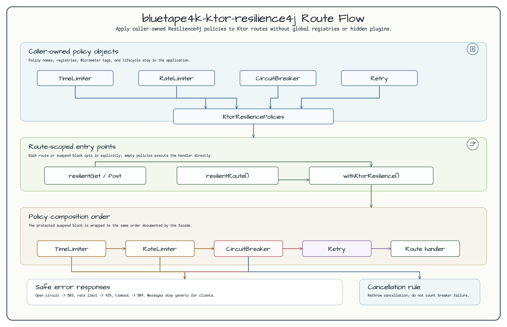

# bluetape4k-ktor-resilience4j

[English](./README.md) | [한국어](./README.ko.md)

bluetape4k 생태계의 Ktor 서버 애플리케이션에서 route 단위로 Resilience4j 정책을
적용하는 helper 모듈입니다.

## Route Flow 다이어그램



## 기능

- caller가 소유한 retry, circuit breaker, rate limiter, time limiter를 전달하는 `KtorResiliencePolicies`.
- 임의의 suspend block을 보호하는 `withKtorResilience()`.
- route 단위 정책 적용을 위한 `resilientRoute()`, `resilientGet()`, `resilientPost()`.
- 안전한 JSON 오류 응답을 위한 `StatusPagesConfig.bluetape4kResilienceErrors()`.
- 취소 안전 circuit breaker 처리: `CancellationException`은 다시 던지고 실패로 집계하지 않습니다.

## 의존성

```kotlin
dependencies {
    implementation("io.github.bluetape4k:bluetape4k-ktor-resilience4j")
}
```

## 사용 예

```kotlin
import io.bluetape4k.ktor.core.Bluetape4kKtorCoreConfig
import io.bluetape4k.ktor.core.bluetape4kErrorResponses
import io.bluetape4k.ktor.core.installBluetape4kKtorCore
import io.bluetape4k.ktor.resilience4j.KtorResiliencePolicies
import io.bluetape4k.ktor.resilience4j.bluetape4kResilienceErrors
import io.bluetape4k.ktor.resilience4j.resilientGet
import io.github.resilience4j.circuitbreaker.CircuitBreaker
import io.github.resilience4j.retry.Retry
import io.ktor.server.application.Application
import io.ktor.server.application.install
import io.ktor.server.plugins.statuspages.StatusPages
import io.ktor.server.response.respondText
import io.ktor.server.routing.routing

fun Application.module() {
    installBluetape4kKtorCore(Bluetape4kKtorCoreConfig(installStatusPages = false))
    install(StatusPages) {
        bluetape4kResilienceErrors()
        bluetape4kErrorResponses()
    }

    val policies = KtorResiliencePolicies(
        circuitBreaker = CircuitBreaker.ofDefaults("products.route"),
        retry = Retry.ofDefaults("products.route"),
    )

    routing {
        resilientGet("/products", policies) {
            call.respondText("ok")
        }
    }
}
```

## 오류 매핑

| 실패 | HTTP 상태 | 오류 코드 |
|---|---:|---|
| Circuit open | 503 | `circuit_breaker_open` |
| Rate limiter 거부 | 429 | `rate_limited` |
| Time limiter timeout | 504 | `timeout` |

메시지는 client에 노출해도 안전한 일반 문구만 사용합니다. 정책 이름은 caller가
소유한 Resilience4j 객체에 남기므로 metrics와 registry 소유권은 애플리케이션에
남습니다.

## 비목표

- 전역 Ktor plugin이나 숨겨진 registry를 만들지 않습니다.
- 애플리케이션 설정 바인딩을 제공하지 않습니다.
- 인증, 로깅, tracing, OpenAPI 통합을 포함하지 않습니다.
- client 전용 facade를 제공하지 않습니다.
