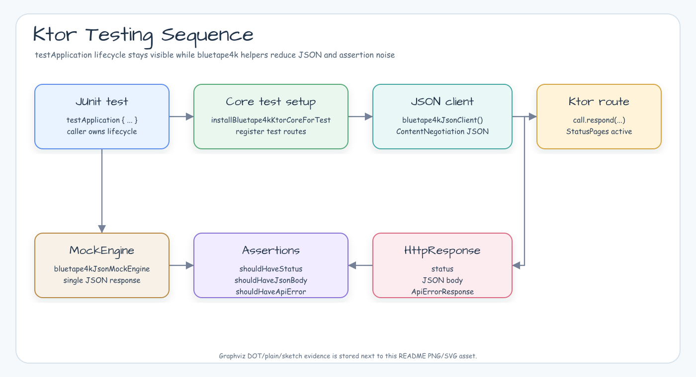

# bluetape4k-ktor-testing

[English](./README.md) | [한국어](./README.ko.md)

bluetape4k 생태계를 위한 Ktor 테스트 helper 모듈입니다.

## Sequence Diagram



## 기능

- Ktor `testApplication` 생명주기를 숨기지 않는 `bluetape4k-ktor-core` 설치 helper.
- `Bluetape4kKtorJson.defaultJson()`을 사용하는 JSON test client factory.
- kotlinx serialization 응답 decode helper.
- HTTP status, JSON body, 표준 `ApiErrorResponse` assertion.
- 단일 JSON 응답 client test를 위한 작은 `MockEngine` helper.

## 의존성

```kotlin
testImplementation("io.github.bluetape4k:bluetape4k-ktor-testing")
```

## 사용 예

```kotlin
@Test
fun `endpoint returns json`() = testApplication {
    installBluetape4kKtorCoreForTest {
        get("/echo") {
            call.respond(EchoResponse("blue"))
        }
    }

    val response = client.get("/echo")

    response shouldHaveStatus HttpStatusCode.OK
    response.shouldHaveJsonBody(EchoResponse("blue"))
}
```

typed request/response body가 필요한 테스트에서는 JSON-aware Ktor test client를
만들 수 있습니다.

```kotlin
val jsonClient = bluetape4kJsonClient()
val body = jsonClient.get("/echo").body<EchoResponse>()
```

표준 bluetape4k error payload도 바로 검증할 수 있습니다.

```kotlin
client.get("/bad").shouldHaveApiError(
    ExpectedApiError(
        status = HttpStatusCode.BadRequest,
        error = "bad_request",
        message = "Invalid input",
        path = "/bad"
    )
)
```

단순 client-side test에는 `bluetape4kJsonMockEngine`을 사용합니다.

```kotlin
val client = HttpClient(
    bluetape4kJsonMockEngine(EchoResponse("mock"))
)
```
