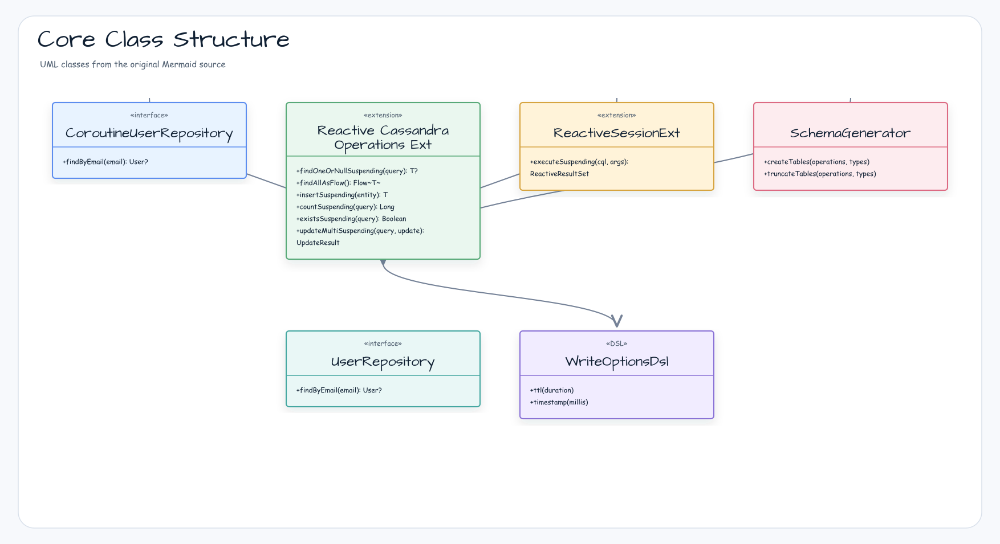
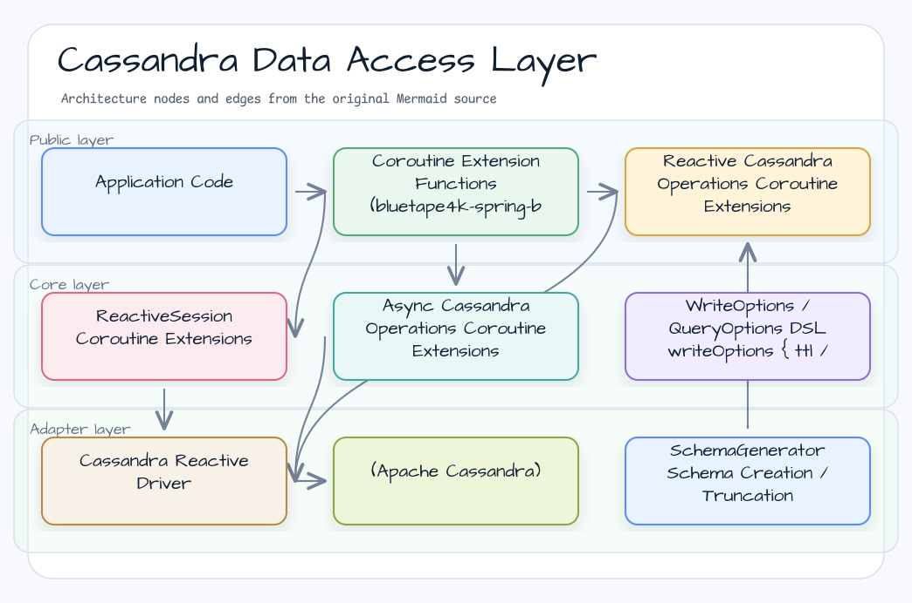
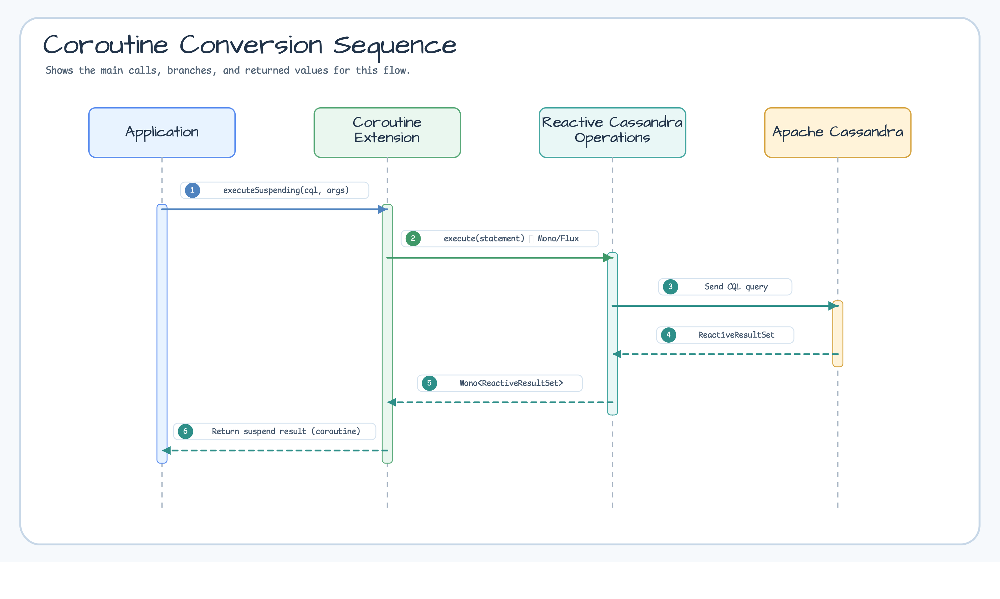

# Module bluetape4k-spring-boot-cassandra

English | [한국어](./README.ko.md)

Provides coroutine extensions, convenience DSLs, and schema utilities for Spring Data Cassandra development (Spring Boot 4.x).

> This is the versionless Spring Boot 4 implementation.

## Key Features

- Coroutine extensions for `ReactiveSession`, `ReactiveCassandraOperations`, and `AsyncCassandraOperations`
- DSL helpers for CQL options (`QueryOptions`, `WriteOptions`, etc.)
- Schema creation and truncation utilities (`SchemaGenerator`)

## Architecture Diagrams

### Core Extension and Class Structure



### Cassandra Data Access Layer



### Coroutine Conversion Sequence



## Installation

```kotlin
dependencies {
    implementation("io.github.bluetape4k:bluetape4k-spring-boot-cassandra:${bluetape4kVersion}")
}
```

## Usage Examples

### Coroutine Extensions

```kotlin
val result = reactiveSession.executeSuspending("SELECT * FROM users WHERE id = ?", id)
```

### WriteOptions DSL

```kotlin
import java.util.concurrent.TimeUnit

val options = writeOptions {
    ttl(Duration.ofSeconds(30))
    timestamp(TimeUnit.MILLISECONDS.toMicros(System.currentTimeMillis()))
}
```

`WriteOptions` follows these Cassandra statement contracts:

| Input | Result |
| --- | --- |
| `ttl == null` | No TTL clause is rendered. |
| `ttl == Duration.ZERO` or a subsecond duration such as `1ms`/`500ms` | The whole-second value is truncated and rendered as TTL 0 (`USING TTL 0` for `INSERT`, `AND TTL 0` for `UPDATE`). |
| Negative TTL | The Spring Data builder fails with `IllegalArgumentException("TTL must be greater than equal to zero")`. |
| TTL seconds outside the `Int` range | `addWriteOptions` fails with `ArithmeticException` before the statement is executed. |
| `timestamp` | Applied in Cassandra microseconds; `Delete` preserves the timestamp but never applies TTL. |

The historical `isPositiveTtl` extension returns `true` for any non-negative TTL, including zero, and `false` when TTL is absent.

### Entity Definition

```kotlin
@Table
data class User(
    @PrimaryKey val id: UUID = UUID.randomUUID(),
    val name: String,
    val email: String,
)
```

### Repository

```kotlin
interface UserRepository : CassandraRepository<User, UUID> {
    fun findByEmail(email: String): User?
}

// Coroutines Repository
interface CoroutineUserRepository : CoroutineCrudRepository<User, UUID> {
    suspend fun findByEmail(email: String): User?
}
```

## Build and Test

```bash
./gradlew :bluetape4k-spring-boot-cassandra:test
```

## References

- [Spring Data Cassandra](https://spring.io/projects/spring-data-cassandra)
- [Apache Cassandra](https://cassandra.apache.org/)
