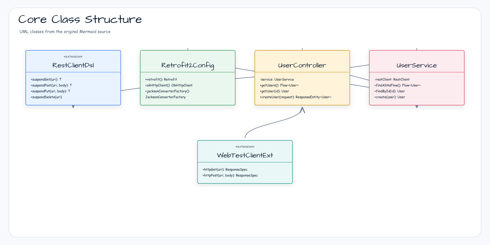
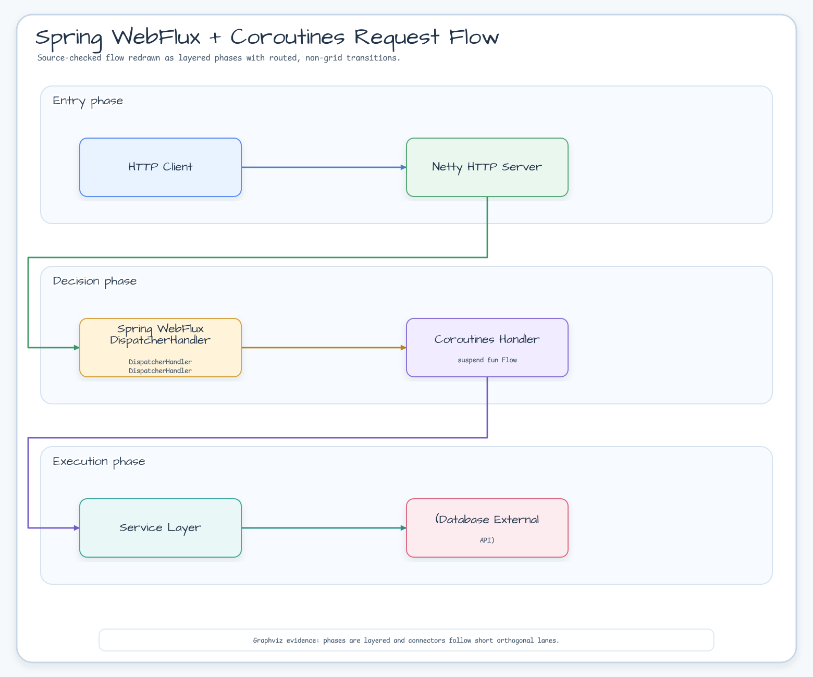
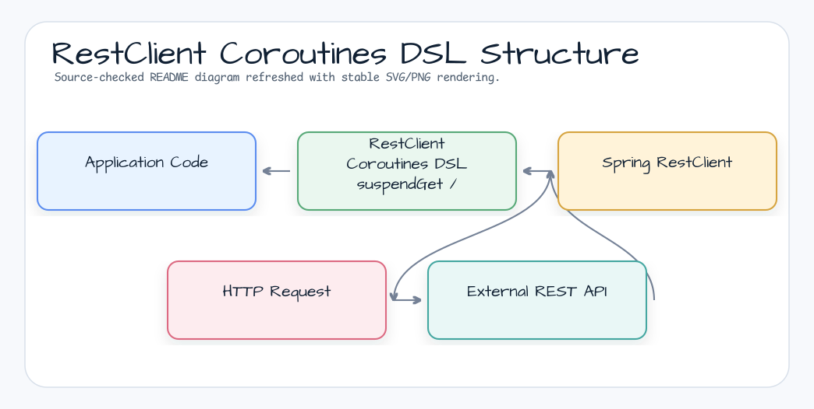
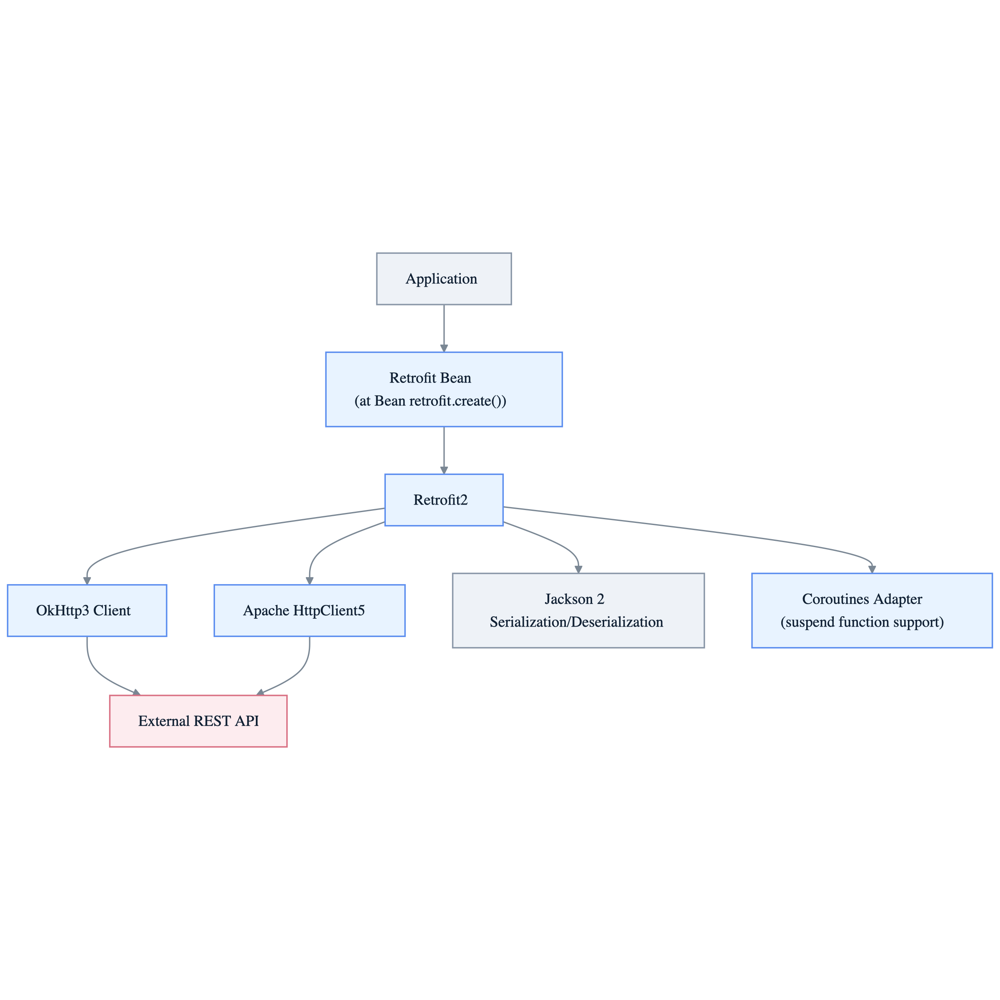

# Module bluetape4k-spring-boot-core

English | [한국어](./README.ko.md)

A unified module providing common features for Spring Boot 4.x applications.

> This is the versionless Spring Boot 4 implementation.

## Features

### Spring Core Utilities

- BeanFactory extension functions
- Kotlin reified annotation lookup extensions for `AnnotatedElementUtils` and `AnnotationUtils`
- Spring Boot AutoConfiguration support
- Jakarta Annotation API integration

### Spring WebFlux + Coroutines

- Coroutines-based WebFlux handler utilities
- `WebClient` extension functions (`httpGet`, `httpPost`, `httpPut`, `httpPatch`, `httpDelete`)
- `WebTestClient` extension functions
- Reactor ↔ Coroutines conversion support
- Dedicated `WebClient` resource configuration through `AbstractWebClientConfig`

### RestClient Coroutines DSL

- `RestClient` coroutine extensions (`suspendGet`, `suspendPost`, `suspendPut`, `suspendPatch`, `suspendDelete`)

### Spring Boot Observability Helpers

- `ObservationRegistry.observeSpring` for service, HTTP handler, and event handler code paths
- `ObservationRegistry.observeSpringSuspending` for coroutine-aware observation scope propagation
- Low-cardinality and high-cardinality Micrometer key value grouping through `SpringObservationKeyValues`
- Prometheus and OpenTelemetry export remain application-owned Spring Boot Actuator configuration

### Test Utilities

- Integration test support based on Spring Boot Test
- `WebTestClient` test extensions (`httpGet`, `httpPost`, etc.)
- Testcontainers integration

## Diagrams

### Spring Boot Core Capability Map



### Spring WebFlux + Coroutines Request Flow



### RestClient Coroutines DSL Structure



### WebClient Dedicated Resource Configuration



## Installation

```kotlin
dependencies {
    implementation("io.github.bluetape4k:bluetape4k-spring-boot-core:${bluetape4kVersion}")
}
```

## BOM Configuration Notes

The Spring Boot 4 BOM must be applied using `implementation(platform(...))`. Using
`dependencyManagement { imports { mavenBom() } }` conflicts with the Kotlin Gradle Plugin.

```kotlin
// ✅ Correct approach
dependencies {
    implementation(platform("org.springframework.boot:spring-boot-dependencies:4.x.x"))
}

// ❌ Incorrect approach (causes KGP build failures)
dependencyManagement {
    imports { mavenBom("org.springframework.boot:spring-boot-dependencies:4.x.x") }
}
```

## Usage Examples

### Annotation Lookup Extensions

```kotlin
import io.bluetape4k.spring.beans.findMergedAnnotationOrNull
import io.bluetape4k.spring.beans.hasMergedAnnotation

val mapping = method.findMergedAnnotationOrNull<RequestMapping>()
val hasMapping = method.hasMergedAnnotation<RequestMapping>()
```

### RestClient Coroutines DSL

The DSL runs blocking `RestClient` calls with `runInterruptible(Dispatchers.IO)`, so coroutine cancellation can interrupt the waiting client thread when the underlying request factory honors interruption.

```kotlin
import io.bluetape4k.spring.http.*

val restClient = RestClient.create("https://api.example.com")

// Make HTTP requests using suspend functions
val user: User = restClient.suspendGet("/users/1")
val created: User = restClient.suspendPost("/users", newUser, MediaType.APPLICATION_JSON)
val updated: User = restClient.suspendPut("/users/1", updatedUser, MediaType.APPLICATION_JSON)
restClient.suspendDelete("/users/1")
```

### WebClient Extensions

```kotlin
import io.bluetape4k.spring.tests.*

val webClient = WebClient.create("https://api.example.com")

// GET request
val response = webClient.httpGet("/users")
    .bodyToFlux(User::class.java)
    .asFlow()

// POST request
val created = webClient.httpPost("/users", newUser)
    .bodyToMono(User::class.java)
    .awaitSingle()
```

### WebFlux Controller (Coroutines)

```kotlin
@RestController
@RequestMapping("/users")
class UserController(private val service: UserService) {

    @GetMapping
    fun getUsers(): Flow<User> = service.findAllAsFlow()

    @GetMapping("/{id}")
    suspend fun getUser(@PathVariable id: Long): User =
        service.findById(id)
}
```

### Observing Service, HTTP Handler, and Event Code

Use the `ObservationRegistry` that Spring Boot wires for the application. The helpers only manage Micrometer Observation lifecycle and coroutine scope cleanup; they do not install exporters or mutate global OpenTelemetry SDK state.

```kotlin
import io.bluetape4k.spring.observability.SpringObservationKeyValues
import io.bluetape4k.spring.observability.observeSpring
import io.bluetape4k.spring.observability.observeSpringSuspending
import io.micrometer.common.KeyValue
import io.micrometer.common.KeyValues
import io.micrometer.observation.ObservationRegistry
import org.springframework.web.reactive.function.server.ServerRequest
import org.springframework.web.reactive.function.server.ServerResponse
import org.springframework.web.reactive.function.server.bodyValueAndAwait

class OrderService(
    private val observationRegistry: ObservationRegistry,
) {
    fun load(orderId: String): Order =
        observationRegistry.observeSpring(
            name = "order.service.load",
            keyValues = SpringObservationKeyValues(
                lowCardinality = KeyValues.of(KeyValue.of("component", "order-service")),
            ),
        ) { context ->
            context.addLowCardinalityKeyValue(KeyValue.of("outcome", "success"))
            repository.find(orderId)
        }

    suspend fun handleCreated(event: OrderCreated): Unit =
        observationRegistry.observeSpringSuspending("order.events.consume") { context ->
            context.addLowCardinalityKeyValue(KeyValue.of("event.name", "order.created"))
            eventHandler.handle(event)
        }
}

class OrderHandler(
    private val observationRegistry: ObservationRegistry,
    private val orderService: OrderService,
) {
    suspend fun get(request: ServerRequest): ServerResponse =
        observationRegistry.observeSpringSuspending("order.http.get") { context ->
            context.addLowCardinalityKeyValue(KeyValue.of("http.route", "/orders/{id}"))
            val order = orderService.load(request.pathVariable("id"))
            ServerResponse.ok().bodyValueAndAwait(order)
        }
}
```

Expose Prometheus through Spring Boot Actuator instead of registering a custom endpoint:

```yaml
management:
  endpoints:
    web:
      exposure:
        include: health,info,prometheus
  endpoint:
    prometheus:
      access: read_only
```

Configure tracing/export backends with Spring Boot and Micrometer Tracing properties owned by the application:

```yaml
management:
  tracing:
    sampling:
      probability: 1.0
  otlp:
    tracing:
      endpoint: http://localhost:4318/v1/traces
```

### WebTestClient Test

```kotlin
@SpringBootTest(webEnvironment = SpringBootTest.WebEnvironment.RANDOM_PORT)
class UserControllerTest(@Autowired val client: WebTestClient) {

    @Test
    fun `fetch user list`() = runTest {
        client.httpGet("/users")
            .expectStatus().isOk
            .expectBodyList(User::class.java)
            .hasSize(10)
    }
}
```

## Key Dependency Structure

| Category                      | Scope         | Description                       |
|-------------------------------|---------------|-----------------------------------|
| `spring-boot-starter-webflux` | `compileOnly` | Required for WebFlux + Coroutines |
| `bluetape4k-coroutines`       | `compileOnly` | Coroutines support                |
| `micrometer-observation`      | `compileOnly` | Observation helper support        |
| `spring-boot-starter-web`     | `compileOnly` | Optional servlet support          |
| `resilience4j-*`              | `compileOnly` | Optional Resilience4j             |

## Build and Test

```bash
./gradlew :bluetape4k-spring-boot-core:test
```
