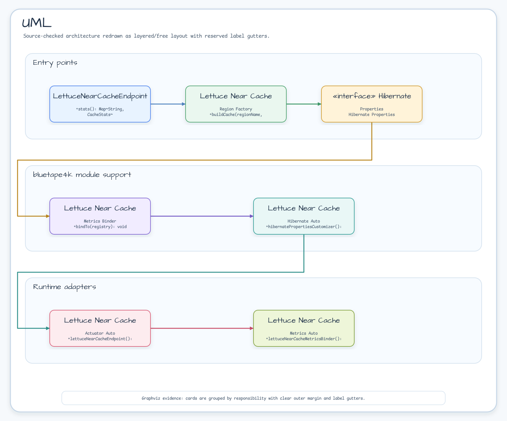
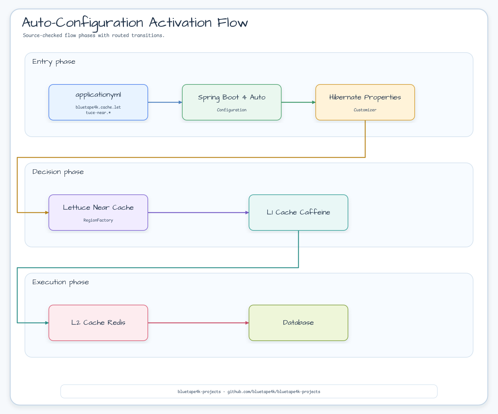

# bluetape4k-spring-boot-hibernate-lettuce

English | [한국어](./README.ko.md)

**Spring Boot 4 Auto-Configuration** for Hibernate 7 **2nd Level Cache** (Lettuce Near Cache).

Simply add `bluetape4k.cache.lettuce-near.*` settings to your
`application.yml` and Hibernate Second Level Cache activates automatically — no additional code required. Millisecond-based durations (e.g.,
`500ms`) are passed through directly to Hibernate configuration.

## Auto-Configuration Class Structure



### Auto-Configuration Activation Flow



## Spring Boot 4 Notes

Package names have changed in Spring Boot 4:

`HibernatePropertiesCustomizer` now comes from
`org.springframework.boot.hibernate.autoconfigure.HibernatePropertiesCustomizer`.
The old Spring Boot 3 package path is retired with the Spring Boot 3 module
line and is kept only in historical docs.

The Spring Boot 4 BOM must also be applied explicitly:

```kotlin
// build.gradle.kts
val springBootVersion = "4.0.6"
val bluetape4kVersion = "1.11.0"

dependencies {
    // Spring Boot 4 BOM (use platform instead of dependencyManagement)
    implementation(platform("org.springframework.boot:spring-boot-dependencies:$springBootVersion"))

    implementation("io.github.bluetape4k:bluetape4k-spring-boot-hibernate-lettuce:${bluetape4kVersion}")

    // Spring Boot 4 Hibernate integration
    implementation("org.springframework.boot:spring-boot-hibernate")

    // Spring Boot Starters
    implementation("org.springframework.boot:spring-boot-starter-data-jpa")
    implementation("org.springframework.boot:spring-boot-starter-actuator") // Actuator endpoint (optional)
    implementation("io.micrometer:micrometer-core")                         // Micrometer metrics (optional)
}
```

## Features

- 2nd Level Cache enabled with just a dependency + `application.yml` configuration
- Safe auto-configuration using `@ConditionalOnClass` / `@ConditionalOnProperty`
- **Actuator** endpoint (`GET /actuator/nearcache`) — per-region cache statistics
- **Micrometer** metrics (`lettuce.nearcache.*`) — active region count, total local size
- **Two-tier** caching architecture: L1 (Caffeine) + L2 (Redis)

## Dependencies (Spring Boot 4)

```kotlin
// build.gradle.kts
val springBootVersion = "4.0.6"
val bluetape4kVersion = "1.11.0"

dependencies {
    // Spring Boot 4 BOM (required)
    implementation(platform("org.springframework.boot:spring-boot-dependencies:$springBootVersion"))

    implementation("io.github.bluetape4k:bluetape4k-spring-boot-hibernate-lettuce:${bluetape4kVersion}")

    // Spring Boot Starters
    implementation("org.springframework.boot:spring-boot-starter-data-jpa")
    implementation("org.springframework.boot:spring-boot-starter-actuator") // Actuator endpoint (optional)
    implementation("io.micrometer:micrometer-core")                         // Micrometer metrics (optional)

    // Spring Boot 4 Hibernate integration
    implementation("org.springframework.boot:spring-boot-hibernate")
}
```

## Quick Start

### 1. Add the dependency and configure application.yml

```yaml
bluetape4k:
    cache:
        lettuce-near:
            redis-uri: redis://localhost:6379
            local:
                max-size: 10000
                expire-after-write: 30m
            redis-ttl:
                default: 120s
            metrics:
                enabled: true
                enable-caffeine-stats: true

spring:
    jpa:
        hibernate:
            ddl-auto: update
    datasource:
        url: jdbc:h2:mem:testdb;DB_CLOSE_DELAY=-1

management:
    endpoints:
        web:
            exposure:
                include: health, info, metrics, nearcache
```

### 2. Annotate your entities for caching

```kotlin
@Entity
@Table(name = "products")
@Cacheable
@Cache(usage = CacheConcurrencyStrategy.NONSTRICT_READ_WRITE, region = "product")
data class Product(
    @Id
    @GeneratedValue(strategy = GenerationType.IDENTITY)
    val id: Long? = null,

    @Column(nullable = false)
    val name: String,

    @Column
    val description: String? = null,

    @Column(nullable = false)
    val price: Double = 0.0,
)
```

### 3. Run — auto-configuration takes care of the rest

Hibernate properties are injected automatically and 2nd Level Cache is activated. No additional code required.

## Full Configuration Options

```yaml
bluetape4k:
    cache:
        lettuce-near:
            # Enable/disable (default: true)
            enabled: true

            # Redis connection URI
            redis-uri: redis://localhost:6379

            # Serialization codec (default: lz4fory)
            # Options: lz4fory | lz4fastfory | fory | fastfory | kryo | lz4kryo | lz4jdk | gzipfory | gzipfastfory | zstdfory | zstdfastfory | jdk
            codec: lz4fory

            # Enable RESP3 CLIENT TRACKING (requires Redis 6+, default: true)
            use-resp3: true

            # L1 (Caffeine) settings
            local:
                max-size: 10000                    # Maximum number of entries
                expire-after-write: 30m            # Expire after write

            # Redis TTL
            redis-ttl:
                default: 120s                      # Default TTL
                regions:
                    # Per-region TTL override (use brackets for keys with dots)
                    "[io.bluetape4k.examples.cache.lettuce.domain.Product]": 300s
                    "[io.bluetape4k.examples.cache.lettuce.domain.Order]": 600s

            # Metrics / statistics
            metrics:
                enabled: true                           # Enable metrics collection
                enable-caffeine-stats: true             # Collect Caffeine CacheStats
```

### Configuration → Hibernate properties mapping

| Spring Configuration                 | Hibernate property                                 |
|--------------------------------------|----------------------------------------------------|
| `redis-uri`                          | `hibernate.cache.lettuce.redis_uri`                |
| `codec`                              | `hibernate.cache.lettuce.codec`                    |
| `use-resp3`                          | `hibernate.cache.lettuce.use_resp3`                |
| `local.max-size`                     | `hibernate.cache.lettuce.local.max_size`           |
| `local.expire-after-write`           | `hibernate.cache.lettuce.local.expire_after_write` |
| `redis-ttl.default`                  | `hibernate.cache.lettuce.redis_ttl.default`        |
| `redis-ttl.regions[name]`            | `hibernate.cache.lettuce.redis_ttl.{name}`         |
| `metrics.enabled=true`               | `hibernate.generate_statistics=true`               |
| `metrics.enable-caffeine-stats=true` | `hibernate.cache.lettuce.local.record_stats=true`  |

### Root and metrics activation matrix

The root property `bluetape4k.cache.lettuce-near.enabled` gates every phase.
The Metrics and Actuator phases additionally require
`bluetape4k.cache.lettuce-near.metrics.enabled=true`. The Actuator endpoint also
requires the optional `spring-boot-starter-actuator` dependency, an
`EntityManagerFactory` bean, and `management.endpoints.web.exposure.include=nearcache`.

| Root `enabled` | `metrics.enabled` | Hibernate customizer | MetricsBinder | Actuator endpoint bean |
|---------------|-------------------|----------------------|---------------|------------------------|
| `false`       | `false` or `true`  | absent               | absent        | absent                 |
| `true`        | `false`           | present              | absent        | absent                 |
| `true`        | `true`            | present              | present       | present when Actuator conditions and exposure are met |

## Auto-Configuration Classes

| Class                                        | Condition                                                            | Role                                      |
|----------------------------------------------|----------------------------------------------------------------------|-------------------------------------------|
| `LettuceNearCacheHibernateAutoConfiguration` | Root `enabled=true` (default) + `LettuceNearCacheRegionFactory`, `EntityManagerFactory`, and `HibernatePropertiesCustomizer` on classpath | Registers `HibernatePropertiesCustomizer` |
| `LettuceNearCacheMetricsAutoConfiguration`   | Root `enabled=true` + `metrics.enabled=true` (both default) + `MeterRegistry` and `EntityManagerFactory` beans | Registers `LettuceNearCacheMetricsBinder` |
| `LettuceNearCacheActuatorAutoConfiguration`  | Root `enabled=true` + `metrics.enabled=true` (both default) + Actuator `Endpoint` and `EntityManagerFactory` conditions | Registers `/actuator/nearcache` endpoint  |

## Actuator Endpoint

### Retrieve Statistics for All Regions

```bash
GET /actuator/nearcache
```

Example response:

```json
{
  "product": {
    "regionName": "product",
    "localSize": 850,
    "localHitRate": 0.984,
    "localHitCount": 12453,
    "localMissCount": 203,
    "localEvictionCount": 10,
    "l2HitCount": 12050,
    "l2MissCount": 403,
    "l2PutCount": 1200
  }
}
```

### Retrieve Details for a Specific Region

```bash
GET /actuator/nearcache/{regionName}
```

Example:

```bash
GET /actuator/nearcache/product
```

Response:

```json
{
  "regionName": "product",
  "localSize": 850,
  "localHitRate": 0.984,
  "localHitCount": 12453,
  "localMissCount": 203,
  "localEvictionCount": 10,
  "l2HitCount": 12050,
  "l2MissCount": 403,
  "l2PutCount": 1200
}
```

## Micrometer Metrics

When both the root `enabled=true` and `metrics.enabled=true` conditions hold,
the following Gauges are registered. Setting `metrics.enabled=false` keeps the
Hibernate customizer but disables the MetricsBinder and near-cache Actuator endpoint.

| Metric                                  | Description                          |
|-----------------------------------------|--------------------------------------|
| `lettuce.nearcache.active.regions`      | Number of active regions             |
| `lettuce.nearcache.total.local.size`    | Estimated total L1 cache entry count |

```bash
# Retrieve Micrometer metrics (JSON)
GET /actuator/metrics/lettuce.nearcache.active.regions
GET /actuator/metrics/lettuce.nearcache.total.local.size
```

Example response:

```json
{
  "name": "lettuce.nearcache.active.regions",
  "baseUnit": "items",
  "measurements": [
    {
      "statistic": "VALUE",
      "value": 2.0
    }
  ]
}
```

## Disabling

To completely disable auto-configuration, set the root property to false:

```yaml
bluetape4k:
    cache:
        lettuce-near:
            enabled: false   # Disables customizer, MetricsBinder, and Actuator endpoint
```

This root switch wins over `metrics.enabled=true` and any Actuator exposure
setting; `management.endpoints.web.exposure.include=nearcache` cannot re-enable
the endpoint. To keep Hibernate integration while disabling metrics and the
endpoint, set `bluetape4k.cache.lettuce-near.metrics.enabled=false` instead.

## Running Tests

### Unit Tests (no Redis/DB required)

```bash
./gradlew :bluetape4k-spring-boot-hibernate-lettuce:test
```

Uses `ApplicationContextRunner` to test configuration without a real Redis or database instance.

### Integration Tests (Testcontainers)

Integration tests automatically manage Redis + H2 via Testcontainers.

```bash
./gradlew :bluetape4k-spring-boot-hibernate-lettuce:test -i
```

## Related Modules

- [`bluetape4k-cache-lettuce`](../../cache/cache-lettuce/README.md) — Near Cache core implementation
- [`bluetape4k-hibernate-cache-lettuce`](../../cache/hibernate-cache-lettuce/README.md) — Hibernate Region Factory
- [`bluetape4k-spring-boot-hibernate-lettuce-demo`](../hibernate-lettuce-demo/README.md) — Usage example

## Migration Note

This module is Spring Boot 4.x only. Use
`implementation(platform("org.springframework.boot:spring-boot-dependencies:$springBootVersion"))`
and keep `org.springframework.boot:spring-boot-hibernate` on the application
classpath so `HibernatePropertiesCustomizer` is available.

## Package Information

- **Group**: `io.github.bluetape4k`
- **Artifact**: `bluetape4k-spring-boot-hibernate-lettuce`
- **Package**: `io.bluetape4k.spring.boot.autoconfigure.cache.lettuce`

## License

MIT License
