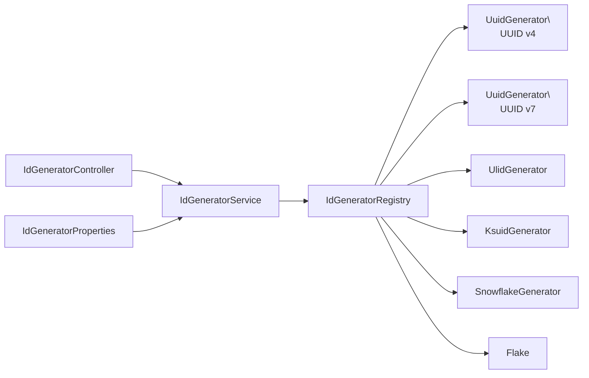

# bluetape4k Spring Boot idgenerator demo

English | [한국어](./README.ko.md)

This example shows how to expose `bluetape4k-idgenerators` through a Spring Boot REST application.
The Ktor version is tracked separately in issue #419.

## Architecture



## Configuration

```yaml
bluetape4k:
  id-generator:
    default-batch-size: 10
    max-batch-size: 100
```

`IdGeneratorConfiguration` registers each generator as a Spring Bean. `IdGeneratorRegistry` maps the REST
type name to the concrete generator and `IdGeneratorService` applies batch-size validation.

## Endpoints

Explicit endpoints:

| Method | Path |
|---|---|
| GET | `/ids/uuid-v4` |
| GET | `/ids/uuid-v7` |
| GET | `/ids/ulid` |
| GET | `/ids/ksuid` |
| GET | `/ids/snowflake` |
| GET | `/ids/flake` |
| GET | `/ids/{type}/batch?size=10` |

Generic endpoints:

| Method | Path |
|---|---|
| GET | `/idgen/{type}` |
| GET | `/idgen/{type}/batch?size=10` |
| GET | `/generators` |
| GET | `/health` |

Supported types are `uuid-v4`, `uuid-v7`, `ulid`, `ksuid`, `snowflake`, and `flake`.

## Usage

```bash
./gradlew :bluetape4k-spring-boot-idgenerator-demo:bootRun
```

```bash
curl http://localhost:8080/ids/uuid-v7
curl 'http://localhost:8080/idgen/snowflake/batch?size=5'
curl http://localhost:8080/generators
```

## Tests

```bash
./gradlew :bluetape4k-spring-boot-idgenerator-demo:test
```

The tests load the Spring Boot application, verify all REST endpoints, and use `SuspendedJobTester`
to prove that parallel UUID v7 and Snowflake requests return unique IDs.
