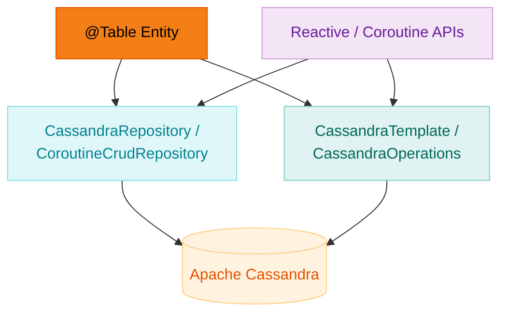

# Module Examples - Cassandra & Spring Data Cassandra

English | [한국어](./README.ko.md)

A comprehensive set of examples demonstrating Apache Cassandra and Spring Data Cassandra.

## UML



## Example List

### Basic (basic/)

| Example File                          | Description                              |
|---------------------------------------|------------------------------------------|
| `BasicUserRepositoryTest.kt`          | Basic Repository usage                   |
| `CassandraOperationsTest.kt`          | Running queries with CassandraOperations |
| `CoroutineCassandraOperationsTest.kt` | Async queries using Coroutines           |

### Kotlin DSL (kotlin/)

| Example File              | Description                           |
|---------------------------|---------------------------------------|
| `PersonRepositoryTest.kt` | Defining a Repository with Kotlin DSL |
| `TemplateTest.kt`         | Using CassandraTemplate               |

### Reactive (reactive/)

| Example File                       | Description           |
|------------------------------------|-----------------------|
| `ReactivePersonRepositoryTest.kt`  | Reactive Repository   |
| `CoroutinePersonRepositoryTest.kt` | Coroutines Repository |

### Multi-tenancy (multitenancy/)

| Example File                | Description                  |
|-----------------------------|------------------------------|
| `keyspace/`                 | Keyspace-based multi-tenancy |
| `row/RowMultitenantTest.kt` | Row-Level multi-tenancy      |

### Auditing (auditing/)

| Example File         | Description                    |
|----------------------|--------------------------------|
| `AuditingTest.kt`    | @CreatedBy, @LastModifiedBy    |
| `reactive/auditing/` | Auditing in a Reactive context |

### Domain Model (domain/model/)

| Model                 | Description            |
|-----------------------|------------------------|
| `User.kt`             | Basic user entity      |
| `Person.kt`           | Embedded type example  |
| `AllPossibleTypes.kt` | Cassandra type mapping |
| `VersionedEntity.kt`  | Optimistic locking     |

### Other Features

| Example              | Description                |
|----------------------|----------------------------|
| `udt/`               | User Defined Types (UDT)   |
| `optimisticlocking/` | Optimistic locking pattern |
| `projection/`        | Projection queries         |
| `convert/`           | Custom converters          |
| `event/`             | Domain events              |
| `streamnullable/`    | Nullable stream handling   |

## Key Learning Points

### Entity Definition

```kotlin
@Table
data class User(
    @Id val id: UUID?,
    val name: String,
    val email: String
)
```

### Repository

```kotlin
interface UserRepository : CassandraRepository<User, UUID> {
    fun findByEmail(email: String): User?
}
```

### Coroutines Support

```kotlin
interface CoroutinePersonRepository : CoroutineCrudRepository<Person, UUID> {
    suspend fun findByLastName(lastName: String): Flow<Person>
}
```

## How to Run

```bash
# Start Cassandra via Docker
docker run -d --name cassandra -p 9042:9042 cassandra:4

# Run all examples
./gradlew :examples:cassandra:test
```

## References

- [Spring Data Cassandra](https://spring.io/projects/spring-data-cassandra)
- [Apache Cassandra](https://cassandra.apache.org/)
