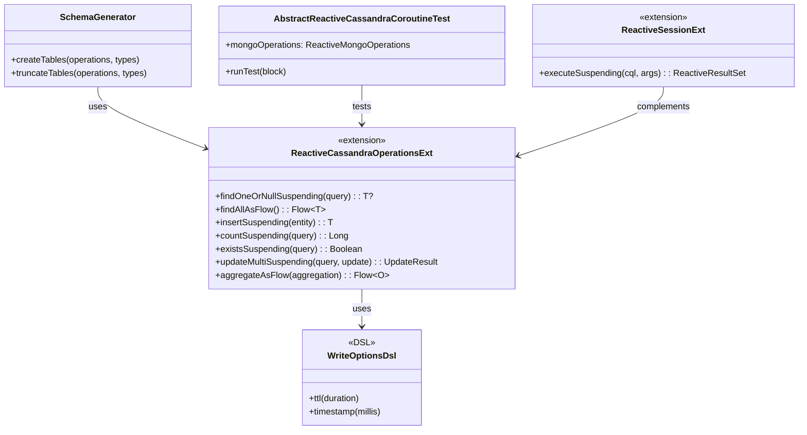
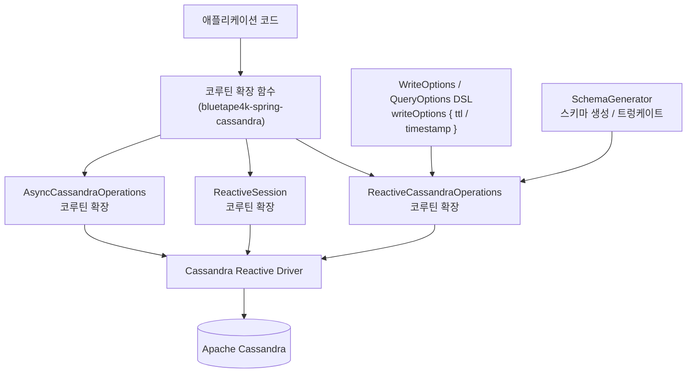
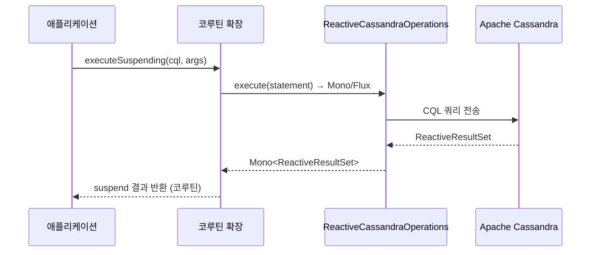

# Module bluetape4k-spring-cassandra

[English](./README.md) | 한국어

`bluetape4k-spring-cassandra`는 Spring Data Cassandra 기반 개발에서 자주 쓰는 코루틴 확장과 편의 DSL, 스키마 유틸을 제공합니다.

## 주요 기능

- `ReactiveSession`/`ReactiveCassandraOperations`/`AsyncCassandraOperations` 코루틴 확장
- CQL 옵션(`QueryOptions`, `WriteOptions` 등) DSL 헬퍼
- 스키마 생성/트렁케이트 유틸 (`SchemaGenerator`)
- Calendar/Period 기반 테스트 유틸 및 예제

## 설치

```kotlin
dependencies {
    implementation("io.github.bluetape4k:bluetape4k-spring-cassandra")
}
```

## 코루틴 확장 예시

```kotlin
val result = reactiveSession.executeSuspending("SELECT * FROM users WHERE id = ?", id)
```

## 옵션 DSL 예시

```kotlin
val options = writeOptions {
    ttl(Duration.ofSeconds(30))
    timestamp(System.currentTimeMillis())
}
```

## 아키텍처 다이어그램

### 핵심 클래스 다이어그램



### Cassandra 데이터 접근 계층



### 코루틴 변환 흐름



## 테스트

```bash
./gradlew :bluetape4k-spring-cassandra:test
```
