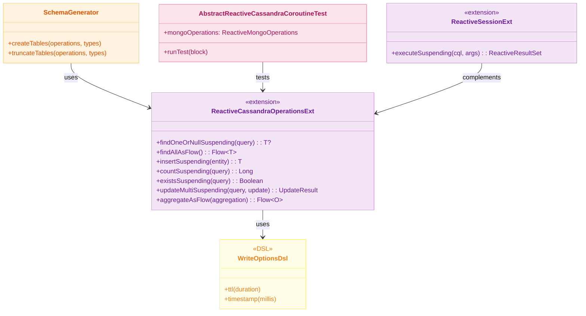
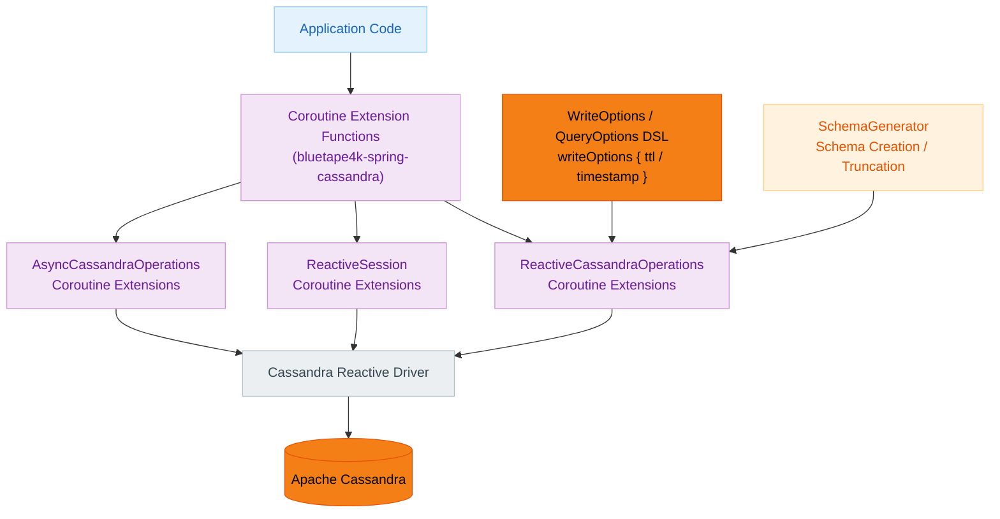
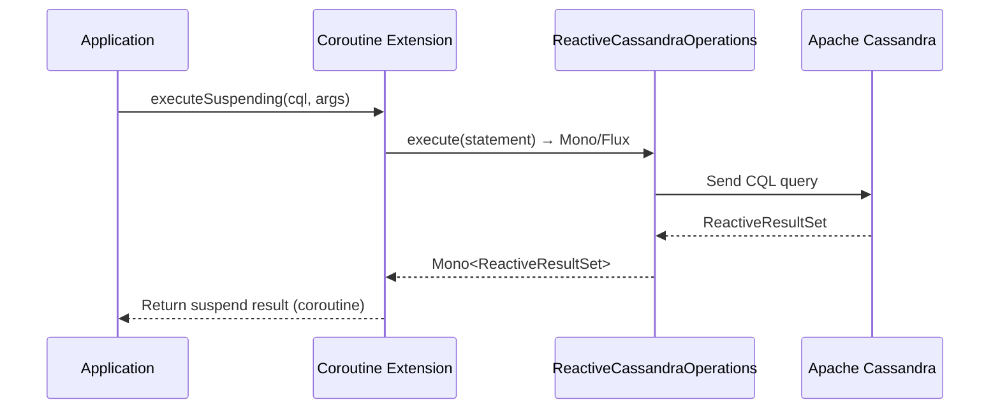

# Module bluetape4k-spring-cassandra

English | [한국어](./README.ko.md)

`bluetape4k-spring-cassandra` provides Kotlin coroutine extensions, convenience DSLs, and schema utilities commonly needed for Spring Data Cassandra development.

## Key Features

- Coroutine extensions for `ReactiveSession`, `ReactiveCassandraOperations`, and `AsyncCassandraOperations`
- DSL helpers for CQL options (`QueryOptions`, `WriteOptions`, etc.)
- Schema creation and truncation utilities (`SchemaGenerator`)
- Test utilities and examples based on Calendar/Period

## Installation

```kotlin
dependencies {
    implementation("io.github.bluetape4k:bluetape4k-spring-cassandra")
}
```

## Coroutine Extension Example

```kotlin
val result = reactiveSession.executeSuspending("SELECT * FROM users WHERE id = ?", id)
```

## Options DSL Example

```kotlin
val options = writeOptions {
    ttl(Duration.ofSeconds(30))
    timestamp(System.currentTimeMillis())
}
```

## Architecture Diagrams

### Core Class Diagram



### Cassandra Data Access Layer



### Coroutine Conversion Flow



## Testing

```bash
./gradlew :bluetape4k-spring-cassandra:test
```
