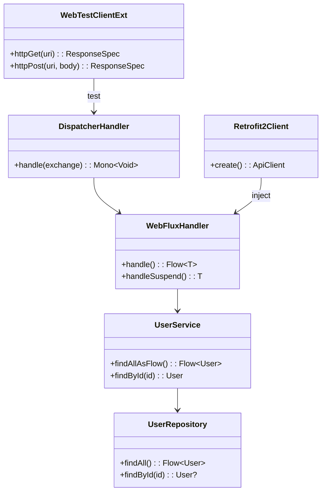
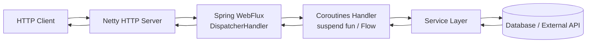
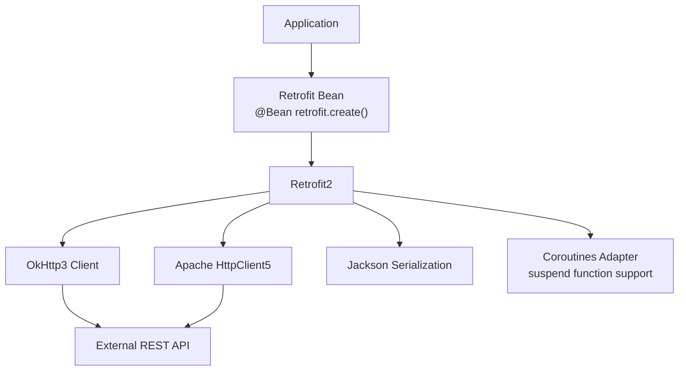
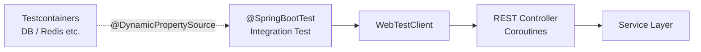

# Module bluetape4k-spring-boot3

English | [한국어](./README.ko.md)

An integrated module for common functionality based on Spring Boot 3.

> The former `spring/core`, `spring/webflux`, `spring/retrofit2`, and `spring/tests` modules have been consolidated into this single module.

## Features

### Spring Core Utilities (formerly `spring/core`)

- BeanFactory extension functions
- `ToStringCreator` support utilities
- Spring Boot AutoConfiguration support
- Jakarta Annotation API integration

### Spring WebFlux + Coroutines (formerly `spring/webflux`)

- Coroutines-based WebFlux handler utilities
- `WebTestClient` extension functions
- Reactor ↔ Coroutines conversion support
- Netty-based HTTP server integration

### Retrofit2 Integration (formerly `spring/retrofit2`)

- Spring Boot + Retrofit2 auto-configuration
- OkHttp3 client integration
- Apache HttpClient5 integration
- Coroutines suspend function support (`retrofit2-adapter-java8`)
- Jackson serialization/deserialization converters

### Test Utilities (formerly `spring/tests`)

- Spring Boot Test-based integration test support
- `WebTestClient` test extensions
- Testcontainers integration

## Installation

```kotlin
dependencies {
    implementation("io.github.bluetape4k:bluetape4k-spring-boot3:${bluetape4kVersion}")
}
```

Optional service-specific dependencies:

```kotlin
dependencies {
    // For Retrofit2 usage
    implementation("io.github.bluetape4k:bluetape4k-spring-boot3:${bluetape4kVersion}")
    runtimeOnly(Libs.retrofit2)

    // For Resilience4j usage (declared compileOnly, so add at runtime)
    implementation(Libs.resilience4j_all)
}
```

## Key Dependency Structure

| Category                        | Scope         | Description                      |
|---------------------------------|---------------|----------------------------------|
| `spring-boot-starter-webflux`   | `api`         | WebFlux + Coroutines (required)  |
| `bluetape4k-retrofit2`          | `api`         | Retrofit2 integration            |
| `bluetape4k-coroutines`         | `api`         | Coroutines support               |
| `bluetape4k-netty`              | `api`         | Netty integration                |
| `bluetape4k-micrometer`         | `api`         | Metrics                          |
| `spring-boot-starter-web`       | `compileOnly` | Optional servlet support         |
| `resilience4j-*`                | `compileOnly` | Optional Resilience4j            |

## Usage Examples

## Architecture Diagrams

### Core Component Class Diagram



### Spring WebFlux + Coroutines Request Flow



### Retrofit2 Integration Structure



### WebTestClient Test Structure



### WebFlux Controller (Coroutines)

```kotlin
import org.springframework.web.bind.annotation.*
import kotlinx.coroutines.flow.Flow

@RestController
@RequestMapping("/users")
class UserController(private val service: UserService) {

    @GetMapping
    fun getUsers(): Flow<User> = service.findAllAsFlow()

    @GetMapping("/{id}")
    suspend fun getUser(@PathVariable id: Long): User =
        service.findById(id)
}
```

### Registering a Retrofit2 Client

```kotlin
import retrofit2.Retrofit
import retrofit2.create

@Configuration
class RetrofitConfig {

    @Bean
    fun userApiClient(retrofit: Retrofit): UserApiClient =
        retrofit.create()
}
```

### WebTestClient Test

```kotlin
@SpringBootTest(webEnvironment = SpringBootTest.WebEnvironment.RANDOM_PORT)
class UserControllerTest(@Autowired val client: WebTestClient) {

    @Test
    fun `fetch user list`() {
        client.get().uri("/users")
            .exchange()
            .expectStatus().isOk
            .expectBodyList(User::class.java)
            .hasSize(10)
    }
}
```
