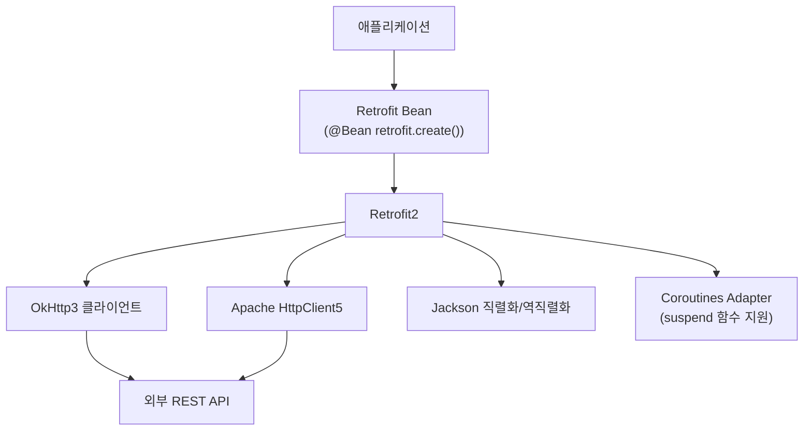
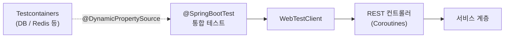

# Module bluetape4k-spring-boot3

Spring Boot 3 기반 공통 기능 통합 모듈입니다.

> 구 `spring/core`, `spring/webflux`, `spring/retrofit2`, `spring/tests` 모듈이 이 모듈로 통합되었습니다.

## 제공 기능

### Spring Core 유틸리티 (구 `spring/core`)

- BeanFactory 확장 함수
- `ToStringCreator` 지원 유틸리티
- Spring Boot AutoConfiguration 지원
- Jakarta Annotation API 통합

### Spring WebFlux + Coroutines (구 `spring/webflux`)

- Coroutines 기반 WebFlux 핸들러 유틸리티
- `WebTestClient` 확장 함수
- Reactor ↔ Coroutines 변환 지원
- Netty 기반 HTTP 서버 통합

### Retrofit2 통합 (구 `spring/retrofit2`)

- Spring Boot + Retrofit2 자동 구성
- OkHttp3 클라이언트 통합
- Apache HttpClient5 통합
- Coroutines suspend 함수 지원 (`retrofit2-adapter-java8`)
- Jackson 직렬화/역직렬화 컨버터

### 테스트 유틸리티 (구 `spring/tests`)

- Spring Boot Test 기반 통합 테스트 지원
- `WebTestClient` 테스트 확장
- Testcontainers 통합

## 설치

```kotlin
dependencies {
    implementation("io.github.bluetape4k:bluetape4k-spring-boot3:${bluetape4kVersion}")
}
```

서비스별 선택적 의존성:

```kotlin
dependencies {
    // Retrofit2 사용 시
    implementation("io.github.bluetape4k:bluetape4k-spring-boot3:${bluetape4kVersion}")
    runtimeOnly(Libs.retrofit2)

    // Resilience4j 사용 시 (compileOnly이므로 런타임에 추가 필요)
    implementation(Libs.resilience4j_all)
}
```

## 주요 의존성 구조

| 범주                            | 의존 방식         | 설명                      |
|-------------------------------|---------------|-------------------------|
| `spring-boot-starter-webflux` | `api`         | WebFlux + Coroutines 필수 |
| `bluetape4k-retrofit2`        | `api`         | Retrofit2 통합            |
| `bluetape4k-coroutines`       | `api`         | Coroutines 지원           |
| `bluetape4k-netty`            | `api`         | Netty 통합                |
| `bluetape4k-micrometer`       | `api`         | 메트릭                     |
| `spring-boot-starter-web`     | `compileOnly` | 선택적 서블릿 지원              |
| `resilience4j-*`              | `compileOnly` | 선택적 Resilience4j        |

## 사용 예시

## 아키텍처 다이어그램

### Spring WebFlux + Coroutines 요청 흐름

```mermaid
graph LR
    Client["HTTP 클라이언트"] --> Netty["Netty HTTP 서버"]
    Netty --> WebFlux["Spring WebFlux\nDispatcherHandler"]
    WebFlux --> Handler["Coroutines 핸들러\n(suspend fun / Flow)"]
    Handler --> Service["서비스 계층"]
    Service --> DB[("데이터베이스 / 외부 API")]
    DB -->> Service
    Service -->> Handler
    Handler -->> WebFlux
    WebFlux -->> Netty
    Netty -->> Client
```

### Retrofit2 통합 구조



### WebTestClient 테스트 구조



### WebFlux 컨트롤러 (Coroutines)

```kotlin
import org.springframework.web.bind.annotation.*
import kotlinx.coroutines.flow.Flow

@RestController
@RequestMapping("/users")
class UserController(private val service: UserService) {

    @GetMapping
    fun getUsers(): Flow<User> = service.findAllAsFlow()

    @GetMapping("/{id}")
    suspend fun getUser(@PathVariable id: Long): User =
        service.findById(id)
}
```

### Retrofit2 클라이언트 등록

```kotlin
import retrofit2.Retrofit
import retrofit2.create

@Configuration
class RetrofitConfig {

    @Bean
    fun userApiClient(retrofit: Retrofit): UserApiClient =
        retrofit.create()
}
```

### WebTestClient 테스트

```kotlin
@SpringBootTest(webEnvironment = SpringBootTest.WebEnvironment.RANDOM_PORT)
class UserControllerTest(@Autowired val client: WebTestClient) {

    @Test
    fun `사용자 목록 조회`() {
        client.get().uri("/users")
            .exchange()
            .expectStatus().isOk
            .expectBodyList(User::class.java)
            .hasSize(10)
    }
}
```
