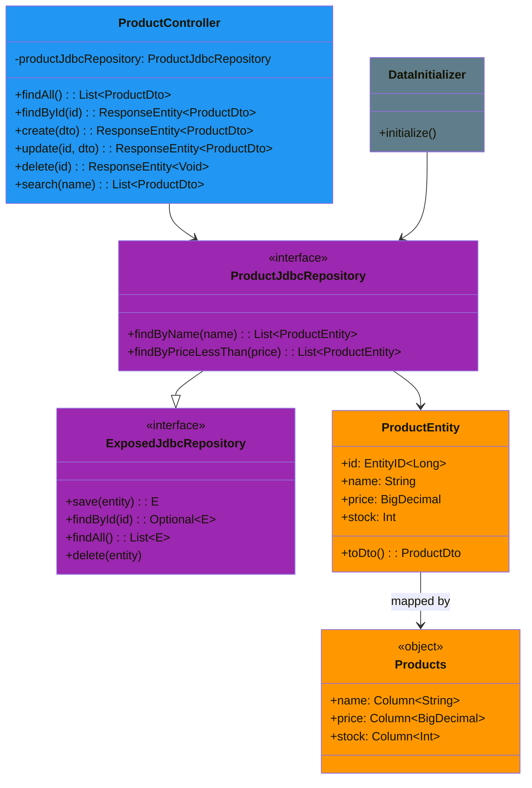
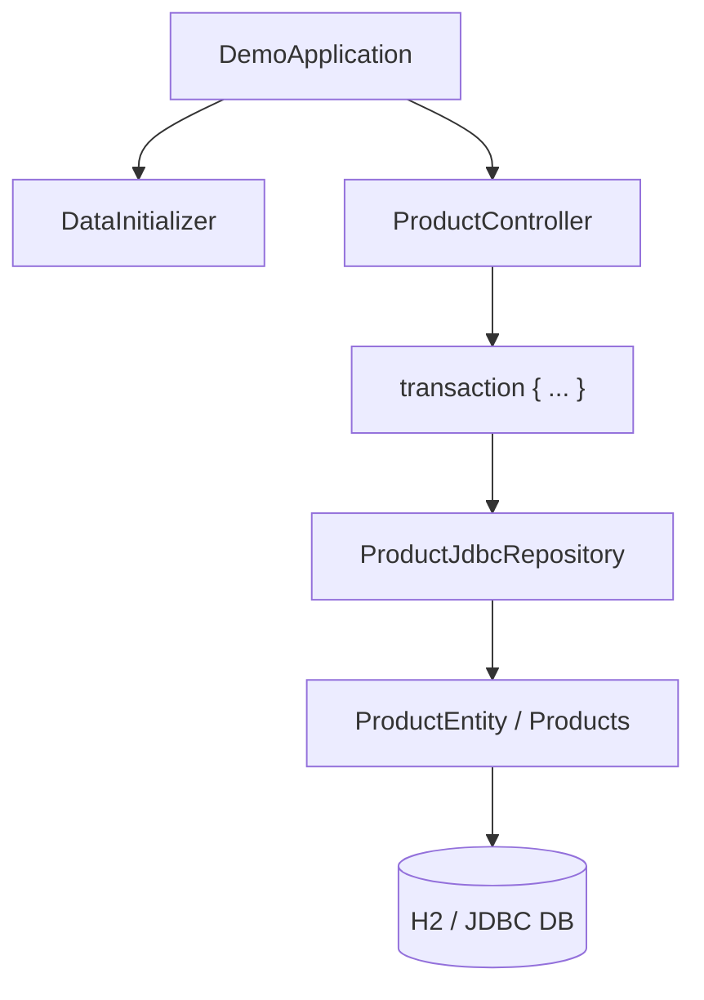

# bluetape4k-spring-boot3-exposed-jdbc-demo

Exposed DAO + Spring Data JDBC Repository + Spring MVC 통합 데모 (Spring Boot 3.x)

## 개요

이 모듈은 **Exposed DAO 엔티티**를 Spring Data JDBC Repository로 감싸고, Spring MVC REST API로 노출하는 기본 패턴을 보여줍니다.

## UML



### 애플리케이션 흐름 다이어그램



### 주요 특징

- **Exposed DAO 엔티티 기반**: `ProductEntity`, `Products` 테이블 정의
- **Spring Data JDBC Repository**: `ExposedJdbcRepository<E, ID>` 구현
- **쿼리 메서드**: `findByName`, `findByPriceLessThan` 자동 생성
- **Spring MVC REST API**: 표준 CRUD 엔드포인트
- **트랜잭션 경계**: 요청 당 하나의 `transaction {}` 블록으로 DAO와 DTO 변환까지 처리
- **자동 스키마 생성**: 애플리케이션 시작 시 테이블 자동 생성

## 프로젝트 구조

```
src/main/kotlin/io/bluetape4k/examples/exposed/mvc/
├── DemoApplication.kt              # Spring Boot 애플리케이션
├── domain/
│   └── ProductEntity.kt            # Exposed DAO 엔티티 + DTO
├── repository/
│   └── ProductJdbcRepository.kt     # Spring Data JDBC Repository
├── controller/
│   └── ProductController.kt         # REST API 컨트롤러
└── config/
    └── DataInitializer.kt           # 초기 데이터 로더
```

## 도메인 모델

### ProductEntity (Exposed DAO)

```kotlin
object Products : LongIdTable("products") {
    val name = varchar("name", 255)
    val price = decimal("price", 10, 2)
    val stock = integer("stock").default(0)
}

@ExposedEntity
class ProductEntity(id: EntityID<Long>) : LongEntity(id) {
    companion object : LongEntityClass<ProductEntity>(Products)
    var name: String by Products.name
    var price: java.math.BigDecimal by Products.price
    var stock: Int by Products.stock
}
```

### ProductDto (전송 객체)

```kotlin
data class ProductDto(
    val id: Long? = null,
    val name: String,
    val price: java.math.BigDecimal,
    val stock: Int = 0,
)

fun ProductEntity.toDto() = ProductDto(id.value, name, price, stock)
```

## Repository

### ExposedJdbcRepository 구현

```kotlin
interface ProductJdbcRepository: ExposedJdbcRepository<ProductEntity, Long> {
    fun findByName(name: String): List<ProductEntity>
    fun findByPriceLessThan(price: java.math.BigDecimal): List<ProductEntity>
}
```

`ExposedJdbcRepository`는 자동으로 PartTree 쿼리를 생성합니다. 메서드명 규칙을 따르면 별도의 구현이 필요 없습니다.

## REST API

### 기본 CRUD

| 메서드 | 경로 | 설명 |
|--------|------|------|
| GET | `/products` | 모든 상품 조회 |
| GET | `/products/{id}` | 특정 상품 조회 |
| POST | `/products` | 상품 생성 |
| PUT | `/products/{id}` | 상품 수정 |
| DELETE | `/products/{id}` | 상품 삭제 |
| GET | `/products/search` | 이름으로 검색 (쿼리 파라미터 `name`) |

### 요청/응답 예시

**모든 상품 조회**

```bash
curl http://localhost:8080/products
```

응답:
```json
[
  {
    "id": 1,
    "name": "Kotlin Programming Book",
    "price": 39.99,
    "stock": 100
  },
  {
    "id": 2,
    "name": "Spring Boot Guide",
    "price": 49.99,
    "stock": 50
  }
]
```

**상품 생성**

```bash
curl -X POST http://localhost:8080/products \
  -H "Content-Type: application/json" \
  -d '{
    "name": "Exposed ORM Tutorial",
    "price": 29.99,
    "stock": 200
  }'
```

응답 (201 Created):
```json
{
  "id": 3,
  "name": "Exposed ORM Tutorial",
  "price": 29.99,
  "stock": 200
}
```

**상품 수정**

```bash
curl -X PUT http://localhost:8080/products/1 \
  -H "Content-Type: application/json" \
  -d '{
    "name": "Advanced Kotlin",
    "price": 49.99,
    "stock": 150
  }'
```

**상품 삭제**

```bash
curl -X DELETE http://localhost:8080/products/1
```

**이름으로 검색**

```bash
curl "http://localhost:8080/products/search?name=Kotlin"
```

## 실행 방법

### 필수 사항

- Java 21+
- Gradle 8.x+
- Spring Boot 3.4+

### 빌드

```bash
./gradlew :spring-boot3:exposed-jdbc-demo:build
```

### 애플리케이션 실행

```bash
./gradlew :spring-boot3:exposed-jdbc-demo:bootRun
```

또는 JAR로 실행:

```bash
./gradlew :spring-boot3:exposed-jdbc-demo:assemble
java -jar spring-boot3/exposed-jdbc-demo/build/libs/exposed-spring-data-mvc-demo-*.jar
```

### 기본 포트

애플리케이션은 기본 포트 `8080`에서 시작됩니다.

### 초기 데이터

애플리케이션이 시작되면 자동으로 다음 3개의 샘플 상품이 생성됩니다.

```
1. Kotlin Programming Book - $39.99 (100개 재고)
2. Spring Boot Guide - $49.99 (50개 재고)
3. Exposed ORM Tutorial - $29.99 (200개 재고)
```

## 데이터베이스

기본적으로 **H2 인메모리 데이터베이스**를 사용합니다. `application.yml`에서 변경할 수 있습니다.

### application.yml

```yaml
spring:
  datasource:
    url: jdbc:h2:mem:mvcdb;DB_CLOSE_DELAY=-1;DB_CLOSE_ON_EXIT=FALSE
    driver-class-name: org.h2.Driver
    username: sa
    password:
  exposed:
    generate-ddl: true
```

### PostgreSQL로 변경

```yaml
spring:
  datasource:
    url: jdbc:postgresql://localhost:5432/exposed_demo
    driver-class-name: org.postgresql.Driver
    username: postgres
    password: password
```

그리고 `build.gradle.kts`에서:

```kotlin
runtimeOnly("org.postgresql:postgresql")
```

## 테스트

### 단위 테스트 실행

```bash
./gradlew :spring-boot3:exposed-jdbc-demo:test
```

### 통합 테스트

`ProductJdbcRepositoryTest`와 `ProductControllerTest`를 확인하세요.

```bash
./gradlew :spring-boot3:exposed-jdbc-demo:test --tests "ProductControllerTest"
```

## 핵심 패턴

### 트랜잭션 경계

모든 컨트롤러 메서드는 `transaction {}` 블록 내에서 실행되어 DAO 엔티티를 동작시킵니다.

```kotlin
@GetMapping("/{id}")
fun findById(@PathVariable id: Long): ResponseEntity<ProductDto> {
    val entity = transaction {
        productJdbcRepository.findById(id).orElse(null)?.toDto()
    }
    return entity?.let { ResponseEntity.ok(it) } ?: ResponseEntity.notFound().build()
}
```

### DAO에서 DTO로 변환

트랜잭션 내에서 엔티티를 DTO로 변환하여 HTTP 응답으로 안전하게 반환합니다.

```kotlin
fun ProductEntity.toDto() = ProductDto(id.value, name, price, stock)
```

### 새 엔티티 생성

```kotlin
@PostMapping
fun create(@RequestBody dto: ProductDto): ResponseEntity<ProductDto> {
    val created = transaction {
        ProductEntity.new {
            name = dto.name
            price = dto.price
            stock = dto.stock
        }.toDto()
    }
    return ResponseEntity.created(URI.create("/products/${created.id}")).body(created)
}
```

## 주의사항

1. **Exposed DAO 엔티티는 트랜잭션 경계를 벗어나면 안 됨**: HTTP 응답 직렬화 시점에서 프록시 초기화 오류가 발생할 수 있으므로, 트랜잭션 내에서 DTO로 변환합니다.

2. **Spring Data JDBC Repository 확장**: `ExposedJdbcRepository`를 상속하는 인터페이스에 메서드를 추가하면 PartTree 쿼리가 자동으로 생성됩니다.

3. **로깅**: 기본 설정에서 `io.bluetape4k`와 `org.jetbrains.exposed` 패키지의 DEBUG 로그가 활성화되어 있습니다.

## 의존성

```kotlin
implementation(project(":bluetape4k-spring-boot3-exposed-jdbc"))
implementation(Libs.springBootStarter("web"))
implementation(Libs.exposed_spring_boot_starter)
implementation(Libs.exposed_jdbc)
implementation(Libs.exposed_dao)
implementation(Libs.exposed_migration_jdbc)
runtimeOnly(Libs.h2_v2)
```

## 참고 자료

- [Exposed ORM 공식 문서](https://github.com/JetBrains/Exposed)
- [Spring Boot 공식 문서](https://spring.io/projects/spring-boot)
- [Spring Data JDBC 가이드](https://spring.io/projects/spring-data-jdbc)
