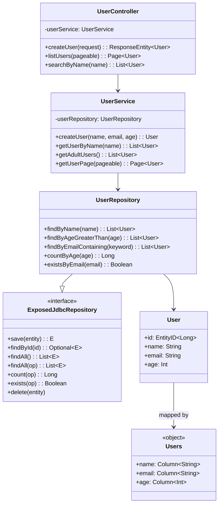
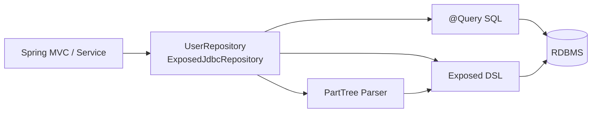

# bluetape4k-spring-boot3-exposed-jdbc

[English](./README.md) | 한국어

**Exposed DAO Entity 기반 Spring Data JDBC Repository (Spring Boot 3.5.x / Spring 6)**

Spring Boot 3와 Spring Data를 활용하여 Exposed DAO 엔티티를 관리하는 고성능 Repository 구현입니다. PartTree 메서드 이름 쿼리와
`@Query` 어노테이션을 통한 Exposed DSL 지원을 제공합니다.

## UML



### 데이터 흐름 다이어그램



## 설치

```gradle
dependencies {
    implementation("io.github.bluetape4k:bluetape4k-spring-boot3-exposed-jdbc:${version}")
}
```

## 주요 기능

### 1. ExposedJdbcRepository - Spring Data 표준 인터페이스

```kotlin
@NoRepositoryBean
interface ExposedJdbcRepository<E: Entity<ID>, ID: Any>:
    ListCrudRepository<E, ID>,
    ListPagingAndSortingRepository<E, ID>,
    QueryByExampleExecutor<E>
```

- **ListCrudRepository**: `save`, `findById`, `findAll`, `delete`, `deleteById` 등
- **ListPagingAndSortingRepository**: 페이징, 정렬 지원
- **QueryByExampleExecutor**: 예제 기반 쿼리
- **Exposed DSL 확장**: `findAll { op }`, `count { op }`, `exists { op }`

### 2. PartTree 쿼리 자동 생성

메서드 이름에 따라 자동으로 Exposed DSL 쿼리 생성:

```kotlin
interface UserRepository : ExposedJdbcRepository<User, Long> {
    // 자동 쿼리 생성
    fun findByName(name: String): List<User>
    fun findByAgeGreaterThan(age: Int): List<User>
    fun findByEmailContaining(keyword: String): List<User>
    fun findByNameAndAge(name: String, age: Int): User?
    fun findByAgeBetween(min: Int, max: Int): List<User>
    fun findByNameOrderByAgeDesc(name: String): List<User>
    fun findTop3ByOrderByAgeDesc(): List<User>
    fun countByAge(age: Int): Long
    fun existsByEmail(email: String): Boolean
    fun deleteByName(name: String): Long
}
```

### 3. @Query 어노테이션 - 직접 SQL 작성

```kotlin
interface UserRepository : ExposedJdbcRepository<User, Long> {
    @Query("SELECT * FROM users WHERE email = ?1")
    fun findByEmailNative(email: String): List<User>

    @Query("SELECT * FROM users WHERE age = ?2 AND email = ?1")
    fun findByEmailAndAgeNative(email: String, age: Int): List<User>

    @Query("SELECT * FROM users WHERE age BETWEEN ?1 AND ?2")
    fun findByAgeRangeNative(minAge: Int, maxAge: Int): List<User>
}
```

### 4. 자동 구성 (Auto Configuration)

```kotlin
@Configuration
@EnableExposedJdbcRepositories(basePackages = ["com.example.repository"])
class RepositoryConfig
```

또는 Spring Boot 자동 구성 사용:

```kotlin
// application.properties
spring.data.exposed-jdbc.repositories.enabled=true
spring.data.exposed-jdbc.repositories.base-packages=com.example.repository
```

## 사용 예시

### 엔티티 정의

```kotlin
object Users : LongIdTable("users") {
    val name = varchar("name", 255)
    val email = varchar("email", 255).uniqueIndex()
    val age = integer("age")
}

@ExposedEntity
class User(id: EntityID<Long>) : LongEntity(id) {
    companion object : LongEntityClass<User>(Users)

    var name: String by Users.name
    var email: String by Users.email
    var age: Int by Users.age
}
```

### Repository 정의

```kotlin
interface UserRepository : ExposedJdbcRepository<User, Long> {
    fun findByName(name: String): List<User>
    fun findByAgeGreaterThan(age: Int): List<User>
    fun findByEmailContaining(keyword: String): List<User>
}
```

### Service 사용

```kotlin
@Service
@Transactional
class UserService(
    private val userRepository: UserRepository
) {
    fun createUser(name: String, email: String, age: Int): User {
        return transaction {
            User.new {
                this.name = name
                this.email = email
                this.age = age
            }
        }
    }

    fun getUserByName(name: String): List<User> {
        return userRepository.findByName(name)
    }

    fun getAdultUsers(): List<User> {
        return userRepository.findByAgeGreaterThan(18)
    }

    fun getUserPage(pageable: Pageable): Page<User> {
        return userRepository.findAll(pageable)
    }

    fun getUsersWithDslCondition(): List<User> {
        return userRepository.findAll { Users.age greaterEq 18 }
    }
}
```

### REST Controller 예제

```kotlin
@RestController
@RequestMapping("/api/users")
class UserController(
    private val userService: UserService
) {
    @PostMapping
    fun createUser(@RequestBody request: CreateUserRequest): ResponseEntity<User> {
        val user = userService.createUser(request.name, request.email, request.age)
        return ResponseEntity.status(HttpStatus.CREATED).body(user)
    }

    @GetMapping
    fun listUsers(@ParameterObject pageable: Pageable): Page<User> {
        return userService.getUserPage(pageable)
    }

    @GetMapping("/by-name")
    fun searchByName(@RequestParam name: String): List<User> {
        return userService.getUserByName(name)
    }

    @GetMapping("/adults")
    fun getAdults(): List<User> {
        return userService.getAdultUsers()
    }
}
```

## Exposed DSL 확장 메서드

Repository 인터페이스에서 추가 메서드 사용:

```kotlin
val userRepository: UserRepository = TODO()

// DSL 조건으로 조회
val activeUsers = userRepository.findAll { Users.age greaterEq 18 }

// DSL 조건으로 개수 세기
val adultCount = userRepository.count { Users.age greaterEq 18 }

// DSL 조건으로 존재 확인
val hasAdults = userRepository.exists { Users.age greaterEq 18 }
```

## 의존성

- **Spring Boot**: 3.5.x 이상
- **Spring Data**: 3.4.x 이상
- **Exposed**: 1.0.x 이상
- **Kotlin**: 2.0 이상

Spring Boot 3와 Spring 6 호환.

## 주의사항

### 트랜잭션 처리

Exposed DAO 엔티티 생성/수정은 `transaction` 블록 내에서만 가능합니다:

```kotlin
@Transactional
fun createUser(name: String, email: String): User {
    return transaction {  // Spring 트랜잭션과 Exposed 트랜잭션 통합
        User.new {
            this.name = name
            this.email = email
        }
    }
}
```

### PartTree 쿼리 제약

지원하는 키워드:

- **비교**: `GreaterThan`, `LessThan`, `Between`, `In`, `Contains`
- **정렬**: `OrderBy`
- **집계**: `count`, `exists`
- **삭제**: `deleteBy`
- **페이징**: `Top`, `First`

지원하지 않는 패턴:

- 복잡한 OR/AND 조합 → `@Query` 또는 DSL 메서드 사용
- 조인 → Exposed DSL 직접 사용

### @Query 플레이스홀더

- `?1`, `?2`, ... : 메서드 파라미터 순서 (1-indexed)
- 중복 플레이스홀더 지원: `?1 OR ?1`
- 플레이스홀더 건너뛰기 미지원: `?1`과 `?3` 동시 사용 불가

## 멀티 데이터베이스

동일한 Repository 패턴으로 H2, PostgreSQL, MySQL, MariaDB 지원:

```properties
# application.properties (MySQL 예시)
spring.datasource.url=jdbc:mysql://localhost:3306/mydb
spring.datasource.username=root
spring.datasource.password=password
```

```properties
# application.properties (PostgreSQL 예시)
spring.datasource.url=jdbc:postgresql://localhost:5432/mydb
```

## 성능 최적화

### 페이징 쿼리

```kotlin
val page = userRepository.findAll(PageRequest.of(0, 10, Sort.by("age").descending()))
```

### 배치 작업

```kotlin
val users = listOf(
    User(null, "Alice", 30),
    User(null, "Bob", 25)
)
userRepository.saveAll(users)
```

### DSL 직접 사용

복잡한 조건은 DSL 메서드 사용:

```kotlin
val users = userRepository.findAll {
    (Users.age greaterEq 18) and (Users.name like "%A%")
}
```

## 문제 해결

### "Repository 빈이 생성되지 않음"

```kotlin
@EnableExposedJdbcRepositories(basePackages = ["com.example.repository"])
class AppConfig
```

또는 자동 구성 확인:

```properties
# application.properties
spring.data.exposed-jdbc.repositories.enabled=true
spring.data.exposed-jdbc.repositories.base-packages=com.example.repository
```

### "PartTree 쿼리 해석 오류"

더 간단한 메서드 이름 사용 또는 `@Query` 어노테이션 사용:

```kotlin
// 복잡한 메서드 이름 대신
@Query("SELECT * FROM users WHERE age > ?1 AND status = ?2")
fun findActiveAdults(age: Int, status: String): List<User>
```

### "LazyInitializationException"

응답 객체 구성 시 트랜잭션 끝나기 전에 모든 연관 데이터 로드:

```kotlin
@Transactional(readOnly = true)
fun getUser(id: Long): UserDto {
    val user = userRepository.findById(id).get()
    // 이 시점에서 모든 lazy 로딩 발생
    return user.toDto()
}
```

## 관련 모듈

- **bluetape4k-exposed-jdbc**: 핵심 Exposed JDBC Repository 구현
- **bluetape4k-spring-boot4-exposed-jdbc**: Spring Boot 4.x 버전
- **bluetape4k-spring-boot3-exposed-r2dbc**: R2DBC 코루틴 Repository (Spring Boot 3.x)
