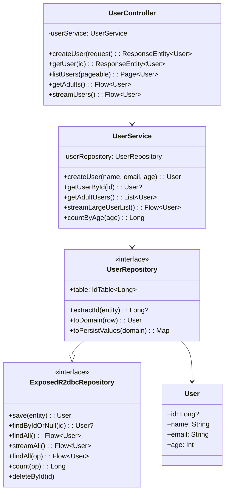
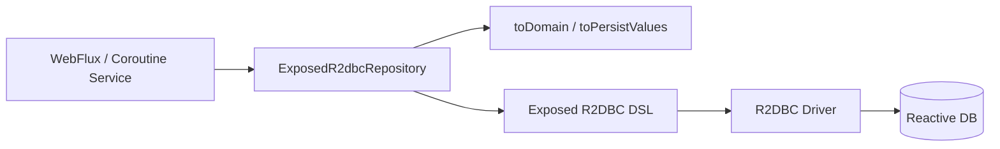

# bluetape4k-spring-boot3-exposed-r2dbc

English | [한국어](./README.ko.md)

**Exposed R2DBC DSL-Based Coroutine Spring Data Repository (Spring Boot 3.5.x / Spring 6)**

Provides Exposed R2DBC as a fully suspend-based coroutine Repository using Spring Boot 3 and Spring Data Reactive. Build high-performance non-blocking applications with non-blocking I/O and backpressure support.

## UML



### Data Flow Diagram



## Installation

```gradle
dependencies {
    implementation("io.github.bluetape4k:bluetape4k-spring-boot3-exposed-r2dbc:${version}")

    // Coroutines support (required)
    implementation("org.jetbrains.kotlinx:kotlinx-coroutines-reactor:${version}")
}
```

## Key Features

### 1. ExposedR2dbcRepository - Spring Data Coroutine Standard

```kotlin
@NoRepositoryBean
interface ExposedR2dbcRepository<R : Any, ID : Any> : CoroutineCrudRepository<R, ID>
```

- **CoroutineCrudRepository**: Standard suspend-based CRUD operations
- **Flow support**: Large-scale data streaming with backpressure
- **Paging**: Suspend-based paged queries
- **Exposed DSL integration**: Conditional R2DBC queries

### 2. Domain Object Mapping

Define Row-to-Domain conversion directly in the interface:

```kotlin
interface UserRepository : ExposedR2dbcRepository<User, Long> {
    override val table: IdTable<Long> get() = Users

    override fun extractId(entity: User): Long? = entity.id

    override fun toDomain(row: ResultRow): User =
        User(
            id = row[Users.id].value,
            name = row[Users.name],
            email = row[Users.email],
            age = row[Users.age],
        )

    override fun toPersistValues(domain: User): Map<Column<*>, Any?> =
        mapOf(
            Users.name to domain.name,
            Users.email to domain.email,
            Users.age to domain.age,
        )
}
```

### 3. Suspend-Based CRUD

```kotlin
interface UserRepository : ExposedR2dbcRepository<User, Long> {
    // Automatically implemented
}

// Usage
suspend fun getUser(id: Long): User? {
    return userRepository.findByIdOrNull(id)
}

suspend fun saveUser(user: User): User {
    return userRepository.save(user)
}
```

### 4. Flow Streaming

Process large datasets with backpressure:

```kotlin
suspend fun processAllUsers() {
    userRepository.findAll()
        .collect { user ->
            println("Processing: $user")
        }
}

// Conditional streaming
userRepository.findAll { Users.age greaterEq 18 }
    .collect { adult ->
        // process...
    }

// Row-by-row streaming (memory-efficient)
userRepository.streamAll()
    .collect { user ->
        // process...
    }
```

### 5. Paged Queries

```kotlin
suspend fun getUsersPage(pageNo: Int, pageSize: Int): Page<User> {
    return userRepository.findAll(PageRequest.of(pageNo, pageSize))
}

suspend fun getUsersSorted(): Page<User> {
    return userRepository.findAll(
        PageRequest.of(0, 20, Sort.by("age").descending())
    )
}
```

### 6. Exposed DSL Conditions

Express complex conditions using DSL:

```kotlin
val adults = userRepository.findAll { Users.age greaterEq 18 }.toList()

val emailContains = userRepository.findAll {
    (Users.email like "%@example.com") and (Users.age greaterEq 20)
}.toList()

val count = userRepository.count { Users.age greaterEq 18 }

val exists = userRepository.exists { Users.email eq "alice@example.com" }
```

## Usage Examples

### Entity and Table Definition

```kotlin
object Users : LongIdTable("users") {
    val name = varchar("name", 255)
    val email = varchar("email", 255)
    val age = integer("age")
}

data class User(
    override val id: Long? = null,
    val name: String,
    val email: String,
    val age: Int,
) : HasIdentifier<Long>
```

### Repository Implementation

```kotlin
interface UserRepository : ExposedR2dbcRepository<User, Long> {
    override val table: IdTable<Long> get() = Users

    override fun extractId(entity: User): Long? = entity.id

    override fun toDomain(row: ResultRow): User =
        User(
            id = row[Users.id].value,
            name = row[Users.name],
            email = row[Users.email],
            age = row[Users.age],
        )

    override fun toPersistValues(domain: User): Map<Column<*>, Any?> =
        mapOf(
            Users.name to domain.name,
            Users.email to domain.email,
            Users.age to domain.age,
        )
}
```

### Using the Service

```kotlin
@Service
class UserService(
    private val userRepository: UserRepository
) {
    suspend fun createUser(name: String, email: String, age: Int): User {
        return userRepository.save(User(name = name, email = email, age = age))
    }

    suspend fun getUserById(id: Long): User? {
        return userRepository.findByIdOrNull(id)
    }

    suspend fun getAdultUsers(): List<User> {
        return userRepository.findAll { Users.age greaterEq 18 }.toList()
    }

    suspend fun getUsersPage(pageable: Pageable): Page<User> {
        return userRepository.findAll(pageable)
    }

    suspend fun streamLargeUserList(): Flow<User> {
        return userRepository.streamAll()
    }

    suspend fun countByAge(age: Int): Long {
        return userRepository.count { Users.age eq age }
    }
}
```

### REST Controller (WebFlux)

```kotlin
@RestController
@RequestMapping("/api/users")
class UserController(
    private val userService: UserService
) {
    @PostMapping
    suspend fun createUser(@RequestBody request: CreateUserRequest): ResponseEntity<User> {
        val user = userService.createUser(request.name, request.email, request.age)
        return ResponseEntity.status(HttpStatus.CREATED).body(user)
    }

    @GetMapping("/{id}")
    suspend fun getUser(@PathVariable id: Long): ResponseEntity<User> {
        return userService.getUserById(id)
            ?.let { ResponseEntity.ok(it) }
            ?: ResponseEntity.notFound().build()
    }

    @GetMapping
    suspend fun listUsers(@ParameterObject pageable: Pageable): Page<User> {
        return userService.getUsersPage(pageable)
    }

    @GetMapping("/adults")
    fun getAdults(): Flow<User> = flow {
        userService.getAdultUsers().forEach { emit(it) }
    }

    @GetMapping("/stream")
    fun streamUsers(): Flow<User> {
        return userService.streamLargeUserList()
    }

    @GetMapping("/count")
    suspend fun countAdults(): ResponseEntity<Long> {
        val count = userService.countByAge(18)
        return ResponseEntity.ok(count)
    }

    @DeleteMapping("/{id}")
    suspend fun deleteUser(@PathVariable id: Long): ResponseEntity<Void> {
        userService.deleteUser(id)
        return ResponseEntity.noContent().build()
    }
}
```

## Core Methods

### CRUD Operations

```kotlin
// Save
suspend fun save(entity: User): User

// Find by ID
suspend fun findByIdOrNull(id: Long): User?

// Find all (loads into memory)
suspend fun findAllAsList(): List<User>

// Stream all (with backpressure)
fun findAll(): Flow<User>

// Existence check
suspend fun existsById(id: Long): Boolean

// Delete
suspend fun deleteById(id: Long)

// Count
suspend fun count(): Long
```

### Paging and Sorting

```kotlin
suspend fun findAll(pageable: Pageable): Page<User>

// Example
val pageable = PageRequest.of(
    0,  // page number
    20, // page size
    Sort.by("age").descending()
)
```

### Flow and Streaming

```kotlin
// Load all and return as Flow
fun findAll(): Flow<User>

// Row-by-row streaming (memory-efficient)
fun streamAll(database: R2dbcDatabase? = null): Flow<User>

// Conditional streaming
fun findAll(op: () -> Op<Boolean>): Flow<User>
```

### Bulk Operations

```kotlin
// Save multiple entities
suspend fun saveAll(entities: Iterable<User>): Flow<User>

// Save as Flow (with backpressure)
suspend fun saveAll(entityStream: Flow<User>): Flow<User>

// Delete multiple
suspend fun deleteAllById(ids: Iterable<Long>)
```

## Writing Tests

### Unit Tests

```kotlin
@SpringBootTest
class UserRepositoryTest {
    @Autowired
    private lateinit var userRepository: UserRepository

    @Autowired
    private lateinit var r2dbcDatabase: R2dbcDatabase

    @Test
    fun `save and findById`() = runTest {
        val user = User(name = "Alice", email = "alice@example.com", age = 30)
        val saved = userRepository.save(user)

        val found = userRepository.findByIdOrNull(saved.id!!)
        assertThat(found).isNotNull()
        assertThat(found?.name).isEqualTo("Alice")
    }

    @Test
    fun `findAll returns users`() = runTest {
        suspendTransaction(r2dbcDatabase) {
            Users.deleteAll()
        }

        userRepository.save(User(name = "Alice", email = "alice@example.com", age = 30))
        userRepository.save(User(name = "Bob", email = "bob@example.com", age = 25))

        val users = userRepository.findAllAsList()
        assertThat(users).hasSize(2)
    }

    @Test
    fun `streamAll processes large dataset`() = runTest {
        val count = AtomicInteger(0)

        userRepository.streamAll()
            .collect { user ->
                count.incrementAndGet()
            }

        assertThat(count.get()).isGreaterThan(0)
    }
}
```

## Dependencies

- **Spring Boot**: 3.5.x or later
- **Spring Data Reactive**: 3.4.x or later
- **Exposed**: 1.0.x or later (with R2DBC support)
- **Kotlin**: 2.0 or later
- **Coroutines**: 1.8.x or later
- **R2DBC Driver**: H2, PostgreSQL, MySQL, MariaDB, etc.

Compatible with Spring Boot 3 and Spring 6.

### Database-Specific Drivers

```gradle
dependencies {
    // H2
    implementation("io.r2dbc:r2dbc-h2:${r2dbcH2Version}")

    // PostgreSQL
    implementation("io.r2dbc:r2dbc-postgresql:${r2dbcPostgresqlVersion}")

    // MySQL
    implementation("io.r2dbc:r2dbc-mysql:${r2dbcMysqlVersion}")

    // MariaDB
    implementation("io.r2dbc:r2dbc-mariadb:${r2dbcMariadbVersion}")
}
```

## Configuration

### Spring Boot Auto-Configuration

```properties
# application.properties (H2 example)
spring.r2dbc.url=r2dbc:h2:mem:///test
spring.r2dbc.username=sa
spring.r2dbc.password=
```

```properties
# application.properties (PostgreSQL example)
spring.r2dbc.url=r2dbc:postgresql://localhost:5432/mydb
spring.r2dbc.username=postgres
spring.r2dbc.password=password
```

### Explicit Configuration

```kotlin
@Configuration
@EnableExposedR2dbcRepositories(basePackages = ["com.example.repository"])
class RepositoryConfig {
    // Handled by auto-configuration
}
```

## Caveats

### Using Suspend Functions

All Repository find/save/delete methods are suspend functions:

```kotlin
// Must be called from a coroutine context
suspend fun getUser(id: Long) = userRepository.findByIdOrNull(id)

// In a Controller
@GetMapping("/{id}")
suspend fun get(@PathVariable id: Long): User? = getUser(id)
```

### Consuming Flow

The difference between `findAll()` and `streamAll()`:

```kotlin
// findAll: loads all results into memory, then returns as Flow
userRepository.findAll().toList()  // Higher memory usage

// streamAll: row-by-row streaming with backpressure support
userRepository.streamAll()  // Memory-efficient
    .collect { user -> /* process */ }
```

### Mandatory toDomain and toPersistValues Implementation

Both must be defined when implementing the Repository interface:

```kotlin
interface UserRepository : ExposedR2dbcRepository<User, Long> {
    // Required: row conversion
    override fun toDomain(row: ResultRow): User

    // Required: define values to persist
    override fun toPersistValues(domain: User): Map<Column<*>, Any?>
}
```

### Exclude the ID Column

The ID column must be excluded from `toPersistValues`:

```kotlin
override fun toPersistValues(domain: User): Map<Column<*>, Any?> =
    mapOf(
        Users.name to domain.name,
        Users.email to domain.email,
        // Users.id is excluded (auto-generated)
    )
```

### Transaction Scope

R2DBC handles transactions automatically inside suspend functions. Use `suspendTransaction` for complex operations:

```kotlin
suspend fun complexOperation() {
    suspendTransaction(r2dbcDatabase) {
        userRepository.save(user1)
        userRepository.save(user2)
        // All succeed or all fail within the transaction
    }
}
```

## Performance Optimization

### Large-Scale Streaming

```kotlin
userRepository.streamAll()
    .buffer(256)  // Adjust buffer size
    .collect { user ->
        // Backpressure control
    }
```

### Batch Insert

```kotlin
userRepository.saveAll(
    listOf(
        User(name = "Alice", email = "alice@example.com", age = 30),
        User(name = "Bob", email = "bob@example.com", age = 25)
    )
).toList()
```

### Conditional Streaming

Use DSL for complex conditions:

```kotlin
userRepository.findAll {
    (Users.age greaterEq 18) and (Users.email like "%example.com")
}.toList()
```

## Troubleshooting

### "Cannot call suspend function from blocking context"

A WebFlux or coroutine context is required:

```kotlin
// Incorrect
fun getUser(id: Long) {
    val user = userRepository.findByIdOrNull(id)  // compile error
}

// Correct
suspend fun getUser(id: Long) {
    val user = userRepository.findByIdOrNull(id)  // OK
}

// Or
@GetMapping
suspend fun getUser(): User? = userRepository.findByIdOrNull(1)
```

### "Using Flow without toList()"

Return a stream directly from the response:

```kotlin
@GetMapping("/stream")
fun getUsers(): Flow<User> = userRepository.findAll()
```

Or explicitly convert to a list:

```kotlin
@GetMapping
suspend fun getUsers(): List<User> =
    userRepository.findAll().toList()
```

## Related Modules

- **bluetape4k-exposed-r2dbc**: Core Exposed R2DBC Repository implementation
- **bluetape4k-spring-boot4-exposed-r2dbc**: Spring Boot 4.x version
- **bluetape4k-spring-boot3-exposed-jdbc**: JDBC-based Repository (Spring Boot 3.x)
- **bluetape4k-coroutines**: Coroutines utilities
