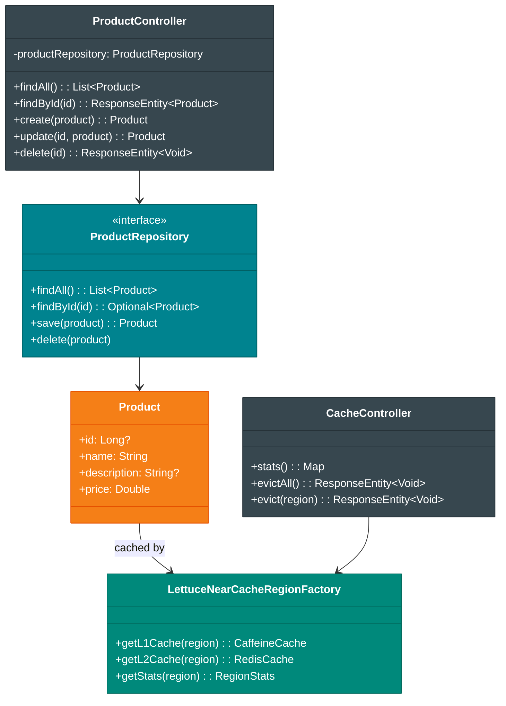
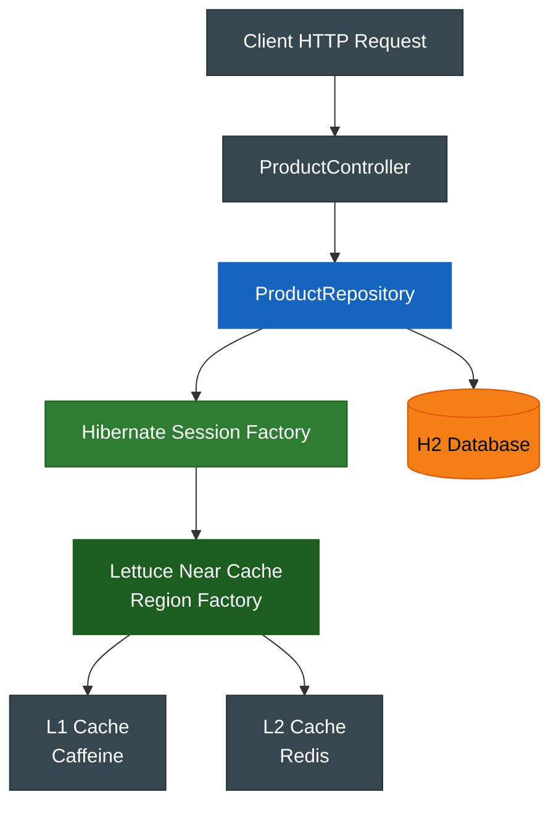

# bluetape4k-spring-boot3-hibernate-lettuce-demo

[English](./README.md) | 한국어

Spring Boot 3 + Hibernate 7 **2nd Level Cache (2LC)** with **Lettuce Near Cache** 데모 애플리케이션.

`bluetape4k-spring-boot3-hibernate-lettuce` 모듈의 auto-configuration을 사용해 zero-code로 Hibernate 2nd Level Cache를 활성화하는 예제이다.

## 아키텍처

```
Client HTTP Request
       ↓
ProductController (REST API)
       ↓
ProductRepository (Spring Data JPA)
       ↓
Hibernate Session Factory
       ↓
┌─────────────────────────────────────────────┐
│ Lettuce Near Cache Region Factory           │
├─────────────────────────────────────────────┤
│ L1 Cache (Caffeine)                         │
│ ├─ maxSize: 10,000 items                    │
│ ├─ expireAfterWrite: 30m                    │
│ └─ localStats() ← Metrics/Actuator          │
├─────────────────────────────────────────────┤
│ L2 Cache (Redis)                            │
│ ├─ TTL: 120s (default)                      │
│ ├─ RESP3 CLIENT TRACKING                    │
│ ├─ Codec: LZ4+Fory                          │
│ └─ Region별 TTL 설정 가능                    │
└─────────────────────────────────────────────┘
       ↓
H2 Database
```



### 요청 흐름 다이어그램



## 도메인 모델

### Product 엔티티

```kotlin
@Entity
@Table(name = "products")
@Cacheable
@Cache(usage = CacheConcurrencyStrategy.NONSTRICT_READ_WRITE, region = "product")
data class Product(
    @Id
    @GeneratedValue(strategy = GenerationType.IDENTITY)
    val id: Long? = null,

    @Column(nullable = false)
    val name: String,

    @Column
    val description: String? = null,

    @Column(nullable = false)
    val price: Double = 0.0,
)
```

- `@Cacheable`: JPA 2nd Level Cache 활성화
- `@Cache(NONSTRICT_READ_WRITE)`: 낙관적 락 기반 업데이트 전략
- `region = "product"`: Redis 키 prefix (`product::*`)

## REST API

### 상품 API (`/api/products`)

| 메서드      | 경로                   | 설명        | 캐시 동작          |
|----------|----------------------|-----------|----------------|
| `GET`    | `/api/products`      | 전체 상품 조회  | 캐시 적용 안 함      |
| `GET`    | `/api/products/{id}` | ID로 상품 조회 | L1/L2 Hit/Miss |
| `POST`   | `/api/products`      | 상품 생성     | L1 + L2에 저장    |
| `PUT`    | `/api/products/{id}` | 상품 수정     | L1 + L2 갱신     |
| `DELETE` | `/api/products/{id}` | 상품 삭제     | L1 + L2 제거     |

#### 예시: 상품 조회 (캐시 활용)

```bash
# 첫 번째 요청: DB에서 조회 (L1 Miss, L2 Miss)
curl http://localhost:8080/api/products/1

# 응답 (200 OK)
{
  "id": 1,
  "name": "Laptop",
  "description": "High-performance laptop",
  "price": 999.99
}

# 두 번째 요청: L1 캐시에서 즉시 응답 (L1 Hit)
curl http://localhost:8080/api/products/1
```

#### 예시: 상품 생성

```bash
curl -X POST http://localhost:8080/api/products \
  -H "Content-Type: application/json" \
  -d '{
    "name": "Mouse",
    "description": "Wireless mouse",
    "price": 29.99
  }'

# 응답 (200 OK) - 자동으로 L1 + L2 캐시에 저장됨
{
  "id": 2,
  "name": "Mouse",
  "description": "Wireless mouse",
  "price": 29.99
}
```

#### 예시: 상품 수정 (캐시 갱신)

```bash
curl -X PUT http://localhost:8080/api/products/1 \
  -H "Content-Type: application/json" \
  -d '{
    "name": "Gaming Laptop",
    "description": "Ultra-fast gaming laptop",
    "price": 1299.99,
    "id": 1
  }'

# 응답 (200 OK) - L1 + L2 캐시 모두 갱신됨
{
  "id": 1,
  "name": "Gaming Laptop",
  "description": "Ultra-fast gaming laptop",
  "price": 1299.99
}
```

#### 예시: 상품 삭제 (캐시 제거)

```bash
curl -X DELETE http://localhost:8080/api/products/1

# 응답 (204 No Content) - L1 + L2 캐시에서 모두 제거됨
```

### 캐시 관리 API (`/api/cache`)

| 메서드      | 경로                          | 설명              | 동작                        |
|----------|-----------------------------|-----------------|---------------------------|
| `GET`    | `/api/cache/stats`          | 리전별 캐시 통계       | L1 크기, hit/miss 수 조회      |
| `DELETE` | `/api/cache/evict`          | 전체 리전 L1 캐시 비우기 | L1만 제거 (L2는 유지)           |
| `DELETE` | `/api/cache/evict/{region}` | 특정 리전 L1 캐시 비우기 | 해당 region L1만 제거 (L2는 유지) |

#### 예시: 캐시 통계 조회

```bash
curl http://localhost:8080/api/cache/stats

# 응답 (200 OK)
{
  "product": {
    "regionName": "product",
    "localSize": 15,
    "localHitCount": 245,
    "localMissCount": 18,
    "localHitRate": 0.931
  }
}
```

#### 예시: 특정 region L1 캐시 비우기

```bash
# L1(Caffeine) 캐시만 제거 (Redis L2는 유지)
curl -X DELETE http://localhost:8080/api/cache/evict/product

# 응답 (204 No Content)
```

#### 예시: 전체 L1 캐시 비우기

```bash
curl -X DELETE http://localhost:8080/api/cache/evict

# 응답 (204 No Content)
```

> **주의**: 이 엔드포인트들은 L1(Caffeine)만 비운다. Redis L2는 영향받지 않는다.

### Actuator 엔드포인트

Spring Boot Actuator에서 제공하는 `/actuator/nearcache` 엔드포인트.

#### 모든 Region 통계

```bash
curl http://localhost:8080/actuator/nearcache

# 응답 (200 OK)
{
  "product": {
    "regionName": "product",
    "localSize": 42,
    "localHitRate": 0.977,
    "localHitCount": 1830,
    "localMissCount": 42,
    "localEvictionCount": 5,
    "l2HitCount": 1750,
    "l2MissCount": 80,
    "l2PutCount": 120
  }
}
```

#### 특정 Region 상세 조회

```bash
curl http://localhost:8080/actuator/nearcache/product

# 응답 (200 OK)
{
  "regionName": "product",
  "localSize": 42,
  "localHitRate": 0.977,
  "localHitCount": 1830,
  "localMissCount": 42,
  "localEvictionCount": 5,
  "l2HitCount": 1750,
  "l2MissCount": 80,
  "l2PutCount": 120
}
```

## 애플리케이션 설정

### application.yml

```yaml
spring:
  application:
    name: hibernat-lettuce-demo

  datasource:
    url: jdbc:h2:mem:demo;DB_CLOSE_DELAY=-1;MODE=MySQL
    driver-class-name: org.h2.Driver
    username: sa
    password:

  jpa:
    database-platform: org.hibernate.dialect.H2Dialect
    hibernate:
      ddl-auto: create-drop
    show-sql: false
    properties:
      hibernate:
        cache:
          use_second_level_cache: true

bluetape4k:
  cache:
    lettuce-near:
      redis-uri: redis://localhost:6379
      codec: lz4fory                            # LZ4 압축 + Fory 직렬화
      use-resp3: true                           # RESP3 + CLIENT TRACKING
      local:
        max-size: 10000
        expire-after-write: 30m
      redis-ttl:
        default: 120s
        regions:
          product: 300s                         # product region TTL 5분
      metrics:
        enabled: true
        enable-caffeine-stats: true

management:
  endpoints:
    web:
      exposure:
        include: health, info, metrics, actuator, nearcache
  endpoint:
    health:
      show-details: always
```

## 테스트 실행

### 단위 테스트

```bash
./gradlew :bluetape4k-spring-boot3-hibernate-lettuce-demo:test
```

테스트는 Testcontainers를 사용하여 Redis를 자동으로 관리한다.

### 테스트 예시

```kotlin
@SpringBootTest
class DemoApplicationTest {

    @Autowired
    private lateinit var productRepository: ProductRepository

    @Autowired
    private lateinit var entityManagerFactory: EntityManagerFactory

    @BeforeEach
    fun setUp() {
        val sessionFactory = entityManagerFactory.unwrap(SessionFactoryImplementor::class.java)
        sessionFactory.statistics.clear()
    }

    @Test
    fun `상품 조회 시 2LC 캐시 활용`() {
        // Given
        val product = Product(name = "Laptop", price = 999.99)
        val saved = productRepository.save(product)

        // When (첫 번째 조회)
        val result1 = productRepository.findById(saved.id!!).get()

        // Then (DB에서 조회)
        assertThat(result1.name).isEqualTo("Laptop")

        // When (두 번째 조회)
        val result2 = productRepository.findById(saved.id).get()

        // Then (L1 캐시에서 즉시 응답 - DB 쿼리 없음)
        assertThat(result2.name).isEqualTo("Laptop")
    }
}
```

## 테스트 항목

- `ProductControllerTest`: REST API 엔드포인트 테스트
- `CacheControllerTest`: 캐시 관리 API 테스트
- `CachingIntegrationTest`: 2LC + Lettuce Near Cache 통합 테스트
- `LettuceNearCacheStatsTest`: Actuator 엔드포인트 테스트

## 의존성

```kotlin
// build.gradle.kts
dependencies {
    implementation(project(":bluetape4k-spring-boot3-hibernate-lettuce"))
    implementation(Libs.springBootStarter("web"))
    implementation(Libs.springBootStarter("data-jpa"))
    implementation(Libs.springBootStarter("actuator"))
    runtimeOnly(Libs.h2_database)

    testImplementation(Libs.springBootStarter("test"))
    testImplementation(Libs.testcontainers)
    testImplementation(Libs.testcontainers_junit5)
}
```

## 패키지 정보

- **Group**: `io.github.bluetape4k`
- **Artifact**: `bluetape4k-spring-boot3-hibernate-lettuce-demo`
- **Package**: `io.bluetape4k.examples.cache.lettuce`

## 관련 모듈

- [`bluetape4k-spring-boot3-hibernate-lettuce`](../hibernate-lettuce/README.ko.md) — Auto-Configuration 모듈
- [`bluetape4k-hibernate-cache-lettuce`](../../data/hibernate-cache-lettuce/README.ko.md) — Hibernate Region Factory
- [`bluetape4k-cache-lettuce`](../../infra/cache-lettuce/README.ko.md) — Near Cache 코어

## 라이센스

Apache License 2.0
