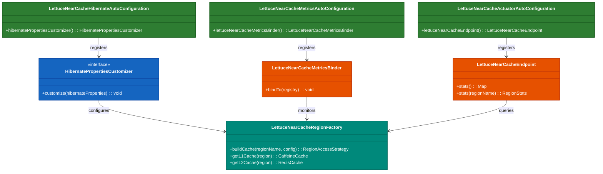
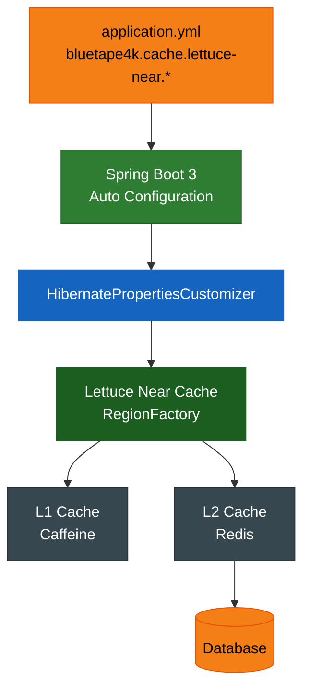

# bluetape4k-spring-boot3-hibernate-lettuce

English | [한국어](./README.ko.md)

**Spring Boot 3 Auto-Configuration** for Hibernate 7 **2nd Level Cache** (Lettuce Near Cache).

Simply add `bluetape4k.cache.lettuce-near.*` settings to
`application.yml` and Hibernate Second Level Cache is activated automatically — no extra code required. Millisecond-precision durations (e.g.
`500ms`) are passed through to Hibernate configuration as-is.

## UML



### Auto-Configuration Flow Diagram



## Features

- 2nd Level Cache activated with just a dependency and `application.yml` configuration
- Safe auto-configuration via `@ConditionalOnClass` / `@ConditionalOnProperty`
- **Actuator** endpoint (`GET /actuator/nearcache`) — per-region cache statistics
- **Micrometer** metrics (`lettuce.nearcache.*`) — region count, local size
- **Two-Tier** caching architecture: L1 (Caffeine) + L2 (Redis)

## Dependencies

```kotlin
// build.gradle.kts
dependencies {
    implementation(project(":bluetape4k-spring-boot3-hibernate-lettuce"))

    // Spring Boot Starters
    implementation(Libs.springBootStarter("data-jpa"))
    implementation(Libs.springBootStarter("actuator"))   // Actuator endpoint (optional)
    implementation(Libs.micrometer_core)                 // Micrometer metrics (optional)
}
```

## Quick Start

### 1. Add the dependency and configure application.yml

```yaml
bluetape4k:
    cache:
        lettuce-near:
            redis-uri: redis://localhost:6379
            local:
                max-size: 10000
                expire-after-write: 30m
            redis-ttl:
                default: 120s
            metrics:
                enabled: true
                enable-caffeine-stats: true

spring:
    jpa:
        hibernate:
            ddl-auto: update
    datasource:
        url: jdbc:h2:mem:testdb;DB_CLOSE_DELAY=-1

management:
    endpoints:
        web:
            exposure:
                include: health, info, metrics, nearcache
```

### 2. Add cache annotations to your Entity

```kotlin
@Entity
@Table(name = "products")
@Cacheable
@Cache(usage = CacheConcurrencyStrategy.NONSTRICT_READ_WRITE, region = "product")
data class Product(
    @Id
    @GeneratedValue(strategy = GenerationType.IDENTITY)
    val id: Long? = null,

    @Column(nullable = false)
    val name: String,

    @Column
    val description: String? = null,

    @Column(nullable = false)
    val price: Double = 0.0,
)
```

### 3. Run — auto-configuration is complete

Hibernate properties are injected automatically and 2nd Level Cache is activated. No additional code is needed.

## Full Configuration Reference

```yaml
bluetape4k:
    cache:
        lettuce-near:
            # Enable/disable (default: true)
            enabled: true

            # Redis connection URI
            redis-uri: redis://localhost:6379

            # Serialization codec (default: lz4fory)
            # Options: lz4fory | fory | kryo | lz4kryo | lz4jdk | gzipfory | zstdfory | jdk
            codec: lz4fory

            # Enable RESP3 CLIENT TRACKING (requires Redis 6+, default: true)
            use-resp3: true

            # L1 (Caffeine) settings
            local:
                max-size: 10000                    # Maximum number of entries
                expire-after-write: 30m            # TTL after write

            # Redis TTL
            redis-ttl:
                default: 120s                      # Default TTL
                regions:
                    # Per-region TTL override (keys with dots must use bracket notation)
                    "[io.bluetape4k.examples.cache.lettuce.domain.Product]": 300s
                    "[io.bluetape4k.examples.cache.lettuce.domain.Order]": 600s

            # Metrics / statistics
            metrics:
                enabled: true                           # Enable metrics collection
                enable-caffeine-stats: true             # Enable Caffeine CacheStats
```

### Configuration to Hibernate Property Mapping

| Spring Setting                       | Hibernate Property                                 |
|--------------------------------------|----------------------------------------------------|
| `redis-uri`                          | `hibernate.cache.lettuce.redis_uri`                |
| `codec`                              | `hibernate.cache.lettuce.codec`                    |
| `use-resp3`                          | `hibernate.cache.lettuce.use_resp3`                |
| `local.max-size`                     | `hibernate.cache.lettuce.local.max_size`           |
| `local.expire-after-write`           | `hibernate.cache.lettuce.local.expire_after_write` |
| `redis-ttl.default`                  | `hibernate.cache.lettuce.redis_ttl.default`        |
| `redis-ttl.regions[name]`            | `hibernate.cache.lettuce.redis_ttl.{name}`         |
| `metrics.enabled=true`               | `hibernate.generate_statistics=true`               |
| `metrics.enable-caffeine-stats=true` | `hibernate.cache.lettuce.local.record_stats=true`  |

## Auto-Configuration Classes

| Class                                        | Condition                                                            | Role                                      |
|----------------------------------------------|----------------------------------------------------------------------|-------------------------------------------|
| `LettuceNearCacheHibernateAutoConfiguration` | `LettuceNearCacheRegionFactory`, `EntityManagerFactory` on classpath | Registers `HibernatePropertiesCustomizer` |
| `LettuceNearCacheMetricsAutoConfiguration`   | `MeterRegistry` on classpath + Bean present                          | Registers `LettuceNearCacheMetricsBinder` |
| `LettuceNearCacheActuatorAutoConfiguration`  | `Endpoint` (actuator) on classpath + `EntityManagerFactory` Bean     | Registers `/actuator/nearcache` endpoint  |

## Actuator Endpoint

### Get All Region Statistics

```bash
GET /actuator/nearcache
```

Example response:

```json
{
  "product": {
    "regionName": "product",
    "localSize": 850,
    "localHitRate": 0.984,
    "localHitCount": 12453,
    "localMissCount": 203,
    "localEvictionCount": 10,
    "l2HitCount": 12050,
    "l2MissCount": 403,
    "l2PutCount": 1200
  }
}
```

### Get Details for a Specific Region

```bash
GET /actuator/nearcache/{regionName}
```

Example:

```bash
GET /actuator/nearcache/product
```

Response:

```json
{
  "regionName": "product",
  "localSize": 850,
  "localHitRate": 0.984,
  "localHitCount": 12453,
  "localMissCount": 203,
  "localEvictionCount": 10,
  "l2HitCount": 12050,
  "l2MissCount": 403,
  "l2PutCount": 1200
}
```

## Micrometer Metrics

When `metrics.enabled=true`, the following gauges are registered:

| Metric                           | Description                          |
|----------------------------------|--------------------------------------|
| `lettuce.nearcache.region.count` | Number of active regions             |
| `lettuce.nearcache.local.size`   | Estimated total L1 cache entry count |

```bash
# Query Micrometer metrics (JSON)
GET /actuator/metrics/lettuce.nearcache.region.count
GET /actuator/metrics/lettuce.nearcache.local.size
```

Example response:

```json
{
  "name": "lettuce.nearcache.region.count",
  "baseUnit": "items",
  "measurements": [
    {
      "statistic": "VALUE",
      "value": 2.0
    }
  ]
}
```

## Disabling

To fully disable auto-configuration:

```yaml
bluetape4k:
    cache:
        lettuce-near:
            enabled: false   # Disables HibernatePropertiesCustomizer, MetricsBinder, and Endpoint
```

## Running Tests

### Unit Tests (no Redis/DB required)

```bash
./gradlew :bluetape4k-spring-boot3-hibernate-lettuce:test
```

Uses `ApplicationContextRunner` to test configuration without a real Redis or database.

### Integration Tests (Testcontainers)

Integration tests use Testcontainers to manage Redis + H2 automatically.

```bash
./gradlew :bluetape4k-spring-boot3-hibernate-lettuce:test -i
```

## Related Modules

- [`bluetape4k-cache-lettuce`](../../infra/cache-lettuce/README.md) — Near Cache core implementation
- [`bluetape4k-hibernate-cache-lettuce`](../../infra/hibernate-cache-lettuce/README.md) — Hibernate Region Factory
- [`bluetape4k-spring-boot3-hibernate-lettuce-demo`](../hibernate-lettuce-demo/README.md) — Practical usage example

## Package Information

- **Group**: `io.github.bluetape4k`
- **Artifact**: `bluetape4k-spring-boot3-hibernate-lettuce`
- **Package**: `io.bluetape4k.spring.boot.autoconfigure.cache.lettuce`

## License

Apache License 2.0
