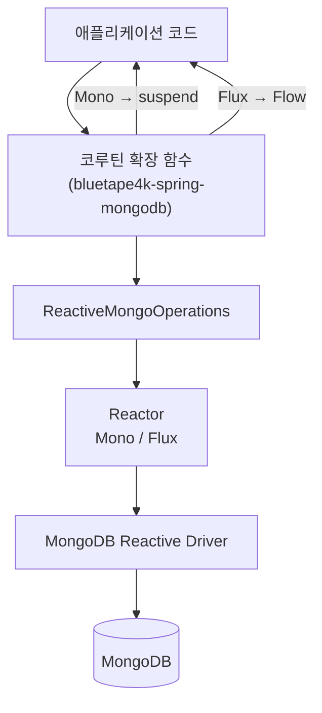
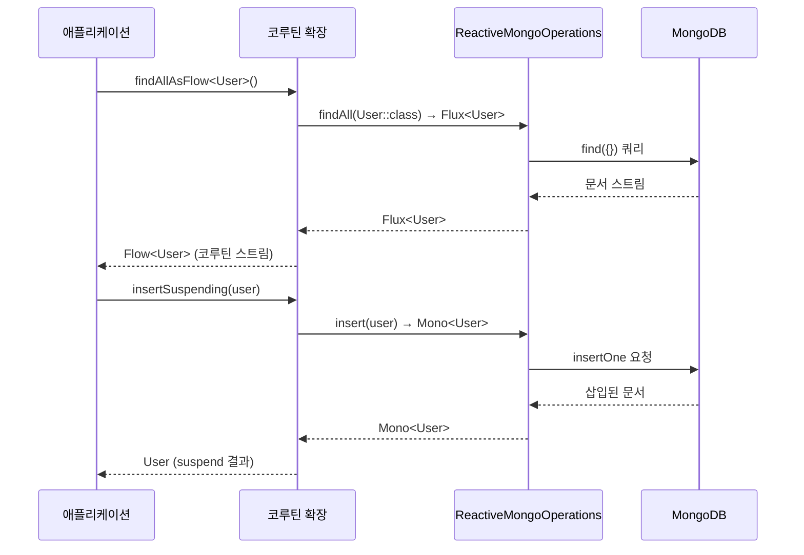

# Module bluetape4k-spring-mongodb

[Spring Data MongoDB Reactive](https://docs.spring.io/spring-data/mongodb/docs/current/reference/html/)를 Kotlin Coroutines 기반으로 더욱 편리하게 사용할 수 있도록 하는 확장 라이브러리입니다.

`ReactiveMongoOperations`의 `Flux`/`Mono` 반환 타입을 `Flow`/`suspend`로 변환하는 확장 함수와,
`Criteria`·`Query`·`Update` 구성을 위한 Kotlin infix DSL을 제공합니다.

## 특징

- **ReactiveMongoOperations 코루틴 확장**: `Flux` → `Flow`, `Mono` → `suspend` 변환
- **Criteria infix DSL**: `"age".criteria() gt 28`, `"name".criteria() eq "Alice"` 등
- **Query 빌더 확장**: `queryOf()`, `sortAscBy()`, `paginate()` 등
- **Update DSL**: `"field" setTo value`, `update.andSet()`, `"field".incBy()` 등
- **Spring Boot 자동 설정**: `ReactiveMongoAutoConfiguration`

## 의존성 추가

```kotlin
dependencies {
    implementation("io.github.bluetape4k:bluetape4k-spring-mongodb:${bluetape4kVersion}")
}
```

## 주요 기능

### 1. ReactiveMongoOperations 코루틴 확장

`ReactiveMongoOperations`의 모든 주요 연산을 `suspend` 함수 또는 `Flow`로 사용할 수 있습니다.

```kotlin
import io.bluetape4k.spring.mongodb.coroutines.*

// 조회
val user: User? = mongoOperations.findOneOrNullSuspending(
    Query(Criteria.where("name").`is`("Alice"))
)

// Flow로 전체 조회
val users: List<User> = mongoOperations.findAllAsFlow<User>().toList()

// 조건 조회 (Flow)
val seoulUsers = mongoOperations.findAsFlow<User>(
    Query(Criteria.where("city").`is`("Seoul"))
).toList()

// 삽입
val saved: User = mongoOperations.insertSuspending(User(name = "Bob", age = 25))

// 카운트
val count: Long = mongoOperations.countSuspending<User>()

// 존재 여부
val exists: Boolean = mongoOperations.existsSuspending<User>(
    Query(Criteria.where("name").`is`("Alice"))
)

// 업데이트
val result = mongoOperations.updateMultiSuspending<User>(
    Query(Criteria.where("city").`is`("Seoul")),
    Update().set("city", "Suwon")
)

// Aggregation (Flow)
val results = mongoOperations.aggregateAsFlow<User, CityCount>(aggregation).toList()
```

### 2. Criteria infix DSL

`Criteria.where(field).`is`(value)` 형태 대신 간결한 infix 표현을 사용할 수 있습니다.

```kotlin
import io.bluetape4k.spring.mongodb.query.*

// 비교 연산자
val c1 = "age".criteria() gt 20
val c2 = "age".criteria() gte 18
val c3 = "age".criteria() lt 65
val c4 = "name".criteria() eq "Alice"
val c5 = "status".criteria() ne "inactive"

// 컬렉션 연산자
val c6 = "city".criteria() inValues listOf("Seoul", "Busan")
val c7 = "status".criteria() notInValues listOf("deleted", "blocked")

// 문자열 연산자
val c8 = "name".criteria() regex "^Alice"
val c9 = "name".criteria() regex Regex("^alice", RegexOption.IGNORE_CASE)

// Null / 존재 여부
val c10 = "deletedAt".criteria().isNull()
val c11 = "email".criteria().fieldExists()

// 배열 연산자
val c12 = "tags".criteria() allValues listOf("kotlin", "mongodb")
val c13 = "tags".criteria() sizeOf 3

// 논리 연산자
val c14 = "age".criteria().gt(20) andWith "city".criteria().`is`("Seoul")
val c15 = "city".criteria().`is`("Seoul") orWith "city".criteria().`is`("Busan")
```

### 3. Query 빌더 확장

```kotlin
import io.bluetape4k.spring.mongodb.query.*

// Criteria로 Query 생성
val query1 = queryOf("age".criteria() gt 20)

// 복합 AND 조건
val query2 = queryOf(
    "age".criteria() gt 20,
    "city".criteria() eq "Seoul"
)

// 정렬
val query3 = Query().sortAscBy("name", "age")
val query4 = Query().sortDescBy("createdAt")

// 페이지네이션 (0-based 페이지)
val query5 = Query().sortAscBy("age").paginate(page = 0, size = 10)

// Criteria → Query 변환
val query6 = Criteria.where("name").`is`("Alice").toQuery()
```

### 4. Update DSL

```kotlin
import io.bluetape4k.spring.mongodb.query.*

// 단일 필드 설정
val update1 = "name" setTo "Alice"

// 여러 필드 체인
val update2 = ("name" setTo "Alice")
    .andSet("age", 30)
    .andSet("city", "Seoul")

// 증가
val update3 = "score" incBy 10

// 필드 삭제
val update4 = "tempField".unsetField()

// 배열 push/pull
val update5 = "tags".pushValue("kotlin")
val update6 = "tags".pullValue("java")
```

## 테스트 지원

```kotlin
import io.bluetape4k.spring.mongodb.AbstractReactiveMongoCoroutineTest

@DataMongoTest
class MyMongoTest : AbstractReactiveMongoCoroutineTest() {

    @BeforeEach
    fun setUp() = runTest {
        mongoOperations.dropCollectionSuspending<MyDocument>()
        mongoOperations.insertAllAsFlow(testData).toList()
    }

    @Test
    fun `문서 조회 테스트`() = runTest {
        val doc = mongoOperations.findOneOrNullSuspending<MyDocument>(
            queryOf("name".criteria() eq "Alice")
        )
        doc.shouldNotBeNull()
        doc.name shouldBeEqualTo "Alice"
    }
}
```

`AbstractReactiveMongoCoroutineTest`는 [MongoDBServer](../../testing/testcontainers) Testcontainer를
`@DynamicPropertySource`로 자동 연결하며, `CoroutineScope`를 구현하여 코루틴 테스트를 바로 작성할 수 있습니다.

## 제공 확장 함수 목록

### ReactiveMongoOperations 확장

| 함수                                          | 반환 타입          | 설명               |
|---------------------------------------------|----------------|------------------|
| `findAsFlow<T>(query)`                      | `Flow<T>`      | 조건에 맞는 문서 스트림    |
| `findAllAsFlow<T>()`                        | `Flow<T>`      | 전체 문서 스트림        |
| `findOneOrNullSuspending<T>(query)`         | `T?`           | 단건 조회 (없으면 null) |
| `findByIdOrNullSuspending<T>(id)`           | `T?`           | ID로 단건 조회        |
| `countSuspending<T>(query?)`                | `Long`         | 문서 수 조회          |
| `existsSuspending<T>(query)`                | `Boolean`      | 존재 여부 확인         |
| `insertSuspending(entity)`                  | `T`            | 단건 삽입            |
| `insertAllAsFlow(entities)`                 | `Flow<T>`      | 다건 삽입            |
| `saveSuspending(entity)`                    | `T`            | 저장 (삽입 또는 업데이트)  |
| `updateFirstSuspending<T>(query, update)`   | `UpdateResult` | 첫 번째 일치 문서 업데이트  |
| `updateMultiSuspending<T>(query, update)`   | `UpdateResult` | 모든 일치 문서 업데이트    |
| `upsertSuspending<T>(query, update)`        | `UpdateResult` | Upsert           |
| `removeSuspending<T>(query)`                | `DeleteResult` | 조건 삭제            |
| `findAndModifySuspending<T>(query, update)` | `T?`           | 수정 후 이전 문서 반환    |
| `findAndRemoveSuspending<T>(query)`         | `T?`           | 삭제 후 삭제된 문서 반환   |
| `aggregateAsFlow<I, O>(aggregation)`        | `Flow<O>`      | Aggregation 실행   |
| `dropCollectionSuspending<T>()`             | `Unit`         | 컬렉션 삭제           |

## 참고 자료

- [Spring Data MongoDB 공식 문서](https://docs.spring.io/spring-data/mongodb/docs/current/reference/html/)
- [bluetape4k-mongodb](../data/mongodb/README.md) — 네이티브 MongoDB Kotlin 드라이버 확장

## 아키텍처 다이어그램

### ReactiveMongoOperations 코루틴 확장 흐름



### Criteria / Query / Update DSL 흐름

```mermaid
flowchart LR
    Code["애플리케이션 코드"] --> CriteriaDSL["Criteria infix DSL<br/>\"age\".criteria() gt 20"]
    Code --> QueryBuilder["Query 빌더 확장<br/>queryOf() / paginate()"]
    Code --> UpdateDSL["Update DSL<br/>\"field\" setTo value"]
    CriteriaDSL --> Query["Query 객체"]
    QueryBuilder --> Query
    UpdateDSL --> Update["Update 객체"]
    Query --> ROps["ReactiveMongoOperations<br/>코루틴 확장"]
    Update --> ROps
    ROps --> MongoDB[("MongoDB")]
```

### 코루틴 변환 시퀀스



## 라이선스

Apache License 2.0
