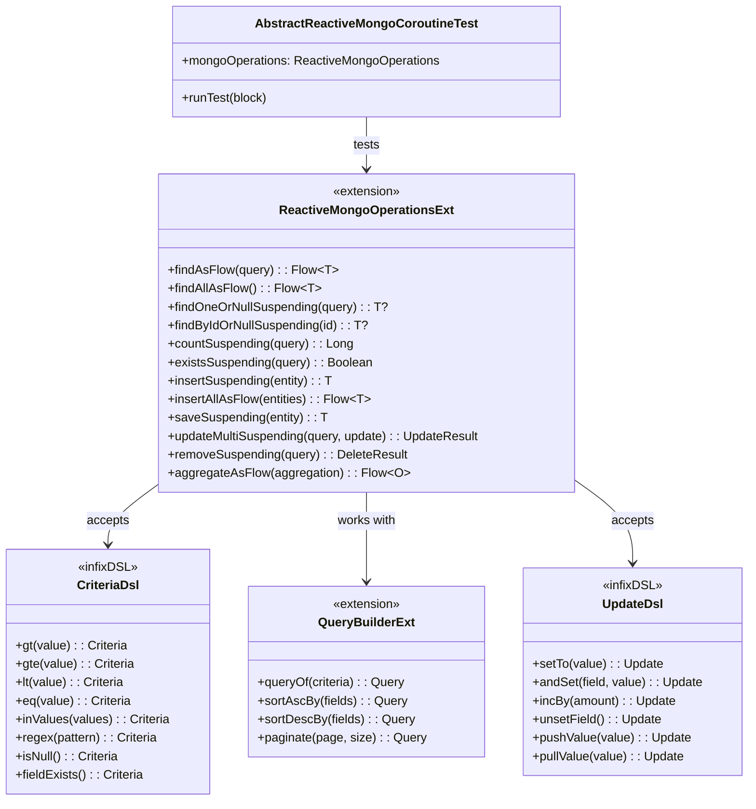
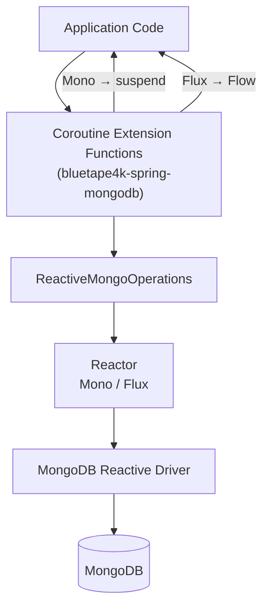
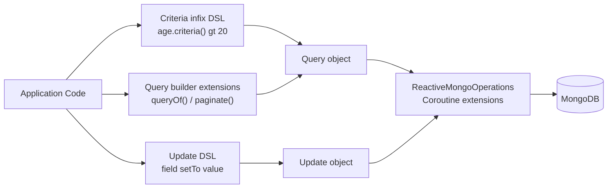
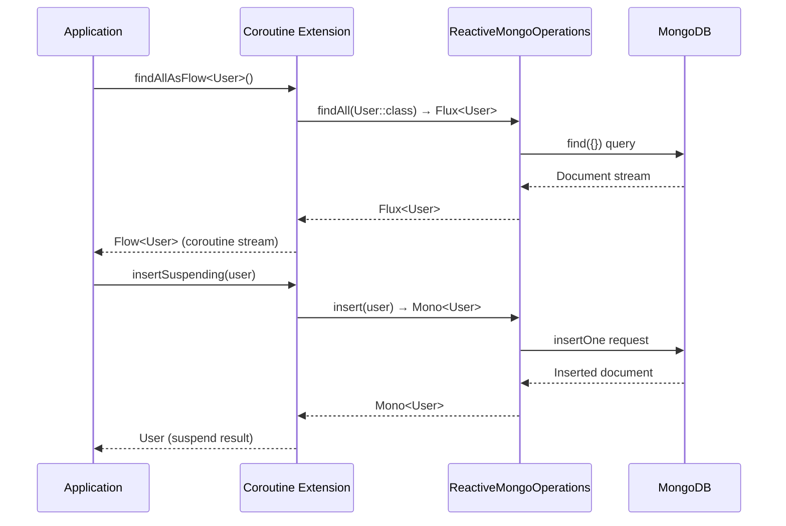

# Module bluetape4k-spring-mongodb

English | [한국어](./README.ko.md)

An extension library that makes [Spring Data MongoDB Reactive](https://docs.spring.io/spring-data/mongodb/docs/current/reference/html/) more convenient to use with Kotlin Coroutines.

It provides extension functions that convert `Flux`/`Mono` return types from `ReactiveMongoOperations` to `Flow`/
`suspend`, along with a Kotlin infix DSL for building `Criteria`, `Query`, and `Update` objects.

## Features

- **ReactiveMongoOperations coroutine extensions**: `Flux` → `Flow`, `Mono` → `suspend` conversion
- **Criteria infix DSL**: `"age".criteria() gt 28`, `"name".criteria() eq "Alice"`, etc.
- **Query builder extensions**: `queryOf()`, `sortAscBy()`, `paginate()`, etc.
- **Update DSL**: `"field" setTo value`, `update.andSet()`, `"field".incBy()`, etc.
- **Spring Boot auto-configuration**: `ReactiveMongoAutoConfiguration`

## Adding the Dependency

```kotlin
dependencies {
    implementation("io.github.bluetape4k:bluetape4k-spring-mongodb:${bluetape4kVersion}")
}
```

## Key Features

### 1. ReactiveMongoOperations Coroutine Extensions

All major operations on `ReactiveMongoOperations` are available as `suspend` functions or `Flow`.

```kotlin
import io.bluetape4k.spring.mongodb.coroutines.*

// Find one
val user: User? = mongoOperations.findOneOrNullSuspending(
    Query(Criteria.where("name").`is`("Alice"))
)

// Find all as Flow
val users: List<User> = mongoOperations.findAllAsFlow<User>().toList()

// Conditional query (Flow)
val seoulUsers = mongoOperations.findAsFlow<User>(
    Query(Criteria.where("city").`is`("Seoul"))
).toList()

// Insert
val saved: User = mongoOperations.insertSuspending(User(name = "Bob", age = 25))

// Count
val count: Long = mongoOperations.countSuspending<User>()

// Existence check
val exists: Boolean = mongoOperations.existsSuspending<User>(
    Query(Criteria.where("name").`is`("Alice"))
)

// Update
val result = mongoOperations.updateMultiSuspending<User>(
    Query(Criteria.where("city").`is`("Seoul")),
    Update().set("city", "Suwon")
)

// Aggregation (Flow)
val results = mongoOperations.aggregateAsFlow<User, CityCount>(aggregation).toList()
```

### 2. Criteria Infix DSL

Use concise infix expressions instead of the verbose `Criteria.where(field).`is`(value)` form.

```kotlin
import io.bluetape4k.spring.mongodb.query.*

// Comparison operators
val c1 = "age".criteria() gt 20
val c2 = "age".criteria() gte 18
val c3 = "age".criteria() lt 65
val c4 = "name".criteria() eq "Alice"
val c5 = "status".criteria() ne "inactive"

// Collection operators
val c6 = "city".criteria() inValues listOf("Seoul", "Busan")
val c7 = "status".criteria() notInValues listOf("deleted", "blocked")

// String operators
val c8 = "name".criteria() regex "^Alice"
val c9 = "name".criteria() regex Regex("^alice", RegexOption.IGNORE_CASE)

// Null / existence checks
val c10 = "deletedAt".criteria().isNull()
val c11 = "email".criteria().fieldExists()

// Array operators
val c12 = "tags".criteria() allValues listOf("kotlin", "mongodb")
val c13 = "tags".criteria() sizeOf 3

// Logical operators
val c14 = "age".criteria().gt(20) andWith "city".criteria().`is`("Seoul")
val c15 = "city".criteria().`is`("Seoul") orWith "city".criteria().`is`("Busan")
```

### 3. Query Builder Extensions

```kotlin
import io.bluetape4k.spring.mongodb.query.*

// Build a Query from Criteria
val query1 = queryOf("age".criteria() gt 20)

// Compound AND condition
val query2 = queryOf(
    "age".criteria() gt 20,
    "city".criteria() eq "Seoul"
)

// Sorting
val query3 = Query().sortAscBy("name", "age")
val query4 = Query().sortDescBy("createdAt")

// Pagination (0-based page index)
val query5 = Query().sortAscBy("age").paginate(page = 0, size = 10)

// Convert Criteria to Query
val query6 = Criteria.where("name").`is`("Alice").toQuery()
```

### 4. Update DSL

```kotlin
import io.bluetape4k.spring.mongodb.query.*

// Set a single field
val update1 = "name" setTo "Alice"

// Chain multiple fields
val update2 = ("name" setTo "Alice")
    .andSet("age", 30)
    .andSet("city", "Seoul")

// Increment
val update3 = "score" incBy 10

// Remove a field
val update4 = "tempField".unsetField()

// Array push/pull
val update5 = "tags".pushValue("kotlin")
val update6 = "tags".pullValue("java")
```

## Test Support

```kotlin
import io.bluetape4k.spring.mongodb.AbstractReactiveMongoCoroutineTest

@DataMongoTest
class MyMongoTest : AbstractReactiveMongoCoroutineTest() {

    @BeforeEach
    fun setUp() = runTest {
        mongoOperations.dropCollectionSuspending<MyDocument>()
        mongoOperations.insertAllAsFlow(testData).toList()
    }

    @Test
    fun `document query test`() = runTest {
        val doc = mongoOperations.findOneOrNullSuspending<MyDocument>(
            queryOf("name".criteria() eq "Alice")
        )
        doc.shouldNotBeNull()
        doc.name shouldBeEqualTo "Alice"
    }
}
```

`AbstractReactiveMongoCoroutineTest` automatically wires the [MongoDBServer](../../testing/testcontainers) Testcontainer via
`@DynamicPropertySource`, and implements `CoroutineScope` so coroutine tests can be written directly.

## Available Extension Functions

### ReactiveMongoOperations Extensions

| Function                                    | Return Type    | Description                             |
|---------------------------------------------|----------------|-----------------------------------------|
| `findAsFlow<T>(query)`                      | `Flow<T>`      | Stream of matching documents            |
| `findAllAsFlow<T>()`                        | `Flow<T>`      | Stream of all documents                 |
| `findOneOrNullSuspending<T>(query)`         | `T?`           | Find one or null                        |
| `findByIdOrNullSuspending<T>(id)`           | `T?`           | Find by ID or null                      |
| `countSuspending<T>(query?)`                | `Long`         | Count documents                         |
| `existsSuspending<T>(query)`                | `Boolean`      | Check existence                         |
| `insertSuspending(entity)`                  | `T`            | Insert a single document                |
| `insertAllAsFlow(entities)`                 | `Flow<T>`      | Insert multiple documents               |
| `saveSuspending(entity)`                    | `T`            | Save (insert or update)                 |
| `updateFirstSuspending<T>(query, update)`   | `UpdateResult` | Update first matching document          |
| `updateMultiSuspending<T>(query, update)`   | `UpdateResult` | Update all matching documents           |
| `upsertSuspending<T>(query, update)`        | `UpdateResult` | Upsert                                  |
| `removeSuspending<T>(query)`                | `DeleteResult` | Delete by condition                     |
| `findAndModifySuspending<T>(query, update)` | `T?`           | Modify and return the previous document |
| `findAndRemoveSuspending<T>(query)`         | `T?`           | Remove and return the deleted document  |
| `aggregateAsFlow<I, O>(aggregation)`        | `Flow<O>`      | Run an aggregation pipeline             |
| `dropCollectionSuspending<T>()`             | `Unit`         | Drop a collection                       |

## References

- [Spring Data MongoDB Official Documentation](https://docs.spring.io/spring-data/mongodb/docs/current/reference/html/)
- [bluetape4k-mongodb](../data/mongodb/README.md) — Native MongoDB Kotlin driver extensions

## Architecture Diagrams

### Core Class Diagram



### ReactiveMongoOperations Coroutine Extension Flow



### Criteria / Query / Update DSL Flow



### Coroutine Conversion Sequence



## License

Apache License 2.0
