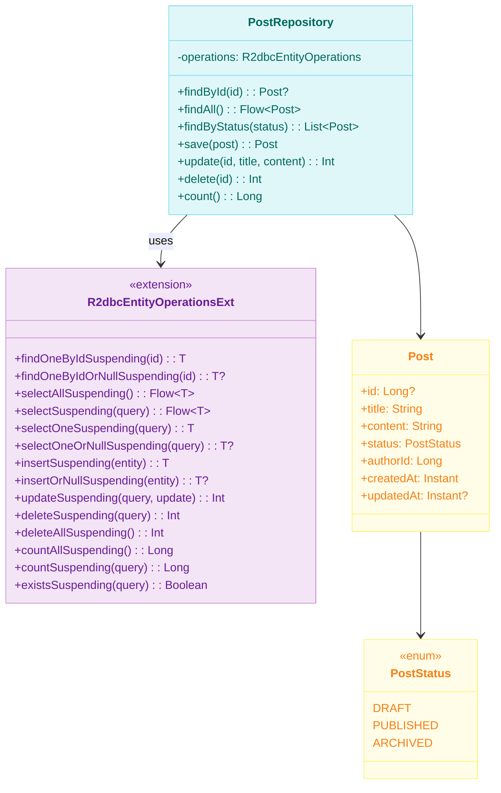
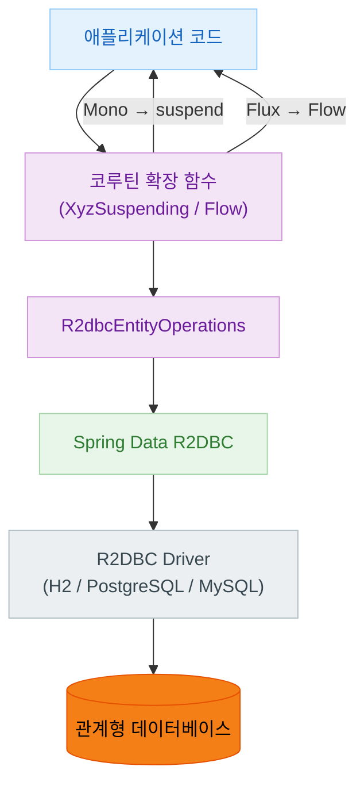
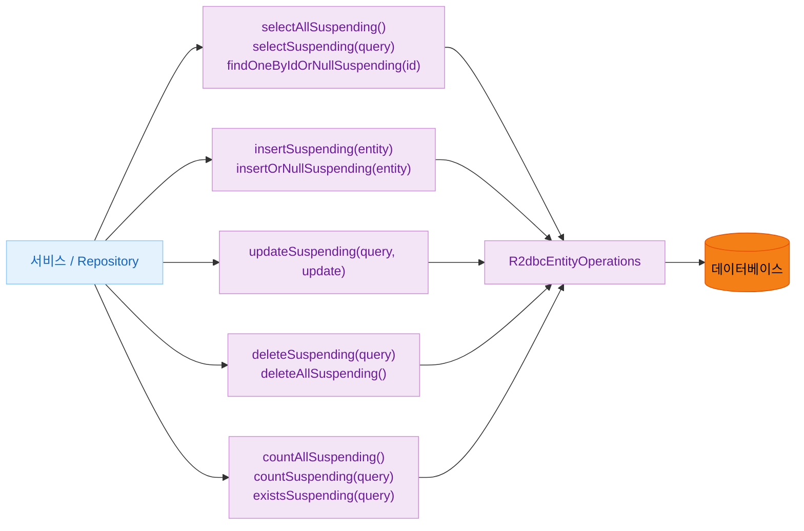
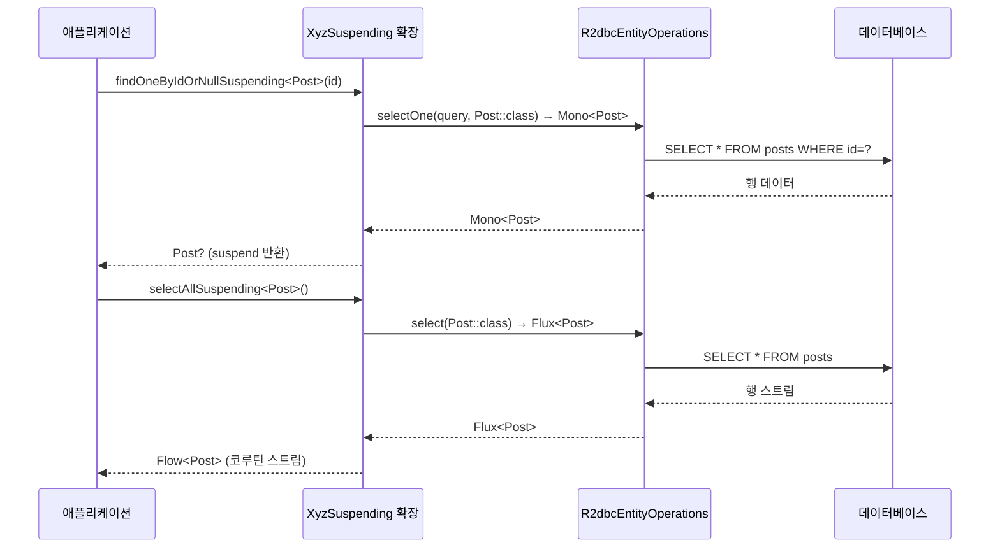

# Module bluetape4k-spring-r2dbc

[English](./README.md) | 한국어

Spring Data R2DBC를 Kotlin 코루틴에서 사용하기 편하게 확장한 라이브러리입니다.

## 주요 기능

- **R2dbcEntityOperations 확장**: 코루틴 기반 CRUD 연산
- **ReactiveInsert/Update/Delete/Select 확장**: 타입 안전한 코루틴 연산
- **네이밍 규칙**: `XyzSuspending` 형식의 일관된 함수명

## 의존성 추가

```kotlin
dependencies {
    implementation("io.github.bluetape4k:bluetape4k-spring-r2dbc:${version}")
}
```

## 주요 기능 상세

### 1. R2dbcEntityOperations 확장

#### ID로 단건 조회

```kotlin
import io.bluetape4k.spring.r2dbc.coroutines.*
import org.springframework.data.r2dbc.core.R2dbcEntityOperations

class PostService(private val operations: R2dbcEntityOperations) {

    suspend fun findById(id: Long): Post {
        // ID로 조회 (없으면 예외)
        return operations.findOneByIdSuspending<Post>(id)
    }

    suspend fun findByIdOrNull(id: Long): Post? {
        // ID로 조회 (없으면 null)
        return operations.findOneByIdOrNullSuspending<Post>(id)
    }

    suspend fun findFirstById(id: Long): Post {
        // ID로 첫 번째 결과 조회
        return operations.findFirstByIdSuspending<Post>(id)
    }

    suspend fun findFirstByIdOrNull(id: Long): Post? {
        // ID로 첫 번째 결과 조회 (없으면 null)
        return operations.findFirstByIdOrNullSuspending<Post>(id)
    }

    // 커스텀 ID 컬럼명 지정
    suspend fun findByPostId(postId: String): Post {
        return operations.findOneByIdSuspending<Post>(postId, "post_id")
    }
}
```

#### Query를 이용한 조회

```kotlin
import org.springframework.data.relational.core.query.Query
import org.springframework.data.relational.core.query.Criteria
import org.springframework.data.relational.core.query.isEqual

class PostService(private val operations: R2dbcEntityOperations) {

    suspend fun findByTitle(title: String): Post? {
        val query = Query.query(Criteria.where("title").isEqual(title))
        return operations.selectOneOrNullSuspending<Post>(query)
    }

    suspend fun findByStatus(status: PostStatus): List<Post> {
        val query = Query.query(Criteria.where("status").isEqual(status.name))
        return operations.selectSuspending<Post>(query).toList()
    }

    suspend fun findByAuthorId(authorId: Long): Post {
        val query = Query.query(Criteria.where("author_id").isEqual(authorId))
        return operations.selectFirstSuspending<Post>(query)
    }
}
```

#### 전체 조회 및 건수

```kotlin
class PostService(private val operations: R2dbcEntityOperations) {

    // 전체 조회
    fun findAll(): Flow<Post> {
        return operations.selectAllSuspending<Post>()
    }

    // 전체 건수
    suspend fun countAll(): Long {
        return operations.countAllSuspending<Post>()
    }

    // 조건부 건수
    suspend fun countByStatus(status: PostStatus): Long {
        val query = Query.query(Criteria.where("status").isEqual(status.name))
        return operations.countSuspending<Post>(query)
    }

    // 존재 여부 확인
    suspend fun existsByAuthorId(authorId: Long): Boolean {
        val query = Query.query(Criteria.where("author_id").isEqual(authorId))
        return operations.existsSuspending<Post>(query)
    }
}
```

---

### 2. Insert 확장

```kotlin
import io.bluetape4k.spring.r2dbc.coroutines.*

class PostService(private val operations: R2dbcEntityOperations) {

    suspend fun createPost(title: String, content: String): Post {
        val post = Post(
            title = title,
            content = content,
            createdAt = Instant.now()
        )

        // 저장된 엔티티 반환
        return operations.insertSuspending(post)
    }

    suspend fun createPostOrNull(title: String, content: String): Post? {
        val post = Post(title = title, content = content)
        return operations.insertOrNullSuspending(post)
    }
}
```

---

### 3. Update 확장

```kotlin
import org.springframework.data.relational.core.query.Query
import org.springframework.data.relational.core.query.Update

class PostService(private val operations: R2dbcEntityOperations) {

    suspend fun updatePostTitle(id: Long, newTitle: String): Int {
        val query = Query.query(Criteria.where("id").isEqual(id))
        val update = Update.update("title", newTitle)

        return operations.updateSuspending<Post>(query, update)
    }

    suspend fun updatePostStatus(id: Long, status: PostStatus): Int {
        val query = Query.query(Criteria.where("id").isEqual(id))
        val update = Update.update("status", status.name)
            .set("updated_at", Instant.now())

        return operations.updateSuspending<Post>(query, update)
    }
}
```

---

### 4. Delete 확장

```kotlin
class PostService(private val operations: R2dbcEntityOperations) {

    suspend fun deleteById(id: Long): Int {
        val query = Query.query(Criteria.where("id").isEqual(id))
        return operations.deleteSuspending<Post>(query)
    }

    suspend fun deleteByAuthorId(authorId: Long): Int {
        val query = Query.query(Criteria.where("author_id").isEqual(authorId))
        return operations.deleteSuspending<Post>(query)
    }

    suspend fun deleteAll(): Int {
        return operations.deleteAllSuspending<Post>()
    }
}
```

---

### 5. Flow 기반 스트리밍

대량 데이터를 Flow로 스트리밍하여 메모리 효율적으로 처리합니다.

```kotlin
class PostService(private val operations: R2dbcEntityOperations) {

    // Flow로 스트리밍
    fun streamAllPosts(): Flow<Post> {
        return operations.selectAllSuspending<Post>()
    }

    // Flow 처리
    suspend fun exportAllPosts(): Int {
        var count = 0
        operations.selectAllSuspending<Post>()
            .collect { post ->
                exportToCsv(post)
                count++
            }
        return count
    }

    // 배치 처리
    fun processInBatches(batchSize: Int = 100): Flow<List<Post>> {
        return operations.selectAllSuspending<Post>()
            .chunked(batchSize)
    }
}
```

---

### 6. 네이밍 규칙

코루틴 함수는 `XyzSuspending` 형식으로 제공됩니다.

---

### 7. 전체 예시

```kotlin
@Table("posts")
data class Post(
    @Id val id: Long? = null,
    val title: String,
    val content: String,
    val status: PostStatus,
    val authorId: Long,
    val createdAt: Instant,
    val updatedAt: Instant? = null
)

enum class PostStatus {
    DRAFT,
    PUBLISHED,
    ARCHIVED
}

@Repository
class PostRepository(
    private val operations: R2dbcEntityOperations
) {

    suspend fun findById(id: Long): Post? {
        return operations.findOneByIdOrNullSuspending<Post>(id)
    }

    suspend fun findAll(): List<Post> {
        return operations.selectAllSuspending<Post>().toList()
    }

    suspend fun findByStatus(status: PostStatus): List<Post> {
        val query = Query.query(Criteria.where("status").isEqual(status.name))
        return operations.selectSuspending<Post>(query).toList()
    }

    suspend fun save(post: Post): Post {
        return operations.insertSuspending(post)
    }

    suspend fun update(id: Long, title: String, content: String): Int {
        val query = Query.query(Criteria.where("id").isEqual(id))
        val update = Update.update("title", title)
            .set("content", content)
            .set("updated_at", Instant.now())
        return operations.updateSuspending<Post>(query, update)
    }

    suspend fun delete(id: Long): Int {
        val query = Query.query(Criteria.where("id").isEqual(id))
        return operations.deleteSuspending<Post>(query)
    }

    suspend fun count(): Long {
        return operations.countAllSuspending<Post>()
    }
}
```

---

## 테스트

```bash
./gradlew :spring:r2dbc:test
```

## 아키텍처 다이어그램

### 핵심 클래스 다이어그램



### R2DBC + Coroutines 데이터 흐름



### CRUD 연산 계층 구조



### 코루틴 변환 시퀀스



## 참고

- [Spring Data R2DBC Reference](https://docs.spring.io/spring-data/r2dbc/reference/)
- [Kotlin Coroutines Support](https://docs.spring.io/spring-framework/reference/languages/kotlin/coroutines.html)
