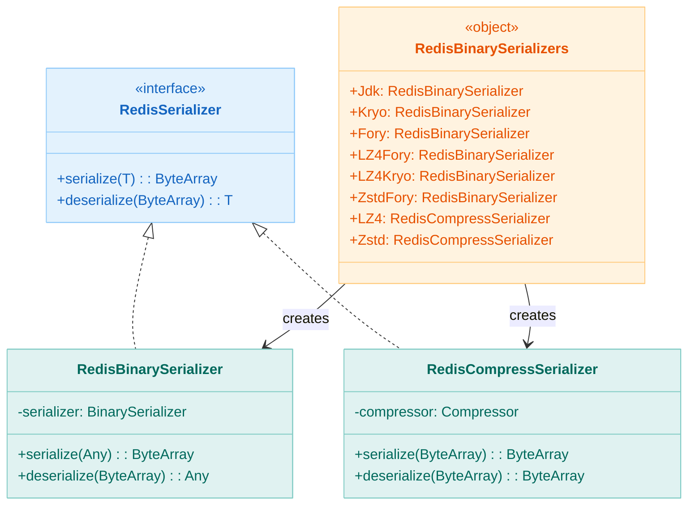
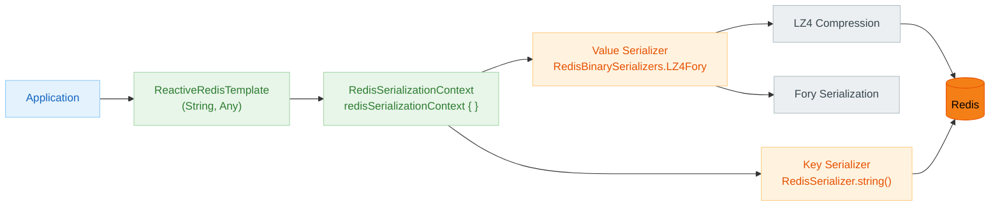

# bluetape4k-spring-boot3-redis

English | [한국어](./README.ko.md)

A module that replaces the serialization layer of Spring Data Redis with high-performance binary serialization and compression combinations. It makes it easy to configure
`Serializer` and `RedisSerializationContext` when setting up `RedisTemplate` or `ReactiveRedisTemplate`.

## Key Features

| Class / Function                   | Description                                                                                    |
|------------------------------------|------------------------------------------------------------------------------------------------|
| `RedisBinarySerializer`            | `RedisSerializer<Any>` implementation backed by `BinarySerializer`                             |
| `RedisCompressSerializer`          | Compression-only `RedisSerializer<ByteArray>` backed by `Compressor`                           |
| `RedisBinarySerializers`           | Singleton factory combining serialization (Jdk/Kryo/Fory) × compression (GZip/LZ4/Snappy/Zstd) |
| `redisSerializationContext {}`     | DSL-based `RedisSerializationContext` builder                                                  |
| `redisSerializationContextOf(...)` | Convenience function for specifying key/value serializers directly                             |

## Dependencies

```kotlin
// build.gradle.kts
dependencies {
    implementation("io.github.bluetape4k:bluetape4k-spring-boot3-redis:$bluetape4kVersion")
}
```

## Usage Examples

### ReactiveRedisTemplate Configuration (DSL Style)

```kotlin
@Configuration
class RedisConfig {

    @Bean
    fun reactiveRedisTemplate(
        factory: ReactiveRedisConnectionFactory,
    ): ReactiveRedisTemplate<String, Any> {
        val context = redisSerializationContext<String, Any> {
            key(RedisSerializer.string())
            value(RedisBinarySerializers.LZ4Fory)
            hashKey(RedisSerializer.string())
            hashValue(RedisBinarySerializers.LZ4Fory)
        }
        return ReactiveRedisTemplate(factory, context)
    }
}
```

### ReactiveRedisTemplate Configuration (Convenience Function Style)

```kotlin
@Bean
fun reactiveRedisTemplate(
    factory: ReactiveRedisConnectionFactory,
): ReactiveRedisTemplate<String, ByteArray> {
    // String key + LZ4 Kryo value serialization
    val context = redisSerializationContextOf<ByteArray>(
        valueSerializer = RedisBinarySerializers.LZ4Kryo,
    )
    return ReactiveRedisTemplate(factory, context)
}
```

### RedisTemplate Configuration

```kotlin
@Bean
fun redisTemplate(factory: RedisConnectionFactory): RedisTemplate<String, Any> {
    return RedisTemplate<String, Any>().apply {
        connectionFactory = factory
        keySerializer = RedisSerializer.string()
        valueSerializer = RedisBinarySerializers.LZ4Fory
        hashKeySerializer = RedisSerializer.string()
        hashValueSerializer = RedisBinarySerializers.LZ4Fory
    }
}
```

### Compression-Only Serializer

```kotlin
// When the value is already a ByteArray, apply compression only
val context = redisSerializationContext<String, ByteArray> {
    key(RedisSerializer.string())
    value(RedisBinarySerializers.LZ4)   // ByteArray → LZ4 compression
}
```

## Serializer Reference

### Serialization (Object → ByteArray)

| Constant                            | Serialization Engine | Compression |
|-------------------------------------|----------------------|-------------|
| `RedisBinarySerializers.Jdk`        | JDK                  | None        |
| `RedisBinarySerializers.Kryo`       | Kryo                 | None        |
| `RedisBinarySerializers.Fory`       | Fory                 | None        |
| `RedisBinarySerializers.LZ4Fory`    | Fory                 | LZ4         |
| `RedisBinarySerializers.LZ4Kryo`    | Kryo                 | LZ4         |
| `RedisBinarySerializers.ZstdFory`   | Fory                 | Zstd        |
| `RedisBinarySerializers.SnappyFory` | Fory                 | Snappy      |
| `RedisBinarySerializers.GzipFory`   | Fory                 | GZip        |

### Compression-Only (ByteArray → ByteArray)

| Constant                        | Algorithm |
|---------------------------------|-----------|
| `RedisBinarySerializers.LZ4`    | LZ4       |
| `RedisBinarySerializers.Zstd`   | Zstd      |
| `RedisBinarySerializers.Snappy` | Snappy    |
| `RedisBinarySerializers.Gzip`   | GZip      |

## Architecture Diagrams

### Redis Serializer Class Hierarchy



### ReactiveRedisTemplate Serialization Flow



## Build and Test

```bash
./gradlew :bluetape4k-spring-boot3-redis:test
```
