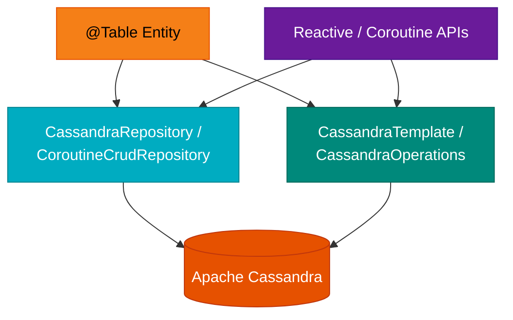

# Module Examples - Cassandra & Spring Data Cassandra (Spring Boot 4)

English | [한국어](./README.ko.md)

A comprehensive set of examples for Apache Cassandra and Spring Data Cassandra (Spring Boot 4.x).

## UML



> Provides the same examples as the Spring Boot 3 demo (
`spring-boot3/cassandra-demo`), adapted to the Spring Boot 4.x API.

## Example List

### Basic (basic/)

| Example File                          | Description                              |
|---------------------------------------|------------------------------------------|
| `BasicUserRepositoryTest.kt`          | Basic Repository usage                   |
| `CassandraOperationsTest.kt`          | Running queries with CassandraOperations |
| `CoroutineCassandraOperationsTest.kt` | Coroutines-based async queries           |

### Kotlin DSL (kotlin/)

| Example File              | Description                           |
|---------------------------|---------------------------------------|
| `PersonRepositoryTest.kt` | Defining a Repository with Kotlin DSL |
| `TemplateTest.kt`         | Using CassandraTemplate               |

### Reactive (reactive/)

| Example File                       | Description           |
|------------------------------------|-----------------------|
| `ReactivePersonRepositoryTest.kt`  | Reactive Repository   |
| `CoroutinePersonRepositoryTest.kt` | Coroutines Repository |

### Auditing (auditing/)

| Example File      | Description                             |
|-------------------|-----------------------------------------|
| `AuditingTest.kt` | `@CreatedBy`, `@LastModifiedBy` support |

## Entity Definition

```kotlin
@Table
data class User(
    @PrimaryKey val id: UUID = UUID.randomUUID(),
    val name: String,
    val email: String,
)
```

## Repository

```kotlin
interface UserRepository : CassandraRepository<User, UUID> {
    fun findByEmail(email: String): User?
}
```

## Coroutines Support

```kotlin
interface CoroutinePersonRepository : CoroutineCrudRepository<Person, UUID> {
    suspend fun findByLastName(lastName: String): Flow<Person>
}
```

## Running the Examples

```bash
# Start Cassandra via Docker
docker run -d --name cassandra -p 9042:9042 cassandra:4

# Run all examples
./gradlew :bluetape4k-spring-boot4-cassandra-demo:test
```

## References

- [Spring Data Cassandra](https://spring.io/projects/spring-data-cassandra)
- [Apache Cassandra](https://cassandra.apache.org/)
