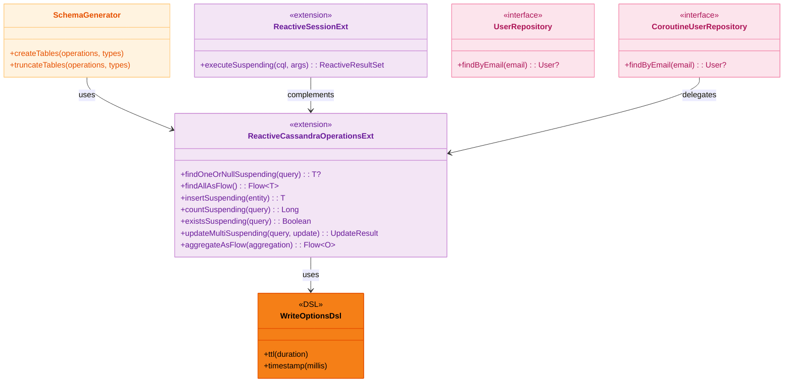
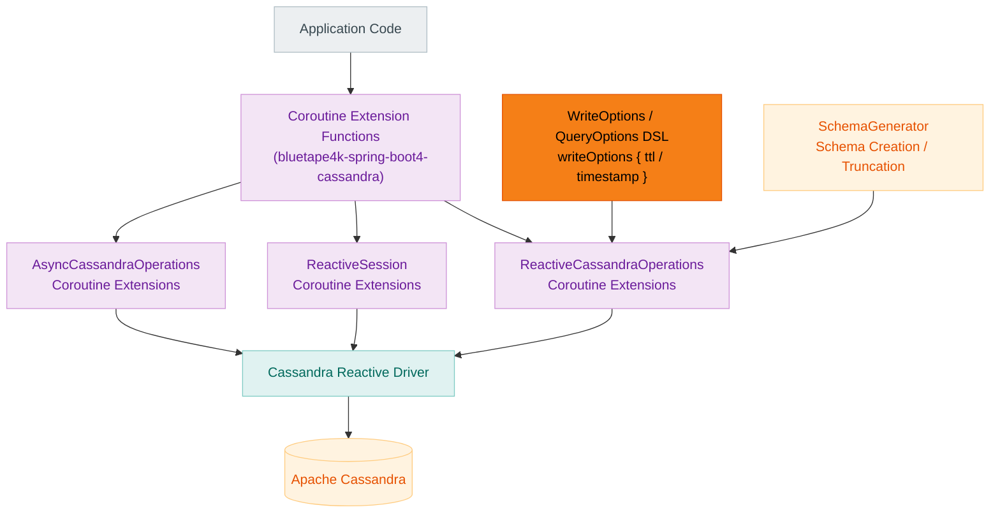
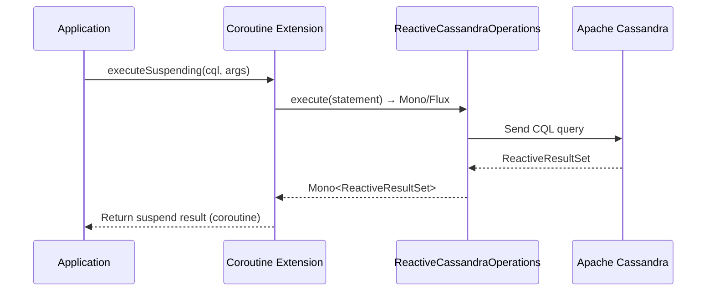

# Module bluetape4k-spring-boot4-cassandra

English | [한국어](./README.ko.md)

Provides coroutine extensions, convenience DSLs, and schema utilities for Spring Data Cassandra development (Spring Boot 4.x).

> Provides the same functionality as the Spring Boot 3 module (
`bluetape4k-spring-cassandra`), adapted to the Spring Boot 4.x API.

## Key Features

- Coroutine extensions for `ReactiveSession`, `ReactiveCassandraOperations`, and `AsyncCassandraOperations`
- DSL helpers for CQL options (`QueryOptions`, `WriteOptions`, etc.)
- Schema creation and truncation utilities (`SchemaGenerator`)

## Installation

```kotlin
dependencies {
    implementation("io.github.bluetape4k:bluetape4k-spring-boot4-cassandra:${bluetape4kVersion}")
}
```

## Usage Examples

### Coroutine Extensions

```kotlin
val result = reactiveSession.executeSuspending("SELECT * FROM users WHERE id = ?", id)
```

### WriteOptions DSL

```kotlin
val options = writeOptions {
    ttl(Duration.ofSeconds(30))
    timestamp(System.currentTimeMillis())
}
```

### Entity Definition

```kotlin
@Table
data class User(
    @PrimaryKey val id: UUID = UUID.randomUUID(),
    val name: String,
    val email: String,
)
```

### Repository

```kotlin
interface UserRepository : CassandraRepository<User, UUID> {
    fun findByEmail(email: String): User?
}

// Coroutines Repository
interface CoroutineUserRepository : CoroutineCrudRepository<User, UUID> {
    suspend fun findByEmail(email: String): User?
}
```

## Build and Test

```bash
./gradlew :bluetape4k-spring-boot4-cassandra:test
```

## Architecture Diagrams

### Core Class Structure



### Cassandra Data Access Layer



### Coroutine Conversion Sequence



## References

- [Spring Data Cassandra](https://spring.io/projects/spring-data-cassandra)
- [Apache Cassandra](https://cassandra.apache.org/)
