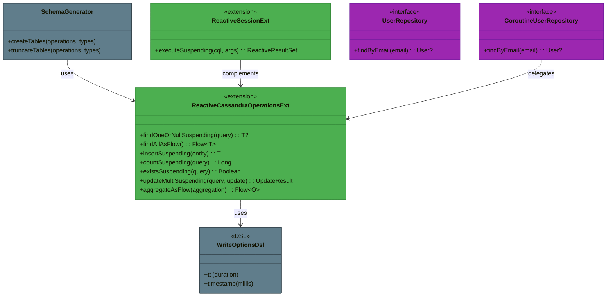
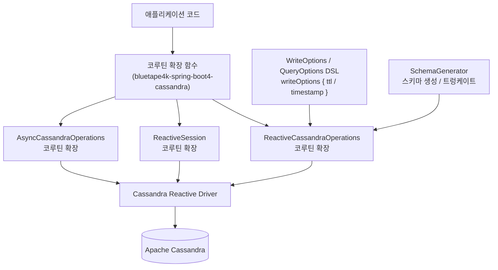
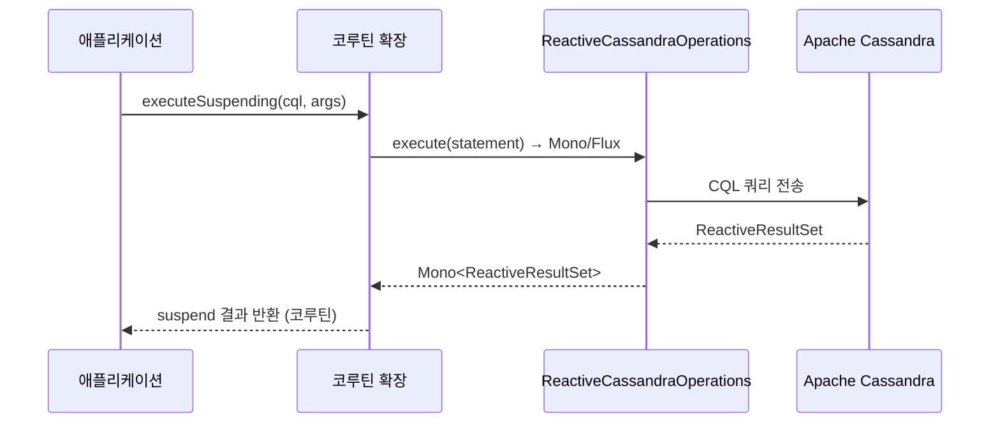

# Module bluetape4k-spring-boot4-cassandra

Spring Data Cassandra 기반 개발에서 자주 쓰는 코루틴 확장, 편의 DSL, 스키마 유틸을 제공합니다 (Spring Boot 4.x).

> Spring Boot 3 모듈(`bluetape4k-spring-cassandra`)과 동일한 기능을 Spring Boot 4.x API로 제공합니다.

## 주요 기능

- `ReactiveSession`/`ReactiveCassandraOperations`/`AsyncCassandraOperations` 코루틴 확장
- CQL 옵션(`QueryOptions`, `WriteOptions` 등) DSL 헬퍼
- 스키마 생성/트렁케이트 유틸 (`SchemaGenerator`)

## 설치

```kotlin
dependencies {
    implementation("io.github.bluetape4k:bluetape4k-spring-boot4-cassandra:${bluetape4kVersion}")
}
```

## 사용 예시

### 코루틴 확장

```kotlin
val result = reactiveSession.executeSuspending("SELECT * FROM users WHERE id = ?", id)
```

### WriteOptions DSL

```kotlin
val options = writeOptions {
    ttl(Duration.ofSeconds(30))
    timestamp(System.currentTimeMillis())
}
```

### Entity 정의

```kotlin
@Table
data class User(
    @PrimaryKey val id: UUID = UUID.randomUUID(),
    val name: String,
    val email: String,
)
```

### Repository

```kotlin
interface UserRepository : CassandraRepository<User, UUID> {
    fun findByEmail(email: String): User?
}

// Coroutines Repository
interface CoroutineUserRepository : CoroutineCrudRepository<User, UUID> {
    suspend fun findByEmail(email: String): User?
}
```

## 빌드 및 테스트

```bash
./gradlew :bluetape4k-spring-boot4-cassandra:test
```

## 아키텍처 다이어그램

### 핵심 클래스 구조



### Cassandra 데이터 접근 계층



### 코루틴 변환 흐름



## 참고

- [Spring Data Cassandra](https://spring.io/projects/spring-data-cassandra)
- [Apache Cassandra](https://cassandra.apache.org/)
