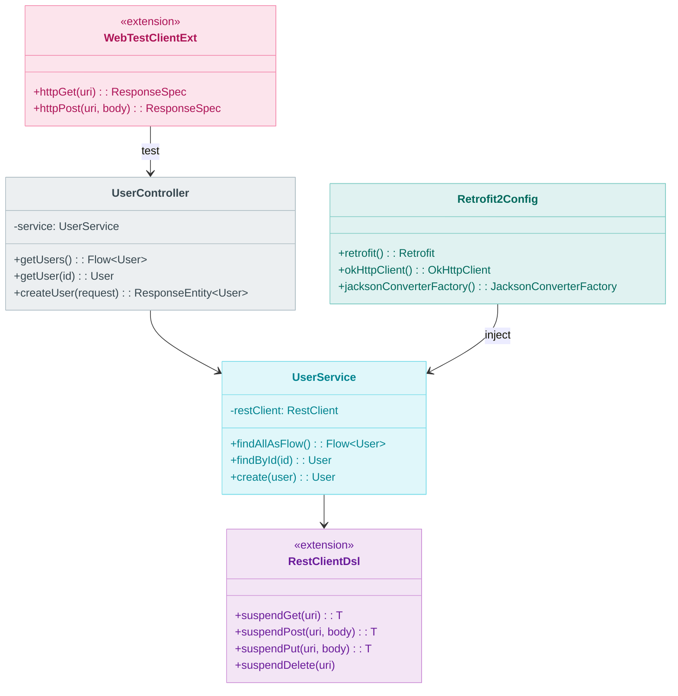
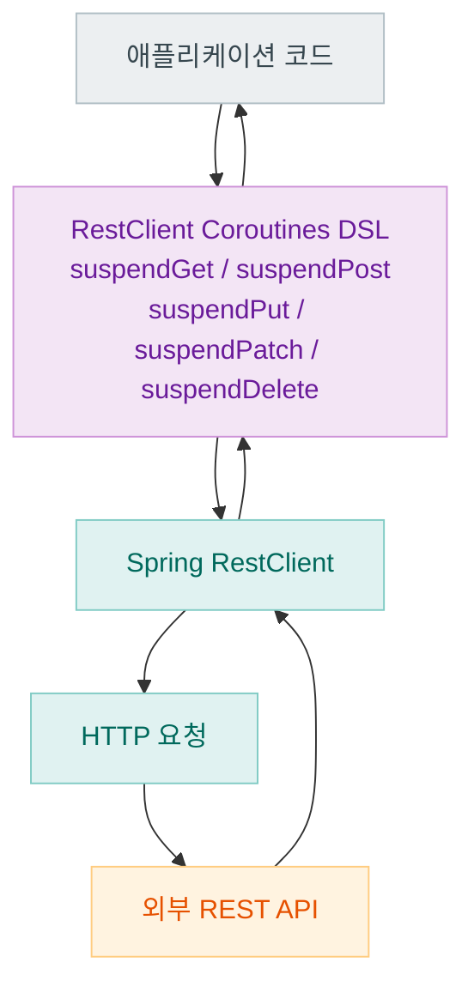
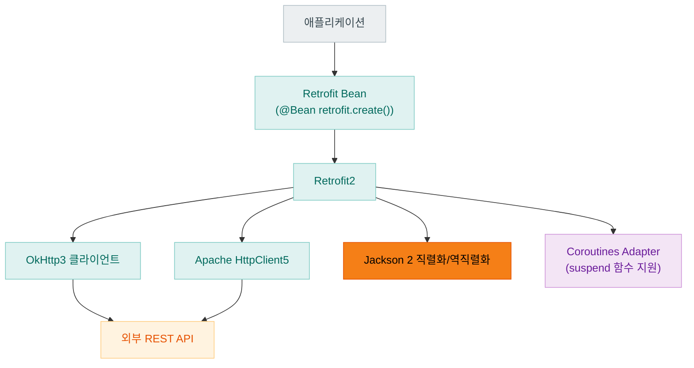

# Module bluetape4k-spring-boot4-core

[English](./README.md) | 한국어

Spring Boot 4.x 기반 공통 기능 통합 모듈입니다.

> Spring Boot 3 모듈(`bluetape4k-spring-boot3`)과 동일한 기능을 Spring Boot 4.x API로 제공합니다.
> 두 모듈은 독립적으로 사용 가능합니다.

## 제공 기능

### Spring Core 유틸리티

- BeanFactory 확장 함수
- Spring Boot AutoConfiguration 지원
- Jakarta Annotation API 통합

### Spring WebFlux + Coroutines

- Coroutines 기반 WebFlux 핸들러 유틸리티
- `WebClient` 확장 함수 (`httpGet`, `httpPost`, `httpPut`, `httpPatch`, `httpDelete`)
- `WebTestClient` 확장 함수
- Reactor ↔ Coroutines 변환 지원

### RestClient Coroutines DSL

- `RestClient` 코루틴 확장 (`suspendGet`, `suspendPost`, `suspendPut`, `suspendPatch`, `suspendDelete`)

### Jackson 2 커스터마이저

- `jacksonObjectMapperBuilderCustomizer` DSL
- KotlinModule, JsonUuidModule 자동 등록
- 직렬화/역직렬화 기본 설정 제공

> **주의**: Spring Boot 4는 내부적으로 Jackson 2(`com.fasterxml.jackson.*`)를 사용합니다.
> Jackson 3은 지원되지 않습니다.

### Retrofit2 통합

- Spring Boot + Retrofit2 자동 구성
- OkHttp3 클라이언트 통합
- Apache HttpClient5 통합
- Coroutines suspend 함수 지원

### 테스트 유틸리티

- Spring Boot Test 기반 통합 테스트 지원
- `WebTestClient` 테스트 확장 (`httpGet`, `httpPost` 등)
- Testcontainers 통합

## 설치

```kotlin
dependencies {
    implementation("io.github.bluetape4k:bluetape4k-spring-boot4-core:${bluetape4kVersion}")
}
```

## BOM 적용 주의사항

Spring Boot 4 BOM은 반드시 `implementation(platform(...))` 방식으로 적용해야 합니다.
`dependencyManagement { imports { mavenBom() } }` 방식은 Kotlin Gradle Plugin과 충돌합니다.

```kotlin
// ✅ 올바른 방식
dependencies {
    implementation(platform("org.springframework.boot:spring-boot-dependencies:4.x.x"))
}

// ❌ 잘못된 방식 (KGP 빌드 실패 유발)
dependencyManagement {
    imports { mavenBom("org.springframework.boot:spring-boot-dependencies:4.x.x") }
}
```

## 사용 예시

### RestClient Coroutines DSL

```kotlin
import io.bluetape4k.spring4.http.*

val restClient = RestClient.create("https://api.example.com")

// suspend 함수로 HTTP 요청
val user: User = restClient.suspendGet("/users/1")
val created: User = restClient.suspendPost("/users", newUser, MediaType.APPLICATION_JSON)
val updated: User = restClient.suspendPut("/users/1", updatedUser, MediaType.APPLICATION_JSON)
restClient.suspendDelete("/users/1")
```

### WebClient 확장

```kotlin
import io.bluetape4k.spring4.tests.*

val webClient = WebClient.create("https://api.example.com")

// GET 요청
val response = webClient.httpGet("/users")
    .retrieve()
    .bodyToFlux(User::class.java)
    .asFlow()

// POST 요청
val created = webClient.httpPost("/users", newUser)
    .retrieve()
    .bodyToMono(User::class.java)
    .awaitSingle()
```

### WebFlux 컨트롤러 (Coroutines)

```kotlin
@RestController
@RequestMapping("/users")
class UserController(private val service: UserService) {

    @GetMapping
    fun getUsers(): Flow<User> = service.findAllAsFlow()

    @GetMapping("/{id}")
    suspend fun getUser(@PathVariable id: Long): User =
        service.findById(id)
}
```

### Jackson 커스터마이저

```kotlin
@Configuration
class JacksonConfig {

    @Bean
    fun customizer(): Jackson2ObjectMapperBuilderCustomizer =
        jacksonObjectMapperBuilderCustomizer {
            // 추가 커스터마이징
            featuresToEnable(SerializationFeature.INDENT_OUTPUT)
        }
}
```

### WebTestClient 테스트

```kotlin
@SpringBootTest(webEnvironment = SpringBootTest.WebEnvironment.RANDOM_PORT)
class UserControllerTest(@Autowired val client: WebTestClient) {

    @Test
    fun `사용자 목록 조회`() = runTest {
        client.httpGet("/users")
            .expectStatus().isOk
            .expectBodyList(User::class.java)
            .hasSize(10)
    }
}
```

## 주요 의존성 구조

| 범주                            | 의존 방식         | 설명                      |
|-------------------------------|---------------|-------------------------|
| `spring-boot-starter-webflux` | `api`         | WebFlux + Coroutines 필수 |
| `bluetape4k-retrofit2`        | `api`         | Retrofit2 통합            |
| `bluetape4k-coroutines`       | `api`         | Coroutines 지원           |
| `bluetape4k-jackson2`         | `compileOnly` | Jackson 2 지원            |
| `spring-boot-starter-web`     | `compileOnly` | 선택적 서블릿 지원              |
| `resilience4j-*`              | `compileOnly` | 선택적 Resilience4j        |

## 아키텍처 다이어그램

### 핵심 클래스 구조



### Spring WebFlux + Coroutines 요청 흐름

```mermaid
flowchart LR
    Client["HTTP 클라이언트"] --> Netty["Netty HTTP 서버"]
    Netty --> WebFlux["Spring WebFlux<br/>DispatcherHandler"]
    WebFlux --> Handler["Coroutines 핸들러<br/>suspend fun / Flow"]
    Handler --> Service["서비스 계층"]
    Service --> DB[("데이터베이스 / 외부 API")]
    DB --> Service
    Service --> Handler
    Handler --> WebFlux
    WebFlux --> Netty
    Netty --> Client

    classDef clientStyle fill:#ECEFF1,stroke:#B0BEC5,color:#37474F
    classDef serverStyle fill:#E3F2FD,stroke:#90CAF9,color:#1565C0
    classDef handlerStyle fill:#F3E5F5,stroke:#CE93D8,color:#6A1B9A
    classDef serviceStyle fill:#E0F7FA,stroke:#80DEEA,color:#00838F
    classDef dataStyle fill:#FFF3E0,stroke:#FFCC80,color:#E65100

    class Client clientStyle
    class Netty,WebFlux serverStyle
    class Handler handlerStyle
    class Service serviceStyle
    class DB dataStyle
```



### RestClient Coroutines DSL 구조



### Retrofit2 통합 구조



## 빌드 및 테스트

```bash
./gradlew :bluetape4k-spring-boot4-core:test
```
