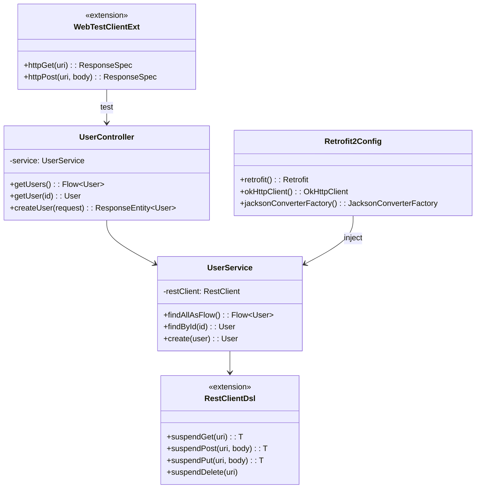
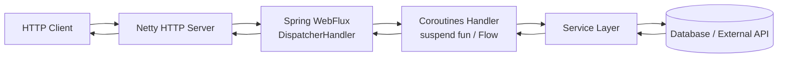
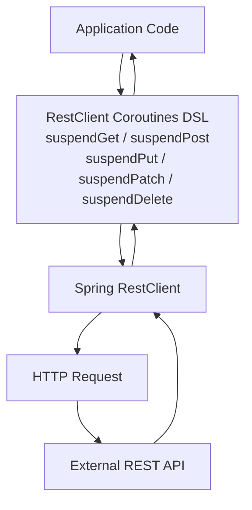
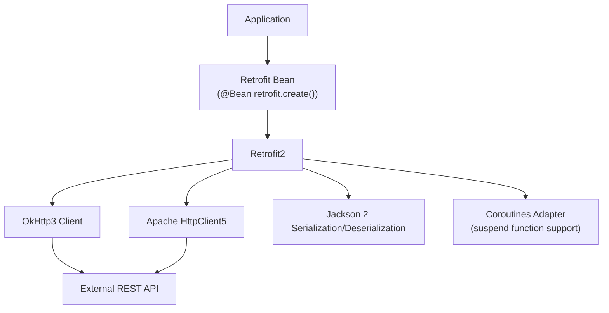

# Module bluetape4k-spring-boot4-core

English | [한국어](./README.ko.md)

A unified module providing common features for Spring Boot 4.x applications.

> Provides the same functionality as the Spring Boot 3 module (`bluetape4k-spring-boot3`), adapted to the Spring Boot 4.x API. Both modules can be used independently.

## Features

### Spring Core Utilities

- BeanFactory extension functions
- Spring Boot AutoConfiguration support
- Jakarta Annotation API integration

### Spring WebFlux + Coroutines

- Coroutines-based WebFlux handler utilities
- `WebClient` extension functions (`httpGet`, `httpPost`, `httpPut`, `httpPatch`, `httpDelete`)
- `WebTestClient` extension functions
- Reactor ↔ Coroutines conversion support

### RestClient Coroutines DSL

- `RestClient` coroutine extensions (`suspendGet`, `suspendPost`, `suspendPut`, `suspendPatch`, `suspendDelete`)

### Jackson 2 Customizer

- `jacksonObjectMapperBuilderCustomizer` DSL
- Auto-registration of KotlinModule and JsonUuidModule
- Default serialization/deserialization configuration

> **Note**: Spring Boot 4 uses Jackson 2 (`com.fasterxml.jackson.*`) internally. Jackson 3 is not supported.

### Retrofit2 Integration

- Spring Boot + Retrofit2 auto-configuration
- OkHttp3 client integration
- Apache HttpClient5 integration
- Coroutines suspend function support

### Test Utilities

- Integration test support based on Spring Boot Test
- `WebTestClient` test extensions (`httpGet`, `httpPost`, etc.)
- Testcontainers integration

## Installation

```kotlin
dependencies {
    implementation("io.github.bluetape4k:bluetape4k-spring-boot4-core:${bluetape4kVersion}")
}
```

## BOM Configuration Notes

The Spring Boot 4 BOM must be applied using `implementation(platform(...))`. Using `dependencyManagement { imports { mavenBom() } }` conflicts with the Kotlin Gradle Plugin.

```kotlin
// ✅ Correct approach
dependencies {
    implementation(platform("org.springframework.boot:spring-boot-dependencies:4.x.x"))
}

// ❌ Incorrect approach (causes KGP build failures)
dependencyManagement {
    imports { mavenBom("org.springframework.boot:spring-boot-dependencies:4.x.x") }
}
```

## Usage Examples

### RestClient Coroutines DSL

```kotlin
import io.bluetape4k.spring4.http.*

val restClient = RestClient.create("https://api.example.com")

// Make HTTP requests using suspend functions
val user: User = restClient.suspendGet("/users/1")
val created: User = restClient.suspendPost("/users", newUser, MediaType.APPLICATION_JSON)
val updated: User = restClient.suspendPut("/users/1", updatedUser, MediaType.APPLICATION_JSON)
restClient.suspendDelete("/users/1")
```

### WebClient Extensions

```kotlin
import io.bluetape4k.spring4.tests.*

val webClient = WebClient.create("https://api.example.com")

// GET request
val response = webClient.httpGet("/users")
    .retrieve()
    .bodyToFlux(User::class.java)
    .asFlow()

// POST request
val created = webClient.httpPost("/users", newUser)
    .retrieve()
    .bodyToMono(User::class.java)
    .awaitSingle()
```

### WebFlux Controller (Coroutines)

```kotlin
@RestController
@RequestMapping("/users")
class UserController(private val service: UserService) {

    @GetMapping
    fun getUsers(): Flow<User> = service.findAllAsFlow()

    @GetMapping("/{id}")
    suspend fun getUser(@PathVariable id: Long): User =
        service.findById(id)
}
```

### Jackson Customizer

```kotlin
@Configuration
class JacksonConfig {

    @Bean
    fun customizer(): Jackson2ObjectMapperBuilderCustomizer =
        jacksonObjectMapperBuilderCustomizer {
            // Additional customization
            featuresToEnable(SerializationFeature.INDENT_OUTPUT)
        }
}
```

### WebTestClient Test

```kotlin
@SpringBootTest(webEnvironment = SpringBootTest.WebEnvironment.RANDOM_PORT)
class UserControllerTest(@Autowired val client: WebTestClient) {

    @Test
    fun `fetch user list`() = runTest {
        client.httpGet("/users")
            .expectStatus().isOk
            .expectBodyList(User::class.java)
            .hasSize(10)
    }
}
```

## Key Dependency Structure

| Category                        | Scope         | Description                        |
|-------------------------------|---------------|------------------------------------|
| `spring-boot-starter-webflux` | `api`         | Required for WebFlux + Coroutines  |
| `bluetape4k-retrofit2`        | `api`         | Retrofit2 integration              |
| `bluetape4k-coroutines`       | `api`         | Coroutines support                 |
| `bluetape4k-jackson2`         | `compileOnly` | Jackson 2 support                  |
| `spring-boot-starter-web`     | `compileOnly` | Optional servlet support           |
| `resilience4j-*`              | `compileOnly` | Optional Resilience4j              |

## Architecture Diagrams

### Core Class Structure



### Spring WebFlux + Coroutines Request Flow



### RestClient Coroutines DSL Structure



### Retrofit2 Integration Structure



## Build and Test

```bash
./gradlew :bluetape4k-spring-boot4-core:test
```
