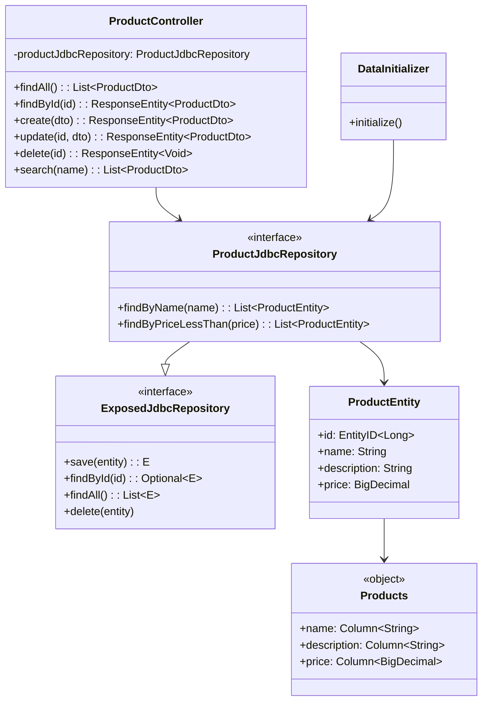
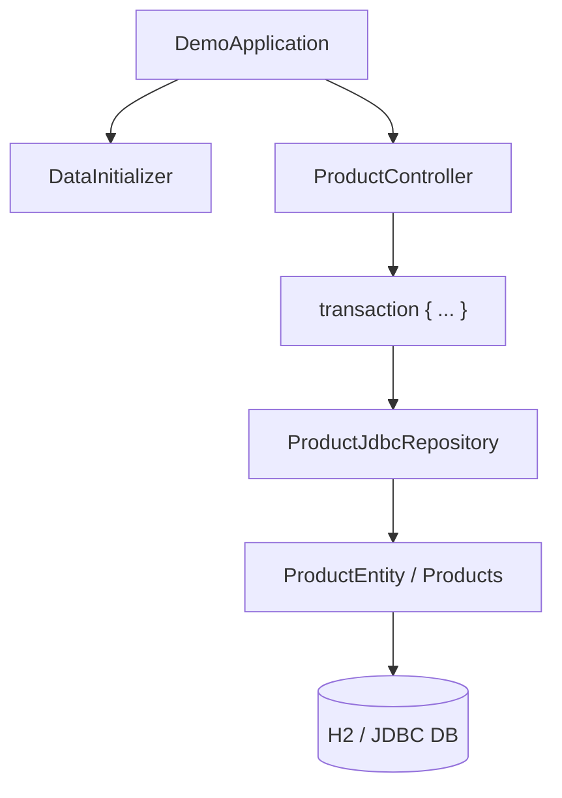

# bluetape4k-spring-boot4-exposed-jdbc-demo

English | [한국어](./README.ko.md)

Exposed DAO + Spring Data JDBC Repository + Spring MVC Integration Demo (Spring Boot 4.x)

## Overview

This module demonstrates the fundamental pattern of wrapping **Exposed DAO entities
** in a Spring Data JDBC Repository and exposing them through a Spring MVC REST API. It provides the same functionality as the Spring Boot 3.x version, using the
**Spring Boot 4 BOM**.

## UML



### Application Structure Flow



### Key Characteristics

- **Exposed DAO entity-based**: `ProductEntity` and `Products` table definitions
- **Spring Data JDBC Repository**: `ExposedJdbcRepository<E, ID>` implementation
- **Query methods**: Auto-generated `findByName`, `findByPriceLessThan` methods
- **Spring MVC REST API**: Standard CRUD endpoints
- **Transaction boundary**: A single `transaction {}` block per request handles DAO operations through DTO conversion
- **Automatic schema creation**: Tables created automatically on application startup
- **Spring Boot 4 compatible**: Spring Boot 4.0+ platform dependency management

## Project Structure

```
src/main/kotlin/io/bluetape4k/examples/exposed/mvc/
├── DemoApplication.kt              # Spring Boot application
├── domain/
│   └── ProductEntity.kt            # Exposed DAO entity + DTO
├── repository/
│   └── ProductJdbcRepository.kt     # Spring Data JDBC Repository
├── controller/
│   └── ProductController.kt         # REST API controller
└── config/
    ├── DataInitializer.kt           # Initial data loader
    └── ExposedConfig.kt             # Exposed JDBC configuration (Spring Boot 4)
```

## Domain Model

### ProductEntity (Exposed DAO)

```kotlin
object Products : LongIdTable("products") {
    val name = varchar("name", 255)
    val price = decimal("price", 10, 2)
    val stock = integer("stock").default(0)
}

@ExposedEntity
class ProductEntity(id: EntityID<Long>) : LongEntity(id) {
    companion object : LongEntityClass<ProductEntity>(Products)
    var name: String by Products.name
    var price: java.math.BigDecimal by Products.price
    var stock: Int by Products.stock
}
```

### ProductDto (Transfer Object)

```kotlin
data class ProductDto(
    val id: Long? = null,
    val name: String,
    val price: java.math.BigDecimal,
    val stock: Int = 0,
)

fun ProductEntity.toDto() = ProductDto(id.value, name, price, stock)
```

## Repository

### ExposedJdbcRepository Implementation

```kotlin
interface ProductJdbcRepository: ExposedJdbcRepository<ProductEntity, Long> {
    fun findByName(name: String): List<ProductEntity>
    fun findByPriceLessThan(price: java.math.BigDecimal): List<ProductEntity>
}
```

`ExposedJdbcRepository` automatically generates PartTree queries. No additional implementation is required as long as you follow method naming conventions.

## REST API

### Basic CRUD

| Method | Path               | Description                         |
|--------|--------------------|-------------------------------------|
| GET    | `/products`        | List all products                   |
| GET    | `/products/{id}`   | Get a specific product              |
| POST   | `/products`        | Create a product                    |
| PUT    | `/products/{id}`   | Update a product                    |
| DELETE | `/products/{id}`   | Delete a product                    |
| GET    | `/products/search` | Search by name (query param `name`) |

### Request/Response Examples

**List all products**

```bash
curl http://localhost:8080/products
```

Response:

```json
[
  {
    "id": 1,
    "name": "Kotlin Programming Book",
    "price": 39.99,
    "stock": 100
  },
  {
    "id": 2,
    "name": "Spring Boot Guide",
    "price": 49.99,
    "stock": 50
  }
]
```

**Create a product**

```bash
curl -X POST http://localhost:8080/products \
  -H "Content-Type: application/json" \
  -d '{
    "name": "Exposed ORM Tutorial",
    "price": 29.99,
    "stock": 200
  }'
```

Response (201 Created):

```json
{
  "id": 3,
  "name": "Exposed ORM Tutorial",
  "price": 29.99,
  "stock": 200
}
```

**Update a product**

```bash
curl -X PUT http://localhost:8080/products/1 \
  -H "Content-Type: application/json" \
  -d '{
    "name": "Advanced Kotlin",
    "price": 49.99,
    "stock": 150
  }'
```

**Delete a product**

```bash
curl -X DELETE http://localhost:8080/products/1
```

**Search by name**

```bash
curl "http://localhost:8080/products/search?name=Kotlin"
```

## Running the Application

### Prerequisites

- Java 21+
- Gradle 8.x+
- Spring Boot 4.0+

### Build

```bash
./gradlew :spring-boot4:exposed-jdbc-demo:build
```

### Run the Application

```bash
./gradlew :spring-boot4:exposed-jdbc-demo:bootRun
```

Or run as a JAR:

```bash
./gradlew :spring-boot4:exposed-jdbc-demo:assemble
java -jar spring-boot4/exposed-jdbc-demo/build/libs/exposed-spring-data-mvc-demo-*.jar
```

### Default Port

The application starts on port `8080` by default.

### Initial Data

When the application starts, three sample products are automatically created:

```
1. Kotlin Programming Book - $39.99 (100 in stock)
2. Spring Boot Guide - $49.99 (50 in stock)
3. Exposed ORM Tutorial - $29.99 (200 in stock)
```

## Database

The application uses an **H2 in-memory database** by default. This can be changed in `application.yml`.

### application.yml

```yaml
spring:
  datasource:
    url: jdbc:h2:mem:mvcdb;DB_CLOSE_DELAY=-1;DB_CLOSE_ON_EXIT=FALSE
    driver-class-name: org.h2.Driver
    username: sa
    password:
  exposed:
    generate-ddl: true
```

### Switching to PostgreSQL

```yaml
spring:
  datasource:
    url: jdbc:postgresql://localhost:5432/exposed_demo
    driver-class-name: org.postgresql.Driver
    username: postgres
    password: password
```

And in `build.gradle.kts`:

```kotlin
runtimeOnly("org.postgresql:postgresql")
```

## Testing

### Run Unit Tests

```bash
./gradlew :spring-boot4:exposed-jdbc-demo:test
```

### Integration Tests

See `ProductJdbcRepositoryTest` and `ProductControllerTest`.

```bash
./gradlew :spring-boot4:exposed-jdbc-demo:test --tests "ProductControllerTest"
```

## Core Patterns

### Transaction Boundary

All controller methods run within a `transaction {}` block to operate on DAO entities.

```kotlin
@GetMapping("/{id}")
fun findById(@PathVariable id: Long): ResponseEntity<ProductDto> {
    val entity = transaction {
        productJdbcRepository.findById(id).orElse(null)?.toDto()
    }
    return entity?.let { ResponseEntity.ok(it) } ?: ResponseEntity.notFound().build()
}
```

### DAO to DTO Conversion

Entities are converted to DTOs within the transaction for safe HTTP response serialization.

```kotlin
fun ProductEntity.toDto() = ProductDto(id.value, name, price, stock)
```

### Creating New Entities

```kotlin
@PostMapping
fun create(@RequestBody dto: ProductDto): ResponseEntity<ProductDto> {
    val created = transaction {
        ProductEntity.new {
            name = dto.name
            price = dto.price
            stock = dto.stock
        }.toDto()
    }
    return ResponseEntity.created(URI.create("/products/${created.id}")).body(created)
}
```

## Migrating from Spring Boot 4

When migrating from Spring Boot 3.x to 4.x:

### BOM Change

`build.gradle.kts`:

```kotlin
dependencies {
    // Use Spring Boot 4 BOM
    implementation(platform(Libs.spring_boot4_dependencies))

    // Other dependencies remain the same
    implementation(project(":bluetape4k-spring-boot4-exposed-jdbc"))
    implementation(Libs.springBootStarter("web"))
}
```

### Dependency Differences

Spring Boot 4 provides the following versions by default:

- Spring Framework 6.2+
- Spring Boot 4.0+
- Java 21+

## Important Notes

1. **Exposed DAO entities must not escape transaction boundaries
   **: Convert to DTOs within the transaction to avoid proxy initialization errors during HTTP response serialization.

2. **Spring Data JDBC Repository extension**: Adding methods to interfaces extending
   `ExposedJdbcRepository` automatically generates PartTree queries.

3. **Logging**: DEBUG logs for the `io.bluetape4k` and `org.jetbrains.exposed` packages are enabled by default.

4. **Spring Boot 4 platform**: Use `implementation(platform(...))` instead of `dependencyManagement { imports }`.

## Dependencies

```kotlin
dependencies {
    implementation(platform(Libs.spring_boot4_dependencies))
    implementation(project(":bluetape4k-spring-boot4-exposed-jdbc"))
    implementation(Libs.springBootStarter("web"))
    implementation(Libs.jackson_module_kotlin)
    implementation(Libs.exposed_spring_boot_starter)
    implementation(Libs.exposed_jdbc)
    implementation(Libs.exposed_dao)
    implementation(Libs.exposed_migration_jdbc)
    implementation(Libs.exposed_java_time)
    runtimeOnly(Libs.h2_v2)

    testImplementation(Libs.springBootStarter("test"))
}
```

## References

- [Exposed ORM Official Documentation](https://github.com/JetBrains/Exposed)
- [Spring Boot 4 Migration Guide](https://spring.io/blog/2023/09/06/spring-boot-4-0-m1-released)
- [Spring Data JDBC Guide](https://spring.io/projects/spring-data-jdbc)
