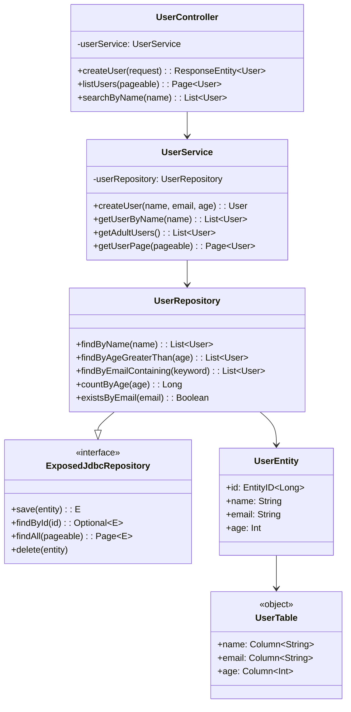
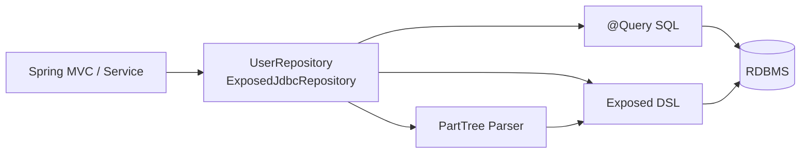

# bluetape4k-spring-boot4-exposed-jdbc

English | [한국어](./README.ko.md)

**Exposed DAO Entity-based Spring Data JDBC Repository (Spring Boot 4.0.x / Spring 7)**

A high-performance Repository implementation for managing Exposed DAO entities using Spring Boot 4 and Spring Data. Supports PartTree method-name queries and Exposed DSL via the `@Query` annotation.

## UML



### Query Processing Flow



## Installation

```gradle
dependencies {
    implementation(platform(Libs.spring_boot4_dependencies))
    implementation("io.github.bluetape4k:bluetape4k-spring-boot4-exposed-jdbc:${version}")
}
```

## Key Features

### 1. ExposedJdbcRepository - Spring Data Standard Interface

```kotlin
@NoRepositoryBean
interface ExposedJdbcRepository<E: Entity<ID>, ID: Any>:
    ListCrudRepository<E, ID>,
    ListPagingAndSortingRepository<E, ID>,
    QueryByExampleExecutor<E>
```

- **ListCrudRepository**: `save`, `findById`, `findAll`, `delete`, `deleteById`, etc.
- **ListPagingAndSortingRepository**: Pagination and sorting support
- **QueryByExampleExecutor**: Query by example
- **Exposed DSL extensions**: `findAll { op }`, `count { op }`, `exists { op }`

### 2. Automatic PartTree Query Generation

Queries are automatically generated from method names:

```kotlin
interface UserRepository : ExposedJdbcRepository<User, Long> {
    // Automatically generated queries
    fun findByName(name: String): List<User>
    fun findByAgeGreaterThan(age: Int): List<User>
    fun findByEmailContaining(keyword: String): List<User>
    fun findByNameAndAge(name: String, age: Int): User?
    fun findByAgeBetween(min: Int, max: Int): List<User>
    fun findByNameOrderByAgeDesc(name: String): List<User>
    fun findTop3ByOrderByAgeDesc(): List<User>
    fun countByAge(age: Int): Long
    fun existsByEmail(email: String): Boolean
    fun deleteByName(name: String): Long
}
```

### 3. @Query Annotation - Write SQL Directly

```kotlin
interface UserRepository : ExposedJdbcRepository<User, Long> {
    @Query("SELECT * FROM users WHERE email = ?1")
    fun findByEmailNative(email: String): List<User>

    @Query("SELECT * FROM users WHERE age = ?2 AND email = ?1")
    fun findByEmailAndAgeNative(email: String, age: Int): List<User>

    @Query("SELECT * FROM users WHERE age BETWEEN ?1 AND ?2")
    fun findByAgeRangeNative(minAge: Int, maxAge: Int): List<User>
}
```

### 4. Auto Configuration

```kotlin
@Configuration
@EnableExposedJdbcRepositories(basePackages = ["com.example.repository"])
class RepositoryConfig
```

Or use Spring Boot auto-configuration:

```kotlin
// application.properties
spring.data.exposed-jdbc.repositories.enabled=true
spring.data.exposed-jdbc.repositories.base-packages=com.example.repository
```

## Usage Examples

### Entity Definition

```kotlin
object Users : LongIdTable("users") {
    val name = varchar("name", 255)
    val email = varchar("email", 255).uniqueIndex()
    val age = integer("age")
}

@ExposedEntity
class User(id: EntityID<Long>) : LongEntity(id) {
    companion object : LongEntityClass<User>(Users)

    var name: String by Users.name
    var email: String by Users.email
    var age: Int by Users.age
}
```

### Repository Definition

```kotlin
interface UserRepository : ExposedJdbcRepository<User, Long> {
    fun findByName(name: String): List<User>
    fun findByAgeGreaterThan(age: Int): List<User>
    fun findByEmailContaining(keyword: String): List<User>
}
```

### Service Usage

```kotlin
@Service
@Transactional
class UserService(
    private val userRepository: UserRepository
) {
    fun createUser(name: String, email: String, age: Int): User {
        return transaction {
            User.new {
                this.name = name
                this.email = email
                this.age = age
            }
        }
    }

    fun getUserByName(name: String): List<User> {
        return userRepository.findByName(name)
    }

    fun getAdultUsers(): List<User> {
        return userRepository.findByAgeGreaterThan(18)
    }

    fun getUserPage(pageable: Pageable): Page<User> {
        return userRepository.findAll(pageable)
    }

    fun getUsersWithDslCondition(): List<User> {
        return userRepository.findAll { Users.age greaterEq 18 }
    }
}
```

### REST Controller Example

```kotlin
@RestController
@RequestMapping("/api/users")
class UserController(
    private val userService: UserService
) {
    @PostMapping
    fun createUser(@RequestBody request: CreateUserRequest): ResponseEntity<User> {
        val user = userService.createUser(request.name, request.email, request.age)
        return ResponseEntity.status(HttpStatus.CREATED).body(user)
    }

    @GetMapping
    fun listUsers(@ParameterObject pageable: Pageable): Page<User> {
        return userService.getUserPage(pageable)
    }

    @GetMapping("/by-name")
    fun searchByName(@RequestParam name: String): List<User> {
        return userService.getUserByName(name)
    }

    @GetMapping("/adults")
    fun getAdults(): List<User> {
        return userService.getAdultUsers()
    }
}
```

## Exposed DSL Extension Methods

Additional methods available in the Repository interface:

```kotlin
val userRepository: UserRepository = TODO()

// Query with DSL condition
val activeUsers = userRepository.findAll { Users.age greaterEq 18 }

// Count with DSL condition
val adultCount = userRepository.count { Users.age greaterEq 18 }

// Check existence with DSL condition
val hasAdults = userRepository.exists { Users.age greaterEq 18 }
```

## Dependencies

- **Spring Boot**: 4.0.x or later
- **Spring Data**: 3.4.x or later
- **Exposed**: 1.0.x or later
- **Kotlin**: 2.0 or later

### Spring Boot 4 BOM

```gradle
dependencies {
    implementation(platform(Libs.spring_boot4_dependencies))
}
```

Note: Use `platform()` instead of the `dependencyManagement` plugin, which has compatibility issues with the Kotlin Gradle Plugin.

## Important Notes

### Transaction Handling

Exposed DAO entities must be created and modified within a `transaction` block:

```kotlin
@Transactional
fun createUser(name: String, email: String): User {
    return transaction {  // Integrates Spring and Exposed transactions
        User.new {
            this.name = name
            this.email = email
        }
    }
}
```

### PartTree Query Limitations

Supported keywords:
- **Comparison**: `GreaterThan`, `LessThan`, `Between`, `In`, `Contains`
- **Sorting**: `OrderBy`
- **Aggregation**: `count`, `exists`
- **Deletion**: `deleteBy`
- **Paging**: `Top`, `First`

Unsupported patterns:
- Complex OR/AND combinations → use `@Query` or DSL methods
- Joins → use Exposed DSL directly

### @Query Placeholders

- `?1`, `?2`, ... : Method parameters by position (1-indexed)
- Repeated placeholders supported: `?1 OR ?1`
- Skipping placeholders not supported: cannot use `?1` and `?3` simultaneously

## Multi-Database Support

Supports H2, PostgreSQL, MySQL, and MariaDB with the same Repository pattern:

```properties
# application.properties (MySQL example)
spring.datasource.url=jdbc:mysql://localhost:3306/mydb
spring.datasource.username=root
spring.datasource.password=password
```

```properties
# application.properties (PostgreSQL example)
spring.datasource.url=jdbc:postgresql://localhost:5432/mydb
```

## Performance Optimization

### Paginated Queries

```kotlin
val page = userRepository.findAll(PageRequest.of(0, 10, Sort.by("age").descending()))
```

### Batch Operations

```kotlin
val users = listOf(
    User(null, "Alice", 30),
    User(null, "Bob", 25)
)
userRepository.saveAll(users)
```

### Direct DSL Usage

For complex conditions, use DSL methods:

```kotlin
val users = userRepository.findAll {
    (Users.age greaterEq 18) and (Users.name like "%A%")
}
```

## Troubleshooting

### "Repository bean not created"

```kotlin
@EnableExposedJdbcRepositories(basePackages = ["com.example.repository"])
class AppConfig
```

Or check auto-configuration:

```properties
# application.properties
spring.data.exposed-jdbc.repositories.enabled=true
spring.data.exposed-jdbc.repositories.base-packages=com.example.repository
```

### "PartTree query parsing error"

Use simpler method names or the `@Query` annotation:

```kotlin
// Instead of a complex method name
@Query("SELECT * FROM users WHERE age > ?1 AND status = ?2")
fun findActiveAdults(age: Int, status: String): List<User>
```

### "LazyInitializationException"

Load all associated data before the transaction ends when building response objects:

```kotlin
@Transactional(readOnly = true)
fun getUser(id: Long): UserDto {
    val user = userRepository.findById(id).get()
    // All lazy loading happens here
    return user.toDto()
}
```

## Related Modules

- **bluetape4k-exposed-jdbc**: Core Exposed JDBC Repository implementation
- **bluetape4k-spring-boot3-exposed-jdbc**: Spring Boot 3.x version
- **bluetape4k-spring-boot4-exposed-r2dbc**: R2DBC coroutine Repository
