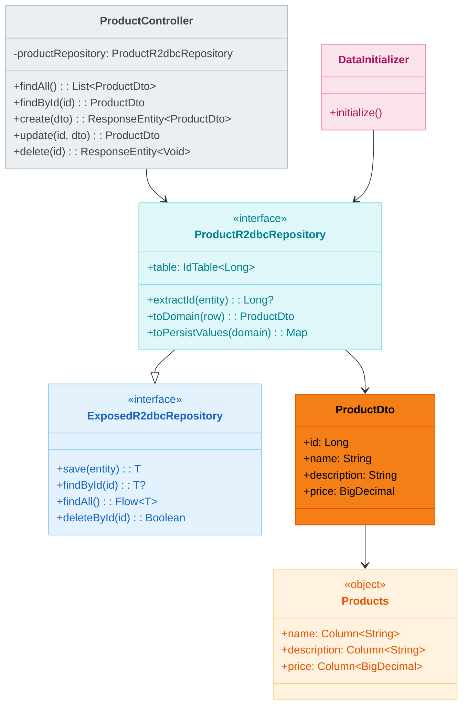
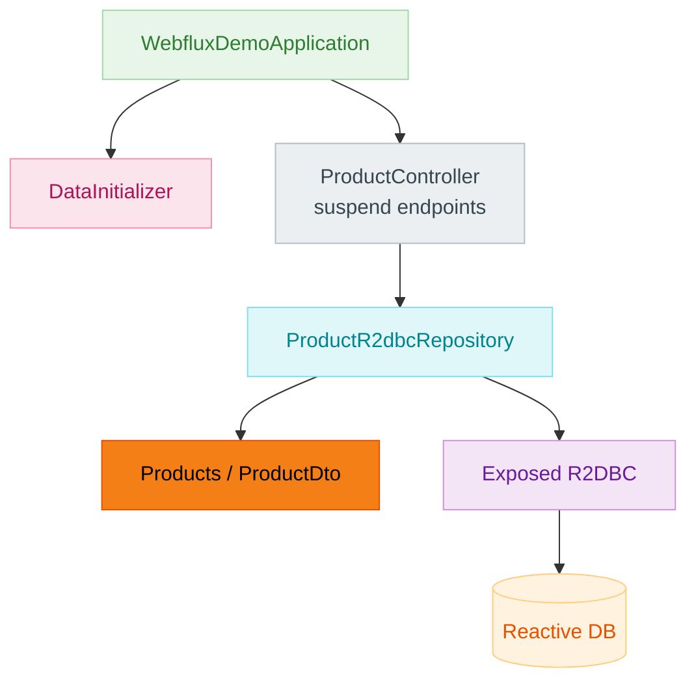

# bluetape4k-spring-boot4-exposed-r2dbc-demo

[English](./README.md) | 한국어

Exposed R2DBC + suspend Repository + Spring WebFlux 통합 데모 (Spring Boot 4.x)

## 개요

이 모듈은 **Exposed R2DBC
**를 Spring Data Repository로 감싸고, Spring WebFlux REST API로 비동기 논블로킹으로 노출하는 패턴을 보여줍니다. Spring Boot 3.x 버전과 동일한 기능을 제공하며, *
*Spring Boot 4 BOM**을 사용합니다.

## UML



### 애플리케이션 구조 흐름



### 주요 특징

- **Exposed R2DBC 기반**: `ProductDto`, `Products` 테이블 정의
- **suspend 함수**: 모든 Repository와 Controller 메서드가 Kotlin 코루틴 `suspend` 함수
- **ExposedR2dbcRepository**: DTO 중심의 매핑 구현
- **Spring WebFlux**: 비동기 논블로킹 REST API
- **코루틴**: `suspendTransaction`으로 R2DBC 데이터베이스 액세스
- **자동 스키마 생성**: 애플리케이션 준비 완료 후 비동기 초기화
- **Spring Boot 4 호환**: Spring Boot 4.0+ 플랫폼 의존성 관리

## 프로젝트 구조

```
src/main/kotlin/io/bluetape4k/examples/exposed/webflux/
├── WebfluxDemoApplication.kt       # Spring Boot 애플리케이션
├── domain/
│   └── ProductEntity.kt            # DTO + Products 테이블
├── repository/
│   └── ProductR2dbcRepository.kt    # suspend CRUD Repository
├── controller/
│   └── ProductController.kt         # 비동기 REST API
└── config/
    ├── ExposedR2dbcConfig.kt        # R2DBC 데이터베이스 설정
    └── DataInitializer.kt           # 비동기 초기 데이터 로더
```

## 도메인 모델

### Products (Exposed R2DBC 테이블)

```kotlin
object Products : LongIdTable("webflux_products") {
    val name = varchar("name", 255)
    val price = decimal("price", 10, 2)
    val stock = integer("stock").default(0)
}
```

### ProductDto (DTO)

```kotlin
data class ProductDto(
    override val id: Long? = null,
    val name: String,
    val price: java.math.BigDecimal,
    val stock: Int = 0,
) : HasIdentifier<Long>
```

`HasIdentifier<Long>` 인터페이스를 구현하여 Repository에서 ID 추출이 가능합니다.

## Repository

### ExposedR2dbcRepository 구현

```kotlin
interface ProductR2dbcRepository: ExposedR2dbcRepository<ProductDto, Long> {
    override val table: IdTable<Long> get() = Products

    override fun extractId(entity: ProductDto): Long? = entity.id

    override fun toDomain(row: ResultRow): ProductDto =
        ProductDto(
            id = row[Products.id].value,
            name = row[Products.name],
            price = row[Products.price],
            stock = row[Products.stock],
        )

    override fun toPersistValues(domain: ProductDto): Map<Column<*>, Any?> =
        mapOf(
            Products.name to domain.name,
            Products.price to domain.price,
            Products.stock to domain.stock,
        )
}
```

모든 Repository 메서드는 `suspend` 함수입니다:

```kotlin
suspend fun findAll(): List<ProductDto>
suspend fun findByIdOrNull(id: Long): ProductDto?
suspend fun save(entity: ProductDto): ProductDto
suspend fun deleteById(id: Long)
```

## REST API

### 기본 CRUD

| 메서드    | 경로               | 설명             |
|--------|------------------|----------------|
| GET    | `/products`      | 모든 상품 조회 (비동기) |
| GET    | `/products/{id}` | 특정 상품 조회 (비동기) |
| POST   | `/products`      | 상품 생성 (비동기)    |
| PUT    | `/products/{id}` | 상품 수정 (비동기)    |
| DELETE | `/products/{id}` | 상품 삭제 (비동기)    |

모든 엔드포인트는 `suspend` 함수이며, Spring WebFlux가 자동으로 코루틴을 처리합니다.

### 요청/응답 예시

**모든 상품 조회 (비동기)**

```bash
curl http://localhost:8080/products
```

응답:

```json
[
  {
    "id": 1,
    "name": "Kotlin Coroutines Book",
    "price": 39.99,
    "stock": 100
  },
  {
    "id": 2,
    "name": "Spring WebFlux Guide",
    "price": 49.99,
    "stock": 50
  }
]
```

**상품 생성 (비동기)**

```bash
curl -X POST http://localhost:8080/products \
  -H "Content-Type: application/json" \
  -d '{
    "name": "Reactive Programming",
    "price": 29.99,
    "stock": 200
  }'
```

응답 (201 Created):

```json
{
  "id": 3,
  "name": "Reactive Programming",
  "price": 29.99,
  "stock": 200
}
```

**상품 수정 (비동기)**

```bash
curl -X PUT http://localhost:8080/products/1 \
  -H "Content-Type: application/json" \
  -d '{
    "name": "Advanced Kotlin Coroutines",
    "price": 49.99,
    "stock": 150
  }'
```

**상품 삭제 (비동기)**

```bash
curl -X DELETE http://localhost:8080/products/1
```

## 실행 방법

### 필수 사항

- Java 21+
- Gradle 8.x+
- Spring Boot 4.0+

### 빌드

```bash
./gradlew :spring-boot4:exposed-r2dbc-demo:build
```

### 애플리케이션 실행

```bash
./gradlew :spring-boot4:exposed-r2dbc-demo:bootRun
```

또는 JAR로 실행:

```bash
./gradlew :spring-boot4:exposed-r2dbc-demo:assemble
java -jar spring-boot4/exposed-r2dbc-demo/build/libs/exposed-r2dbc-spring-data-webflux-demo-*.jar
```

### 기본 포트

애플리케이션은 기본 포트 `8080`에서 시작됩니다.

### 초기 데이터

애플리케이션이 준비 완료(`ApplicationReadyEvent`)한 후 비동기로 다음 3개의 샘플 상품이 생성됩니다.

```
1. Kotlin Coroutines Book - $39.99 (100개 재고)
2. Spring WebFlux Guide - $49.99 (50개 재고)
3. Reactive Programming - $29.99 (200개 재고)
```

## 데이터베이스

기본적으로 **H2 R2DBC 인메모리 데이터베이스**를 사용합니다. `application.yml`에서 변경할 수 있습니다.

### application.yml

```yaml
spring:
  datasource:
    url: jdbc:h2:mem:webfluxdb;DB_CLOSE_DELAY=-1;DB_CLOSE_ON_EXIT=FALSE
    driver-class-name: org.h2.Driver
  r2dbc:
    url: r2dbc:h2:mem:///webfluxdb;DB_CLOSE_DELAY=-1;DB_CLOSE_ON_EXIT=FALSE;MODE=LEGACY
    username: sa
    password:
```

### PostgreSQL로 변경

```yaml
spring:
  r2dbc:
    url: r2dbc:postgresql://localhost:5432/exposed_demo
    username: postgres
    password: password
  datasource:
    url: jdbc:postgresql://localhost:5432/exposed_demo
    driver-class-name: org.postgresql.Driver
    username: postgres
    password: password
```

그리고 `build.gradle.kts`에서:

```kotlin
implementation("org.postgresql:r2dbc-postgresql")
runtimeOnly("org.postgresql:postgresql")
```

## 테스트

### 단위 테스트 실행

```bash
./gradlew :spring-boot4:exposed-r2dbc-demo:test
```

### 코루틴 테스트

모든 테스트는 `runTest { ... }` 블록 내에서 실행되어 코루틴을 지원합니다.

```bash
./gradlew :spring-boot4:exposed-r2dbc-demo:test --tests "ProductControllerTest"
```

## 핵심 패턴

### suspend 함수 기반

모든 Repository와 Controller 메서드는 `suspend` 함수입니다.

```kotlin
@GetMapping("/{id}")
suspend fun findById(@PathVariable id: Long): ProductDto =
    productRepository.findByIdOrNull(id)
        ?: throw ResponseStatusException(HttpStatus.NOT_FOUND, "Product not found: $id")
```

Spring WebFlux가 자동으로 코루틴을 처리합니다.

### suspendTransaction

R2DBC 데이터베이스 액세스는 `suspendTransaction`으로 감싸집니다.

```kotlin
@PutMapping("/{id}")
suspend fun update(@PathVariable id: Long, @RequestBody dto: ProductDto): ProductDto =
    suspendTransaction {
        val existing = productRepository.findByIdOrNull(id)
            ?: throw ResponseStatusException(HttpStatus.NOT_FOUND, "Product not found: $id")
        productRepository.save(dto.copy(id = existing.id ?: id))
    }
```

### 비동기 초기화

데이터 초기화는 `ApplicationReadyEvent`에서 별도 코루틴으로 실행되어 시작 스레드를 막지 않습니다.

```kotlin
@Component
class DataInitializer(private val r2dbcDatabase: R2dbcDatabase) {
    private val scope = CoroutineScope(SupervisorJob() + Dispatchers.IO)

    @EventListener(ApplicationReadyEvent::class)
    fun onApplicationReady(event: ApplicationReadyEvent) {
        scope.launch {
            initializeData()
        }
    }
}
```

## DTO 매핑

Repository 메서드는 DTO 중심이므로 Row -> DTO 변환을 구현해야 합니다.

```kotlin
override fun toDomain(row: ResultRow): ProductDto =
    ProductDto(
        id = row[Products.id].value,
        name = row[Products.name],
        price = row[Products.price],
        stock = row[Products.stock],
    )

override fun toPersistValues(domain: ProductDto): Map<Column<*>, Any?> =
    mapOf(
        Products.name to domain.name,
        Products.price to domain.price,
        Products.stock to domain.stock,
    )
```

## Spring Boot 4 마이그레이션

Spring Boot 3.x에서 4.x로 마이그레이션하는 경우:

### BOM 변경

`build.gradle.kts`:

```kotlin
dependencies {
    // Spring Boot 4 BOM 사용
    implementation(platform(Libs.spring_boot4_dependencies))

    // 나머지 의존성은 동일
    implementation(project(":bluetape4k-spring-boot4-exposed-r2dbc"))
    implementation(Libs.springBootStarter("webflux"))
}
```

### 의존성 차이

Spring Boot 4는 기본적으로 다음 버전을 제공합니다:

- Spring Framework 6.2+
- Spring WebFlux 6.2+
- Spring Boot 4.0+
- Java 21+

## 주의사항

1. **runBlocking 금지**: suspend 함수에서 `runBlocking`을 사용하면 안 됩니다. Spring WebFlux가 자동으로 처리합니다.

2. **R2DBC 드라이버**: 선택한 데이터베이스의 R2DBC 드라이버가 클래스패스에 있어야 합니다.

3. **suspendTransaction 필수**: 트랜잭션이 필요한 경우 `suspendTransaction`을 사용합니다.

4. **Spring Boot 4 플랫폼**: `dependencyManagement { imports }` 대신 `implementation(platform(...))` 사용합니다.

## 의존성

```kotlin
dependencies {
    implementation(platform(Libs.spring_boot4_dependencies))
    implementation(project(":bluetape4k-spring-boot4-exposed-r2dbc"))
    implementation(Libs.springBootStarter("webflux"))
    implementation(Libs.exposed_spring_boot_starter)
    implementation(Libs.exposed_r2dbc)
    runtimeOnly(Libs.h2_r2dbc)

    testImplementation(Libs.springBootStarter("test"))
}
```

## 참고 자료

- [Exposed R2DBC 문서](https://github.com/JetBrains/Exposed)
- [Spring Boot 4 마이그레이션 가이드](https://spring.io/blog/2023/09/06/spring-boot-4-0-m1-released)
- [Spring WebFlux 가이드](https://spring.io/projects/spring-webflux)
- [Kotlin 코루틴 공식 문서](https://kotlinlang.org/docs/coroutines-overview.html)
- [R2DBC 사양](https://r2dbc.io/)
