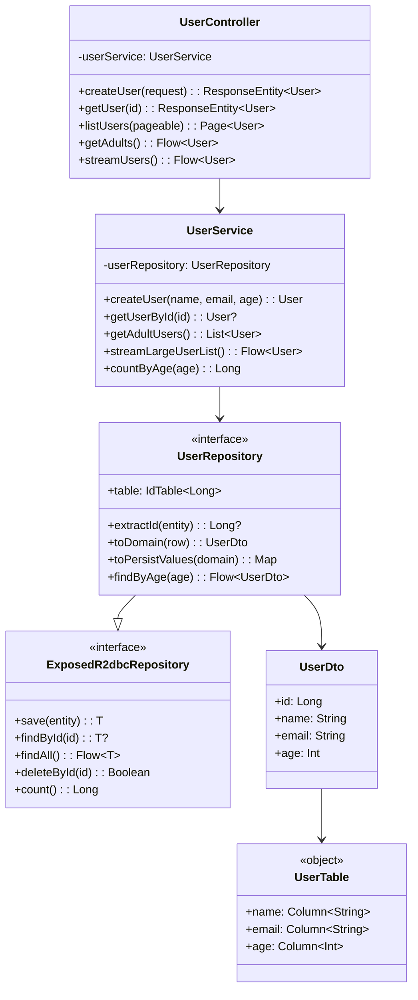
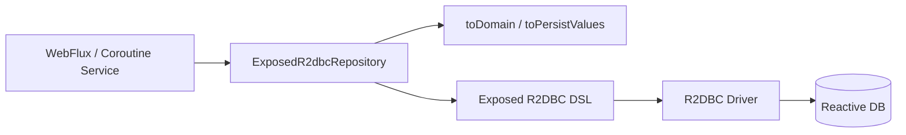

# bluetape4k-spring-boot4-exposed-r2dbc

**Exposed R2DBC DSL 기반 코루틴 Spring Data Repository (Spring Boot 4.0.x / Spring 7)**

Spring Boot 4와 Spring Data Reactive를 활용하여 Exposed R2DBC를 완전한 suspend 기반 코루틴 Repository로 제공합니다. 논블로킹 I/O와 백프레셔 지원으로 고성능 non-blocking 애플리케이션을 구축합니다.

## UML



### 비동기 처리 흐름



## 설치

```gradle
dependencies {
    implementation(platform(Libs.spring_boot4_dependencies))
    implementation("io.github.bluetape4k:bluetape4k-spring-boot4-exposed-r2dbc:${version}")

    // 코루틴 지원 (필수)
    implementation("org.jetbrains.kotlinx:kotlinx-coroutines-reactor:${version}")
}
```

## 주요 기능

### 1. ExposedR2dbcRepository - Spring Data Coroutine 표준

```kotlin
@NoRepositoryBean
interface ExposedR2dbcRepository<R : Any, ID : Any> : CoroutineCrudRepository<R, ID>
```

- **CoroutineCrudRepository**: suspend 기반 표준 CRUD 작업
- **Flow 지원**: 대용량 데이터 스트리밍 (백프레셔 포함)
- **페이징**: suspend 기반 페이징 조회
- **Exposed DSL 통합**: R2DBC 조건 쿼리

### 2. 도메인 객체 매핑

Row-to-Domain 변환을 인터페이스에서 정의:

```kotlin
interface UserRepository : ExposedR2dbcRepository<User, Long> {
    override val table: IdTable<Long> get() = Users

    override fun extractId(entity: User): Long? = entity.id

    override fun toDomain(row: ResultRow): User =
        User(
            id = row[Users.id].value,
            name = row[Users.name],
            email = row[Users.email],
            age = row[Users.age],
        )

    override fun toPersistValues(domain: User): Map<Column<*>, Any?> =
        mapOf(
            Users.name to domain.name,
            Users.email to domain.email,
            Users.age to domain.age,
        )
}
```

### 3. Suspend 기반 CRUD

```kotlin
interface UserRepository : ExposedR2dbcRepository<User, Long> {
    // 자동 구현됨
}

// 사용
suspend fun getUser(id: Long): User? {
    return userRepository.findByIdOrNull(id)
}

suspend fun saveUser(user: User): User {
    return userRepository.save(user)
}
```

### 4. Flow 스트리밍

대용량 데이터를 백프레셔와 함께 처리:

```kotlin
suspend fun processAllUsers() {
    userRepository.findAll()
        .collect { user ->
            println("Processing: $user")
        }
}

// 조건부 스트리밍
userRepository.findAll { Users.age greaterEq 18 }
    .collect { adult ->
        // 처리...
    }

// row-by-row 스트리밍 (메모리 효율적)
userRepository.streamAll()
    .collect { user ->
        // 처리...
    }
```

### 5. 페이징 조회

```kotlin
suspend fun getUsersPage(pageNo: Int, pageSize: Int): Page<User> {
    return userRepository.findAll(PageRequest.of(pageNo, pageSize))
}

suspend fun getUsersSorted(): Page<User> {
    return userRepository.findAll(
        PageRequest.of(0, 20, Sort.by("age").descending())
    )
}
```

### 6. Exposed DSL 조건

복잡한 조건은 DSL로 표현:

```kotlin
val adults = userRepository.findAll { Users.age greaterEq 18 }.toList()

val emailContains = userRepository.findAll {
    (Users.email like "%@example.com") and (Users.age greaterEq 20)
}.toList()

val count = userRepository.count { Users.age greaterEq 18 }

val exists = userRepository.exists { Users.email eq "alice@example.com" }
```

## 사용 예시

### 엔티티 및 테이블 정의

```kotlin
object Users : LongIdTable("users") {
    val name = varchar("name", 255)
    val email = varchar("email", 255)
    val age = integer("age")
}

data class User(
    override val id: Long? = null,
    val name: String,
    val email: String,
    val age: Int,
) : HasIdentifier<Long>
```

### Repository 구현

```kotlin
interface UserRepository : ExposedR2dbcRepository<User, Long> {
    override val table: IdTable<Long> get() = Users

    override fun extractId(entity: User): Long? = entity.id

    override fun toDomain(row: ResultRow): User =
        User(
            id = row[Users.id].value,
            name = row[Users.name],
            email = row[Users.email],
            age = row[Users.age],
        )

    override fun toPersistValues(domain: User): Map<Column<*>, Any?> =
        mapOf(
            Users.name to domain.name,
            Users.email to domain.email,
            Users.age to domain.age,
        )
}
```

### Service 사용

```kotlin
@Service
class UserService(
    private val userRepository: UserRepository
) {
    suspend fun createUser(name: String, email: String, age: Int): User {
        return userRepository.save(User(name = name, email = email, age = age))
    }

    suspend fun getUserById(id: Long): User? {
        return userRepository.findByIdOrNull(id)
    }

    suspend fun getAdultUsers(): List<User> {
        return userRepository.findAll { Users.age greaterEq 18 }.toList()
    }

    suspend fun getUsersPage(pageable: Pageable): Page<User> {
        return userRepository.findAll(pageable)
    }

    suspend fun streamLargeUserList(): Flow<User> {
        return userRepository.streamAll()
    }

    suspend fun countByAge(age: Int): Long {
        return userRepository.count { Users.age eq age }
    }
}
```

### REST Controller (WebFlux)

```kotlin
@RestController
@RequestMapping("/api/users")
class UserController(
    private val userService: UserService
) {
    @PostMapping
    suspend fun createUser(@RequestBody request: CreateUserRequest): ResponseEntity<User> {
        val user = userService.createUser(request.name, request.email, request.age)
        return ResponseEntity.status(HttpStatus.CREATED).body(user)
    }

    @GetMapping("/{id}")
    suspend fun getUser(@PathVariable id: Long): ResponseEntity<User> {
        return userService.getUserById(id)
            ?.let { ResponseEntity.ok(it) }
            ?: ResponseEntity.notFound().build()
    }

    @GetMapping
    suspend fun listUsers(@ParameterObject pageable: Pageable): Page<User> {
        return userService.getUsersPage(pageable)
    }

    @GetMapping("/adults")
    fun getAdults(): Flow<User> = flow {
        userService.getAdultUsers().forEach { emit(it) }
    }

    @GetMapping("/stream")
    fun streamUsers(): Flow<User> {
        return userService.streamLargeUserList()
    }

    @GetMapping("/count")
    suspend fun countAdults(): ResponseEntity<Long> {
        val count = userService.countByAge(18)
        return ResponseEntity.ok(count)
    }

    @DeleteMapping("/{id}")
    suspend fun deleteUser(@PathVariable id: Long): ResponseEntity<Void> {
        userService.deleteUser(id)
        return ResponseEntity.noContent().build()
    }
}
```

## 핵심 메서드

### CRUD 작업

```kotlin
// 저장
suspend fun save(entity: User): User

// 조회
suspend fun findByIdOrNull(id: Long): User?

// 모두 조회
suspend fun findAllAsList(): List<User>  // 메모리 로드

// 스트림 조회 (백프레셔)
fun findAll(): Flow<User>

// 존재 확인
suspend fun existsById(id: Long): Boolean

// 삭제
suspend fun deleteById(id: Long)

// 개수
suspend fun count(): Long
```

### 페이징 및 정렬

```kotlin
suspend fun findAll(pageable: Pageable): Page<User>

// 예제
val pageable = PageRequest.of(
    0,  // 페이지 번호
    20, // 페이지 크기
    Sort.by("age").descending()
)
```

### Flow 및 스트리밍

```kotlin
// 일괄 로드 후 Flow 반환
fun findAll(): Flow<User>

// row-by-row 스트리밍 (메모리 효율적)
fun streamAll(database: R2dbcDatabase? = null): Flow<User>

// 조건부 스트리밍
fun findAll(op: () -> Op<Boolean>): Flow<User>
```

### 대량 작업

```kotlin
// 여러 엔티티 저장
suspend fun saveAll(entities: Iterable<User>): Flow<User>

// Flow로 저장 (백프레셔)
suspend fun saveAll(entityStream: Flow<User>): Flow<User>

// 여러 개 삭제
suspend fun deleteAllById(ids: Iterable<Long>)
```

## 테스트 작성

### Unit 테스트

```kotlin
@SpringBootTest
class UserRepositoryTest {
    @Autowired
    private lateinit var userRepository: UserRepository

    @Autowired
    private lateinit var r2dbcDatabase: R2dbcDatabase

    @Test
    fun `save and findById`() = runTest {
        val user = User(name = "Alice", email = "alice@example.com", age = 30)
        val saved = userRepository.save(user)

        val found = userRepository.findByIdOrNull(saved.id!!)
        assertThat(found).isNotNull()
        assertThat(found?.name).isEqualTo("Alice")
    }

    @Test
    fun `findAll returns users`() = runTest {
        // 테스트 데이터 준비
        suspendTransaction(r2dbcDatabase) {
            Users.deleteAll()
        }

        userRepository.save(User(name = "Alice", email = "alice@example.com", age = 30))
        userRepository.save(User(name = "Bob", email = "bob@example.com", age = 25))

        val users = userRepository.findAllAsList()
        assertThat(users).hasSize(2)
    }

    @Test
    fun `streamAll processes large dataset`() = runTest {
        val count = AtomicInteger(0)

        userRepository.streamAll()
            .collect { user ->
                count.incrementAndGet()
            }

        assertThat(count.get()).isGreaterThan(0)
    }
}
```

## 의존성

- **Spring Boot**: 4.0.x 이상
- **Spring Data Reactive**: 3.4.x 이상
- **Exposed**: 1.0.x 이상 (R2DBC 지원)
- **Kotlin**: 2.0 이상
- **Coroutines**: 1.8.x 이상
- **R2DBC Driver**: H2, PostgreSQL, MySQL, MariaDB 등

### 데이터베이스별 드라이버

```gradle
dependencies {
    // H2
    implementation("io.r2dbc:r2dbc-h2:${r2dbcH2Version}")

    // PostgreSQL
    implementation("io.r2dbc:r2dbc-postgresql:${r2dbcPostgresqlVersion}")

    // MySQL
    implementation("io.r2dbc:r2dbc-mysql:${r2dbcMysqlVersion}")

    // MariaDB
    implementation("io.r2dbc:r2dbc-mariadb:${r2dbcMariadbVersion}")
}
```

## 설정

### Spring Boot 자동 구성

```properties
# application.properties (H2 예시)
spring.r2dbc.url=r2dbc:h2:mem:///test
spring.r2dbc.username=sa
spring.r2dbc.password=
```

```properties
# application.properties (PostgreSQL 예시)
spring.r2dbc.url=r2dbc:postgresql://localhost:5432/mydb
spring.r2dbc.username=postgres
spring.r2dbc.password=password
```

### 명시적 구성

```kotlin
@Configuration
@EnableExposedR2dbcRepositories(basePackages = ["com.example.repository"])
class RepositoryConfig {
    // 자동 구성 처리
}
```

## 주의사항

### Suspend 함수 사용

Repository의 모든 조회/저장/삭제 메서드는 suspend 함수입니다:

```kotlin
// 반드시 코루틴 컨텍스트에서 호출
suspend fun getUser(id: Long) = userRepository.findByIdOrNull(id)

// Controller에서
@GetMapping("/{id}")
suspend fun get(@PathVariable id: Long): User? = getUser(id)
```

### Flow 소비 방식

`findAll()`과 `streamAll()`의 차이:

```kotlin
// findAll: 결과를 모두 메모리로 로드한 후 Flow 반환
userRepository.findAll().toList()  // 메모리 사용량 증가

// streamAll: row-by-row 스트리밍, 백프레셔 지원
userRepository.streamAll()  // 메모리 효율적
    .collect { user -> /* 처리 */ }
```

### toDomain과 toPersistValues 구현 필수

Repository 인터페이스를 구현할 때 반드시 정의:

```kotlin
interface UserRepository : ExposedR2dbcRepository<User, Long> {
    // 필수: row 변환
    override fun toDomain(row: ResultRow): User

    // 필수: 저장 값 정의
    override fun toPersistValues(domain: User): Map<Column<*>, Any?>
}
```

### ID 컬럼 제외

`toPersistValues`에서 ID 컬럼은 반드시 제외:

```kotlin
override fun toPersistValues(domain: User): Map<Column<*>, Any?> =
    mapOf(
        Users.name to domain.name,
        Users.email to domain.email,
        // Users.id는 제외 (자동 생성)
    )
```

### Transaction 범위

R2DBC 기반 대체로 suspend 함수 내부에서 자동으로 처리됩니다. 복잡한 작업은 `suspendTransaction` 사용:

```kotlin
suspend fun complexOperation() {
    suspendTransaction(r2dbcDatabase) {
        userRepository.save(user1)
        userRepository.save(user2)
        // 트랜잭션 내 모두 성공 또는 모두 실패
    }
}
```

## 성능 최적화

### 대용량 스트리밍

```kotlin
userRepository.streamAll()
    .buffer(256)  // 버퍼 크기 조정
    .collect { user ->
        // 백프레셔 제어
    }
```

### 배치 삽입

```kotlin
userRepository.saveAll(
    listOf(
        User(name = "Alice", email = "alice@example.com", age = 30),
        User(name = "Bob", email = "bob@example.com", age = 25)
    )
).toList()
```

### 조건부 스트리밍

복잡한 조건은 DSL 사용:

```kotlin
userRepository.findAll {
    (Users.age greaterEq 18) and (Users.email like "%example.com")
}.toList()
```

## 문제 해결

### "suspend 함수를 블로킹 컨텍스트에서 호출 불가"

WebFlux 또는 코루틴 컨텍스트 필요:

```kotlin
// 잘못된 사용
fun getUser(id: Long) {
    val user = userRepository.findByIdOrNull(id)  // 컴파일 에러
}

// 올바른 사용
suspend fun getUser(id: Long) {
    val user = userRepository.findByIdOrNull(id)  // OK
}

// 또는
@GetMapping
suspend fun getUser(): User? = userRepository.findByIdOrNull(1)
```

### "Flow를 toList() 없이 사용"

Response로 Stream 반환:

```kotlin
@GetMapping("/stream")
fun getUsers(): Flow<User> = userRepository.findAll()
```

또는 명시적으로 리스트 변환:

```kotlin
@GetMapping
suspend fun getUsers(): List<User> =
    userRepository.findAll().toList()
```

## 관련 모듈

- **bluetape4k-exposed-r2dbc**: 핵심 Exposed R2DBC Repository 구현
- **bluetape4k-spring-boot3-exposed-r2dbc**: Spring Boot 3.x 버전
- **bluetape4k-spring-boot4-exposed-jdbc**: JDBC 기반 Repository
- **bluetape4k-coroutines**: 코루틴 유틸리티
