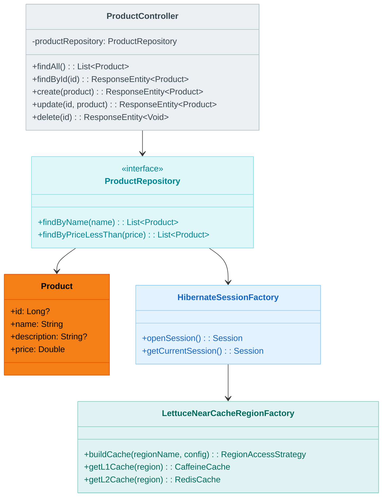
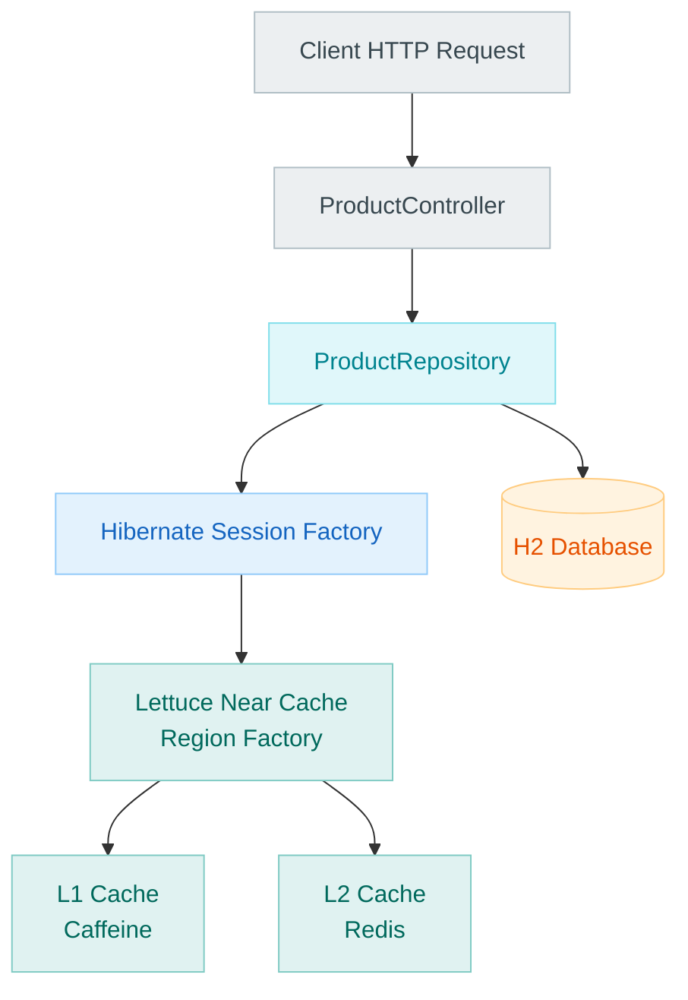

# bluetape4k-spring-boot4-hibernate-lettuce-demo

English | [한국어](./README.ko.md)

Spring Boot 4 + Hibernate 7 **2nd Level Cache (2LC)** with **Lettuce Near Cache** demo application.

An example of enabling Hibernate 2nd Level Cache with zero additional code using the auto-configuration from the
`bluetape4k-spring-boot4-hibernate-lettuce` module.

## UML Diagram



## Architecture

```
Client HTTP Request
       ↓
ProductController (REST API)
       ↓
ProductRepository (Spring Data JPA)
       ↓
Hibernate Session Factory
       ↓
┌─────────────────────────────────────────────┐
│ Lettuce Near Cache Region Factory           │
├─────────────────────────────────────────────┤
│ L1 Cache (Caffeine)                         │
│ ├─ maxSize: 10,000 items                    │
│ ├─ expireAfterWrite: 30m                    │
│ └─ localStats() ← Metrics/Actuator          │
├─────────────────────────────────────────────┤
│ L2 Cache (Redis)                            │
│ ├─ TTL: 120s (default)                      │
│ ├─ RESP3 CLIENT TRACKING                    │
│ ├─ Codec: LZ4+Fory                          │
│ └─ Per-region TTL configuration             │
└─────────────────────────────────────────────┘
       ↓
H2 Database
```



## Domain Model

### Product Entity

```kotlin
@Entity
@Table(name = "products")
@Cacheable
@Cache(usage = CacheConcurrencyStrategy.NONSTRICT_READ_WRITE, region = "product")
data class Product(
    @Id
    @GeneratedValue(strategy = GenerationType.IDENTITY)
    val id: Long? = null,

    @Column(nullable = false)
    val name: String,

    @Column
    val description: String? = null,

    @Column(nullable = false)
    val price: Double = 0.0,
)
```

- `@Cacheable`: Enables JPA 2nd Level Cache
- `@Cache(NONSTRICT_READ_WRITE)`: Optimistic lock-based update strategy
- `region = "product"`: Redis key prefix (`product::*`)

## REST API

### Product API (`/api/products`)

| Method   | Path                 | Description       | Cache Behavior       |
|----------|----------------------|-------------------|----------------------|
| `GET`    | `/api/products`      | List all products | Cache not applied    |
| `GET`    | `/api/products/{id}` | Get product by ID | L1/L2 Hit/Miss       |
| `POST`   | `/api/products`      | Create a product  | Stored in L1 + L2    |
| `PUT`    | `/api/products/{id}` | Update a product  | L1 + L2 updated      |
| `DELETE` | `/api/products/{id}` | Delete a product  | Removed from L1 + L2 |

#### Example: Get product (cache in action)

```bash
# First request: fetched from DB (L1 Miss, L2 Miss)
curl http://localhost:8080/api/products/1

# Response (200 OK)
{
  "id": 1,
  "name": "Laptop",
  "description": "High-performance laptop",
  "price": 999.99
}

# Second request: served from L1 cache immediately (L1 Hit)
curl http://localhost:8080/api/products/1
```

#### Example: Create a product

```bash
curl -X POST http://localhost:8080/api/products \
  -H "Content-Type: application/json" \
  -d '{
    "name": "Mouse",
    "description": "Wireless mouse",
    "price": 29.99
  }'

# Response (200 OK) - automatically stored in L1 + L2 cache
{
  "id": 2,
  "name": "Mouse",
  "description": "Wireless mouse",
  "price": 29.99
}
```

#### Example: Update a product (cache refresh)

```bash
curl -X PUT http://localhost:8080/api/products/1 \
  -H "Content-Type: application/json" \
  -d '{
    "name": "Gaming Laptop",
    "description": "Ultra-fast gaming laptop",
    "price": 1299.99,
    "id": 1
  }'

# Response (200 OK) - both L1 + L2 caches are updated
{
  "id": 1,
  "name": "Gaming Laptop",
  "description": "Ultra-fast gaming laptop",
  "price": 1299.99
}
```

#### Example: Delete a product (cache eviction)

```bash
curl -X DELETE http://localhost:8080/api/products/1

# Response (204 No Content) - removed from both L1 + L2 caches
```

### Cache Management API (`/api/cache`)

| Method   | Path                        | Description                          | Action                                |
|----------|-----------------------------|--------------------------------------|---------------------------------------|
| `GET`    | `/api/cache/stats`          | Per-region cache statistics          | Retrieve L1 size, hit/miss counts     |
| `DELETE` | `/api/cache/evict`          | Evict all region L1 caches           | L1 only (L2 unaffected)               |
| `DELETE` | `/api/cache/evict/{region}` | Evict L1 cache for a specific region | That region's L1 only (L2 unaffected) |

#### Example: Retrieve cache statistics

```bash
curl http://localhost:8080/api/cache/stats

# Response (200 OK)
{
  "product": {
    "regionName": "product",
    "localSize": 15,
    "localHitCount": 245,
    "localMissCount": 18,
    "localHitRate": 0.931
  }
}
```

#### Example: Evict L1 cache for a specific region

```bash
# Evict only L1 (Caffeine) cache; Redis L2 is unaffected
curl -X DELETE http://localhost:8080/api/cache/evict/product

# Response (204 No Content)
```

#### Example: Evict all L1 caches

```bash
curl -X DELETE http://localhost:8080/api/cache/evict

# Response (204 No Content)
```

> **Note**: These endpoints only evict the L1 (Caffeine) cache. Redis L2 is not affected.

### Actuator Endpoint

The `/actuator/nearcache` endpoint provided by Spring Boot Actuator.

#### All Region Statistics

```bash
curl http://localhost:8080/actuator/nearcache

# Response (200 OK)
{
  "product": {
    "regionName": "product",
    "localSize": 42,
    "localHitRate": 0.977,
    "localHitCount": 1830,
    "localMissCount": 42,
    "localEvictionCount": 5,
    "l2HitCount": 1750,
    "l2MissCount": 80,
    "l2PutCount": 120
  }
}
```

#### Specific Region Details

```bash
curl http://localhost:8080/actuator/nearcache/product

# Response (200 OK)
{
  "regionName": "product",
  "localSize": 42,
  "localHitRate": 0.977,
  "localHitCount": 1830,
  "localMissCount": 42,
  "localEvictionCount": 5,
  "l2HitCount": 1750,
  "l2MissCount": 80,
  "l2PutCount": 120
}
```

## Application Configuration

### application.yml

```yaml
spring:
  application:
    name: hibernat-lettuce-demo

  datasource:
    url: jdbc:h2:mem:demo;DB_CLOSE_DELAY=-1;MODE=MySQL
    driver-class-name: org.h2.Driver
    username: sa
    password:

  jpa:
    database-platform: org.hibernate.dialect.H2Dialect
    hibernate:
      ddl-auto: create-drop
    show-sql: false
    properties:
      hibernate:
        cache:
          use_second_level_cache: true

bluetape4k:
  cache:
    lettuce-near:
      redis-uri: redis://localhost:6379
      codec: lz4fory                            # LZ4 compression + Fory serialization
      use-resp3: true                           # RESP3 + CLIENT TRACKING
      local:
        max-size: 10000
        expire-after-write: 30m
      redis-ttl:
        default: 120s
        regions:
          product: 300s                         # product region TTL: 5 minutes
      metrics:
        enabled: true
        enable-caffeine-stats: true

management:
  endpoints:
    web:
      exposure:
        include: health, info, metrics, actuator, nearcache
  endpoint:
    health:
      show-details: always
```

## Running Tests

### Unit Tests

```bash
./gradlew :bluetape4k-spring-boot4-hibernate-lettuce-demo:test
```

Tests automatically manage Redis using Testcontainers.

### Test Examples

```kotlin
@SpringBootTest
class DemoApplicationTest {

    @Autowired
    private lateinit var productRepository: ProductRepository

    @Autowired
    private lateinit var entityManagerFactory: EntityManagerFactory

    @BeforeEach
    fun setUp() {
        val sessionFactory = entityManagerFactory.unwrap(SessionFactoryImplementor::class.java)
        sessionFactory.statistics.clear()
    }

    @Test
    fun `product retrieval uses 2LC cache`() {
        // Given
        val product = Product(name = "Laptop", price = 999.99)
        val saved = productRepository.save(product)

        // When (first retrieval)
        val result1 = productRepository.findById(saved.id!!).get()

        // Then (fetched from DB)
        assertThat(result1.name).isEqualTo("Laptop")

        // When (second retrieval)
        val result2 = productRepository.findById(saved.id).get()

        // Then (served from L1 cache — no DB query)
        assertThat(result2.name).isEqualTo("Laptop")
    }
}
```

## Test Coverage

- `ProductControllerTest`: REST API endpoint tests
- `CacheControllerTest`: Cache management API tests
- `CachingIntegrationTest`: 2LC + Lettuce Near Cache integration tests
- `LettuceNearCacheStatsTest`: Actuator endpoint tests

## Dependencies (Spring Boot 4)

```kotlin
// build.gradle.kts
dependencies {
    // Spring Boot 4 BOM
    implementation(platform(Libs.spring_boot4_dependencies))

    implementation(project(":bluetape4k-spring-boot4-hibernate-lettuce"))
    implementation(Libs.springBootStarter("web"))
    implementation(Libs.springBootStarter("data-jpa"))
    implementation(Libs.springBootStarter("actuator"))
    runtimeOnly(Libs.h2_database)

    // Hibernate (explicit declaration)
    compileOnly(Libs.springBoot("hibernate"))

    testImplementation(Libs.springBootStarter("test"))
    testImplementation(Libs.testcontainers)
    testImplementation(Libs.testcontainers_junit5)
}
```

## Spring Boot 4-Specific Notes

- **BOM**: `implementation(platform(Libs.spring_boot4_dependencies))` required
- **Hibernate**: `compileOnly(Libs.springBoot("hibernate"))` must be added
- **Package name**: `org.springframework.boot.hibernate.autoconfigure.HibernatePropertiesCustomizer`

## Package Information

- **Group**: `io.github.bluetape4k`
- **Artifact**: `bluetape4k-spring-boot4-hibernate-lettuce-demo`
- **Package**: `io.bluetape4k.examples.cache.lettuce`

## Related Modules

- [`bluetape4k-spring-boot4-hibernate-lettuce`](../hibernate-lettuce/README.md) — Auto-Configuration module
- [`bluetape4k-hibernate-cache-lettuce`](../../infra/hibernate-cache-lettuce/README.md) — Hibernate Region Factory
- [`bluetape4k-cache-lettuce`](../../infra/cache-lettuce/README.md) — Near Cache core

## License

Apache License 2.0
