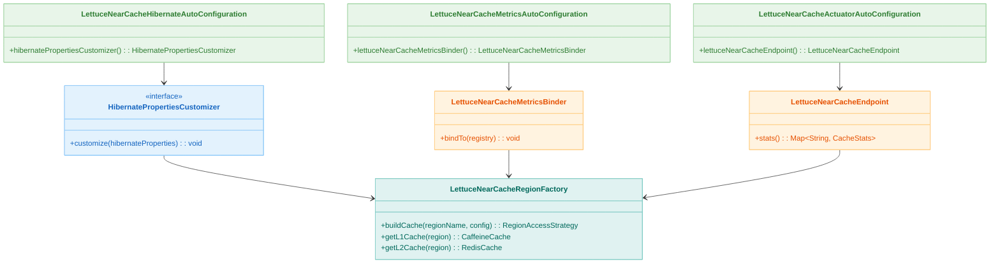
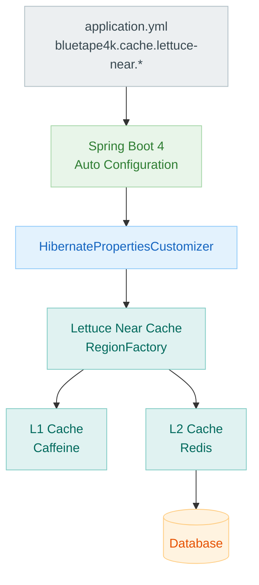

# bluetape4k-spring-boot4-hibernate-lettuce

[English](./README.md) | 한국어

Hibernate 7 **2nd Level Cache** (Lettuce Near Cache)를 위한 **Spring Boot 4 Auto-Configuration**.

`application.yml`에
`bluetape4k.cache.lettuce-near.*` 설정만 추가하면 별도 코드 없이 Hibernate Second Level Cache가 자동으로 활성화된다. 밀리초 단위 duration(
`500ms`)도 Hibernate 설정으로 그대로 전달된다.

## UML



### Auto-Configuration 활성화 흐름



## Spring Boot 4 고유 사항

Spring Boot 4에서는 패키지명이 변경되었습니다:

| Spring Boot 3                                                                  | Spring Boot 4                                                                    |
|--------------------------------------------------------------------------------|----------------------------------------------------------------------------------|
| `org.springframework.boot.autoconfigure.orm.jpa.HibernatePropertiesCustomizer` | `org.springframework.boot.hibernate.autoconfigure.HibernatePropertiesCustomizer` |

또한 Spring Boot 4 BOM을 명시적으로 사용해야 합니다:

```kotlin
// build.gradle.kts
dependencies {
    // Spring Boot 4 BOM (dependencyManagement 대신 platform 사용)
    implementation(platform(Libs.spring_boot4_dependencies))

    implementation(project(":bluetape4k-spring-boot4-hibernate-lettuce"))

    // Hibernate 명시적 추가 필요
    compileOnly(Libs.springBoot("hibernate"))

    // Spring Boot Starters
    implementation(Libs.springBootStarter("data-jpa"))
    implementation(Libs.springBootStarter("actuator"))   // Actuator 엔드포인트 (선택)
    implementation(Libs.micrometer_core)                 // Micrometer 메트릭 (선택)
}
```

## 특징

- 의존성 추가 + `application.yml` 설정만으로 2nd Level Cache 활성화
- `@ConditionalOnClass` / `@ConditionalOnProperty` 기반 안전한 자동 구성
- **Actuator** 엔드포인트 (`GET /actuator/nearcache`) — region별 캐시 통계
- **Micrometer** 메트릭 (`lettuce.nearcache.*`) — region count, local size
- L1 (Caffeine) + L2 (Redis) **Two-Tier** 캐싱 아키텍처

## 의존성 (Spring Boot 4)

```kotlin
// build.gradle.kts
dependencies {
    // Spring Boot 4 BOM (필수)
    implementation(platform(Libs.spring_boot4_dependencies))

    implementation(project(":bluetape4k-spring-boot4-hibernate-lettuce"))

    // Spring Boot Starters
    implementation(Libs.springBootStarter("data-jpa"))
    implementation(Libs.springBootStarter("actuator"))   // Actuator 엔드포인트 (선택)
    implementation(Libs.micrometer_core)                 // Micrometer 메트릭 (선택)

    // Hibernate (명시적 선언)
    compileOnly(Libs.springBoot("hibernate"))
}
```

## 빠른 시작

### 1. 의존성 추가 후 application.yml 설정

```yaml
bluetape4k:
    cache:
        lettuce-near:
            redis-uri: redis://localhost:6379
            local:
                max-size: 10000
                expire-after-write: 30m
            redis-ttl:
                default: 120s
            metrics:
                enabled: true
                enable-caffeine-stats: true

spring:
    jpa:
        hibernate:
            ddl-auto: update
    datasource:
        url: jdbc:h2:mem:testdb;DB_CLOSE_DELAY=-1

management:
    endpoints:
        web:
            exposure:
                include: health, info, metrics, nearcache
```

### 2. Entity에 캐시 어노테이션 추가

```kotlin
@Entity
@Table(name = "products")
@Cacheable
@Cache(usage = CacheConcurrencyStrategy.NONSTRICT_READ_WRITE, region = "product")
data class Product(
    @Id
    @GeneratedValue(strategy = GenerationType.IDENTITY)
    val id: Long? = null,

    @Column(nullable = false)
    val name: String,

    @Column
    val description: String? = null,

    @Column(nullable = false)
    val price: Double = 0.0,
)
```

### 3. 실행 — 자동 설정 완료

Hibernate properties가 자동으로 주입되어 2nd Level Cache가 활성화된다. 추가 코드 불필요.

## 설정 옵션 전체 목록

```yaml
bluetape4k:
    cache:
        lettuce-near:
            # 활성화 여부 (기본: true)
            enabled: true

            # Redis 연결 URI
            redis-uri: redis://localhost:6379

            # 직렬화 코덱 (기본: lz4fory)
            # 선택지: lz4fory | fory | kryo | lz4kryo | lz4jdk | gzipfory | zstdfory | jdk
            codec: lz4fory

            # RESP3 CLIENT TRACKING 활성화 (Redis 6+ 필요, 기본: true)
            use-resp3: true

            # L1 (Caffeine) 설정
            local:
                max-size: 10000                    # 최대 항목 수
                expire-after-write: 30m            # 쓰기 후 만료 시간

            # Redis TTL
            redis-ttl:
                default: 120s                      # 기본 TTL
                regions:
                    # Region별 TTL 오버라이드 (점 포함 키는 대괄호 표기)
                    "[io.bluetape4k.examples.cache.lettuce.domain.Product]": 300s
                    "[io.bluetape4k.examples.cache.lettuce.domain.Order]": 600s

            # Metrics / 통계
            metrics:
                enabled: true                           # Metrics 수집 활성화
                enable-caffeine-stats: true             # Caffeine CacheStats 수집
```

### 설정값 → Hibernate properties 매핑

| Spring 설정                            | Hibernate property                                 |
|--------------------------------------|----------------------------------------------------|
| `redis-uri`                          | `hibernate.cache.lettuce.redis_uri`                |
| `codec`                              | `hibernate.cache.lettuce.codec`                    |
| `use-resp3`                          | `hibernate.cache.lettuce.use_resp3`                |
| `local.max-size`                     | `hibernate.cache.lettuce.local.max_size`           |
| `local.expire-after-write`           | `hibernate.cache.lettuce.local.expire_after_write` |
| `redis-ttl.default`                  | `hibernate.cache.lettuce.redis_ttl.default`        |
| `redis-ttl.regions[name]`            | `hibernate.cache.lettuce.redis_ttl.{name}`         |
| `metrics.enabled=true`               | `hibernate.generate_statistics=true`               |
| `metrics.enable-caffeine-stats=true` | `hibernate.cache.lettuce.local.record_stats=true`  |

## Auto-Configuration 클래스

| 클래스                                          | 조건                                                                   | 역할                                 |
|----------------------------------------------|----------------------------------------------------------------------|------------------------------------|
| `LettuceNearCacheHibernateAutoConfiguration` | `LettuceNearCacheRegionFactory`, `EntityManagerFactory` on classpath | `HibernatePropertiesCustomizer` 등록 |
| `LettuceNearCacheMetricsAutoConfiguration`   | `MeterRegistry` on classpath + Bean                                  | `LettuceNearCacheMetricsBinder` 등록 |
| `LettuceNearCacheActuatorAutoConfiguration`  | `Endpoint` (actuate) on classpath + `EntityManagerFactory` Bean      | `/actuator/nearcache` 엔드포인트 등록     |

## Actuator 엔드포인트

### 전체 Region 통계 조회

```bash
GET /actuator/nearcache
```

응답 예시:

```json
{
  "product": {
    "regionName": "product",
    "localSize": 850,
    "localHitRate": 0.984,
    "localHitCount": 12453,
    "localMissCount": 203,
    "localEvictionCount": 10,
    "l2HitCount": 12050,
    "l2MissCount": 403,
    "l2PutCount": 1200
  }
}
```

### 특정 Region 상세 조회

```bash
GET /actuator/nearcache/{regionName}
```

예시:

```bash
GET /actuator/nearcache/product
```

응답:

```json
{
  "regionName": "product",
  "localSize": 850,
  "localHitRate": 0.984,
  "localHitCount": 12453,
  "localMissCount": 203,
  "localEvictionCount": 10,
  "l2HitCount": 12050,
  "l2MissCount": 403,
  "l2PutCount": 1200
}
```

## Micrometer 메트릭

`metrics.enabled=true` 설정 시 다음 Gauge가 등록된다.

| 메트릭                              | 설명                 |
|----------------------------------|--------------------|
| `lettuce.nearcache.region.count` | 활성 Region 수        |
| `lettuce.nearcache.local.size`   | 전체 L1 캐시 항목 수 (추정) |

```bash
# Micrometer 메트릭 조회 (JSON)
GET /actuator/metrics/lettuce.nearcache.region.count
GET /actuator/metrics/lettuce.nearcache.local.size
```

응답 예시:

```json
{
  "name": "lettuce.nearcache.region.count",
  "baseUnit": "items",
  "measurements": [
    {
      "statistic": "VALUE",
      "value": 2.0
    }
  ]
}
```

## 비활성화

Auto-configuration을 완전히 비활성화하려면:

```yaml
bluetape4k:
    cache:
        lettuce-near:
            enabled: false   # HibernatePropertiesCustomizer, MetricsBinder, Endpoint 모두 비활성화
```

## 테스트 실행

### 단위 테스트 (Redis/DB 없음)

```bash
./gradlew :bluetape4k-spring-boot4-hibernate-lettuce:test
```

`ApplicationContextRunner`로 실제 Redis/DB 없이 설정 테스트를 수행한다.

### 통합 테스트 (Testcontainers)

통합 테스트는 Testcontainers를 통해 Redis + H2를 자동으로 관리한다.

```bash
./gradlew :bluetape4k-spring-boot4-hibernate-lettuce:test -i
```

## 관련 모듈

- [`bluetape4k-cache-lettuce`](../../infra/cache-lettuce/README.ko.md) — Near Cache 코어 구현
- [`bluetape4k-hibernate-cache-lettuce`](../../data/hibernate-cache-lettuce/README.ko.md) — Hibernate Region Factory
- [`bluetape4k-spring-boot4-hibernate-lettuce-demo`](../hibernate-lettuce-demo/README.ko.md) — 실제 사용 예제

## Spring Boot 3과의 차이점

| 항목                                  | Spring Boot 3                                    | Spring Boot 4                                              |
|-------------------------------------|--------------------------------------------------|------------------------------------------------------------|
| `HibernatePropertiesCustomizer` 패키지 | `org.springframework.boot.autoconfigure.orm.jpa` | `org.springframework.boot.hibernate.autoconfigure`         |
| BOM 설정                              | `dependencyManagement { imports }`               | `implementation(platform(Libs.spring_boot4_dependencies))` |
| Hibernate 명시적 추가                    | 불필요                                              | `compileOnly(Libs.springBoot("hibernate"))`                |

## 패키지 정보

- **Group**: `io.github.bluetape4k`
- **Artifact**: `bluetape4k-spring-boot4-hibernate-lettuce`
- **Package**: `io.bluetape4k.spring.boot.autoconfigure.cache.lettuce`

## 라이센스

Apache License 2.0
