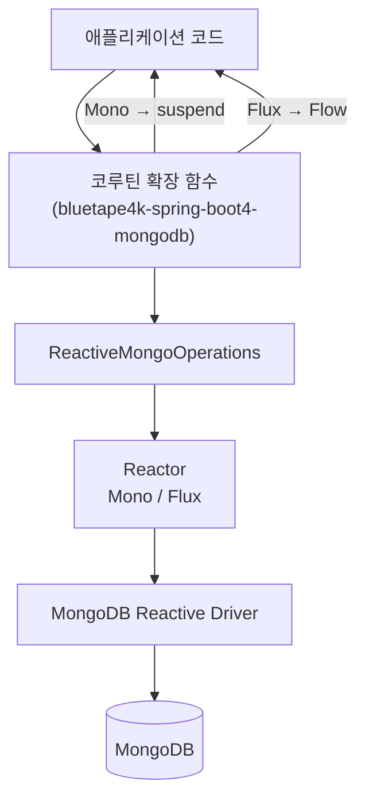
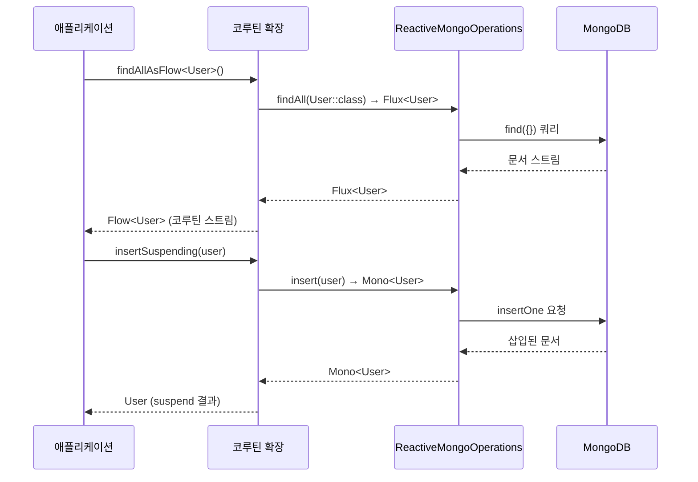

# Module bluetape4k-spring-boot4-mongodb

[Spring Data MongoDB Reactive](https://docs.spring.io/spring-data/mongodb/docs/current/reference/html/)를 Kotlin Coroutines 기반으로 편리하게 사용할 수 있도록 하는 확장 라이브러리입니다 (Spring Boot 4.x).

`ReactiveMongoOperations`의 `Flux`/`Mono` 반환 타입을 `Flow`/`suspend`로 변환하는 확장 함수와,
`Criteria`·`Query`·`Update` 구성을 위한 Kotlin infix DSL을 제공합니다.

> Spring Boot 3 모듈(`bluetape4k-spring-mongodb`)과 동일한 기능을 Spring Boot 4.x API로 제공합니다.

## 특징

- **ReactiveMongoOperations 코루틴 확장**: `Flux` → `Flow`, `Mono` → `suspend` 변환
- **Criteria infix DSL**: `"age".criteria() gt 28`, `"name".criteria() eq "Alice"` 등
- **Query 빌더 확장**: `queryOf()`, `sortAscBy()`, `paginate()` 등
- **Update DSL**: `"field" setTo value`, `"field".incBy()` 등

## 설치

```kotlin
dependencies {
    implementation("io.github.bluetape4k:bluetape4k-spring-boot4-mongodb:${bluetape4kVersion}")
}
```

## 사용 예시

### ReactiveMongoOperations 코루틴 확장

```kotlin
import io.bluetape4k.spring4.mongodb.coroutines.*

// 조회
val user: User? = mongoOperations.findOneOrNullSuspending(
    Query(Criteria.where("name").`is`("Alice"))
)

// Flow로 전체 조회
val users: List<User> = mongoOperations.findAllAsFlow<User>().toList()

// 삽입
val saved: User = mongoOperations.insertSuspending(User(name = "Bob", age = 25))

// 카운트
val count: Long = mongoOperations.countSuspending<User>()

// 업데이트
mongoOperations.updateMultiSuspending<User>(
    Query(Criteria.where("city").`is`("Seoul")),
    Update().set("city", "Suwon")
)
```

### Criteria infix DSL

```kotlin
import io.bluetape4k.spring4.mongodb.query.*

val c1 = "age".criteria() gt 20
val c2 = "name".criteria() eq "Alice"
val c3 = "city".criteria() inValues listOf("Seoul", "Busan")
val c4 = "deletedAt".criteria().isNull()
val c5 = "age".criteria().gt(20) andWith "city".criteria().`is`("Seoul")
```

### Query 빌더 확장

```kotlin
val query = queryOf("age".criteria() gt 20, "city".criteria() eq "Seoul")
    .sortAscBy("name")
    .paginate(page = 0, size = 10)
```

### Update DSL

```kotlin
val update = ("name" setTo "Alice")
    .andSet("age", 30)
    .andSet("city", "Seoul")
```

## 제공 확장 함수 목록

| 함수                                        | 반환 타입          | 설명               |
|-------------------------------------------|----------------|------------------|
| `findAsFlow<T>(query)`                    | `Flow<T>`      | 조건에 맞는 문서 스트림    |
| `findAllAsFlow<T>()`                      | `Flow<T>`      | 전체 문서 스트림        |
| `findOneOrNullSuspending<T>(query)`       | `T?`           | 단건 조회 (없으면 null) |
| `countSuspending<T>(query?)`              | `Long`         | 문서 수 조회          |
| `existsSuspending<T>(query)`              | `Boolean`      | 존재 여부 확인         |
| `insertSuspending(entity)`                | `T`            | 단건 삽입            |
| `insertAllAsFlow(entities)`               | `Flow<T>`      | 다건 삽입            |
| `saveSuspending(entity)`                  | `T`            | 저장 (삽입 또는 업데이트)  |
| `updateMultiSuspending<T>(query, update)` | `UpdateResult` | 다건 업데이트          |
| `removeSuspending<T>(query)`              | `DeleteResult` | 조건 삭제            |
| `aggregateAsFlow<I, O>(aggregation)`      | `Flow<O>`      | Aggregation 실행   |
| `dropCollectionSuspending<T>()`           | `Unit`         | 컬렉션 삭제           |

## 빌드 및 테스트

```bash
./gradlew :bluetape4k-spring-boot4-mongodb:test
```

## 아키텍처 다이어그램

### ReactiveMongoOperations 코루틴 확장 흐름



### Criteria / Query / Update DSL 흐름

```mermaid
graph LR
    Code["애플리케이션 코드"] --> CriteriaDSL["Criteria infix DSL\n\"age\".criteria() gt 20"]
    Code --> QueryBuilder["Query 빌더 확장\nqueryOf() / paginate()"]
    Code --> UpdateDSL["Update DSL\n\"field\" setTo value"]
    CriteriaDSL --> Query["Query 객체"]
    QueryBuilder --> Query
    UpdateDSL --> Update["Update 객체"]
    Query --> ROps["ReactiveMongoOperations\n코루틴 확장"]
    Update --> ROps
    ROps --> MongoDB[("MongoDB")]
```

### 코루틴 변환 시퀀스



## 참고 자료

- [Spring Data MongoDB 공식 문서](https://docs.spring.io/spring-data/mongodb/docs/current/reference/html/)
- [bluetape4k-mongodb](../../data/mongodb/README.md) — 네이티브 MongoDB Kotlin 드라이버 확장
