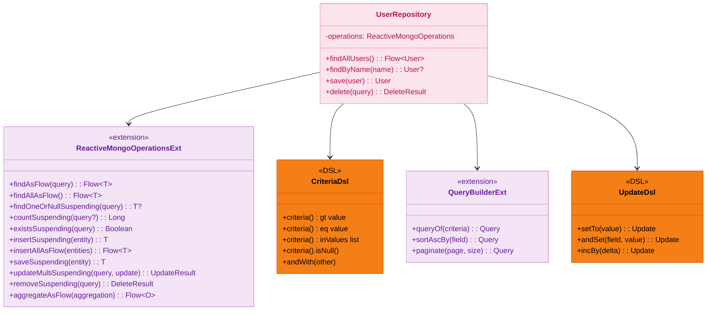
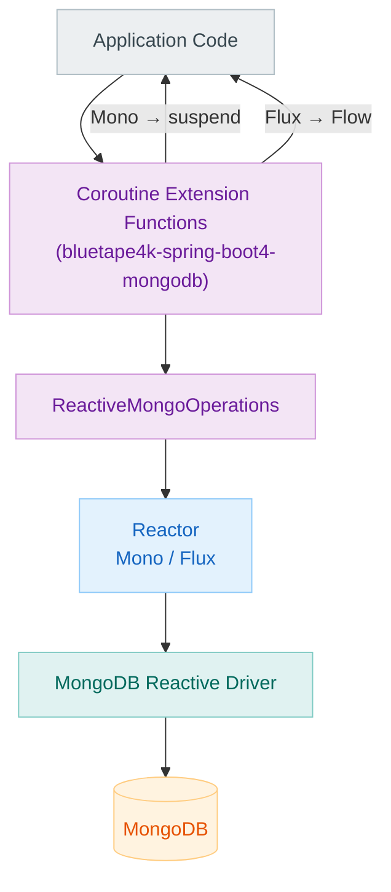
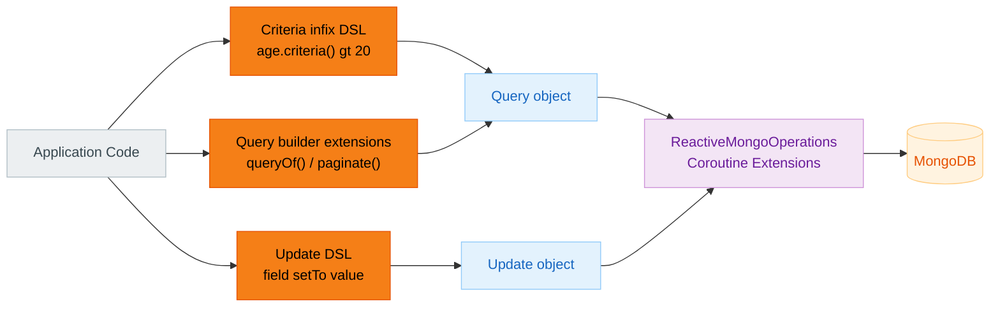
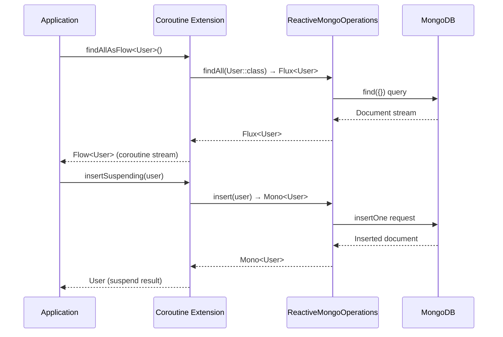

# Module bluetape4k-spring-boot4-mongodb

English | [한국어](./README.ko.md)

An extension library for working with [Spring Data MongoDB Reactive](https://docs.spring.io/spring-data/mongodb/docs/current/reference/html/) using Kotlin Coroutines (Spring Boot 4.x).

Provides extension functions that convert `Flux`/`Mono` return types from `ReactiveMongoOperations` to `Flow`/
`suspend`, along with Kotlin infix DSLs for building `Criteria`, `Query`, and `Update` objects.

> Provides the same functionality as the Spring Boot 3 module (
`bluetape4k-spring-mongodb`), adapted to the Spring Boot 4.x API.

## Features

- **ReactiveMongoOperations coroutine extensions**: `Flux` → `Flow`, `Mono` → `suspend` conversions
- **Criteria infix DSL**: `"age".criteria() gt 28`, `"name".criteria() eq "Alice"`, etc.
- **Query builder extensions**: `queryOf()`, `sortAscBy()`, `paginate()`, etc.
- **Update DSL**: `"field" setTo value`, `"field".incBy()`, etc.

## Installation

```kotlin
dependencies {
    implementation("io.github.bluetape4k:bluetape4k-spring-boot4-mongodb:${bluetape4kVersion}")
}
```

## Usage Examples

### ReactiveMongoOperations Coroutine Extensions

```kotlin
import io.bluetape4k.spring4.mongodb.coroutines.*

// Find one
val user: User? = mongoOperations.findOneOrNullSuspending(
    Query(Criteria.where("name").`is`("Alice"))
)

// Find all as Flow
val users: List<User> = mongoOperations.findAllAsFlow<User>().toList()

// Insert
val saved: User = mongoOperations.insertSuspending(User(name = "Bob", age = 25))

// Count
val count: Long = mongoOperations.countSuspending<User>()

// Update
mongoOperations.updateMultiSuspending<User>(
    Query(Criteria.where("city").`is`("Seoul")),
    Update().set("city", "Suwon")
)
```

### Criteria infix DSL

```kotlin
import io.bluetape4k.spring4.mongodb.query.*

val c1 = "age".criteria() gt 20
val c2 = "name".criteria() eq "Alice"
val c3 = "city".criteria() inValues listOf("Seoul", "Busan")
val c4 = "deletedAt".criteria().isNull()
val c5 = "age".criteria().gt(20) andWith "city".criteria().`is`("Seoul")
```

### Query Builder Extensions

```kotlin
val query = queryOf("age".criteria() gt 20, "city".criteria() eq "Seoul")
    .sortAscBy("name")
    .paginate(page = 0, size = 10)
```

### Update DSL

```kotlin
val update = ("name" setTo "Alice")
    .andSet("age", 30)
    .andSet("city", "Seoul")
```

## Available Extension Functions

| Function                                  | Return Type    | Description                        |
|-------------------------------------------|----------------|------------------------------------|
| `findAsFlow<T>(query)`                    | `Flow<T>`      | Stream documents matching a query  |
| `findAllAsFlow<T>()`                      | `Flow<T>`      | Stream all documents               |
| `findOneOrNullSuspending<T>(query)`       | `T?`           | Find one document (null if absent) |
| `countSuspending<T>(query?)`              | `Long`         | Count documents                    |
| `existsSuspending<T>(query)`              | `Boolean`      | Check existence                    |
| `insertSuspending(entity)`                | `T`            | Insert a single document           |
| `insertAllAsFlow(entities)`               | `Flow<T>`      | Insert multiple documents          |
| `saveSuspending(entity)`                  | `T`            | Save (insert or update)            |
| `updateMultiSuspending<T>(query, update)` | `UpdateResult` | Update multiple documents          |
| `removeSuspending<T>(query)`              | `DeleteResult` | Delete documents by query          |
| `aggregateAsFlow<I, O>(aggregation)`      | `Flow<O>`      | Execute an aggregation pipeline    |
| `dropCollectionSuspending<T>()`           | `Unit`         | Drop a collection                  |

## Build and Test

```bash
./gradlew :bluetape4k-spring-boot4-mongodb:test
```

## Architecture Diagrams

### Core Class Structure



### ReactiveMongoOperations Coroutine Extension Flow



### Criteria / Query / Update DSL Flow



### Coroutine Conversion Sequence



## References

- [Spring Data MongoDB Official Documentation](https://docs.spring.io/spring-data/mongodb/docs/current/reference/html/)
- [bluetape4k-mongodb](../../data/mongodb/README.md) — Native MongoDB Kotlin driver extensions
