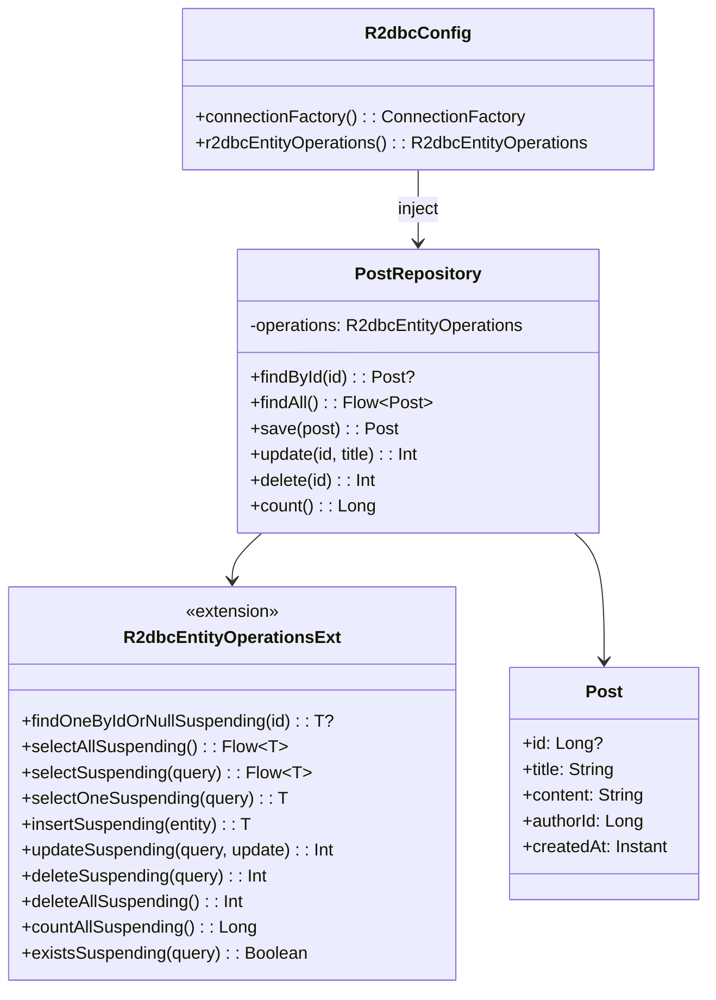
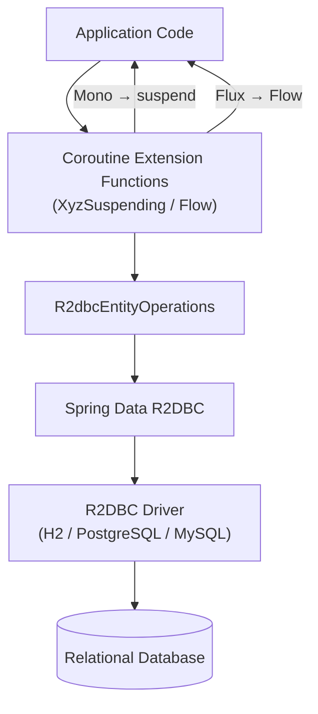
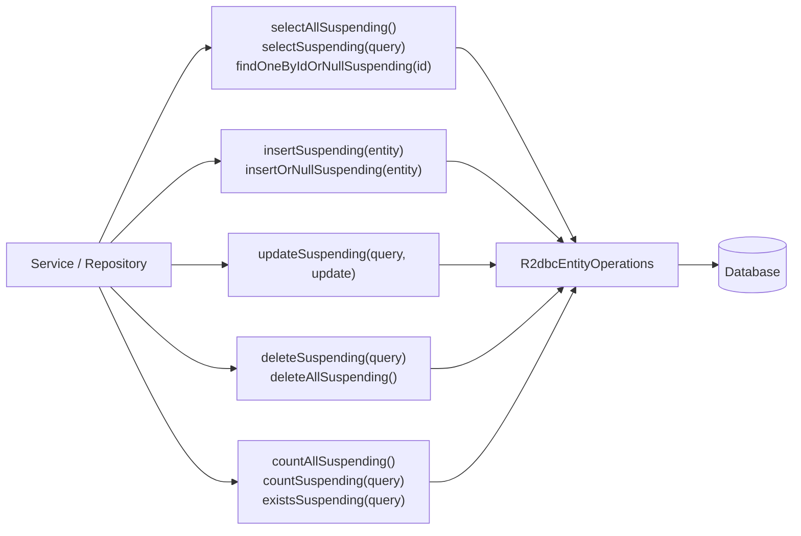
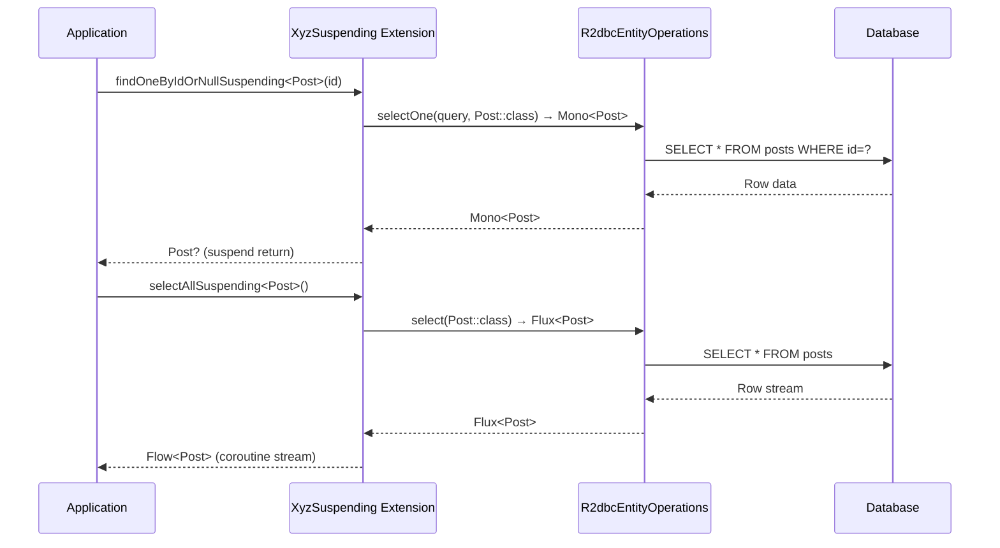

# Module bluetape4k-spring-boot4-r2dbc

English | [한국어](./README.ko.md)

An extension library that makes Spring Data R2DBC easier to use with Kotlin Coroutines (Spring Boot 4.x).

> Provides the same functionality as the Spring Boot 3 module (`bluetape4k-spring-r2dbc`), adapted to the Spring Boot 4.x API.

## Key Features

- **R2dbcEntityOperations extensions**: Coroutines-based CRUD operations
- **ReactiveInsert/Update/Delete/Select extensions**: Type-safe coroutine operations
- **Naming convention**: Consistent `XyzSuspending` function naming

## Installation

```kotlin
dependencies {
    implementation("io.github.bluetape4k:bluetape4k-spring-boot4-r2dbc:${bluetape4kVersion}")
}
```

## Usage Examples

### R2dbcEntityOperations Extensions

```kotlin
import io.bluetape4k.spring4.r2dbc.coroutines.*

class PostService(private val operations: R2dbcEntityOperations) {

    suspend fun findById(id: Long): Post? =
        operations.findOneByIdOrNullSuspending<Post>(id)

    fun findAll(): Flow<Post> =
        operations.selectAllSuspending<Post>()

    suspend fun save(post: Post): Post =
        operations.insertSuspending(post)

    suspend fun update(id: Long, title: String): Int {
        val query = Query.query(Criteria.where("id").isEqual(id))
        val update = Update.update("title", title)
        return operations.updateSuspending<Post>(query, update)
    }

    suspend fun delete(id: Long): Int {
        val query = Query.query(Criteria.where("id").isEqual(id))
        return operations.deleteSuspending<Post>(query)
    }

    suspend fun count(): Long =
        operations.countAllSuspending<Post>()
}
```

### Repository Example

```kotlin
@Table("posts")
data class Post(
    @Id val id: Long? = null,
    val title: String,
    val content: String,
    val authorId: Long,
    val createdAt: Instant = Instant.now(),
)

@Repository
class PostRepository(private val operations: R2dbcEntityOperations) {

    suspend fun findById(id: Long): Post? =
        operations.findOneByIdOrNullSuspending<Post>(id)

    fun findAll(): Flow<Post> =
        operations.selectAllSuspending<Post>()

    suspend fun save(post: Post): Post =
        operations.insertSuspending(post)

    suspend fun delete(id: Long): Int {
        val query = Query.query(Criteria.where("id").isEqual(id))
        return operations.deleteSuspending<Post>(query)
    }
}
```

### Naming Convention

Coroutine functions follow the `XyzSuspending` naming pattern.

| Function                                | Return Type | Description                         |
|----------------------------------------|-------------|-------------------------------------|
| `findOneByIdSuspending<T>(id)`         | `T`         | Find by ID                          |
| `findOneByIdOrNullSuspending<T>(id)`   | `T?`        | Find by ID (null if not found)      |
| `selectAllSuspending<T>()`             | `Flow<T>`   | Select all records                  |
| `selectSuspending<T>(query)`           | `Flow<T>`   | Select by query                     |
| `selectOneSuspending<T>(query)`        | `T`         | Select single record                |
| `selectOneOrNullSuspending<T>(query)`  | `T?`        | Select single record (null if none) |
| `insertSuspending(entity)`             | `T`         | Insert                              |
| `updateSuspending<T>(query, update)`   | `Int`       | Update                              |
| `deleteSuspending<T>(query)`           | `Int`       | Delete                              |
| `deleteAllSuspending<T>()`             | `Int`       | Delete all                          |
| `countAllSuspending<T>()`              | `Long`      | Total count                         |
| `countSuspending<T>(query)`            | `Long`      | Conditional count                   |
| `existsSuspending<T>(query)`           | `Boolean`   | Check existence                     |

## Build and Test

```bash
./gradlew :bluetape4k-spring-boot4-r2dbc:test
```

## Architecture Diagrams

### Core Class Structure



### R2DBC + Coroutines Data Flow



### CRUD Operation Hierarchy



### Coroutine Conversion Sequence



## References

- [Spring Data R2DBC Official Documentation](https://docs.spring.io/spring-data/r2dbc/reference/)
- [Kotlin Coroutines Support](https://docs.spring.io/spring-framework/reference/languages/kotlin/coroutines.html)
