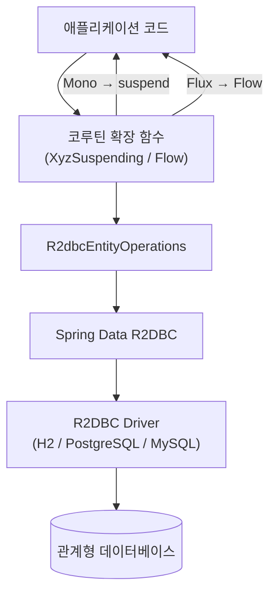
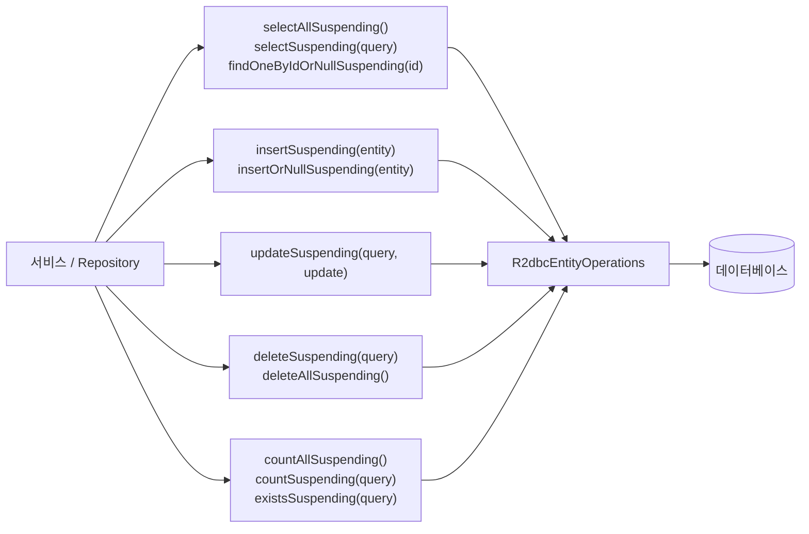
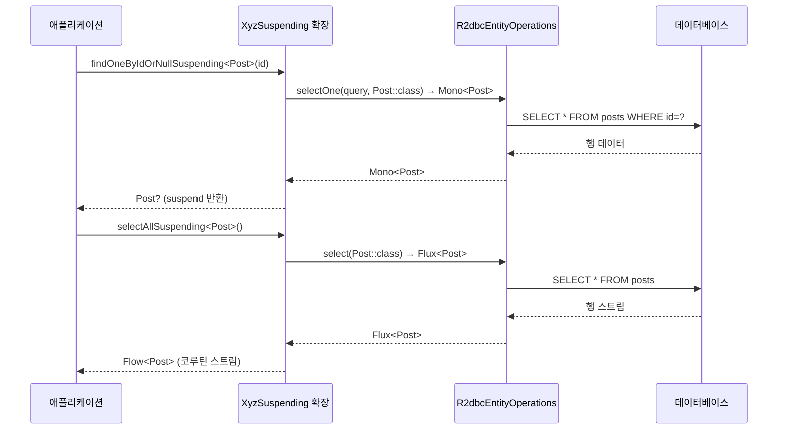

# Module bluetape4k-spring-boot4-r2dbc

Spring Data R2DBC를 Kotlin Coroutines 기반으로 사용하기 편하게 확장한 라이브러리입니다 (Spring Boot 4.x).

> Spring Boot 3 모듈(`bluetape4k-spring-r2dbc`)과 동일한 기능을 Spring Boot 4.x API로 제공합니다.

## 주요 기능

- **R2dbcEntityOperations 확장**: 코루틴 기반 CRUD 연산
- **ReactiveInsert/Update/Delete/Select 확장**: 타입 안전한 코루틴 연산
- **네이밍 규칙**: `XyzSuspending` 형식의 일관된 함수명

## 설치

```kotlin
dependencies {
    implementation("io.github.bluetape4k:bluetape4k-spring-boot4-r2dbc:${bluetape4kVersion}")
}
```

## 사용 예시

### R2dbcEntityOperations 확장

```kotlin
import io.bluetape4k.spring4.r2dbc.coroutines.*

class PostService(private val operations: R2dbcEntityOperations) {

    suspend fun findById(id: Long): Post? =
        operations.findOneByIdOrNullSuspending<Post>(id)

    fun findAll(): Flow<Post> =
        operations.selectAllSuspending<Post>()

    suspend fun save(post: Post): Post =
        operations.insertSuspending(post)

    suspend fun update(id: Long, title: String): Int {
        val query = Query.query(Criteria.where("id").isEqual(id))
        val update = Update.update("title", title)
        return operations.updateSuspending<Post>(query, update)
    }

    suspend fun delete(id: Long): Int {
        val query = Query.query(Criteria.where("id").isEqual(id))
        return operations.deleteSuspending<Post>(query)
    }

    suspend fun count(): Long =
        operations.countAllSuspending<Post>()
}
```

### Repository 예시

```kotlin
@Table("posts")
data class Post(
    @Id val id: Long? = null,
    val title: String,
    val content: String,
    val authorId: Long,
    val createdAt: Instant = Instant.now(),
)

@Repository
class PostRepository(private val operations: R2dbcEntityOperations) {

    suspend fun findById(id: Long): Post? =
        operations.findOneByIdOrNullSuspending<Post>(id)

    fun findAll(): Flow<Post> =
        operations.selectAllSuspending<Post>()

    suspend fun save(post: Post): Post =
        operations.insertSuspending(post)

    suspend fun delete(id: Long): Int {
        val query = Query.query(Criteria.where("id").isEqual(id))
        return operations.deleteSuspending<Post>(query)
    }
}
```

### 네이밍 규칙

코루틴 함수는 `XyzSuspending` 형식으로 제공됩니다.

| 함수                                    | 반환 타입     | 설명                   |
|---------------------------------------|-----------|----------------------|
| `findOneByIdSuspending<T>(id)`        | `T`       | ID로 단건 조회            |
| `findOneByIdOrNullSuspending<T>(id)`  | `T?`      | ID로 단건 조회 (없으면 null) |
| `selectAllSuspending<T>()`            | `Flow<T>` | 전체 조회                |
| `selectSuspending<T>(query)`          | `Flow<T>` | 조건 조회                |
| `selectOneSuspending<T>(query)`       | `T`       | 단건 조회                |
| `selectOneOrNullSuspending<T>(query)` | `T?`      | 단건 조회 (없으면 null)     |
| `insertSuspending(entity)`            | `T`       | 삽입                   |
| `updateSuspending<T>(query, update)`  | `Int`     | 업데이트                 |
| `deleteSuspending<T>(query)`          | `Int`     | 삭제                   |
| `deleteAllSuspending<T>()`            | `Int`     | 전체 삭제                |
| `countAllSuspending<T>()`             | `Long`    | 전체 건수                |
| `countSuspending<T>(query)`           | `Long`    | 조건부 건수               |
| `existsSuspending<T>(query)`          | `Boolean` | 존재 여부                |

## 빌드 및 테스트

```bash
./gradlew :bluetape4k-spring-boot4-r2dbc:test
```

## 아키텍처 다이어그램

### R2DBC + Coroutines 데이터 흐름



### CRUD 연산 계층 구조



### 코루틴 변환 시퀀스



## 참고

- [Spring Data R2DBC 공식 문서](https://docs.spring.io/spring-data/r2dbc/reference/)
- [Kotlin Coroutines Support](https://docs.spring.io/spring-framework/reference/languages/kotlin/coroutines.html)
