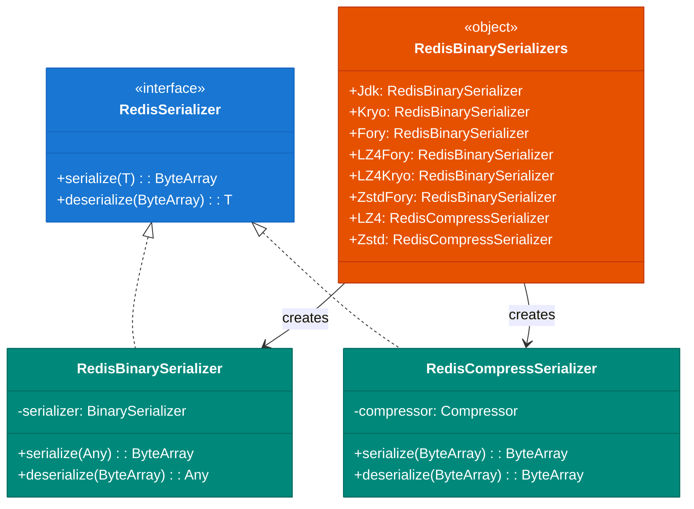
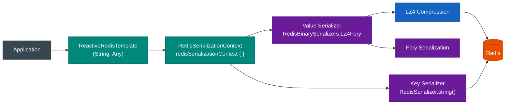

# bluetape4k-spring-boot4-redis

English | [한국어](./README.ko.md)

A module that replaces Spring Data Redis's serialization layer with high-performance binary serialization and compression combinations (Spring Boot 4.x).

Provides a convenient way to configure `Serializer` and `RedisSerializationContext` when setting up `RedisTemplate` /
`ReactiveRedisTemplate`.

> Provides the same functionality as the Spring Boot 3 module (
`bluetape4k-spring-boot3-redis`), adapted to the Spring Boot 4.x API.

## Key Features

| Class / Function                   | Description                                                                                  |
|------------------------------------|----------------------------------------------------------------------------------------------|
| `RedisBinarySerializer`            | `RedisSerializer<Any>` implementation backed by `BinarySerializer`                           |
| `RedisCompressSerializer`          | Compression-only `RedisSerializer<ByteArray>` backed by `Compressor`                         |
| `RedisBinarySerializers`           | Singleton factory combining serializers (Jdk/Kryo/Fory) × compressors (GZip/LZ4/Snappy/Zstd) |
| `redisSerializationContext {}`     | DSL-based `RedisSerializationContext` builder                                                |
| `redisSerializationContextOf(...)` | Convenience function to specify key/value serializers directly                               |

## Installation

```kotlin
dependencies {
    implementation("io.github.bluetape4k:bluetape4k-spring-boot4-redis:${bluetape4kVersion}")
}
```

## Usage Examples

### ReactiveRedisTemplate Configuration (DSL approach)

```kotlin
@Configuration
class RedisConfig {

    @Bean
    fun reactiveRedisTemplate(
        factory: ReactiveRedisConnectionFactory,
    ): ReactiveRedisTemplate<String, Any> {
        val context = redisSerializationContext<String, Any> {
            key(RedisSerializer.string())
            value(RedisBinarySerializers.LZ4Fory)
            hashKey(RedisSerializer.string())
            hashValue(RedisBinarySerializers.LZ4Fory)
        }
        return ReactiveRedisTemplate(factory, context)
    }
}
```

### ReactiveRedisTemplate Configuration (convenience function approach)

```kotlin
@Bean
fun reactiveRedisTemplate(
    factory: ReactiveRedisConnectionFactory,
): ReactiveRedisTemplate<String, ByteArray> {
    val context = redisSerializationContextOf<ByteArray>(
        valueSerializer = RedisBinarySerializers.LZ4Kryo,
    )
    return ReactiveRedisTemplate(factory, context)
}
```

### RedisTemplate Configuration

```kotlin
@Bean
fun redisTemplate(factory: RedisConnectionFactory): RedisTemplate<String, Any> {
    return RedisTemplate<String, Any>().apply {
        connectionFactory = factory
        keySerializer = RedisSerializer.string()
        valueSerializer = RedisBinarySerializers.LZ4Fory
        hashKeySerializer = RedisSerializer.string()
        hashValueSerializer = RedisBinarySerializers.LZ4Fory
    }
}
```

## Serializer Reference

### Object Serializers (Object → ByteArray)

| Constant                            | Serialization Engine | Compression |
|-------------------------------------|----------------------|-------------|
| `RedisBinarySerializers.Jdk`        | JDK                  | None        |
| `RedisBinarySerializers.Kryo`       | Kryo                 | None        |
| `RedisBinarySerializers.Fory`       | Fory                 | None        |
| `RedisBinarySerializers.LZ4Fory`    | Fory                 | LZ4         |
| `RedisBinarySerializers.LZ4Kryo`    | Kryo                 | LZ4         |
| `RedisBinarySerializers.ZstdFory`   | Fory                 | Zstd        |
| `RedisBinarySerializers.SnappyFory` | Fory                 | Snappy      |
| `RedisBinarySerializers.GzipFory`   | Fory                 | GZip        |

### Compression-only (ByteArray → ByteArray)

| Constant                        | Compression Algorithm |
|---------------------------------|-----------------------|
| `RedisBinarySerializers.LZ4`    | LZ4                   |
| `RedisBinarySerializers.Zstd`   | Zstd                  |
| `RedisBinarySerializers.Snappy` | Snappy                |
| `RedisBinarySerializers.Gzip`   | GZip                  |

## Architecture Diagrams

### Redis Serializer Class Hierarchy



### ReactiveRedisTemplate Serialization Flow



## Build and Test

```bash
./gradlew :bluetape4k-spring-boot4-redis:test
```
