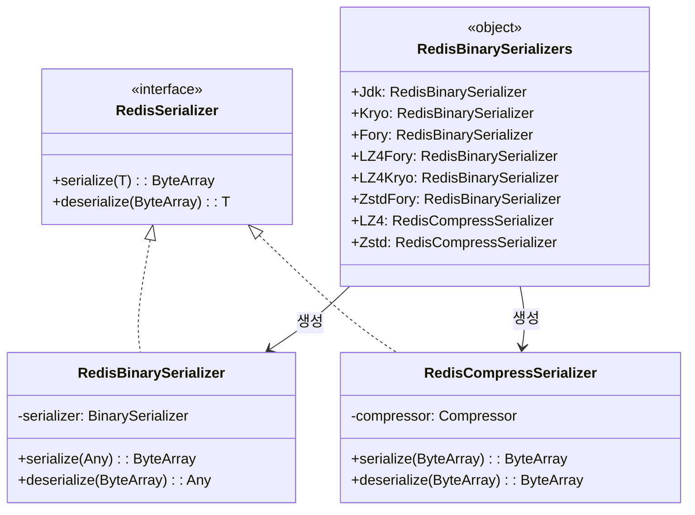
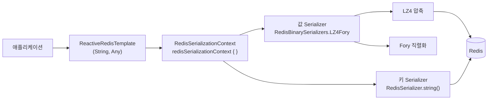

# bluetape4k-spring-boot4-redis

Spring Data Redis의 직렬화 계층을 고성능 바이너리 직렬화/압축 조합으로 대체할 수 있는 모듈입니다 (Spring Boot 4.x).

`RedisTemplate` / `ReactiveRedisTemplate` 설정 시 Serializer와 `RedisSerializationContext`를 간편하게 구성할 수 있습니다.

> Spring Boot 3 모듈(`bluetape4k-spring-boot3-redis`)과 동일한 기능을 Spring Boot 4.x API로 제공합니다.

## 주요 기능

| 클래스 / 함수                           | 설명                                                       |
|------------------------------------|----------------------------------------------------------|
| `RedisBinarySerializer`            | `BinarySerializer` 기반 `RedisSerializer<Any>` 구현          |
| `RedisCompressSerializer`          | `Compressor` 기반 압축 전용 `RedisSerializer<ByteArray>`       |
| `RedisBinarySerializers`           | 직렬화(Jdk/Kryo/Fory) × 압축(GZip/LZ4/Snappy/Zstd) 조합 싱글턴 팩토리 |
| `redisSerializationContext {}`     | DSL 기반 `RedisSerializationContext` 빌더                    |
| `redisSerializationContextOf(...)` | 키/값 Serializer를 직접 지정하는 편의 함수                            |

## 설치

```kotlin
dependencies {
    implementation("io.github.bluetape4k:bluetape4k-spring-boot4-redis:${bluetape4kVersion}")
}
```

## 사용 예시

### ReactiveRedisTemplate 설정 (DSL 방식)

```kotlin
@Configuration
class RedisConfig {

    @Bean
    fun reactiveRedisTemplate(
        factory: ReactiveRedisConnectionFactory,
    ): ReactiveRedisTemplate<String, Any> {
        val context = redisSerializationContext<String, Any> {
            key(RedisSerializer.string())
            value(RedisBinarySerializers.LZ4Fory)
            hashKey(RedisSerializer.string())
            hashValue(RedisBinarySerializers.LZ4Fory)
        }
        return ReactiveRedisTemplate(factory, context)
    }
}
```

### ReactiveRedisTemplate 설정 (편의 함수 방식)

```kotlin
@Bean
fun reactiveRedisTemplate(
    factory: ReactiveRedisConnectionFactory,
): ReactiveRedisTemplate<String, ByteArray> {
    val context = redisSerializationContextOf<ByteArray>(
        valueSerializer = RedisBinarySerializers.LZ4Kryo,
    )
    return ReactiveRedisTemplate(factory, context)
}
```

### RedisTemplate 설정

```kotlin
@Bean
fun redisTemplate(factory: RedisConnectionFactory): RedisTemplate<String, Any> {
    return RedisTemplate<String, Any>().apply {
        connectionFactory = factory
        keySerializer = RedisSerializer.string()
        valueSerializer = RedisBinarySerializers.LZ4Fory
        hashKeySerializer = RedisSerializer.string()
        hashValueSerializer = RedisBinarySerializers.LZ4Fory
    }
}
```

## Serializer 목록

### 직렬화 (객체 → ByteArray)

| 상수                                  | 직렬화 엔진 | 압축     |
|-------------------------------------|--------|--------|
| `RedisBinarySerializers.Jdk`        | JDK    | 없음     |
| `RedisBinarySerializers.Kryo`       | Kryo   | 없음     |
| `RedisBinarySerializers.Fory`       | Fory   | 없음     |
| `RedisBinarySerializers.LZ4Fory`    | Fory   | LZ4    |
| `RedisBinarySerializers.LZ4Kryo`    | Kryo   | LZ4    |
| `RedisBinarySerializers.ZstdFory`   | Fory   | Zstd   |
| `RedisBinarySerializers.SnappyFory` | Fory   | Snappy |
| `RedisBinarySerializers.GzipFory`   | Fory   | GZip   |

### 압축 전용 (ByteArray → ByteArray)

| 상수                              | 압축 알고리즘 |
|---------------------------------|---------|
| `RedisBinarySerializers.LZ4`    | LZ4     |
| `RedisBinarySerializers.Zstd`   | Zstd    |
| `RedisBinarySerializers.Snappy` | Snappy  |
| `RedisBinarySerializers.Gzip`   | GZip    |

## 아키텍처 다이어그램

### Redis Serializer 클래스 계층



### ReactiveRedisTemplate 직렬화 흐름



## 빌드 및 테스트

```bash
./gradlew :bluetape4k-spring-boot4-redis:test
```
