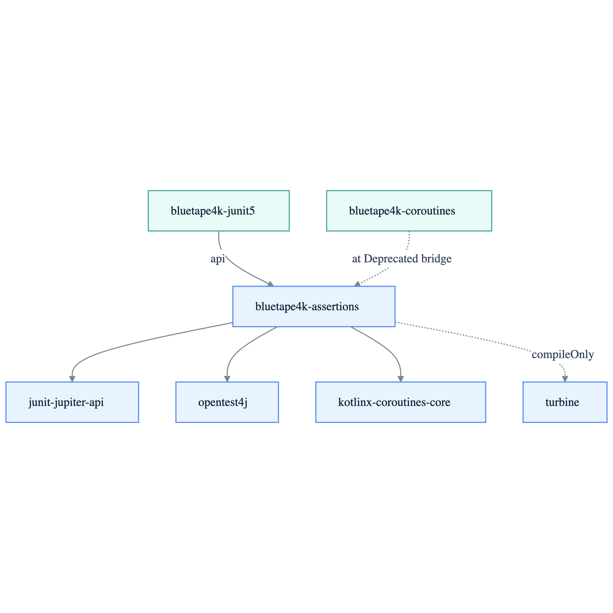

# bluetape4k-assertions

[English](README.md)

JUnit 5 기반의 bluetape4k assertion DSL입니다. 공개 DSL에 필요한 JUnit Jupiter API와 Kotlin coroutines만 api scope로 노출하고,
Turbine 연동은 `compileOnly`로 유지합니다.

## 아키텍처



## 기능

- **bluetape4k assertion API 스타일**: 익숙한 infix 함수 이름과 명확한 동등성 의미 제공
- **기본**: `shouldBe` (ref ===), `shouldBeEqualTo` (value ==), `shouldNotBeNull` 스마트 캐스트 지원
- **숫자 비교**: `shouldBeLessThan`, `shouldBeGreaterOrEqualTo`, 부호 확인, signed/unsigned 범위 포함 확인
- **컬렉션/배열/맵**: 내용 동등성, 포함 검증 (`shouldContainAll`, `shouldNotContainAny`)
- **문자열**: `shouldStartWith`, `shouldEndWith`, `shouldContain`, 대소문자 무시 검증
- **예외**: `invoking { }` / `shouldThrow`, 메시지 검증, 원인 검사
- **비동기 예외**: `coInvoking { }` / `shouldThrow` — CancellationException 안전 coroutine 지원
- **리플렉션**: `shouldBeInstanceOf<T>` 스마트 캐스트 지원
- **날짜시간**: `shouldBeAfter`, `shouldBeBefore`, `shouldBeOnOrAfter` (7가지 java.time 타입)
- **Softly**: `assertSoftly { add { } }` — 가상 스레드 안전, `MultipleFailuresError` 수집
- **Flow 검증**: `assertEmpty`, `assertResult`, `assertResultSet`, `assertFailure`, `assertError`
- **Turbine 통합**: `awaitItemAndAssert`, `awaitItemMatching`, `awaitErrorOfType` (선택사항, compileOnly)

## 빠른 시작

### Gradle 의존성

```kotlin
// build.gradle.kts
testImplementation("io.github.bluetape4k:bluetape4k-assertions:${bluetape4kVersion}")
// 또는 bluetape4k-junit5를 통해 전이적 포함
testImplementation("io.github.bluetape4k:bluetape4k-junit5:${bluetape4kVersion}")
```

### 사용 예시

```kotlin
import io.bluetape4k.assertions.*
import io.bluetape4k.assertions.coroutines.assertEmpty
import io.bluetape4k.assertions.coroutines.assertResult
import kotlinx.coroutines.delay
import kotlinx.coroutines.flow.emptyFlow
import kotlinx.coroutines.flow.flowOf
import kotlinx.coroutines.test.runTest
import org.junit.jupiter.api.Test
import java.time.LocalDateTime

class MyTest {
    @Test
    fun `기본 검증`() {
        // 기본
        "hello" shouldBeEqualTo "hello"
        "hello" shouldNotBeEqualTo "world"
        
        // shouldNotBeNull 후 스마트 캐스트
        val name: String? = "John"
        name.shouldNotBeNull().length shouldBeGreaterThan 0
        
        // 컬렉션
        listOf(1, 2, 3) shouldContainAll listOf(1, 2)
        listOf(1, 2, 3) shouldNotContainAny listOf(4, 5)
        listOf("GET", "POST") shouldContainIgnoringCase "post"
        
        // 문자열
        "hello".shouldStartWith("he")
        "hello".shouldEndWith("lo")
        
        // 숫자 비교
        5 shouldBeLessThan 10
        5 shouldBeGreaterOrEqualTo 5
        5 shouldBeInRange 1..10
        UInt.MAX_VALUE shouldBeInRange Int.MAX_VALUE.toUInt()..UInt.MAX_VALUE
        5.0.shouldBeNear(5.1, tolerance = 0.2)
        
        // 예외
        invoking { error("boom") }.shouldThrow(IllegalStateException::class)
        
        // 리플렉션
        listOf(1, 2, 3).shouldBeInstanceOf<List<*>>()
        
        // 날짜시간
        val now = LocalDateTime.now()
        now.shouldBeAfter(now.minusSeconds(1))
        now.shouldBeOnOrBefore(now.plusSeconds(1))
    }

    @Test
    fun `coroutine 검증`() = runTest {
        coInvoking { delay(10) }.shouldNotThrow()
        flowOf(1, 2, 3).assertResult(1, 2, 3)
        emptyFlow<Int>().assertEmpty()
    }
    
    @Test
    fun `softly 검증`() {
        assertSoftly {
            add { 1 shouldBeEqualTo 1 }
            add { "a" shouldStartWith "a" }
            add { listOf(1) shouldContainAll listOf(1) }
        }
        // 모든 검증 수집, 실패 시 MultipleFailuresError 발생
    }
    
}
```

## API 레퍼런스

### 기본 검증

| 함수 | 설명 |
|------|------|
| `shouldBe(expected)` | 참조 동일성 (===) |
| `shouldNotBe(expected)` | 참조 다름 (!==) |
| `shouldBeEqualTo(expected)` | 값 동등성 (==) |
| `shouldNotBeEqualTo(expected)` | 값 다름 (!=) |
| `shouldBeNull()` | null 확인 |
| `shouldNotBeNull()` | null 아님 확인 (스마트 캐스트) |

### 숫자 비교

| 함수 | 설명 |
|------|------|
| `shouldBeLessThan(bound)` | < |
| `shouldBeLessOrEqualTo(bound)` | <= |
| `shouldBeGreaterThan(bound)` | > |
| `shouldBeGreaterOrEqualTo(bound)` | >= |
| `shouldBePositive()` | > 0 |
| `shouldBeNegative()` | < 0 |
| `shouldBeInRange(range)` | 닫힌 범위 포함 확인 |
| `shouldNotBeInRange(range)` | 닫힌 범위 미포함 확인 |
| `UInt/ULong shouldBeInRange range` | unsigned 범위 포함 확인 |
| `UInt/ULong shouldNotBeInRange range` | unsigned 범위 미포함 확인 |
| `shouldBeNear(expected, tolerance)` | 부동소수점 근사 동등 |
| `BigDecimal shouldBeEqualTo expected` | scale 무관 동등 (`compareTo`) |
| `BigDecimal shouldNotBeEqualTo expected` | scale 무관 비동등 (`compareTo`) |

### 컬렉션 & 배열

| 함수 | 설명 |
|------|------|
| `shouldBeEmpty()` | 빈 컬렉션 |
| `shouldNotBeEmpty()` | 비어있지 않음 |
| `shouldContainAll(elements)` | 모든 요소 포함 (⊇) |
| `shouldNotContainAny(elements)` | 어떤 요소도 미포함 (∩ = ∅) |
| `shouldContainIgnoringCase(element)` | 문자열 컬렉션에서 대소문자 무시 요소 포함 |
| `shouldHaveSize(size)` | 크기 확인 |
| `shouldContain(element)` | 요소 포함 |
| `IntArray shouldBeEqualTo expected` | primitive 배열 내용 동등 (`contentEquals`) |
| `ByteArray shouldBeEqualTo expected` | primitive 배열 내용 동등 (`contentEquals`) |
| `Array<T> shouldBeEqualTo expected` | 객체 배열 deep 내용 동등 (`contentDeepEquals`) |

### 예외

| 함수 | 설명 |
|------|------|
| `invoking { }.shouldThrow(E::class)` | 동기 블록이 E 예외 발생 |
| `invoking { }.shouldNotThrow()` | 동기 블록이 예외 미발생 |
| `coInvoking { }.shouldThrow(E::class)` | 비동기 블록이 E 예외 발생 |
| `.withMessage(msg)` | 정확한 메시지 일치 (체이닝) |
| `.withMessageContaining(substring)` | 메시지 부분 포함 (체이닝) |

### 리플렉션

| 함수 | 설명 |
|------|------|
| `shouldBeInstanceOf<T>()` | 인스턴스 확인 (스마트 캐스트) |
| `shouldNotBeInstanceOf<T>()` | 인스턴스 아님 확인 |

## 마이그레이션 참고

패키지는 `io.bluetape4k.assertions`를 유지하지만, 동등성 의미는 의도적으로 분리했습니다.

| 기존 기대 동작 | 이 모듈에서 사용할 함수 | 주의사항 |
|--------|----------------------|---------|
| `shouldBe`로 값 동등성 확인 | `shouldBeEqualTo` | 구조적 동등성(`==`) 확인 |
| `shouldBe` (ref ===) | `shouldBe` | 동일한 동작 |
| `shouldNotBeNull()` | `shouldNotBeNull()` | + 스마트 캐스트 지원 |
| `shouldThrow(E::class)` | `invoking { }.shouldThrow(E::class)` | 명시적 블록 래퍼 |
| `shouldHaveMessage()` | `.withMessage()` | InvokingBlock에서 체이닝 |
| `coInvoking { }` | `coInvoking { }` | 완전한 coroutine 지원 |

### 중요한 의미 변화

**이 모듈의 `shouldBe`는 `===` (참조 동일성)를 사용합니다.**
**`==` (값 동등성) 검증에는 `shouldBeEqualTo`를 사용하세요.**

이 분리는 의도적인 설계입니다. 테스트에서 값 동등성과 객체 동일성을 한 함수 이름에 의존하지 않고 명확히 구분할 수 있습니다.

```kotlin
// 구조적 동등성
"a" shouldBeEqualTo "a"  // 통과 (== 비교)

// 이 모듈
"a" shouldBe "a"  // 실패! (=== 비교)
"a" shouldBeEqualTo "a"  // 통과 (== 비교)
```

---

**유지보수자**: Sunghyouk Bae (@sunghyouk.bae@gmail.com)
**라이선스**: MIT
