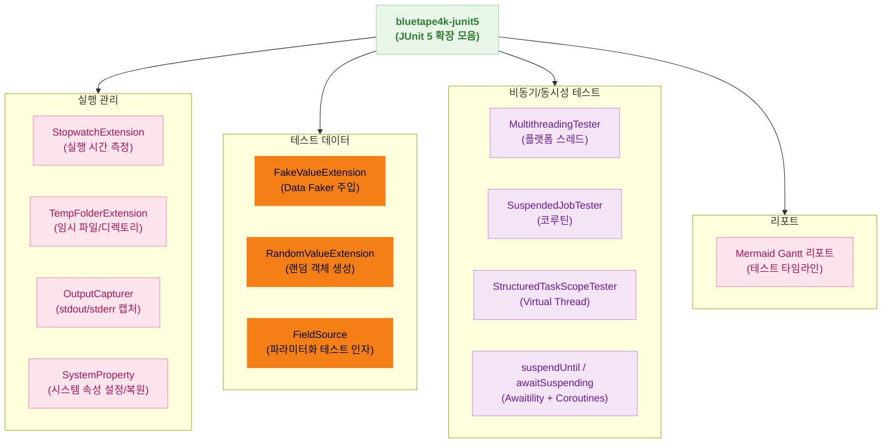

# Module bluetape4k-junit5

[English](./README.md) | 한국어

JUnit 5 테스트 작성 시 반복 코드를 줄여주는 확장 라이브러리입니다.

## 아키텍처

### 확장 기능 구성 다이어그램



### 클래스 다이어그램

```mermaid
classDiagram
    class StopwatchExtension {
        +beforeEach(context)
        +afterEach(context)
    }
    class TempFolderExtension {
        +beforeEach(context)
        +afterEach(context)
        +resolveParameter(context) TempFolder
    }
    class TempFolder {
        +root: File
        +rootPath: String
        +createFile(name) File
        +createDirectory(name) File
        +close()
    }
    class OutputCapturer {
        +capture() String
        +expect(block)
    }
    class FakeValueExtension {
        +beforeEach(context)
        +resolveParameter(context) Any
    }
    class Fakers {
        +randomString(min, max) String
        +fixedString(length) String
        +numberString(pattern) String
        +randomUuid() String
    }
    class MultithreadingTester {
        +workers(n) MultithreadingTester
        +rounds(n) MultithreadingTester
        +add(block) MultithreadingTester
        +run()
    }
    class SuspendedJobTester {
        +workers(n) SuspendedJobTester
        +rounds(n) SuspendedJobTester
        +add(block) SuspendedJobTester
        +run()
    }
    class StructuredTaskScopeTester {
        +rounds(n) StructuredTaskScopeTester
        +add(block) StructuredTaskScopeTester
        +run()
    }

    TempFolderExtension --> TempFolder : provides
    MultithreadingTester --> SuspendedJobTester : similar API
    StructuredTaskScopeTester --> SuspendedJobTester : similar API

    style StopwatchExtension fill:#FCE4EC,stroke:#F48FB1,color:#AD1457
    style TempFolderExtension fill:#FCE4EC,stroke:#F48FB1,color:#AD1457
    style TempFolder fill:#FFFDE7,stroke:#FFF176,color:#F57F17
    style OutputCapturer fill:#FCE4EC,stroke:#F48FB1,color:#AD1457
    style FakeValueExtension fill:#FCE4EC,stroke:#F48FB1,color:#AD1457
    style Fakers fill:#FFF3E0,stroke:#FFCC80,color:#E65100
    style MultithreadingTester fill:#F3E5F5,stroke:#CE93D8,color:#6A1B9A
    style SuspendedJobTester fill:#F3E5F5,stroke:#CE93D8,color:#6A1B9A
    style StructuredTaskScopeTester fill:#F3E5F5,stroke:#CE93D8,color:#6A1B9A
```



## 주요 기능

- **Stopwatch Extension**: 테스트 실행 시간 측정
- **TempFolder Extension**: 테스트용 임시 디렉토리/파일 제공, 테스트 완료 후 자동 삭제
- **Output Capture**: System.out/err 및 로그 출력 캡처
- **Random/Faker 확장**: 랜덤/가짜 데이터 주입
- **System Property 확장**: 테스트 중 시스템 속성 설정/복원
- **Awaitility + Coroutines**: suspend 조건 대기 유틸
- **Stress Tester**: 멀티스레드/가상스레드/코루틴 기반 스트레스 테스트
- **Parameter Source 확장**: FieldSource 기반 인자 제공
- **Mermaid 리포트**: 테스트 실행 결과를 Mermaid Gantt 타임라인으로 출력

## 사용 예시

### 1. Stopwatch Extension

```kotlin
@ExtendWith(StopwatchExtension::class)
class MyTest {
    @Test
    fun `테스트 메소드`() {
        // 로그: Starting test: [테스트 메소드]
        // ...
        // 로그: Completed test: [테스트 메소드] took 123 msecs.
    }
}

// 어노테이션 단축형 사용
@StopwatchTest
fun `테스트 실행 시간 측정`() { }
```

### 2. TempFolder Extension

```kotlin
@ExtendWith(TempFolderExtension::class)
class FileProcessingTest {
    lateinit var tempFolder: TempFolder

    @BeforeEach
    fun setup(tempFolder: TempFolder) {
        this.tempFolder = tempFolder
    }

    @Test
    fun `파일 처리 테스트`() {
        val inputFile = tempFolder.createFile("input.txt")
        inputFile.writeText("test data")

        val outputDir = tempFolder.createDirectory("output")
        processFile(inputFile, outputDir)
        // 테스트 완료 후 자동 삭제
    }
}
```

#### TempFolder 주요 메소드

```kotlin
val tempFolder = TempFolder()

val autoNamedFile = tempFolder.createFile()
val namedFile = tempFolder.createFile("config.yml")
val dir = tempFolder.createDirectory("logs")

println(tempFolder.root)      // File 객체
println(tempFolder.rootPath)  // String

tempFolder.close()  // 수동 삭제 (Closeable 구현)
```

### 3. Output Capture

```kotlin
@OutputCapture
class OutputCaptureTest {

    @Test
    fun `stdout 캡처`(capturer: OutputCapturer) {
        println("Hello, Console!")
        System.err.println("Error message")

        val output = capturer.capture()
        output shouldContain "Hello, Console!"
        output shouldContain "Error message"
    }

    @Test
    fun `expect 블록으로 검증`(capturer: OutputCapturer) {
        println("Test output")
        capturer.expect { captured ->
            captured shouldContain "Test output"
        }
    }
}
```

### 4. Faker 확장

```kotlin
@ExtendWith(FakeValueExtension::class)
class FakeValueTest {

    @FakeValue(provider = "name.fullName")
    private lateinit var fullName: String

    @FakeValue(provider = "address.city", size = 5)
    private lateinit var cities: List<String>

    @Test
    fun `필드에 Fake 값 주입`() {
        println(fullName)   // "John Doe"
        println(cities)     // ["Seoul", "Tokyo", "New York", ...]
    }

    @Test
    fun `파라미터로 Fake 값 받기`(
        @FakeValue(provider = "name.firstName") firstName: String,
        @FakeValue(provider = "internet.emailAddress") email: String,
    ) {
        println(firstName)  // "John"
        println(email)      // "john@example.com"
    }
}
```

#### Fakers 유틸리티

```kotlin
val randomText = Fakers.randomString(10, 20)
val fixedText = Fakers.fixedString(16)
val phone = Fakers.numberString("010-####-####")  // "010-1234-5678"
val code = Fakers.letterString("???-###")         // "ABC-123"
val id = Fakers.alphaNumericString("?#?#?#")      // "A1B2C3"
val uuid = Fakers.randomUuid()
```

### 5. Random 확장

```kotlin
@RandomizedTest
class RandomizedTestExample {

    @RandomValue
    private lateinit var randomString: String

    @RandomValue(excludes = ["id", "password"])
    private lateinit var user: User

    @RandomValue(type = User::class, size = 10)
    private lateinit var users: List<User>

    @Test
    fun `필드에 랜덤 값 주입`() {
        println(randomString)
        println(user)
        users.forEach { println(it) }
    }
}
```

### 6. System Property 확장

```kotlin
@SystemProperty(name = "app.environment", value = "test")
class SystemPropertyTest {

    @Test
    fun `시스템 속성 사용`() {
        System.getProperty("app.environment") shouldBe "test"
        // 테스트 완료 후 자동 복원
    }
}

// 여러 속성 설정
@Test
@SystemProperties(
    SystemProperty(name = "cache.enabled", value = "false"),
    SystemProperty(name = "cache.ttl", value = "60")
)
fun `캐시 설정 테스트`() { }
```

### 7. Awaitility + Coroutines

```kotlin
@Test
fun `suspend 조건 대기`() = runSuspendTest {
    val state = MutableStateFlow(0)

    launch {
        delay(100)
        state.value = 42
    }

    await atMost 5.seconds untilSuspending {
        state.value == 42
    }
}
```

### 8. Stress Tester

#### 실행 모델 요약

- `MultithreadingTester`: `workers * rounds` 실행 단위를 worker 고정 개수로 분배
- `SuspendedJobTester`: `rounds * 등록된 suspend 블록 수` 실행 단위를 worker 고정 개수로 분배
- 두 구현 모두 라운드 수가 커져도 worker 수만큼만 실행자(스레드/코루틴)를 유지해 메모리 사용량을 안정적으로 유지

```kotlin
// 플랫폼 스레드
MultithreadingTester()
    .workers(Runtime.getRuntime().availableProcessors())
    .rounds(100)
    .add { counter.incrementAndGet() }
    .run()

// 코루틴
SuspendedJobTester()
    .workers(16)
    .rounds(100)
    .add {
        delay(10)
        synchronized(results) { results.add(1) }
    }
    .run()

// Virtual Thread (Java 21+)
StructuredTaskScopeTester()
    .rounds(1000)
    .add { processRequest() }
    .add { handleResponse() }
    .run()
```

### 9. Coroutine Support

```kotlin
@Test
fun `기본 suspend 테스트`() = runSuspendTest {
    val result = someSuspendFunction()
    result shouldBe "expected"
}

@Test
fun `IO 작업 테스트`() = runSuspendIO {
    val data = readFromFile()
    processData(data)
}

@Test
fun `CPU 집약적 작업 테스트`() = runSuspendDefault {
    val result = heavyComputation()
    result shouldBe 42
}

@Test
fun `Virtual Thread 환경 테스트`() = runSuspendVT {
    val result = blockingOperation()
    result shouldBe "success"
}
```

### 10. FieldSource (Parameterized Test)

```kotlin
class FieldSourceTest {

    val isBlankArguments = listOf(
        argumentOf(null, true),
        argumentOf("", true),
        argumentOf("  ", true),
        argumentOf("not blank", false)
    )

    @ParameterizedTest
    @FieldSource("isBlankArguments")
    fun `isBlank 테스트`(input: String?, expected: Boolean) {
        input.isNullOrBlank() shouldBe expected
    }
}
```

### 11. Mermaid 리포트

```bash
# 테스트 실행 및 Mermaid 리포트 추출
./gradlew :testing:junit5:test | awk 'f||/^gantt$/{f=1; print}' > gantt.mermaid
```

출력 예시:

```mermaid
gantt
    title Test Execution Timeline
    dateFormat X
    axisFormat %s

    section TestClass1
        testMethod1: active, 0, 123
        testMethod2: active, 123, 456
        failingTest: crit, 456, 789
```



- `active`: 성공한 테스트
- `crit`: 실패한 테스트
- `done`: 중단된 테스트

## 모범 사례

- 임시 파일이 필요한 테스트에는 ad hoc 경로 대신 `TempFolderExtension`을 사용하세요.
- 콘솔 출력을 검증해야 할 때는 `OutputCapture`를 사용하세요.
- 샘플 값에는 하드코딩 대신 `FakeValue`/`Fakers` 프로바이더를 활용하세요.
- 동시성 테스트에는 제공되는 Stress Tester 헬퍼를 재사용하세요 — 라운드 수가 증가해도 worker 수를 일정하게 유지합니다.

## 의존성 추가

```kotlin
dependencies {
    testImplementation("io.github.bluetape4k:bluetape4k-junit5:${version}")
}
```

## 참고

- [JUnit 5 User Guide](https://junit.org/junit5/docs/current/user-guide/)
- [Awaitility](https://github.com/awaitility/awaitility)
- [Data Faker](https://www.datafaker.net/)
- [Enhanced Random Beans](https://github.com/benas/random-beans)
