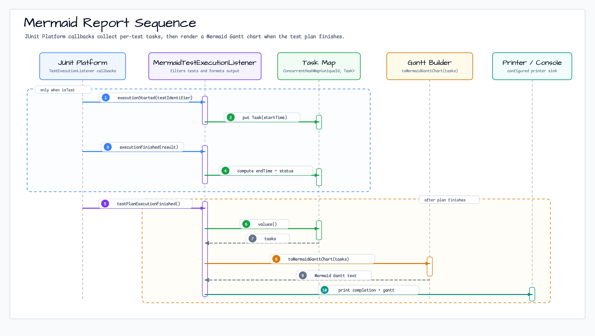

# Module bluetape4k-junit5

[English](./README.md) | 한국어

JUnit 5 테스트 작성 시 반복 코드를 줄여주는 확장 라이브러리입니다.

## 아키텍처

### 확장 기능 구성 다이어그램


### 클래스 다이어그램


## 주요 기능

- **Stopwatch Extension**: 테스트 실행 시간 측정
- **TempFolder Extension**: 테스트용 임시 디렉토리/파일 제공, 테스트 완료 후 자동 삭제
- **Output Capture**: System.out/err 및 로그 출력 캡처
- **Random/Faker 확장**: 랜덤/가짜 데이터 주입
- **System Property 확장**: 테스트 중 시스템 속성 설정/복원
- **Awaitility + Coroutines**: suspend 조건 대기 유틸
- **Coroutine Cancellation Contracts**: cancellation 전파, waiter 정리, resource cancellation 검증
- **HTTP Observability Conformance**: 안정적인 route, 결과 분류, correlation, 민감 정보 제외 검증
- **Stress Tester**: 멀티스레드/가상스레드/코루틴 기반 스트레스 테스트
- **Parameter Source 확장**: FieldSource 기반 인자 제공
- **Mermaid 리포트**: 테스트 실행 결과를 Mermaid Gantt 타임라인으로 출력

## 사용 예시

### 1. Stopwatch Extension

```kotlin
@ExtendWith(StopwatchExtension::class)
class MyTest {
    @Test
    fun `테스트 메소드`() {
        // 로그: Starting test: [테스트 메소드]
        // ...
        // 로그: Completed test: [테스트 메소드] took 123 msecs.
    }
}

// 어노테이션 단축형 사용
@StopwatchTest
fun `테스트 실행 시간 측정`() { }
```

### 2. TempFolder Extension

```kotlin
@ExtendWith(TempFolderExtension::class)
class FileProcessingTest {
    lateinit var tempFolder: TempFolder

    @BeforeEach
    fun setup(tempFolder: TempFolder) {
        this.tempFolder = tempFolder
    }

    @Test
    fun `파일 처리 테스트`() {
        val inputFile = tempFolder.createFile("input.txt")
        inputFile.writeText("test data")

        val outputDir = tempFolder.createDirectory("output")
        processFile(inputFile, outputDir)
        // 테스트 완료 후 자동 삭제
    }
}
```

#### TempFolder 주요 메소드

`TempFolder.createFile(name)`과 `createDirectory(name)`은 임시 루트 아래의 상대 이름만 허용합니다.
blank 이름, 절대 경로, `..` 경로 순회, 임시 루트 밖으로 해석되는 symlink 부모는 거부됩니다.

```kotlin
val tempFolder = TempFolder()

val autoNamedFile = tempFolder.createFile()
val namedFile = tempFolder.createFile("config.yml")
val dir = tempFolder.createDirectory("logs")
// tempFolder.createFile("../escape.txt") 는 IllegalArgumentException 발생

println(tempFolder.root)      // File 객체
println(tempFolder.rootPath)  // String

tempFolder.close()  // 수동 삭제 (Closeable 구현)
```

### 3. Output Capture

```kotlin
@OutputCapture
class OutputCaptureTest {

    @Test
    fun `stdout 캡처`(capturer: OutputCapturer) {
        println("Hello, Console!")
        System.err.println("Error message")

        val output = capturer.capture()
        output shouldContain "Hello, Console!"
        output shouldContain "Error message"
    }

    @Test
    fun `expect 블록으로 검증`(capturer: OutputCapturer) {
        println("Test output")
        capturer.expect { captured ->
            captured shouldContain "Test output"
        }
    }
}
```

### 4. Faker 확장

```kotlin
@ExtendWith(FakeValueExtension::class)
class FakeValueTest {

    @FakeValue(provider = "name.fullName")
    private lateinit var fullName: String

    @FakeValue(provider = "address.city", size = 5)
    private lateinit var cities: List<String>

    @Test
    fun `필드에 Fake 값 주입`() {
        println(fullName)   // "John Doe"
        println(cities)     // ["Seoul", "Tokyo", "New York", ...]
    }

    @Test
    fun `파라미터로 Fake 값 받기`(
        @FakeValue(provider = "name.firstName") firstName: String,
        @FakeValue(provider = "internet.emailAddress") email: String,
    ) {
        println(firstName)  // "John"
        println(email)      // "john@example.com"
    }
}
```

#### Fakers 유틸리티

```kotlin
val randomText = Fakers.randomString(10, 20)
val fixedText = Fakers.fixedString(16)
val phone = Fakers.numberString("010-####-####")  // "010-1234-5678"
val code = Fakers.letterString("???-###")         // "ABC-123"
val id = Fakers.alphaNumericString("?#?#?#")      // "A1B2C3"
val uuid = Fakers.randomUuid()
```

### 5. Random 확장

```kotlin
@RandomizedTest
class RandomizedTestExample {

    @RandomValue
    private lateinit var randomString: String

    @RandomValue(excludes = ["id", "password"])
    private lateinit var user: User

    @RandomValue(type = User::class, size = 10)
    private lateinit var users: List<User>

    @Test
    fun `필드에 랜덤 값 주입`() {
        println(randomString)
        println(user)
        users.forEach { println(it) }
    }
}
```

### 6. System Property 확장

```kotlin
@SystemProperty(name = "app.environment", value = "test")
class SystemPropertyTest {

    @Test
    fun `시스템 속성 사용`() {
        System.getProperty("app.environment") shouldBe "test"
        // 테스트 완료 후 자동 복원
    }
}

// 여러 속성 설정
@Test
@SystemProperties(
    SystemProperty(name = "cache.enabled", value = "false"),
    SystemProperty(name = "cache.ttl", value = "60")
)
fun `캐시 설정 테스트`() { }
```

### 7. Awaitility + Coroutines

```kotlin
@Test
fun `suspend 조건 대기`() = runSuspendTest {
    val state = MutableStateFlow(0)

    launch {
        delay(100)
        state.value = 42
    }

    await atMost 5.seconds untilSuspending {
        state.value == 42
    }
}
```

### 8. Coroutine Cancellation Contracts

callback, future, HTTP call, 공유 waiter를 감싸는 suspend API는 cancellation 계약을 명시적으로 테스트하세요.

```kotlin
@Test
fun `wrapper rethrows cancellation`() = runTest {
    assertCancellationPropagates {
        client.tryFetchSuspending {
            delay(Long.MAX_VALUE)
        }
    }
}

@Test
fun `cancelled waiter does not block the next waiter`() = runTest {
    assertCancellationClearsWaiter(
        awaiter = { gate.await() },
        releaser = { gate.resume() },
    )
}

@Test
fun `cancellation cancels the underlying call`() = runSuspendIO {
    assertResourceCancelledOnCoroutineCancellation(
        beforeCancel = { waitUntilRequestStarted() },
        resourceCancelled = { call.isCanceled },
    ) {
        call.suspendExecute()
    }
}
```

suspend API에서 cancellation 전파가 필요하다면 plain `runCatching`으로 감싸면 안 됩니다.
`CancellationException`은 structured concurrency의 cancellation 신호이므로 반드시 다시 던져야 합니다.
non-cancellation 실패만 `Result`로 반환하려면 `runCatchingNonCancellation` 또는
`resultOfNonCancellation`을 사용하세요.

### HTTP Observability Conformance

Spring Boot, Ktor 같은 서버 통합 테스트에서 registry 또는 tracer 결과를 `HttpOperationObservation`으로
변환한 뒤 같은 계약으로 검증할 수 있습니다.

```kotlin
assertHttpOperationObservability(
    observation = HttpOperationObservation(
        operationName = "http.server.requests",
        routeTemplate = "/sales/{saleId}",
        statusCode = 200,
        classification = HttpOperationClassification.SUCCESS,
        correlation = HttpOperationCorrelation(
            inbound = requestId,
            outbound = responseRequestId,
            mode = HttpOperationCorrelationMode.PROPAGATED,
        ),
        metricAttributes = metricTags,
    ),
    expectation = HttpOperationExpectation(
        operationName = "http.server.requests",
        routeTemplate = "/sales/{saleId}",
        statusCode = 200,
        classification = HttpOperationClassification.SUCCESS,
        sensitiveValues = HttpOperationSensitiveValues(
            rawUrl = rawUrl,
            query = query,
            clientIp = clientIp,
            userId = userId,
            saleId = saleId,
            requestPayload = payload,
        ),
    ),
)
```

fixture는 operation과 route의 안정성, status와 일치하는
success/client-error/timeout-or-cancellation/dependency-failure 분류, propagated/generated/absent correlation
의미, 민감한 metric 값 제외 여부를 확인합니다. 여섯 종류의 대표 민감 입력은 모두 필수입니다. 검증에
성공하면 classification, status code, metric attribute 개수만 로그에 남기고, assertion 실패 메시지에서는
비교값을 redaction하여 raw telemetry 값을 기록하지 않습니다.

registry, tracer, exporter, OpenTelemetry SDK의 lifecycle은 테스트가 직접 소유합니다. 이 fixture는
framework-neutral snapshot만 검증하며 telemetry 인프라를 설치하거나 종료하지 않습니다.

### Context Propagation Conformance

provider-neutral fixture는 실제 framework adapter가 suspension 전후에 동일한 parent marker를 노출하고,
실제 terminal 결과를 보존하며, context를 정리하고, 동시 요청을 격리하는지 증명합니다. 실제 framework
context를 snapshot으로 변환하는 책임은 adapter에 있으며 fixture는 interception을 설치하지 않습니다.

`null`은 root context를 뜻합니다. `SUCCESS`, `FAILURE`, `CANCELLATION`, `DEADLINE_EXCEEDED`는 서로 다른
terminal 결과입니다. 진단은 제한된 좌표와 실제 literal `values redacted`(값 비공개)만 제공하며 raw
marker 값을 포함하지 않습니다. marker-bearing snapshot의 `toString()`도 같은 redaction 규칙을 따릅니다.

test-owned synthetic marker만 사용해야 합니다. production request ID, user data, external trace ID를 전달하면
안 됩니다. `Serializable` snapshot은 테스트 교환값일 뿐 persistence/wire contract가 아니므로 장기 저장하지
마세요. enum 값 추가는 additive이므로 caller의 exhaustive when에는 `else`를 두어야 합니다. data-class
constructor 변경은 compatibility-sensitive하므로 snapshot을 구조분해하거나 constructor layout을 저장
포맷으로 의존하지 마세요.

```kotlin
import io.bluetape4k.junit5.observability.*
import kotlinx.coroutines.asContextElement
import kotlinx.coroutines.runBlocking
import kotlinx.coroutines.withContext
import kotlinx.coroutines.yield

val marker = "synthetic-parent"
val markerContext = ThreadLocal<String?>()
val observation = runBlocking {
    val observed = mutableListOf<ContextMarkerObservation>()
    withContext(markerContext.asContextElement(marker)) {
        observed += ContextMarkerObservation(
            ContextObservationPoint.BOUNDARY_ENTER,
            markerContext.get(),
        )
        yield()
        observed += ContextMarkerObservation(
            ContextObservationPoint.AFTER_SUSPENSION,
            markerContext.get(),
        )
        observed += ContextMarkerObservation(
            ContextObservationPoint.BEFORE_TERMINAL,
            markerContext.get(),
        )
    }
    ContextPropagationObservation(
        boundary = ContextPropagationBoundary.COROUTINE,
        scenario = ContextPropagationScenario.SUCCESS,
        requestAlias = ContextRequestAlias.SINGLE,
        markerObservations = observed,
        cleanupProbes = listOf(
            ContextCleanupProbe(ContextProbeLocation.CALLER, markerContext.get()),
        ),
        terminal = ContextPropagationTerminal.SUCCESS,
    )
}
val expectedMarker = "synthetic-parent"
val expectation = ContextPropagationExpectation(
    boundary = ContextPropagationBoundary.COROUTINE,
    scenario = ContextPropagationScenario.SUCCESS,
    requestAlias = ContextRequestAlias.SINGLE,
    markerExpectations = listOf(
        ContextMarkerExpectation(
            ContextObservationPoint.BOUNDARY_ENTER,
            expectedMarker,
        ),
        ContextMarkerExpectation(
            ContextObservationPoint.AFTER_SUSPENSION,
            expectedMarker,
        ),
        ContextMarkerExpectation(
            ContextObservationPoint.BEFORE_TERMINAL,
            expectedMarker,
        ),
    ),
    cleanupExpectations = listOf(
        ContextCleanupExpectation(ContextProbeLocation.CALLER, null),
    ),
    expectedTerminal = ContextPropagationTerminal.SUCCESS,
)

assertContextPropagationConformance(observation, expectation)
```

```kotlin
import io.bluetape4k.junit5.observability.*
import kotlinx.coroutines.CompletableDeferred
import kotlinx.coroutines.asContextElement
import kotlinx.coroutines.async
import kotlinx.coroutines.runBlocking
import kotlinx.coroutines.withContext
import kotlinx.coroutines.yield

val markerContext = ThreadLocal<String?>()
val isolationObservation = runBlocking {
    val readyA = CompletableDeferred<Unit>()
    val readyB = CompletableDeferred<Unit>()

    suspend fun observe(
        alias: ContextRequestAlias,
        marker: String,
        ownReady: CompletableDeferred<Unit>,
        peerReady: CompletableDeferred<Unit>,
    ): ContextIsolationSample =
        withContext(markerContext.asContextElement(marker)) {
            ownReady.complete(Unit)
            peerReady.await()
            val observed = mutableListOf(markerContext.get())
            yield()
            observed += markerContext.get()
            ContextIsolationSample(alias, observed)
        }

    val sampleA = async {
        observe(ContextRequestAlias.REQUEST_A, "synthetic-parent-A", readyA, readyB)
    }
    val sampleB = async {
        observe(ContextRequestAlias.REQUEST_B, "synthetic-parent-B", readyB, readyA)
    }
    val probe = withContext(markerContext.asContextElement("synthetic-probe")) {
        markerContext.get()
    }
    ContextIsolationObservation(
        boundary = ContextPropagationBoundary.COROUTINE,
        samples = listOf(
            sampleA.await(),
            sampleB.await(),
            ContextIsolationSample(ContextRequestAlias.PROBE, listOf(probe)),
        ),
        cleanupProbes = listOf(
            ContextCleanupProbe(ContextProbeLocation.CALLER, markerContext.get()),
        ),
    )
}
val isolationExpectation = ContextIsolationExpectation(
    boundary = ContextPropagationBoundary.COROUTINE,
    samples = listOf(
        ContextIsolationSampleExpectation(
            requestAlias = ContextRequestAlias.REQUEST_A,
            mode = ContextMarkerExpectationMode.EXACT,
            expectedMarker = "synthetic-parent-A",
            minimumObservationCount = 2,
        ),
        ContextIsolationSampleExpectation(
            requestAlias = ContextRequestAlias.REQUEST_B,
            mode = ContextMarkerExpectationMode.EXACT,
            expectedMarker = "synthetic-parent-B",
            minimumObservationCount = 2,
        ),
        ContextIsolationSampleExpectation(
            requestAlias = ContextRequestAlias.PROBE,
            mode = ContextMarkerExpectationMode.NOT_IN,
            forbiddenMarkers = listOf(
                "synthetic-parent-A",
                "synthetic-parent-B",
            ),
        ),
    ),
    cleanupExpectations = listOf(
        ContextCleanupExpectation(ContextProbeLocation.CALLER, null),
    ),
)

assertContextIsolation(isolationObservation, isolationExpectation)
```

framework가 lifecycle을 소유하는 전체 adapter proof는 compile-checked
[coroutine, Reactor, executor conformance test](../../infra/opentelemetry/src/test/kotlin/io/bluetape4k/opentelemetry/context/ContextPropagationConformanceTest.kt),
[Spring Observation test](../../spring-boot/core/src/test/kotlin/io/bluetape4k/spring/observability/SpringContextPropagationConformanceTest.kt),
[Ktor request test](../../ktor/observability/src/test/kotlin/io/bluetape4k/ktor/observability/KtorContextPropagationConformanceTest.kt)를
참고하세요.

### Bounded-Wait HTTP Idempotency Conformance

opt-in fixture로 framework adapter가 동일한 observable HTTP 계약을 만족하는지 검증합니다. 아래 설정은
instance-scoped test input이며 production 기본값이 아닙니다.

```kotlin
val config = BoundedWaitHttpIdempotencyConformanceConfig(
    waitTimeout = Duration.ofSeconds(2),
    scenarioTimeout = Duration.ofSeconds(15),
    maxWaitersPerKey = 8,
    retention = Duration.ofHours(24),
    inFlightRetryAfter = Duration.ofSeconds(1),
    overflowRetryAfter = Duration.ofSeconds(2),
    maxIdempotencyKeyBytes = 255,
    maxRequestBodyBytes = 64 * 1024,
    maxReplayBodyBytes = 64 * 1024,
    maxReplayHeaderNames = 8,
    maxReplayValuesPerHeader = 4,
    maxReplayHeaderValueBytes = 4 * 1024,
    maxReplayHeaderBytes = 16 * 1024,
)
assertBoundedWaitHttpIdempotencyConformance(adapter, config)
```

| 관찰 | 안정된 결과 | caller 대응 |
| --- | --- | --- |
| 첫 요청이 실행 ownership을 얻음 | `Idempotency-Replayed: false`가 있는 terminal application response | 일반 response 처리를 계속합니다. |
| 같은 command가 terminal record에 도달함 | `Idempotency-Replayed: true`가 있는 동일 terminal response | terminal replay로 처리하고 business effect를 반복하지 않습니다. |
| 같은 key에 다른 canonical payload를 보냄 | `409 idempotency_key_reused` | 자동 retry를 멈추고 key 재사용을 조사합니다. |
| bounded waiter가 `waitTimeout`에 도달함 | `Retry-After`가 있는 `409 idempotency_in_flight` | retry horizon 안에서 ambiguous/retriable response로 처리합니다. |
| per-key waiter budget이 가득 참 | `Retry-After`가 있는 `429 idempotency_waiters_exceeded` | backoff하고 tenant/global admission control을 적용합니다. |
| authentication 또는 authorization 실패 | record 존재 여부와 무관한 application의 일반 `401` 또는 `403` | idempotency lookup 전에 authenticate/authorize합니다. |

`Retry-After`는 양의 delta-seconds 값입니다. `409 idempotency_in_flight`는 `inFlightRetryAfter`를 사용하고,
`429 idempotency_waiters_exceeded`는 `overflowRetryAfter`를 사용합니다. HTTP-date는 이 fixture 계약 밖입니다.

caller key lifecycle은 다음과 같이 명시적으로 운영합니다.

| 상황 | caller 대응 |
| --- | --- |
| Ambiguous/retriable response | 문서화한 retry horizon 안에서만 같은 key와 canonical payload로 다시 요청합니다. |
| Terminal replay | replay된 terminal response를 받아들이고 해당 business command의 retry를 끝냅니다. |
| Changed-payload conflict | `idempotency_key_reused`를 caller defect로 처리하고 같은 key 뒤의 payload를 바꾸지 않습니다. |
| Retention expiry | 설정한 경계부터 같은 key가 새 ownership을 얻을 수 있다고 봅니다. |
| New business intent | 새 key를 생성하고 이전 command의 key를 재활용하지 않습니다. |

fixture를 도입하기 전에 적합성 gate를 적용합니다.

| 입력 또는 operation | 지원 판단 |
| --- | --- |
| canonical representation을 가진 bounded UTF-8 command | shared proof가 지원합니다. |
| Binary, large, multipart, streaming body | 이 fixture가 지원하지 않습니다. domain-specific fingerprint와 integration proof를 사용합니다. |
| SSE, WebSocket, long-running operation | 지원하지 않습니다. `status-resource` 정책을 우선합니다. |
| External provider side effect | observable HTTP behavior만 포함하며 provider idempotency와 reconciliation은 별도로 증명합니다. |

lookup 전에 authentication과 authorization을 끝내고 tenant scope는 server에서 결정합니다. raw key, payload,
tenant identifier를 로그에 남기지 않습니다. 명시적 replay allowlist만 저장하며, `Authorization`, `Cookie`,
credential 계열, hop-by-hop header는 allowlist에 넣어도 해제할 수 없는 denylist입니다.

`maxWaitersPerKey`는 한 key의 duplicate fan-in만 제한합니다. tenant/global connection limit, rate limit,
admission control을 대신하지 않습니다. shared conformance workload의 `maxWaitersPerKey <= 32`는 test를 bounded로
유지하기 위한 제한이지 production 권고값이 아닙니다. 더 큰 production limit은 대표 test instance와 별도
load test로 검증합니다. blocking adapter는 shared three-key fan-in scenario를 위해 test executor thread를
최소 `3 * (maxWaitersPerKey + 1) + 1`개 확보하거나 caller-owned virtual thread를 사용해야 합니다.
`scenarioTimeout`은 cooperative하므로 blocking call은 interruptible bridge를 사용해야 하며 non-cooperative
code를 안전하게 force-stop할 수는 없습니다.

compile-checked reference는
[`KtorHttpIdempotencyConformanceTest`](../../ktor/testing/src/test/kotlin/io/bluetape4k/ktor/testing/idempotency/KtorHttpIdempotencyConformanceTest.kt)와
[`SpringHttpIdempotencyConformanceTest`](../../spring-boot/core/src/test/kotlin/io/bluetape4k/spring/idempotency/SpringHttpIdempotencyConformanceTest.kt)입니다.
Ktor test는 `testApplication`을 소유하고 Spring test는 blocking executor/dispatcher를 소유하고 닫습니다.
fixture는 자체 watchdog만 소유하며 각 scenario 뒤에 adapter cleanup을 호출합니다.

fixture PASS는 in-memory observable HTTP behavior만 증명합니다. business result와 idempotency record의 atomic
commit, restart/crash recovery, external `exactly-once` effect는 증명하지 않습니다. 이 boundary는 durable
integration test로 확인합니다. 도입은 opt-in이며 rollback은 fixture 호출 제거 또는 이전 library version
pin입니다. public 정책을 바꾸려면 API versioning과 client migration 안내가 필요합니다.

### 9. Stress Tester

#### 실행 모델 요약

- `MultithreadingTester`: `workers * rounds` 실행 단위를 worker 고정 개수로 분배
- `SuspendedJobTester`: `rounds * 등록된 suspend 블록 수` 실행 단위를 worker 고정 개수로 분배
- 두 구현 모두 라운드 수가 커져도 worker 수만큼만 실행자(스레드/코루틴)를 유지해 메모리 사용량을 안정적으로 유지

```kotlin
// 플랫폼 스레드
MultithreadingTester()
    .workers(Runtime.getRuntime().availableProcessors())
    .rounds(100)
    .add { counter.incrementAndGet() }
    .run()

// 코루틴
SuspendedJobTester()
    .workers(16)
    .rounds(100)
    .add {
        delay(10)
        synchronized(results) { results.add(1) }
    }
    .run()

// Virtual Thread (Java 21+)
StructuredTaskScopeTester()
    .rounds(1000)
    .add { processRequest() }
    .add { handleResponse() }
    .run()

// withTimeout — 걸린 테스트를 TimeoutException으로 감지
StructuredTaskScopeTester()
    .rounds(100)
    .withTimeout(5.seconds)   // 5초 초과 시 TimeoutException
    .add { processRequest() }
    .run()
```

### 10. Coroutine Support

```kotlin
@Test
fun `기본 suspend 테스트`() = runSuspendTest {
    val result = someSuspendFunction()
    result shouldBe "expected"
}

@Test
fun `IO 작업 테스트`() = runSuspendIO {
    val data = readFromFile()
    processData(data)
}

@Test
fun `CPU 집약적 작업 테스트`() = runSuspendDefault {
    val result = heavyComputation()
    result shouldBe 42
}

@Test
fun `Virtual Thread 환경 테스트`() = runSuspendVT {
    val result = blockingOperation()
    result shouldBe "success"
}
```

### 11. FieldSource (Parameterized Test)

```kotlin
class FieldSourceTest {

    val isBlankArguments = listOf(
        argumentOf(null, true),
        argumentOf("", true),
        argumentOf("  ", true),
        argumentOf("not blank", false)
    )

    @ParameterizedTest
    @FieldSource("isBlankArguments")
    fun `isBlank 테스트`(input: String?, expected: Boolean) {
        input.isNullOrBlank() shouldBe expected
    }
}
```

### 12. Mermaid 리포트

```bash
# 테스트 실행 및 Mermaid 리포트 추출
./gradlew :testing:junit5:test | awk 'f||/^gantt$/{f=1; print}' > gantt.mermaid
```

동작 흐름:



- `active`: 성공한 테스트
- `crit`: 실패한 테스트
- `done`: 중단된 테스트

## 모범 사례

- 임시 파일이 필요한 테스트에는 ad hoc 경로 대신 `TempFolderExtension`을 사용하세요.
- `TempFolder` 이름은 임시 루트 기준 상대 경로로 유지하세요. 경로 순회와 symlink escape는 거부됩니다.
- 콘솔 출력을 검증해야 할 때는 `OutputCapture`를 사용하세요.
- 샘플 값에는 하드코딩 대신 `FakeValue`/`Fakers` 프로바이더를 활용하세요.
- 동시성 테스트에는 제공되는 Stress Tester 헬퍼를 재사용하세요 — 라운드 수가 증가해도 worker 수를 일정하게 유지합니다.
- suspend API는 `CancellationException`을 다시 던지고, cancellation 시 등록된 waiter/continuation을 정리하며, 감싼 future 또는 HTTP call을 취소해야 합니다.
- suspend API를 plain `runCatching`으로 감싸지 마세요. 필요하다면 cancellation을 다시 던지는 `runCatchingNonCancellation`을 사용하세요.

## 의존성 추가

```kotlin
dependencies {
    testImplementation("io.github.bluetape4k:bluetape4k-junit5:${version}")
}
```

## 참고

- [JUnit 5 User Guide](https://junit.org/junit5/docs/current/user-guide/)
- [Awaitility](https://github.com/awaitility/awaitility)
- [Data Faker](https://www.datafaker.net/)
- [Enhanced Random Beans](https://github.com/benas/random-beans)
