# Module bluetape4k-junit5

JUnit 5 테스트 작성 시 반복 코드를 줄여주는 확장 라이브러리입니다.

## 주요 기능

- **Stopwatch Extension**: 테스트 실행 시간 측정
- **TempFolder Extension**: 테스트용 임시 디렉토리/파일 제공
- **Output Capture**: System.out/err 및 로그 출력 캡처
- **Random/Faker 확장**: 랜덤/가짜 데이터 주입
- **System Property 확장**: 테스트 중 시스템 속성 설정/복원
- **Awaitility + Coroutines**: suspend 조건 대기 유틸
- **Stress Tester**: 멀티스레드/가상스레드/코루틴 기반 스트레스 테스트
- **Parameter Source 확장**: FieldSource 기반 인자 제공
- **Mermaid 리포트**: 테스트 실행 결과를 Mermaid Gantt 타임라인으로 출력

## 의존성 추가

```kotlin
dependencies {
    testImplementation("io.bluetape4k:bluetape4k-junit5:${version}")
}
```

## 주요 기능 상세

### 1. Stopwatch Extension

테스트 실행 시간을 측정하여 로그로 출력합니다.

#### 클래스 레벨 적용

```kotlin
@ExtendWith(StopwatchExtension::class)
class MyTest {
    @Test
    fun `테스트 메소드`() {
        // 로그: Starting test: [테스트 메소드]
        // ... 테스트 코드 ...
        // 로그: Completed test: [테스트 메소드] took 123 msecs.
    }
}
```

#### @StopwatchTest 어노테이션 사용

```kotlin
@StopwatchTest
fun `테스트 실행 시간 측정`() {
    // 테스트 코드
}
```

---

### 2. TempFolder Extension

테스트용 임시 폴더와 파일을 생성하고, 테스트 완료 후 자동으로 삭제합니다.

#### BeforeAll에서 임시 폴더 생성

```kotlin
@ExtendWith(TempFolderExtension::class)
class TempFolderBeforeAllTest {
    lateinit var tempFolder: TempFolder

    @BeforeAll
    fun beforeAll(tempFolder: TempFolder) {
        this.tempFolder = tempFolder
    }

    @Test
    fun `임시 폴더 사용`() {
        val file = tempFolder.createFile("test.txt")
        file.writeText("Hello, World!")

        val dir = tempFolder.createDirectory("subdir")
        // 테스트 완료 후 자동 삭제
    }
}
```

#### BeforeEach에서 임시 폴더 생성

```kotlin
@ExtendWith(TempFolderExtension::class)
class TempFolderBeforeEachTest {
    lateinit var tempFolder: TempFolder

    @BeforeEach
    fun setup(tempFolder: TempFolder) {
        this.tempFolder = tempFolder
    }
}
```

#### 테스트 메소드 인자로 받기

```kotlin
@Test
@ExtendWith(TempFolderExtension::class)
fun `인자로 임시 폴더 받기`(tempFolder: TempFolder) {
    val file = tempFolder.createFile()          // 임의 이름의 파일 생성
    val namedFile = tempFolder.createFile("data.json")
    val dir = tempFolder.createDirectory("output")

    println(tempFolder.root)     // 루트 경로
    println(tempFolder.rootPath) // 루트 경로 문자열
}
```

#### TempFolder 주요 메소드

```kotlin
val tempFolder = TempFolder()

// 파일 생성
val autoNamedFile = tempFolder.createFile()
val namedFile = tempFolder.createFile("config.yml")

// 디렉토리 생성
val dir = tempFolder.createDirectory("logs")

// 경로 확인
println(tempFolder.root)      // File 객체
println(tempFolder.rootPath)  // String

// 수동 삭제 (Closeable 구현)
tempFolder.close()
```

---

### 3. Output Capture

System.out, System.err로 출력되는 내용을 캡처하여 검증합니다.

#### 클래스 레벨 적용

```kotlin
@OutputCapture
class OutputCaptureTest {

    @Test
    fun `stdout 캡처`(capturer: OutputCapturer) {
        println("Hello, Console!")
        System.err.println("Error message")

        // 캡처된 내용 확인
        val output = capturer.capture()
        output shouldContain "Hello, Console!"
        output shouldContain "Error message"
    }

    @Test
    fun `expect 블록으로 검증`(capturer: OutputCapturer) {
        println("Test output")

        capturer.expect { captured ->
            captured shouldContain "Test output"
        }
    }
}
```

#### 메소드 레벨 적용

```kotlin
@Test
@OutputCapture
fun `메소드 레벨 적용`(capturer: OutputCapturer) {
    System.out.println("Standard output")
    System.err.println("Standard error")

    capturer.capture() shouldBe "Standard output${System.lineSeparator()}Standard error${System.lineSeparator()}"
}
```

---

### 4. Faker 확장

Data Faker를 이용하여 테스트용 가짜 데이터를 생성합니다.

#### FakeValue 어노테이션으로 주입

```kotlin
@ExtendWith(FakeValueExtension::class)
class FakeValueTest {

    @FakeValue(provider = "name.fullName")
    private lateinit var fullName: String

    @FakeValue(provider = "address.city", size = 5)
    private lateinit var cities: List<String>

    @Test
    fun `필드에 Fake 값 주입`() {
        println(fullName)   // "John Doe"
        println(cities)     // ["Seoul", "Tokyo", "New York", ...]
    }

    @Test
    fun `파라미터로 Fake 값 받기`(
        @FakeValue(provider = "name.firstName") firstName: String,
        @FakeValue(provider = "internet.emailAddress") email: String,
    ) {
        println(firstName)  // "John"
        println(email)      // "john@example.com"
    }
}
```

#### Fakers 유틸리티 사용

```kotlin
import io.bluetape4k.junit5.faker.Fakers

class FakersExample {

    @Test
    fun `랜덤 문자열 생성`() {
        // 임의 길이의 랜덤 문자열
        val randomText = Fakers.randomString(10, 20)

        // 고정 길이 문자열
        val fixedText = Fakers.fixedString(16)

        // 숫자 패턴
        val phone = Fakers.numberString("010-####-####")  // "010-1234-5678"

        // 문자 패턴
        val code = Fakers.letterString("???-###")         // "ABC-123"

        // 영숫자 혼합
        val id = Fakers.alphaNumericString("?#?#?#")      // "A1B2C3"

        // Time-based UUID
        val uuid = Fakers.randomUuid()
    }

    @Test
    fun `다양한 Faker 사용`() {
        val faker = Fakers.faker

        val name = faker.name().fullName()           // "John Doe"
        val address = faker.address().fullAddress()  // "123 Main St, City"
        val company = faker.company().name()         // "Acme Inc"
        val email = faker.internet().emailAddress()  // "john@example.com"
    }
}
```

#### FakeValueProvider 목록

```kotlin
object FakeValueProvider {
    object Name {
        const val FullName = "name.fullName"
        const val FirstName = "name.firstName"
        const val LastName = "name.lastName"
    }

    object Address {
        const val City = "address.city"
        const val StreetAddress = "address.streetAddress"
        const val ZipCode = "address.zipCode"
    }

    object Internet {
        const val EmailAddress = "internet.emailAddress"
        const val Url = "internet.url"
    }

    // ... 더 많은 Provider 지원
}
```

---

### 5. Random 확장

EnhancedRandom을 이용하여 랜덤한 객체를 생성합니다.

#### @RandomizedTest 사용

```kotlin
@RandomizedTest
class RandomizedTestExample {

    // 랜덤 문자열
    @RandomValue
    private lateinit var randomString: String

    // 랜덤 객체 (특정 필드 제외)
    @RandomValue(excludes = ["id", "password"])
    private lateinit var user: User

    // 랜덤 객체 컬렉션
    @RandomValue(type = User::class, size = 10)
    private lateinit var users: List<User>

    @Test
    fun `필드에 랜덤 값 주입`() {
        println(randomString)
        println(user)
        users.forEach { println(it) }
    }

    @Test
    fun `파라미터로 랜덤 값 받기`(
        @RandomValue text: String,
        @RandomValue(type = User::class, size = 5) userList: List<User>,
    ) {
        println(text)
        userList.forEach { println(it) }
    }
}
```

#### 복잡한 객체 랜덤 생성

```kotlin
data class Order(
    val id: Long,
    val customerName: String,
    val amount: Double,
    val items: List<OrderItem>
)

data class OrderItem(
    val productId: String,
    val quantity: Int,
    val price: Double
)

@RandomizedTest
class OrderTest {

    @RandomValue(excludes = ["id"])
    private lateinit var order: Order

    @Test
    fun `주문 처리 테스트`() {
        // id는 제외하고 랜덤 값 생성
        println(order)
    }
}
```

---

### 6. System Property 확장

테스트 중 시스템 속성을 설정하고, 테스트 완료 후 원래 값으로 복원합니다.

#### 단일 속성 설정

```kotlin
@SystemProperty(name = "app.environment", value = "test")
class SystemPropertyTest {

    @Test
    fun `시스템 속성 사용`() {
        System.getProperty("app.environment") shouldBe "test"
    }
    // 테스트 완료 후 자동 복원
}
```

#### 메소드 레벨 적용

```kotlin
class SystemPropertyMethodTest {

    @Test
    @SystemProperty(name = "database.url", value = "jdbc:h2:mem:test")
    @SystemProperty(name = "database.user", value = "sa")
    fun `데이터베이스 연결 테스트`() {
        System.getProperty("database.url") shouldBe "jdbc:h2:mem:test"
        System.getProperty("database.user") shouldBe "sa"
    }
}
```

#### @SystemProperties로 여러 속성 설정

```kotlin
@Test
@SystemProperties(
    SystemProperty(name = "cache.enabled", value = "false"),
    SystemProperty(name = "cache.ttl", value = "60")
)
fun `캐시 설정 테스트`() {
    // ...
}
```

---

### 7. Awaitility + Coroutines

코루틴 환경에서 Awaitility의 조건 대기를 지원합니다.

#### suspendUntil 사용

```kotlin
class AwaitilityCoroutinesTest {

    @Test
    fun `suspend 조건 대기`() = runSuspendTest {
        val state = MutableStateFlow(0)

        // 비동기로 값 변경
        launch {
            delay(100)
            state.value = 42
        }

        // 조건이 만족될 때까지 대기
        await atMost 5.seconds untilSuspending {
            state.value == 42
        }
    }
}
```

#### awaitSuspending 사용

```kotlin
@Test
fun `suspend 블록 대기`() = runSuspendTest {
        val repository = MockRepository()

        // 비동기 작업 시작
        repository.startAsyncProcessing()

        // 작업 완료까지 대기
        await atMost 10.seconds awaitSuspending {
            repository.isProcessingComplete()
        }
    }
```

#### 다양한 대기 설정

```kotlin
@Test
fun `대기 설정 예제`() = runSuspendTest {
        await
            .atMost(Duration.ofSeconds(5))
            .pollInterval(Duration.ofMillis(100))
            .pollDelay(Duration.ofMillis(50))
            .untilSuspending {
                checkCondition()
            }
    }
```

---

### 8. Stress Tester

멀티스레드/가상스레드/코루틴 환경에서 스트레스 테스트를 수행합니다.

#### MultithreadingTester (플랫폼 스레드)

```kotlin
@Test
fun `멀티스레드 스트레스 테스트`() {
    val counter = AtomicInteger(0)

    MultithreadingTester()
        .workers(Runtime.getRuntime().availableProcessors())
        .rounds(100)
        .add {
            counter.incrementAndGet()
        }
        .run()

    counter.get() shouldBe 100 * Runtime.getRuntime().availableProcessors()
}
```

#### StructuredTaskScopeTester (Virtual Thread - Java 21+)

```kotlin
@Test
fun `가상 스레드 스트레스 테스트`() {
    StructuredTaskScopeTester()
        .rounds(1000)
        .add {
            // 각 가상 스레드에서 실행할 코드
            processRequest()
        }
        .add {
            // 다른 작업 추가 가능
            handleResponse()
        }
        .run()
}
```

#### SuspendedJobTester (Coroutines)

```kotlin
@Test
fun `코루틴 스트레스 테스트`() = runSuspendTest {
        val results = mutableListOf<Int>()

        SuspendedJobTester()
            .workers(16)
            .rounds(100)
            .add {
                delay(10)
                synchronized(results) {
                    results.add(1)
                }
            }
            .run()

        results.size shouldBe 1600
    }
```

#### 여러 테스트 블록 등록

```kotlin
@Test
fun `복합 스트레스 테스트`() {
    MultithreadingTester()
        .workers(8)
        .rounds(50)
        .add {
            // 읽기 작업
            cache.get("key")
        }
        .add {
            // 쓰기 작업
            cache.put("key", "value")
        }
        .add {
            // 삭제 작업
            cache.remove("key")
        }
        .run()
}
```

---

### 9. Coroutine Support

코루틴 테스트를 위한 편의 함수들을 제공합니다.

#### runSuspendTest

```kotlin
@Test
fun `기본 suspend 테스트`() = runSuspendTest {
        // 반환 타입 지정 없이 사용 가능
        val result = someSuspendFunction()
        result shouldBe "expected"
    }
```

#### runSuspendIO (Dispatchers.IO)

```kotlin
@Test
fun `IO 작업 테스트`() = runSuspendIO {
        // Dispatchers.IO 환경에서 실행
        val data = readFromFile()
        processData(data)
    }
```

#### runSuspendDefault (Dispatchers.Default)

```kotlin
@Test
fun `CPU 집약적 작업 테스트`() = runSuspendDefault {
        // Dispatchers.Default 환경에서 실행
        val result = heavyComputation()
        result shouldBe 42
    }
```

#### runSuspendVT (Virtual Thread)

```kotlin
@Test
fun `Virtual Thread 환경 테스트`() = runSuspendVT {
        // Virtual Thread를 Dispatcher로 사용
        val result = blockingOperation()
        result shouldBe "success"
    }
```

---

### 10. FieldSource (Parameterized Test)

필드 변수를 파라미터화된 테스트의 인자 소스로 사용합니다.

```kotlin
class FieldSourceTest {

    // 테스트 인자 정의
    val isBlankArguments = listOf(
        argumentOf(null, true),
        argumentOf("", true),
        argumentOf("  ", true),
        argumentOf("not blank", false)
    )

    @ParameterizedTest
    @FieldSource("isBlankArguments")
    fun `isBlank 테스트`(input: String?, expected: Boolean) {
        input.isNullOrBlank() shouldBe expected
    }

    // 복잡한 객체 인자
    val userArguments = listOf(
        argumentOf(User("John", 25), true),
        argumentOf(User("", 0), false),
        argumentOf(User("Jane", -1), false)
    )

    @ParameterizedTest
    @FieldSource("userArguments")
    fun `User 유효성 검사`(user: User, isValid: Boolean) {
        validateUser(user) shouldBe isValid
    }
}
```

---

### 11. Mermaid 리포트

테스트 실행 결과를 Mermaid Gantt 타임라인으로 출력합니다.

#### 리포트 생성

```bash
# 테스트 실행 및 Mermaid 리포트 추출
./gradlew :testing:junit5:test | awk 'f||/^gantt$/{f=1; print}' > gantt.mermaid
```

#### 출력 예시

```mermaid
gantt
    title Test Execution Timeline
    dateFormat X
    axisFormat %s

    section TestClass1
        testMethod1: active, 0, 123
        testMethod2: active, 123, 456
        failingTest: crit, 456, 789

    section TestClass2
        testMethodA: active, 100, 300
        testMethodB: done, 300, 500
```



#### 리포트 해석

- `active`: 성공한 테스트
- `crit`: 실패한 테스트
- `done`: 중단된 테스트

---

## 모범 사례

### 1. 임시 파일이 필요한 테스트

```kotlin
@ExtendWith(TempFolderExtension::class)
class FileProcessingTest {
    lateinit var tempFolder: TempFolder

    @BeforeEach
    fun setup(tempFolder: TempFolder) {
        this.tempFolder = tempFolder
    }

    @Test
    fun `파일 처리 테스트`() {
        val inputFile = tempFolder.createFile("input.txt")
        inputFile.writeText("test data")

        val outputDir = tempFolder.createDirectory("output")

        // 파일 처리 로직 테스트
        processFile(inputFile, outputDir)
    }
}
```

### 2. 랜덤 데이터를 사용한 Property-based 테스트

```kotlin
@RandomizedTest
class EmailValidatorTest {

    @Test
    fun `이메일 유효성 검사`(
        @FakeValue(provider = "internet.emailAddress") validEmail: String,
        @RandomValue invalidEmail: String,
    ) {
        EmailValidator.isValid(validEmail) shouldBe true
        // 랜덤 문자열은 유효한 이메일이 아닐 가능성이 높음
    }
}
```

### 3. 동시성 테스트

```kotlin
class ConcurrentCacheTest {

    @Test
    fun `동시 읽기/쓰기 테스트`() {
        val cache = ThreadSafeCache<String, Int>()

        MultithreadingTester()
            .workers(8)
            .rounds(100)
            .add { cache.put("key", 1) }  // 쓰기
            .add { cache.get("key") }      // 읽기
            .add { cache.remove("key") }   // 삭제
            .run()

        // 캐시가 일관성 있게 동작했는지 확인
        cache.isValid() shouldBe true
    }
}
```

### 4. 시스템 속성이 필요한 테스트

```kotlin
@SystemProperty(name = "config.file", value = "test-config.yml")
class ConfigurationTest {

    @Test
    @SystemProperty(name = "spring.profiles.active", value = "test")
    fun `설정 로드 테스트`() {
        val config = loadConfiguration()
        config.environment shouldBe "test"
    }
}
```

## 참고

- [JUnit 5 User Guide](https://junit.org/junit5/docs/current/user-guide/)
- [Awaitility](https://github.com/awaitility/awaitility)
- [Data Faker](https://www.datafaker.net/)
- [Enhanced Random Beans](https://github.com/benas/random-beans)
