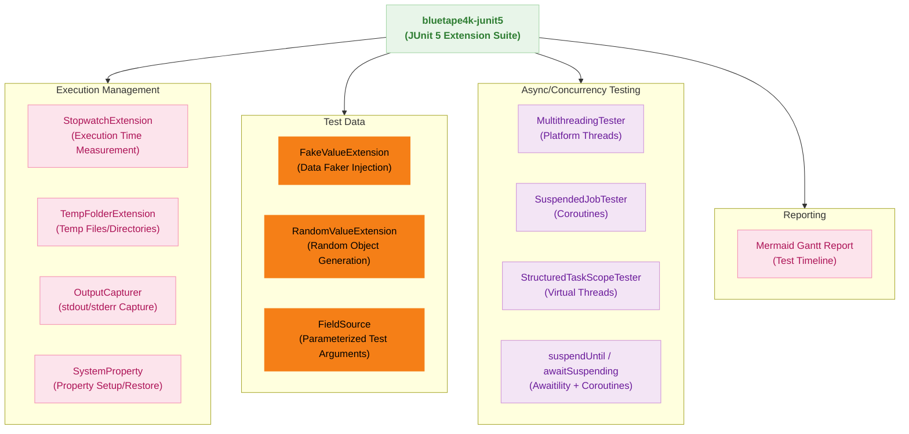

# Module bluetape4k-junit5

English | [한국어](./README.ko.md)

An extension library that reduces repetitive boilerplate in JUnit 5 tests.

## Architecture

### Extension Component Overview


```mermaid
flowchart TD
    JU5["bluetape4k-junit5\n(JUnit 5 Extension Suite)"]

    subgraph Execution["Execution Management"]
        SW["StopwatchExtension\n(Execution Time Measurement)"]
        TF["TempFolderExtension\n(Temp Files/Directories)"]
        OC["OutputCapturer\n(stdout/stderr Capture)"]
        SP["SystemProperty\n(Property Setup/Restore)"]
    end

    subgraph TestData["Test Data"]
        FV["FakeValueExtension\n(Data Faker Injection)"]
        RV["RandomValueExtension\n(Random Object Generation)"]
        FS["FieldSource\n(Parameterized Test Arguments)"]
    end

    subgraph Async["Async/Concurrency Testing"]
        MT["MultithreadingTester\n(Platform Threads)"]
        SJT["SuspendedJobTester\n(Coroutines)"]
        STST["StructuredTaskScopeTester\n(Virtual Threads)"]
        AW["suspendUntil / awaitSuspending\n(Awaitility + Coroutines)"]
    end

    subgraph Report["Reporting"]
        MR["Mermaid Gantt Report\n(Test Timeline)"]
    end

    JU5 --> Execution
    JU5 --> TestData
    JU5 --> Async
    JU5 --> Report

    classDef coreStyle fill:#E8F5E9,stroke:#A5D6A7,color:#2E7D32,font-weight:bold
    classDef testStyle fill:#FCE4EC,stroke:#F48FB1,color:#AD1457
    classDef asyncStyle fill:#F3E5F5,stroke:#CE93D8,color:#6A1B9A
    classDef dataStyle fill:#F57F17,stroke:#F57F17,color:#000000

    class JU5 coreStyle
    class SW testStyle
    class TF testStyle
    class OC testStyle
    class SP testStyle
    class FV dataStyle
    class RV dataStyle
    class FS dataStyle
    class MT asyncStyle
    class SJT asyncStyle
    class STST asyncStyle
    class AW asyncStyle
    class MR testStyle
```

### Class Diagram


```mermaid
classDiagram
    class StopwatchExtension {
        +beforeEach(context)
        +afterEach(context)
    }
    class TempFolderExtension {
        +beforeEach(context)
        +afterEach(context)
        +resolveParameter(context) TempFolder
    }
    class TempFolder {
        +root: File
        +rootPath: String
        +createFile(name) File
        +createDirectory(name) File
        +close()
    }
    class OutputCapturer {
        +capture() String
        +expect(block)
    }
    class FakeValueExtension {
        +beforeEach(context)
        +resolveParameter(context) Any
    }
    class Fakers {
        +randomString(min, max) String
        +fixedString(length) String
        +numberString(pattern) String
        +randomUuid() String
    }
    class MultithreadingTester {
        +workers(n) MultithreadingTester
        +rounds(n) MultithreadingTester
        +add(block) MultithreadingTester
        +run()
    }
    class SuspendedJobTester {
        +workers(n) SuspendedJobTester
        +rounds(n) SuspendedJobTester
        +add(block) SuspendedJobTester
        +run()
    }
    class StructuredTaskScopeTester {
        +rounds(n) StructuredTaskScopeTester
        +add(block) StructuredTaskScopeTester
        +run()
    }

    TempFolderExtension --> TempFolder : provides
    MultithreadingTester --> SuspendedJobTester : similar API
    StructuredTaskScopeTester --> SuspendedJobTester : similar API

    style StopwatchExtension fill:#FCE4EC,stroke:#F48FB1,color:#AD1457
    style TempFolderExtension fill:#FCE4EC,stroke:#F48FB1,color:#AD1457
    style TempFolder fill:#FFFDE7,stroke:#FFF176,color:#F57F17
    style OutputCapturer fill:#FCE4EC,stroke:#F48FB1,color:#AD1457
    style FakeValueExtension fill:#FCE4EC,stroke:#F48FB1,color:#AD1457
    style Fakers fill:#FFF3E0,stroke:#FFCC80,color:#E65100
    style MultithreadingTester fill:#F3E5F5,stroke:#CE93D8,color:#6A1B9A
    style SuspendedJobTester fill:#F3E5F5,stroke:#CE93D8,color:#6A1B9A
    style StructuredTaskScopeTester fill:#F3E5F5,stroke:#CE93D8,color:#6A1B9A
```

## Key Features

- `StopwatchExtension` — measure and log test execution time
- `TempFolderExtension` — provide temp directories/files, auto-deleted after the test
- Output capture helpers — capture `System.out`/`System.err` for assertion
- Random/Faker data injection — inject fake or randomized objects into test fields/parameters
- System property helpers — set properties before a test and restore them after
- Awaitility + coroutine helpers — `suspendUntil` / `awaitSuspending`
- Stress-testing utilities — `MultithreadingTester`, `SuspendedJobTester`, `StructuredTaskScopeTester`
- Parameter-source extensions — `FieldSource` for parameterized tests
- Mermaid-based reporting — Gantt timeline of test execution

## Usage Examples

### StopwatchExtension

```kotlin
@ExtendWith(StopwatchExtension::class)
class MyTest {
    @Test
    fun `measure execution time`() {
        // Logs: Starting test: [measure execution time]
        // ...
        // Logs: Completed test: [measure execution time] took 123 msecs.
    }
}

// Or use the annotation shortcut
@StopwatchTest
fun `annotated stopwatch test`() { }
```

### TempFolderExtension

```kotlin
@ExtendWith(TempFolderExtension::class)
class FileProcessingTest {
    lateinit var tempFolder: TempFolder

    @BeforeEach
    fun setup(tempFolder: TempFolder) {
        this.tempFolder = tempFolder
    }

    @Test
    fun `file processing test`() {
        val inputFile = tempFolder.createFile("input.txt")
        inputFile.writeText("test data")
        val outputDir = tempFolder.createDirectory("output")
        processFile(inputFile, outputDir)
    }
}
```

### OutputCapture

```kotlin
@OutputCapture
class OutputCaptureTest {
    @Test
    fun `capture stdout`(capturer: OutputCapturer) {
        println("Hello, Console!")
        capturer.capture() shouldContain "Hello, Console!"
    }
}
```

### FakeValue / Fakers

```kotlin
@ExtendWith(FakeValueExtension::class)
class FakeValueTest {
    @FakeValue(provider = "name.fullName")
    private lateinit var fullName: String

    @Test
    fun `injected fake value`() {
        println(fullName)  // e.g. "John Doe"
    }
}

// Fakers utility
val randomText = Fakers.randomString(10, 20)
val phone = Fakers.numberString("010-####-####")
```

### Stress Testing

```kotlin
// Platform threads
MultithreadingTester()
    .workers(Runtime.getRuntime().availableProcessors())
    .rounds(100)
    .add { counter.incrementAndGet() }
    .run()

// Coroutines
SuspendedJobTester()
    .workers(16)
    .rounds(100)
    .add { delay(10); results.add(1) }
    .run()

// Virtual Threads (Java 21+)
StructuredTaskScopeTester()
    .rounds(1000)
    .add { processRequest() }
    .run()
```

### Coroutine Test Helpers

```kotlin
@Test
fun `basic suspend test`() = runSuspendTest {
    val result = someSuspendFunction()
    result shouldBe "expected"
}

@Test
fun `io dispatcher test`() = runSuspendIO {
    val data = readFromFile()
    processData(data)
}
```

### SystemProperty

```kotlin
@SystemProperty(name = "app.environment", value = "test")
class SystemPropertyTest {
    @Test
    fun `system property set`() {
        System.getProperty("app.environment") shouldBe "test"
    }
}
```

### FieldSource (Parameterized Test)

```kotlin
class FieldSourceTest {
    val isBlankArguments = listOf(
        argumentOf(null, true),
        argumentOf("", true),
        argumentOf("not blank", false)
    )

    @ParameterizedTest
    @FieldSource("isBlankArguments")
    fun `isBlank test`(input: String?, expected: Boolean) {
        input.isNullOrBlank() shouldBe expected
    }
}
```

### Mermaid Report

```bash
# Extract Mermaid Gantt timeline from test output
./gradlew :testing:junit5:test | awk 'f||/^gantt$/{f=1; print}' > gantt.mermaid
```

## Best Practices

- Use `TempFolderExtension` instead of ad hoc file paths in tests.
- Capture stdout/stderr when assertions depend on console output.
- Prefer `FakeValue` / `Fakers` providers for sample values instead of hardcoded data.
- Use the provided stress-testing helpers for concurrency-heavy tests — they maintain a stable worker pool regardless of round count.

## Adding the Dependency

```kotlin
dependencies {
    testImplementation("io.github.bluetape4k:bluetape4k-junit5:${version}")
}
```

## References

- [JUnit 5 User Guide](https://junit.org/junit5/docs/current/user-guide/)
- [Awaitility](https://github.com/awaitility/awaitility)
- [Data Faker](https://www.datafaker.net/)
