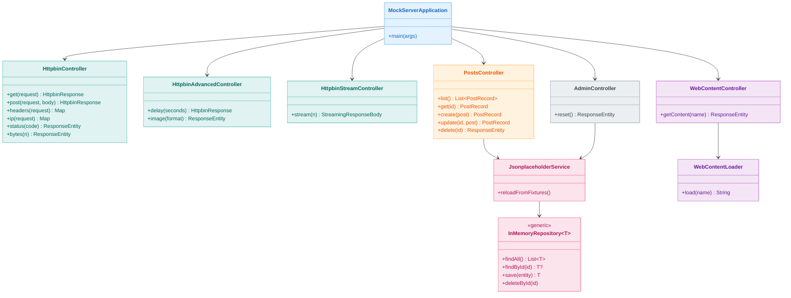
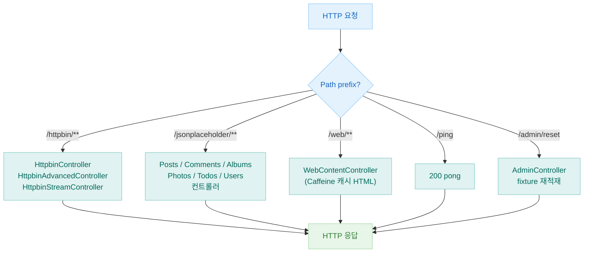
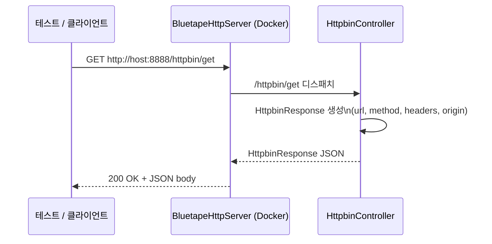

# Module bluetape4k-mock-server

[English](./README.md) | 한국어

외부 HTTP 의존성을 통합 테스트에서 대체하기 위한 독립형 Spring Boot HTTP Mock 서버입니다.
**httpbin.org**, **jsonplaceholder.typicode.com**, 그리고 간단한 웹 컨텐츠 엔드포인트를 하나의 Docker 이미지(`bluetape4k/mock-server`)로 제공합니다.

## 개요

| 대체 대상 | Prefix |
|----------|--------|
| [httpbin.org](https://httpbin.org) — HTTP 요청 검사 API | `/httpbin/**` |
| [jsonplaceholder.typicode.com](https://jsonplaceholder.typicode.com) — REST Fixture API | `/jsonplaceholder/**` |
| HTML / 웹 컨텐츠 목업 | `/web/**` |
| 헬스 체크 | `/ping` |
| 관리 / 데이터 초기화 | `/admin/reset` |

## 엔드포인트

### 기본

| Method | Path | 설명 |
|--------|------|------|
| `GET` | `/ping` | 헬스 체크 — `pong` 반환 |
| `POST` | `/admin/reset` | 인메모리 Fixture 데이터를 클래스패스 JSON에서 재적재 |

### `/httpbin/**`

| Method | Path | 설명 |
|--------|------|------|
| `GET` | `/httpbin/get` | GET 요청 정보 반환 |
| `POST` | `/httpbin/post` | POST 요청 + body 반환 |
| `PUT` | `/httpbin/put` | PUT 요청 + body 반환 |
| `PATCH` | `/httpbin/patch` | PATCH 요청 + body 반환 |
| `DELETE` | `/httpbin/delete` | DELETE 요청 정보 반환 |
| `GET` | `/httpbin/headers` | 모든 요청 헤더 반환 |
| `GET` | `/httpbin/ip` | 클라이언트 IP 반환 |
| `GET` | `/httpbin/user-agent` | User-Agent 헤더 반환 |
| `GET` | `/httpbin/uuid` | 랜덤 UUID 반환 |
| `ANY` | `/httpbin/anything/**` | 임의 요청 에코 |
| `ANY` | `/httpbin/status/{code}` | 지정된 HTTP 상태 코드 반환 |
| `GET` | `/httpbin/bytes/{n}` | `n` 바이트의 랜덤 바이너리 반환 |
| `GET` | `/httpbin/delay/{seconds}` | 지연 후 응답 |
| `GET` | `/httpbin/stream/{n}` | JSON 라인 `n`개 스트리밍 |
| `GET` | `/httpbin/image/{format}` | 샘플 이미지 반환 (png/jpeg/svg/webp) |

### `/jsonplaceholder/**`

[jsonplaceholder.typicode.com](https://jsonplaceholder.typicode.com)을 그대로 모방합니다. 모든 리소스는 전체 CRUD를 지원합니다.

| 리소스 | 기본 경로 |
|--------|----------|
| Posts | `/jsonplaceholder/posts` |
| Comments | `/jsonplaceholder/comments` |
| Albums | `/jsonplaceholder/albums` |
| Photos | `/jsonplaceholder/photos` |
| Todos | `/jsonplaceholder/todos` |
| Users | `/jsonplaceholder/users` |

### `/web/**`

| Method | Path | 설명 |
|--------|------|------|
| `GET` | `/web/{name}` | 이름으로 캐시된 HTML 컨텐츠 반환 |

## 아키텍처

### 클래스 다이어그램



### 요청 라우팅 흐름도



### 시퀀스 다이어그램 — httpbin GET 요청



## 설정

`src/main/resources/application.yml` 기본값:

| 키 | 값 | 설명 |
|----|-----|------|
| `server.port` | `8888` | 컨테이너 고정 포트 |
| `spring.threads.virtual.enabled` | `true` | Virtual Threads (JDK 21+) |
| `spring.cache.type` | `caffeine` | 인프로세스 캐시 |
| `spring.cache.cache-names` | `html-content`, `fixture-data`, `httpbin-image` | Caffeine 캐시 이름 |
| `server.http2.enabled` | `true` | HTTP/2 지원 |

## 빌드 & 실행

### Jib으로 Docker 이미지 빌드

```bash
./gradlew :bluetape4k-mock-server:jibBuildTar
```

`build/jib-image.tar`가 생성됩니다. Docker에 로드:

```bash
docker load < testing/mock-server/build/jib-image.tar
```

### 직접 실행

```bash
docker run --rm -p 8888:8888 bluetape4k/mock-server:latest
```

### Testcontainers로 사용 (`BluetapeHttpServer`)

```kotlin
val server = BluetapeHttpServer.Launcher.bluetapeHttpServer

// 미리 구성된 URL 헬퍼
println(server.url)                // http://localhost:<동적포트>
println(server.httpbinUrl)         // http://localhost:<port>/httpbin
println(server.jsonplaceholderUrl) // http://localhost:<port>/jsonplaceholder
println(server.webUrl)             // http://localhost:<port>/web
```

## 의존성 추가

mock-server 모듈은 라이브러리가 아닌 Docker 이미지입니다.
테스트에서 실행하려면 testcontainers 모듈을 추가하세요:

```kotlin
dependencies {
    testImplementation("io.github.bluetape4k:bluetape4k-testcontainers:${version}")
}
```

## 참고

- [httpbin.org](https://httpbin.org)
- [jsonplaceholder.typicode.com](https://jsonplaceholder.typicode.com)
- [Testcontainers](https://www.testcontainers.org/)
- [Jib — Java 앱 컨테이너화](https://github.com/GoogleContainerTools/jib)
